# 0.48.0
*September 23, 2025*

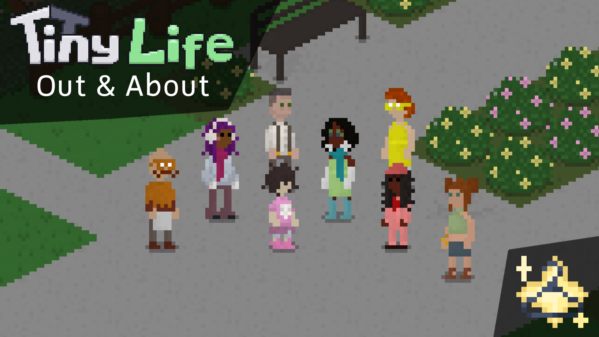

> The Biggest Set Yet (By Far)

**Read the devlog [on the website](https://tinylifegame.com/devlogs/0.48.0/).**

Additions
- Added the Out & About Set with art by [Snail](https://bsky.app/profile/sleepysnail6.bsky.social), which includes 59 accessories, 9 full-body items, 23 hairstyles, 8 pants, 10 shoes, and 16 tops, including items for all age groups
- Added the outfit preset system, as well as several outfit presets using items from the base game and sets
- Added 10 new paintings that can be painted using the easel
- Added 4 kitchen-themed print decorations
- Added the ability to buy paintings from museum curators
- Added the potty professional personality, which is awarded when growing up to a child with level 5 potty skill

Improvements
- Improve the visuals of the nudity censor effect
- Allow recoloring painting frames using the color tool
- Paintings now have display names
- The focused emotion now has a particle effect
- Improve the selection of matching households for household generation to make large houses be more likely to have large families inhabit them
- Improved the character creator's tab icons
- Display brief tooltips in the person selection and character creator when using gamepad or keybind navigation
- Fix particle textures sometimes bleeding into adjacent texture regions
- Made tooltips slightly less transparent
- Made it a lot likelier for random outfits to be generated using items that match the outfit's intended category
- Various food scraps are now displayed when a tiny uses a cutting board
- Food items are now categorized by time of day, and the AI will choose fitting food items with higher likelihood
- The maximum money amount per household has been reduced to 10 million to avoid excessive rounding errors at higher amounts
- An additional icon is now displayed on an action when a tiny is currently traveling to a different map

Fixes
- Fixed a crash when loading into the game before the news finish downloading
- Fixed a rare crash when using gamepad navigation from within the character creator
- Fixed the world button in the demo hanging off the edge of the in-game ui
- Fixed a rare issue where household imports and exports would cause relationships to be duplicated
- Fixed tinies washing their hands when canceling the toilet action before it starts
- Fixed tinies changing out of their non-everyday wear if bathing/showering is canceled before taking their clothes off
- Fixed tinies spamming park lots with grilled food if there is already a lot there
- Fixed various migration issues when importing lots that were exported in older versions

API
- Object icons now use the mod's icon by default, so icons don't need to be set manually by modders anymore
- All objects that are part of sets are now named according to mod item naming rules, with item names prefixed by the set name and a dot. Saves are automatically migrated using the migration system, and the owning set of an item can be queried through the GetOwningSet method in GameImpl.
- Random household generation now supports non-Person people
- Person-related cheats can now be used in the character creator
- The build tools panel now allows scrolling if there are more than 9 registered build tools
- Mods can now register woodworking recipes for items that don't belong to them
- Localization files can now additionally use a flat layout (separating category names from entries using a dot), or a deeper layout (using objects for modded items where previously a dot was required at the start of each key, similar to categories)
- Mods now require prefixing their custom object categories with the mod id
- The game now ensures a sufficient execution stack for error reporting in locations where indefinite recursion may become an issue, meaning stack overflow exceptions will also be caught and reported accordingly

# 0.47.11
*August 6, 2025*

Additions
- Added the Mellow voice style with samples contributed by [Ani Meida](https://ani-meida.carrd.co/)
- Added several new emotes as well as an alert-style emote bubble for some actions
- Added the ability for actions to continue executing after being cancelled to finish important tasks, like putting on clothes after showering. If this causes any actions to malfunction or behave unexpectedly compared to before this update, please let us know through [the feedback form](https://tinylifegame.com/bugreport)!
- Added an experimental nudity censoring effect to Tinies
- Added a teddy bear decoration, as well as a toy duck that children will sometimes hold instead of the toy car

Improvements
- The voice pitch slider now uses named instead of vague numbers
- People now get embarrassed when someone is not wearing clothes outside

Fixes
- Fixed the chef life goal still including grandparent food when it shouldn't
- Fixed Tinies displaying the outfit change animation when they don't have an appropriate outfit to change into
- Fixed people sometimes not turning towards their action spot
- Fixed an exception when importing existing visitors onto a lot
- Fixed babies sometimes using the potty while still holding an item
- Fixed a rare crash when loading a save
- Fixed some issues related to multi-floor homes when trying to find empty tiles for some actions

# 0.47.10
*July 14, 2025*

Improvements
- Oder personality types by category and name
- Made the Mitis song also play in build mode
- Actions now display a little icon in the action queue when they're currently busy pathfinding
- People now wait a bit longer for others to leave the room for private actions
- Display how many servings a platter has left in its tooltip

Fixes
- Fixed adding a map with a lot employee who already exists causing a duplicated person
- Fixed a rare eat action exception when the parent object is removed
- Fixed unfinished woodworks rendering with the wrong color
- Fixed being able to sell crafted items anywhere, not just at the mailbox
- Fixed some actions not counting as fully in progress after being completed, causing various emotions and memories not to be applied correctly
- Fixed actions added by mods never being enqueued by the AI

API
- Cleaned up action interuption by combining cancellation and result forcing methods
- Actions can now force being multi-taskable regardless of other actions
- Added the ability for clothes to be incompatible with a whole layer (including ones that usually cannot be taken off)

# 0.47.9
*July 4, 2025*

Ell had some surgery on Monday and so unfortunately, progress is even slower than it already was. That being said, we're still hard at work on the Out & About Set, and we're hoping to get it to you soon. In the meantime, here's a small update with some bugfixes and improvements from the last few weeks!

Additions
- Added the Classic Park Bench furniture item
- Added two more orange hair color variations
- Added an accessibility option to change the order of color selection previews
- Added an audio option to specify how often music should play in Play mode

Improvements
- Allow elder-only households to be generated when populating empty lots
- Tinies now display an animation when changing their outfits before and after actions, canceling which will cause the Tiny to stay in their action-specific clothes
- Tinies now clean or throw away empty dishes when auto-discarding them before an action
- In-game news on the main menu now allow switching between entries with buttons

Fixes
- Fixed wall-hanging objects sometimes clipping walls using Alt placement
- Fixed a rare build mode object rotation hang
- Fixed the lot type dropdown rendering below the build mode toggles
- Fixed aromantic Tinies showing the romance setting in the character creator
- Fixed the potty not being able to get dirty correctly
- Fixed objects that cannot get dirty erroneously having their Dirty flags set to true by some actions
- Fixed adults changing into protective wear when driving a car
- Fixed custom maps import menu not updating when a zipped map changes in the folder
- Fixed deleting custom content items in quick succession causing exceptions if the import menu is open
- Fixed an exception when pregnant Tinies that live out of town have a baby
- Fixed music ducking having incorrect timing for some sound volume options

API
- Leg accessories are now drawn below pants by default
- Cleaned up startup logging, and added a --trace-load option for extended startup logging

# 0.47.8
*June 12, 2025*

Additions
- Added the ability to sell crafted items in the household storage by selecting the mailbox

Improvements
- Increased the chance that people visit lots the longer they haven't
- Made talk actions very unlikely in the library
- People will now clean their plates after eating with level 2 cleaning skill
- Cleaning out spoiled or empty plates from the fridge is now considered a cleaning action for the purpose of Clean Everything
- Made elders restore energy a bit faster when sleeping

Fixes
- Fixed a crash when closing out of the color tool through the menu
- Fixed hidden achievements being sorted by their hidden name
- Fixed flirty joke being listed when children age up in humor
- Fixed occasionally being unable to see tooltips for objects
- Fixed a crash when loading the game while the debug menu is open
- Fixed people doing the walking animation while not having found a path yet
- Fixed people getting stuck on a different lot when switching away from the current household

API
- Changed the game's assembly name from Tiny Life to TinyLife for portability. This likely breaks all existing mod builds, but rebuilding for the new version shouldn't require any code changes.

# 0.47.7
*May 26, 2025*

Improvements
- Cache tile variation textures to improve rendering performance
- Use a monospaced font for all debug information

Fixes
- Fixed an exception when removing invalid people from the map
- Fixed a crash when deserializing a save with old memories in it

# 0.47.6
*May 25, 2025*

Improvements
- Improved load speed of old maps that don't use the tile instance system yet

Fixes
- Fixed a crash when using the EditPerson cheat

# 0.47.5
*May 24, 2025*

Additions
- Added the color changing tool to build mode, which allows changing the colors of already placed furniture, windows and doors
- Added a metal garden furniture set
- Added two types of lawn edging fencing
- Added the ability to name outfits in the character creator
- Added the ability to disable auto-tiles and animated water in the options
- Added dirt road corners as non-buyable tiles

Improvements
- Beds are now claimed when people start sleeping in them rather than when they finish, causing couples to be more likely to sleep in the same bed when creating a new save
- Selected walls, roofs and stairs are now also highlighted with the white outline in relevant game modes
- Display an alert exclamation point on the job and needs tabs, as well as in the character switcher on the side, when not at work and when important needs are low
- Food items with honey on them are now not considered viable for babies
- Randomly remove a child from the list of adoptable children every night to slowly randomize it
- Improved the performance of auto-tiles, especially when rotating the camera a lot

Fixes
- Fixed the reason why the character creator's Done button is grayed out not displaying when using a gamepad
- Fixed phones being left behind on the ground when people get removed
- Fixed a min/max floor exception when there are no visible lots
- Fixed a deadlock where, sometimes, a person holding a baby would get stuck if the baby was also holding something
- Fixed adults trying to put babies in cribs when they are already in one
- Fixed people being unable to go jogging autonomously when on their home lot
- Fixed people discarding a book they're already holding when told to read

API
- Tiles are now stored on map sections as tile instances, allowing for them to store additional data per-position
- Added the serializer usage enum to denote whether a serializer is used for saving, loading or both

# 0.47.4
*April 29, 2025*

Additions
- Added an option to disable eating and drinking sounds
- Added build mode sounds for rotation, copying and disallowed placement
- Added build mode UI buttons for the grid and lighting hotkeys

Improvements
- Allow fridges to get dirty, causing their food to lose quality over time
- Improved the fidelity of object selection in the world
- Also invoke the AI action cooldown when the player cancels an action
- Improve style choices on randomly generated Tinies
- Doors will now only open when people are going through them, not standing in front of them
- Moved all basegame furniture out of the "Other" tab in the furniture tool
- Recently failed actions started by the AI will now be repeated using a different object if possible

Fixes
- Fixed another action prompt collision causing the game to crash
- Fixed center notifications having a really light background
- Fixed an issue on Steam Deck causing external keyboards not to work
- Fixed Load Game menu buttons not displaying their tooltips when using a gamepad
- Fixed the woodlands set pants missing pixels in some poses
- Fixed an exception when the goal map of an action is removed
- Fixed being able to press B on a gamepad any time to return to the last selected clothing in the character creator
- Fixed a UI thread exception when uploading items to Steam workshop
- Fixed memories not being deserialized with their runtime type, causing some memories to lose their data

API
- Added various events to the RemoveTool
- Recently failed actions now use the memory system
- Hidden execution results now override non-hidden ones, allowing for objects to hide actions on them properly

# 0.47.3
*April 4, 2025*

Additions
- Added Discord and Steam Rich Presence compatibility including the game's logo and the game mode the player is currently in
- Added an emotion for when a full trash can is around

Improvements
- When uploading items to Steam workshop, high-resolution screenshots of households and all floors of a lot are now automatically generated and included
- Dead people are now also displayed in the relationships tab
- Made the trash collector stay longer if there is a lot of trash to collect
- Made the trash collector remember which objects are unreachable so they don't get stuck
- Improved the contrast of in-text links
- A disclaimer is now displayed when playing a preview version of the game
- Improve AI performance by grouping AI actions by age group beforehand
- Made it a lot more likely for people to view art when at a museum

Fixes
- Fixed a rare race condition in which a lot's map is unset
- Fixed collections with objects directly behind doors being ignored
- Fixed some issues with migrations that stopped really old saves from being loadable
- Fixed new notifications not showing in the character creator
- Fixed elder-specific food being included in the Chef life goal's food list
- Fixed the deceased Hannah Buffleman not being an elder despite dying of old age
- Fixed being unable to invite people over if they're on a different map, but close-by in terms of their coordinates on the map

API
- Fixed modded actions having to have their mod id in the action's category rather than the action's name
- Added a debug action to allow aging up other people
- Added the ShowColorSchemeInfos cheat that shows additional hover info for color selectors

# 0.47.2
*March 20, 2025*

Additions
- Added lighting controls for build mode: pressing L or the down D-pad button will now cycle through lighting overrides
- Added loading screen hints for elders

Improvements
- Made mean actions able to hurt relationships consistently even at very high friendship and romance levels
- Made the mean personality icon more light-hearted
- Greatly reduce the amount of save time that is spent halting the game
- Improve pathfinding memory allocations to reduce garbage collection lag
- Made social interactions less of a main focus for people visiting cafés

Fixes
- Fixed people sometimes barging into other people's lots to use or put away objects since the last update
- Fixed camera focusing on deaths and age-ups of people that no one in the active household knows
- Fixed gravestones only being accessible from the front
- Fixed hair colors being randomized when a person ages up

# 0.47.1
*March 16, 2025*

Improvements
- Added a confirmation dialog to the break up action
- Made relevant actions much more likely on public lots

Fixes
- Fixed babysitters putting requested food in the fridge again immediately
- Fixed being able to make fun of a lot employee for being unemployed
- Fixed deadly emotions in-game hint displaying for other households
- Fixed the add to household cheat not clearing tinies' lot employments
- Fixed being unable to use a physical keyboard on steam deck
- Fixed being unable to scrap paintings using public trash cans

# 0.47.0
*March 9, 2025*

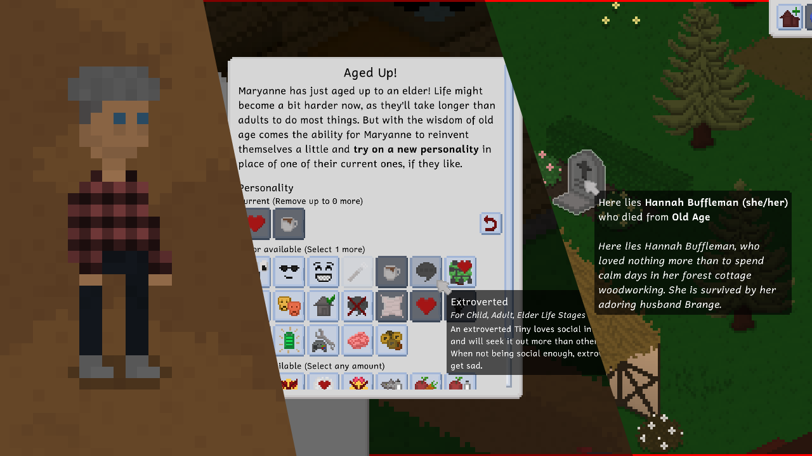

> Elders and Their Demise

**Read the devlog [on the website](https://tinylifegame.com/devlogs/0.47.0/).** Even though the changelog may not show it, it's a pretty big one this time!

Additions
- Added the elder life stage, which includes several unique actions and personalities
- Added the ability for elders to retire from their jobs
- Added the ability for elders to pass down special recipes to their family members
- Added the ability for elders to die of old age
- Added the ability to engrave gravestones with custom text
- Added the grandfather clock furniture item

Improvements
- Allow gravestones to spawn off-lots
- Allow destroying gravestones permanently
- Allow storing gravestones in household storage if they're off-lot
- Improve the random name selection likelihood system, causing more common names from countries matching the current localization to be picked more often

# 0.46.2
*February 25, 2025*

Additions
- Added a European-style wall-attached mailbox
- Added two types of picket fencing

Improvements
- Allow randomly generating a new Tiny for a lot employment
- Allow rotating the character creator preview
- Redesigned the New Save menu and added a difficulty selection to it
- The wall mirror and open shower are now not hidden anymore when hiding walls
- Made in-text links have a bigger box when using a gamepad to make them easier to read
- Puddles now automatically connect to be longer when neighboring
- Allow rotating the camera counter-clockwise using the X key by default
- Tinies will now hold a saw while woodworking
- Paintings that require a higher skill level will now be more likely to be painted
- Explicitly state that you can't zoom the camera in the household selection area
- Fixed auto-tiles with names lexicographically greater than grass not connecting to grass
- The personality selector will now list the life stages that a personality is valid for
- The back and forward buttons in the action ring menu now use a proper image
- When importing a lot or household that errors, it will now not be skipped entirely, but erroring objects will be removed from it instead
- Made regular visitors stay home less long on average, and make them start spawning sooner after a new game is started
- Slightly rebalanced scaling visit priority for community lots, causing them to be less crowded on average
- Adjusted the price of coffee

Fixes
- Fixed the steam integration sometimes not noticing when subscriptions changed
- Fixed gamepad navigation in empty options menu tabs
- Fixed gamepad navigation on the language selection dropdown
- Fixed being able to invite household members over while on a different lot
- Fixed a crash when multiple player prompts try to open at once
- Fixed rotating the camera on different maps incorrectly displaying walls when switching back
- Fixed the simple bookshelf color selection missing a localization
- Fixed the Add Tiny button not being grayed out when a new Tiny can't be added
- Fixed an exception when a talk action partner is deleted
- Fixed pronoun localization being incorrect for languages that change the names of Tinies
- Fixed the This is Inappropriate action not causing a person's other actions to be canceled
- Fixed the Clone Object in-game hint not displaying in the stairs and fence tools
- Fixed the tall bookshelf from the Contemporary Complements set not having the same tabs as the wide one
- Fixed members of hidden households being able to become babysitters
- Fixed moving fridges with items inside to a different map not causing the items to be moved correctly as well
- Fixed the relationships tab not updating correctly when new relationships are added to a Tiny while it is open

API
- Reverted the Mod class name and assembly name requirement from 0.46.1
- Added a PersonLike registry that allows overriding various default behaviors for custom PersonLike types
- Allow the names of custom build mode tools to be localizable correctly

# 0.46.1
*January 27, 2025*

Additions
- Added the Hyphenate life goal and corresponding reward personality
- Added the ability to switch between borderless window and fullscreen mode
- Added an in-game hint that suggests ways to earn money
- Added the ability to skip less important in-game hints, while keeping important ones enabled, for players who are new to the game but not the genre

Improvements
- Display a mod's id in the options menu
- Reduce the amount of friends required for the Friend of Everyone life goal from 15 to 10
- Improve the Move Lot tool's usability by requiring the lot to be picked up to move it
- Added source description text to various emotion modifiers that previously had none
- Tinies now get uncomfortable when using a toilet that is in an open space
- Work and school actions now display a progress bar
- Improved performance of lot imports and exports
- Various additional furniture properties like broken and dirty states are now reset back to their default values when exporting a custom map
- Speed up game load times drastically
- The selected person's AI now defaults to being enabled when starting a new save

Fixes
- Fixed chimneys being moved up infinitely when migrating if there are no roofs around
- Fixed the opening tool not having an opening selected when first opened
- Fixed a crash when copying exported households
- Fixed techies always having the Computer On = Brain On emotion modifier if they've never used a computer
- Fixed an issue where having two gamepads connected would cause them to navigate menus too quickly

API
- A warning is now printed if a mod's id (its mod class's name) is not the same as its assembly name. In the future, this may become a proper requirement.
- Furniture texture region names now have to start with the mod id
- Explicitly disallow multiple classes that extend Mod in a single assembly
- Allow need depletion to be influenced by an action info

# 0.46.0
*January 10, 2025*

> Bathtubs, Tears and Improvements Galore

This update has a lot of quality-of-life improvements, especially for mod creators and modded players. It also introduces bathtubs and crying babies!

Additions
- Added the ability to mourn a person's death at their gravestone
- Added the ability for babies to cry
- Added a selection circle around the currently selected Tiny in the world, which can be disabled in the options menu
- Added bathtubs, the ability to take baths with bath bombs, and a new plumbing upgrade

Improvements
- Display icons for Tinies who are out of town or on different maps
- Allow selecting lot requirements in build mode to see objects that match them
- Allow setting time display independently of the localization setting
- Cleaned up the household split menu to make it clearer
- Order interaction circle menu pages by display name
- Don't include fancy food in the emergency food delivery
- Display special particles for some death reasons around the gravestone
- Display a newborn baby's sex in the customization menu
- Display special visuals for romance and cartoon tv channels
- Include people's ages and personalities as tags when uploading a household to Steam workshop
- Stop people from going jogging while visiting someone else's home lot
- Cycle through hints every few seconds on long loading screens
- Continue following a person with the camera if they move to a different map
- Made gym trainers a bit likelier to help with training
- Improved the baby laying texture
- Made emotion effects on need restoration a bit stronger
- Preload all the game's default sounds when the game is loaded, rather than when they are first used
- Explain the meaning of each backup type in the backups menu
- Also create a backup of a save automatically if the versions of installed mods change

Fixes
- Fixed lot types being sorted by their icon's name rather than their display name
- Fixed being unable to clean objects that are broken
- Fixed people with lot employments spawning into a map immediately when a new save is created
- Fixed the EarnMoney goal not being triggered when selling items from the household storage
- Fixed the main menu background zooming incorrectly on different ui scales
- Fixed being unable to adopt a baby as parent
- Fixed the kiss action sometimes not looking right due to person rotation issues
- Fixed the game crashing when furniture placement causes an exception
- Fixed storing objects in household storage on other maps causing them to be duplicated
- Fixed broken plumbing objects not spawning puddles anymore since the multi-floor update
- Fixed an exception when updating Steam workshop items while in an import menu
- Fixed the buttons in the center of the interaction wheel menu misaligning during the opening and closing animations

Removals
- Removed the keyboard lighting setting due to large maintenance overhead

API
- Allow mods to specify a version through the mod's assembly info
- Allow mods to specify a website and donation link to display in the options menu
- Added the ability for mods to add custom static maps, exported lots and exported households through events
- Allow setting custom death animations and particle spawn functions in DeathReason
- Exposed various more methods to the API, including pathfinding, map drawing utilities, play mode tool, other build tools and more
- Added various events including Map.OnDraw, Particle.OnSpawnAmbientParticles, and more
- Moved breakable furniture settings into BreakableFurniture.Settings struct
- Added IBreakableObject and ILightObject interfaces to generify breakable and light furniture
- Allow using the migration system for exported lots and households
- Added Sand tile category and SandRequired object category

# 0.45.2
*December 14, 2024*

Additions
- Added the ancient bonsai small pot plant
- Added a simple durag head accessory

Improvements
- Improved action selection menu navigation when using a gamepad
- Increased the resolution of the selection texture, causing objects to be easier to highlight when zoomed out
- Improved the way "down" versions of roofs look by still drawing their wall outlines

Fixes
- Fixed being able to place wallpaper on roofs and stairs outside the owned area
- Fixed removing nothing using the remove tool causing an empty undo/redo item to be added
- Fixed a rare exception when navigating the character creator with a gamepad

API
- DeathReason is now a class, allowing for custom death reasons to be added by mods
- Added an event for when a person's age changes
- Removed duplicate frames for all hair, accessories and shirts (see [this commit](https://github.com/Ellpeck/TinyLifeWeb/commit/1138804dc2d51777eba34ac8ff31637aae9f0c95) to the documentation for more info)

# 0.45.1
*December 4, 2024*

Fixes
- Fixed language-specific settings not being parsed properly

# 0.45.0
*November 29, 2024*

> Small Plants and Big Emotions

**Read the devlog [on the website](https://tinylifegame.com/devlogs/0.45.0/).**

Additions
- Added three large potted plants
- Added three small potted plants
- Added a large weeping willow tree
- Added dandelion ground decorations
- Added various particles for different emotions, which can be disabled in the options menu

Improvements
- Improved the diagonal wood tile texture
- Moved world options to their own tab in the options menu
- Improved texture packing speed on startup
- Allow using the emotion cheat to get a specific emotion, rather than just emotion modifiers
- Also notify demo players of the floor restriction in the roof tool
- Made the amount of windows and doors determine the amount of natural light in a room
- Display a warning when a clothing item will be hidden under another
- Display open/closed arrows on dropdown menus
- Made randomly generated names have a high likelihood of matching the selected game language

Fixes
- Fixed various particles on people being in incorrect positions for certain ages and poses
- Fixed babies being able to use an easel
- Fixed being able to undo and redo in build mode when hovering the UI
- Fixed an exception when a transition is happening while starting another one
- Fixed center-aligned dropdown content in the character creator not being hoverable fully
- Fixed a crash when splitting households with a lot of money

# 0.44.1
*October 26, 2024*

Additions
- Added a ToggleDating cheat and debug action
- Added various non-buyable road sign decorations and added them to the game's worlds

Improvements
- Display a link to the game's [Bluesky page](https://tinylifegame.bsky.social) on the main menu
- Only allow going up in floors high enough to view the highest objects on currently visible lots
- Default to viewing the ground floor when loading into a household or lot
- Improved dropdown menu styling to be more consistent everywhere
- Reduced passive need reduction in intense difficulty from 3 times to 2 times the default

Fixes
- Fixed a rare exception when closing a screen with an unseen item
- Fixed the couples in Lunar Grove not dating
- Fixed the lavender texture bleeding into the jungle gym texture in one rotation
- Fixed being able to start file names with .. causing a crash

API
- The log now displays a warning if a mod's issue tracker link is the example mod one
- Added the migration system to various additional object types

# 0.44.0
*October 17, 2024*

> Set the Vibe in Lavender Park

**Read the devlog [on the website](https://tinylifegame.com/devlogs/0.44.0/).**

Additions
- Added the Outright Pride 2024 set, which includes 7 new actions, 10 new clothes and accessories, 12 new furniture items, 2 new foods, 1 new wallpaper, and the rec center lot type
- Added the Lavender Park world, which is a small commercial zone with a rec center, a café and a gym
- Added fallen leaves and big leaf pile autumn decorations
- Added some additional blond hair colors

Improvements
- Improved the custom content import menu for use with gamepads
- Allow hovering over the entire emotion modifier rather than just its text to see the tooltip
- Only mark new upgrades, woodworking recipes and food as seen if they're now available
- Allow multi-tasking tinkering and social actions
- Display passive improvements when the cleaning skill is leveled up
- Allow non-colling objects like plates to sit in neighboring object spots
- Made people prefer eating at tables in the same room even if they don't have a free table spot
- Give various text boxes a maximum length
- Improve the dropdown panel's styling
- Made existing color schemes more consistent and less prone to breaking with color scheme updates
- Improved the money addition/subtraction animation to be much more noticeable
- Display color scheme display names on objects with a lot of color schemes
- Condense the emotion tab's gamepad display
- Also display the lot employment and inhabiting household's portraits in the lot tooltip
- Allow the small bush to have no flowers
- Mail carriers will now not be added to worlds that don't have any residential lots

Fixes
- Fixed being able to visit a lot in AI mode when clicking on self while hovering over an adjacent lot
- Fixed people with invalid memories being entirely deleted on load
- Fixed a computer in Lunar Grove being rotated incorrectly
- Fixed furniture with variations not being marked as seen correctly until the tab is reopened
- Fixed children being able to adopt each other as parents
- Fixed an exception when unable to hire a babysitter
- Fixed a rare crash when a social action ends unexpectedly
- Fixed bobbing furniture also bobbing in build mode previews
- Fixed lots with a lot of walls taking unnecessarily long to import

API
- Modded names now have to follow a more rigid format: they have to start wit the mod's ID (the name is not allowed anymore), followed by a period
- Added type-safe GoalTrigger subclasses
- Added a migration system which allows updating objects of various types in old saves to newer game versions easily
- Allow mods to specify sting sounds for their emotion types
- Added debug actions for setting romance and friendship between people
- Removed the ability to merge color schemes with each other
- Added ModLoader.GetOwningMod utility method
- Fixed MoveMap cheat crashing the game if the number passed is more than 7
- Disallow color schemes that have duplicate colors

# 0.43.11
*September 20, 2024*

Hi everyone! We know it's been a while since the last major update, despite the fact that we usually try to stick to a monthly update schedule. However, we've been hard at work on two major things: the Outright Pride 2024 set and the elder life stage. So stay tuned for the next major update coming soon!

Additions
- Added a popup to hire a babysitter that displays when every adult is out of town
- Added a makeup character creator category and simple blush makeup

Improvements
- Disallow locking the curtain door and staff-only doors
- Increased the notification history from 512 to 1024
- Don't force-save the game on important events like death
- Made fooling around take a random amount of time
- Slowed down the eating animation
- Allow accessing options and notifications from within the character creator
- Don't bob the gamepad selection outline when UI animations are disabled
- Made the gamepad selection outline a bit wider when a text paragraph is selected

Fixes
- Fixed a crash when removing objects that are out of bounds on a higher floor
- Fixed money being charged even when the phone case color is not actually changed
- Fixed the Travel to World action being available if there is only one world in a save
- Fixed gravestones without a person in them disappearing on load
- Fixed hiring one-off employees causing a crash if there are no people in exported households
- Fixed duplicate exported people being able to be added to the map at once
- Fixed fooling around between aro and non-aro people failing when it shouldn't
- Fixed various panels not selecting a default element when using a gamepad
- Fixed the mailbox flag's rotation being inconsistent
- Fixed households being able to be auto-generated with no relations between members

Removals
- Removed the very incomplete traditional chinese translation for now. If you want to help get it back into the game, please check out the [community localization docs](https://docs.tinylifegame.com/articles/localization.html).

API
- Added SaveHandler.OnBindToType event for overriding type deserialization behavior
- Updated door type names to be less confusing
- Added events for modifying the visit priorities of lots and maps
- Added IUpdatingMemory to make updating memories with custom types optional
- Goals and choice prompts now also require the mod id to be present in their names

# 0.43.10
*August 31, 2024*

Fixes
- Fixed an issue running the game on some systems due to a dependency change

# 0.43.9
*August 31, 2024*

Additions
- Added EzTown Modern Indoor Railing fence

Improvements
- Added more gray hair color variations
- Made a person's current emotion influence the quality of objects they create
- Avoid unnecessarily keeping cursor texture data in memory
- Expose save compression level in the options file

Fixes
- Fixed a rare exception when staggered updates remove multiple objects at once
- Fixed people being deleted if they have the demo life goal when transferring to the full game
- Fixed a crash when loading a save that had modded wallpaper after removing the mod

API
- Renamed the Tiny Life API NuGet package to from TinyLifeApi to TinyLife.ApiReference.
- Added combined flags for age groups to allow setting action and personality age requirements more easily
- Wallpapers and tiles are now stored in fields in their respective classes
- Added events for when specific build mode buttons are displayed
- Made various additional Furniture properties and methods virtual

# 0.43.8
*August 15, 2024*

Improvements
- Allow coloring the vertical planter's flowers
- Made trash collectors also clean objects on public lots

Fixes
- Fixed being able to grab a serving of a glass or mug
- Fixed randomly generated people always having a cheap everyday outfit
- Fixed objects being marked as not seen in the household storage at all times
- Fixed being able to tinker with any furniture in the demo
- Fixed various exceptions when moving objects out of bounds
- Fixed a crash when deleting the first outfit in the character creator
- Fixed Liam Lungo having non-demo clothes in the demo

# 0.43.7
*August 8, 2024*

Additions
- Added the ability to ask others to play in the sandbox, on the jungle gym, and with toys together
- Added the ability to set Steam workshop items public from within the game
- Added some more breakfast foods, including various sandwiches
- Added industrial-themed stairs
- Added a small indicator for items, actions, foods, woodworking recipes and upgrades that the player has never seen before

Improvements
- Sort color selector colors by lightness
- Clarified the brightness increase setting's name
- Order worlds by display name in various menus
- Display hidden achievements in their own box, rather than as text

Fixes
- Fixed a rare crash during loading due to the new file loading percentage display
- Fixed a relationship crash when a person interacts in a smaller map than their memory was created in
- Fixed the cleanup action starting prematurely for the baby
- Fixed getting items from storage causing them to sometimes have the wrong rotation
- Fixed the build mode button tooltip hiding the button if long enough
- Fixed some concrete tiles displaying a rogue pixel near map borders
- Fixed the ResetLocation cheat not moving the person to their home map
- Fixed stairs not properly checking whether entry adn exit points are blocked

# 0.43.6
*July 26, 2024*

Additions
- Added a "Get Full Game" button to the demo's main menu and in-game menu
- Added an action to get store-able items back from household storage while playing

Improvements
- Display progress percentage when loading and deserializing a save file
- Display which map is being validated during loading
- Remember the most recently selected person when opening or reloading the play mode tool
- Display memory usage information in the debug menu
- Improve error messages when objects fail to load
- Gain social need when fooling around or online gaming
- Display a person's home's map in the relationship tooltip along with their home

Fixes
- Fixed a crash when moving the cursor out of bounds in build mode while holding a furniture item
- Fixed being unable to invite someone in or ask them to leave when they're stopped before they reach the door
- Fixed being unable to switch TV channels when no one else is watching
- Fixed people starting romantic relationships with people who already have a partner autonomously
- Fixed an exception when multiple actions try to open a player prompt at the same time

API
- Updated MLEM to 7.0.0, which includes various namespace changes so unfortunately, mods are likely to break

# 0.43.5
*July 15, 2024*

Fixes
- Fixed a crash when a person with certain clothes goes to bed
- Fixed a crash when fences or counters are next to the borders of the map

# 0.43.4
*July 14, 2024*

Fixes
- Fixed a crash when babies try to age up
- Fixed being unable to copy saves to Steam cloud since 0.43.0

# 0.43.3
*July 14, 2024*

Improvements
- Display more stages in the loading screen while loading the save file

Fixes
- Fixed being unable to deserialize the discard held item action when loading a save
- Fixed some important social actions only working when the partner's needs are high enough
- Fixed some important social actions losing priority when done recently
- Fixed another exception when holding something while aging up

# 0.43.2
*July 13, 2024*

Additions
- Added an autonomous Check on Baby action that'll help with autonomous baby care in homes with multiple floors especially
- Added [non-buyable](https://docs.tinylifegame.com/articles/cheats.html) debug openings that are just the cutouts other openings use without a texture of their own, which may be useful for custom maps

Improvements
- Improved the way household previews are created and stored. This means that all saves will have to have their previews regenerated by loading them, selecting a household, and saving the game.
- Center the camera on the last relevant lot when entering the household selection screen
- Display infinite tiny bucks in build-only mode, instead of no money at all
- Made the tech withdrawal emotion modifier give bored rather than sad

Fixes
- Fixed the baby cleanup action not displaying proper visuals based on person ordering
- Fixed an exception when adding furniture from other maps to storage
- Fixed empty lots causing a crash when calculating their size
- Fixed a crash when a person holding something just aged up
- Fixed the outdoorsy emotion modifiers displaying when out of town
- Fixed pregnant bellies being able to display out of bounds when changing lifespan settings during pregnancy

# 0.43.1
*July 9, 2024*

Fixes
- Fixed a crash when displaying the lot employment edit panel

# 0.43.0
*July 9, 2024*

> New Plant Stuff, New Language and New Gross Stuff

**Read the devlog [on the website](https://tinylifegame.com/devlogs/0.43.0/).**

Additions
- Added the ability to throw up from being drunk
- Added a wealth tax, whose value is partly determined by the game's difficulty setting
- Added a flower bed object that looks the same as the flower tiles, but can be used on any tile
- Added larger versions of the evergreen and cypress trees
- Added bowls for food that makes more sense in bowls
- Added an ambient water sound, as well as a placement sound for water and water objects
- Added japanese translation by [mameketchup](https://linktr.ee/mameketchup)

Improvements
- Made the game's logo in the main menu animate
- Use the natural placement sound when placing natural tiles like grass
- Increase the flood fill limit for tiles
- Made water borders for sand have the color of the sand
- Made rummaging in the trash be considered inappropriate on other lots
- Display translation completion next to languages in the options menu
- Made objects verify their parent position on load
- Order the life goals menu by name
- Made the lot tooltip stationary above the lot
- Made pregnant people's bellies visually get bigger
- Disallow clicking the ground on water tiles and out of bounds
- Improved the autofill content for the feedback form when accessing it from within the game
- Allow multitasking social actions while playing with toys
- Made the lot outline thicker to look better when zoomed out
- Made the lilypad's bobbing animation look less stupid
- Improve the skill book selection ui
- Made adults carry babies to the food item after they make food for them
- Severely increased the priority of actions that help babies when they need help

Fixes
- Fixed street lamps not drawing correctly with higher floors nearby
- Fixed full release saves with babies in them causing the demo to crash on the load menu
- Fixed actions that have a list of selectable people ignoring their visibility
- Fixed all remaining potential causes of the game sticking around after being closed
- Fixed existing notifications animating again when changing game modes while they're on-screen
- Fixed rotating lots causing objects with a limited amount of rotations to have incorrectly placed children
- Fixed a rare exception when checking for rooms near the map borders
- Fixed the millionaire life goal's expensive lot goal only taking furniture into account
- Fixed primary school students saying they "work" as students
- Fixed bad child food emotion being granted to the food's creator
- Fixed children claiming they forgot their homework every day
- Fixed life goals' homework goal not updating when being helped with homework
- Fixed a bee particle crash when there are no valid positions to fly to
- Fixed chatting being able to start new relationships through the AI even when AI relationships are disabled
- Fixed babies getting stuck when unable to put down items on different floors
- Use optimal compression for saving, which takes a bit longer but saves a lot of space

API
- Allow different person types to support different age groups
- Added an event for when the game's game mode changes
- Added events for when people's animations are created and drawn
- Objects now always support all rotations, but display the texture that is the closest match for their rotation
- Added a cheat to dump portraits of all people
- Added a MinFloor constant for future use, which should be used over hardcoding 0

# 0.42.4
*June 19, 2024*

Additions
- Added various additional debugging [cheats](https://docs.tinylifegame.com/articles/cheats.html) and debug actions to help players debug common issues

# 0.42.3
*June 17, 2024*

Improvements
- Allow selecting multiple maps immediately when starting a new game

Fixes
- Fixed being unable to hire babysitters on maps that didn't already have one prior to 0.42.0

# 0.42.2
*June 15, 2024*

Additions
- Added an accessibility setting that pauses the game when the interaction menu is open

Improvements
- Don't allow the jungle gym to be close to walls
- Roofs on the same floor are now hidden when the walls are fully down
- Steam Workshop item tags are now updated when updating an existing item

Fixes
- Fixed lot previews throwing an exception on small maps
- Fixed tall objects like trees being drawn behind walls on higher floors
- Fixed pathfinding exceptions not being handled gracefully, causing the game to crash

API
- Added construction events for furniture and action types
- Made various additional API methods public

# 0.42.1
*June 9, 2024*

Fixes
- Fixed the build mode preview panel snapping to the top when the controls hints overlay is disabled

# 0.42.0
*June 9, 2024*

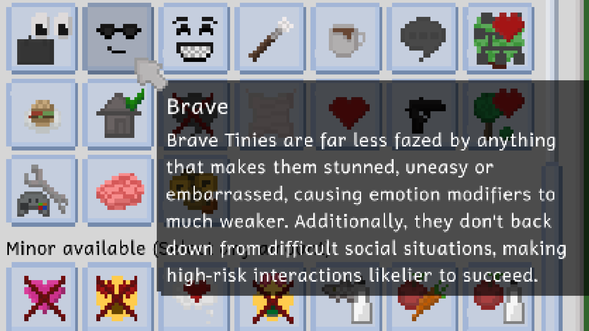

> Plenty of Personalities and Different Difficulties

**Read the devlog [on the website](https://tinylifegame.com/devlogs/0.42.0/).**

Additions
- Added the Homebody, Daydreamer, Cheerful and Brave personalities
- Added the ability to set the game's difficulty level between Chill, Normal and Intense modes in the gameplay options. Difficulty influences skill building, relationship gain, need reduction, and more.

Improvements
- Increased the maximum amount of personalities for adults from 2 to 3, and for children from 1 to 2. To edit the personalities of your existing Tinies, you can use the `EditPerson` [cheat](https://docs.tinylifegame.com/articles/cheats.html).
- Improved the way that lot staff chooses objects to prepare orders with
- Improved random generation style choices to make them a bit more consistent
- Make clear what exactly is missing when trying to exit the character creator
- Improved performance when adding and removing objects, walls, stairs, roofs and lights
- Made more specific emotion types with the same amount be prioritized over Happy, Uncomfortable and Fine
- Various actions now take a randomized amount of time, rather than a fixed amount
- Order personality types by name
- Made Tinies that live on lots with missing amenities automatically leave town to fill their needs elsewhere if they're unplayed
- Don't automatically generate a babysitter for a map when none are needed yet
- Change the baby's last name automatically when adopting or having one
- Scroll the color selection menu if necessary to avoid UI elements overlapping each other
- Made emergency food delivery only occur in the Chill difficulty
- Display a Tiny's pronouns and reproductive abilities in their About tab
- Made children not immediately eat food they made on the child stove
- Only focus the camera on dying people if at least one household member knows them
- Made the chance of fooling around failing lower the higher the romance level is
- Made the Illusion of Bridge debug object be only the ground part, rather than the ground and fence. Fences can now be placed on top to allow more variety in bridge styles.

Fixes
- Fixed an exception when a possible romantic partner is removed during an action
- Fixed the bar in Maple Plains City being inaccessible for ordering
- Fixed an exception when no valid position to order or view art from is found
- Fixed an issue where the game would sometimes stick around after closing
- Fixed babies being able to get some child-and-up emotions
- Fixed controls hint options box not having a correct default value
- Fixed people being able to put babies down through walls
- Fixed mean people not having higher success chances in social actions if their charisma skill is higher
- Fixed large objects escaping their build mode buttons
- Fixed various personality types not counting for both partners of an interaction
- Fixed chatting on the computer displaying friendship particles on the other person
- Fixed relationship bars in action argument menus being mouseable
- Fixed multiple outfits being generated for adoptable children, even if they don't match their intentions
- Fixed lot previous working incorrectly with auto-tiles like paths and water
- Fixed children being able to hire a babysitter
- Fixed Tinies leaving public lots immediately when asked to visit sometimes
- Fixed bees still going through walls
- Fixed babies not being able to interact with other babies
- Fixed getting unbalanced diet emotions from drinks

API
- Split Person out into Person and PersonLike to allow for mods and future game content to feature other person-like objects like animals, and allow actions, personality types and more to be restricted to specific PersonLike types
- Made some more helper and extension methods public
- Made actions have the ability to last a random amount of time easily
- Allow specifying emotes directly, rather than just categories
- Added events for selection handler selection changes
- More aggressively ensure that mods only use their assigned Harmony instances
- Fixed Harmony not working correctly due to an incompatibility with .NET 8

# 0.41.2
*May 1, 2024*

Additions
- Added a romantic action to ask other people about their reproductive abilities

Improvements
- Improved occasions that the Clean Everything action displays on
- Lower the chance of people visiting residential lots further
- Made it likelier for family members to visit each other
- Allow disabling controls hints through the in-game hint about them
- The pregnancy ability and voice style is now randomized when a baby is born, rather than selectable by the player
- Cleaned up the relationships tooltip
- Include the lot type and lot's covered areas as a tag when uploading a lot to the Steam workshop
- Made babies gain communication skill even when someone else initiated an interaction with them
- Increased the speed of reading skill gain again
- Made babies gain communication skill when being helped with actions

Fixes
- Fixed being able to view art through walls
- Fixed a rare exception when pathfinding to the current location
- Fixed the credits menu not being gamepad scrollable
- Fixed babies being unable to put down items if the only available parent object is on another floor
- Fixed babies trying to follow adults who are on different floors
- Fixed being unable to switch the viewed floor while following a person with the camera
- Fixed the new bee particle being able to go through walls

API
- Shortened the game's log message prefix by removing the date and shortening the log level to its initial

# 0.41.1
*April 21, 2024*

Additions
- Added two new achievements, one of which is hidden

Improvements
- Made food expire immediately when thrown in the trash

Fixes
- Fixed a rare crash when adding a new map with lot employments set
- Fixed an exception during payment when a babysitter has a life goal

# 0.41.0
*April 14, 2024*

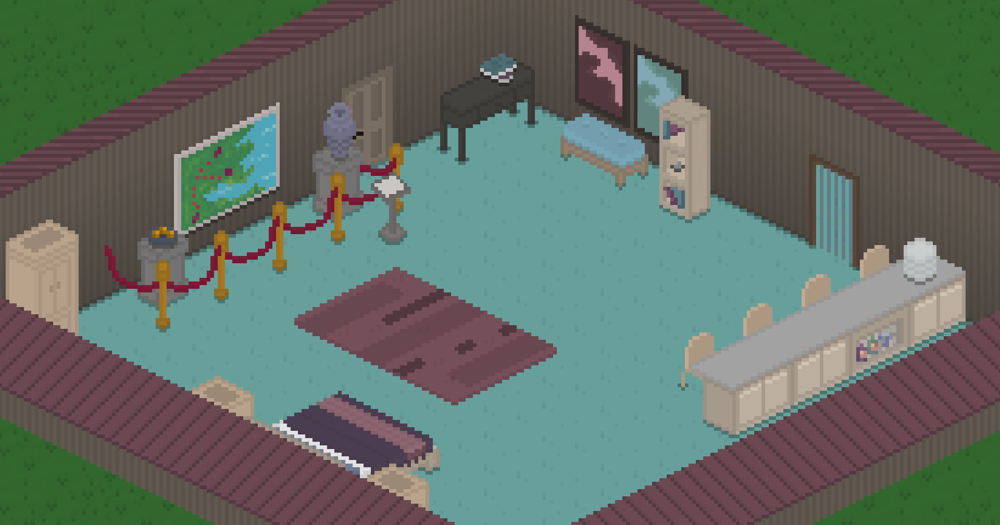

> Huge New Set, Babysitters, Museums, More Stings, and More

**Read the devlog [on the website](https://tinylifegame.com/devlogs/0.41.0/).**

Additions
- Added the Contemporary Complements set with art by [Gindew](https://linktr.ee/redgindew), which includes a large amount of new furniture items, art pieces, and more
- Added the ability to hire a one-off babysitter using the phone
- Added a museum lot type, along with a museum curator lot staff, and the ability to view art pieces
- Added a new voice type, the soft voice, by [Jason Hall](https://linktr.ee/jason11818)
- Added event sting sound effects for various important events by [Jamal Green](https://www.jamalgreenmusic.com/)
- Added the ability to adopt someone as a parent
- Added the ability to set a height offset for roofs, allowing more advanced roof layouts
- Added cute little ambient bee particles around flowers and flower bushes

Improvements
- Improved center position when rotating the camera on higher floors
- Also allow storing furniture in the household storage while on the cursor
- Made it take much longer for family-focused people to miss their family
- Made people get uncomfortable if they eat the same food too often
- Display roadmap and wiki links in the main menu
- Made people discard their held item before sleeping
- Slightly decrease the size of the controls hints by default
- Made the money change overlay more prominent
- Allow making UI scale much smaller on high-res screens
- Made lot staff types have icons
- Move all furniture to its correct parent object spot position on load
- Cull roof filler walls that aren't visible
- Improved skill gain speed of the communication skill
- Display a tooltip when hovering over lots, rather than having to guess the type by the lot's outline color
- Improved the styling of in-world tooltips for the gamepad cursor

Fixes
- Fixed a bed that only has the current person in it saying you're not romantic enough with them
- Fixed TVs close to map borders causing an exception when trying to watch
- Fixed being unable to start interactions with people on different floors
- Fixed a crash when selecting a tile that is out of bounds
- Fixed an exception when opening a people selection menu from a small map
- Fixed content not being selected when switching furniture tabs using a gamepad
- Fixed gamepad tooltips being in the corner of the screen for one frame
- Fixed the played household's held furniture items being deleted when loading the game
- Fixed roof filler walls z-fighting when moving the camera
- Fixed a rogue wallpaper pixel being visible on gabled roofs in some camera rotations
- Fixed babies being unable to eat when the only seat is on a different floor
- Fixed people turning a weird direction sometimes when interacting with big furniture items
- Fixed ordering from staff not failing when the staff can't be reached, causing far-away interactions

API
- Localizers: the verbose log now displays mismatched newline characters between localizations
- Added a proper README to the API

# 0.40.1
*March 10, 2024*

In yesterday's update, we made a last minute change to lot visitation behavior that we thought was minor but turned out to break a lot of things. Oops?

Fixes
- Fixed played people also having to be invited in, causing them to be unable to visit lots
- Fixed home lots not counting as visited when first spawning on them, causing people to be unable to find objects on them
- Fixed players having to use the visit lot action for people to be able to see objects on lots

# 0.40.0
*March 9, 2024*

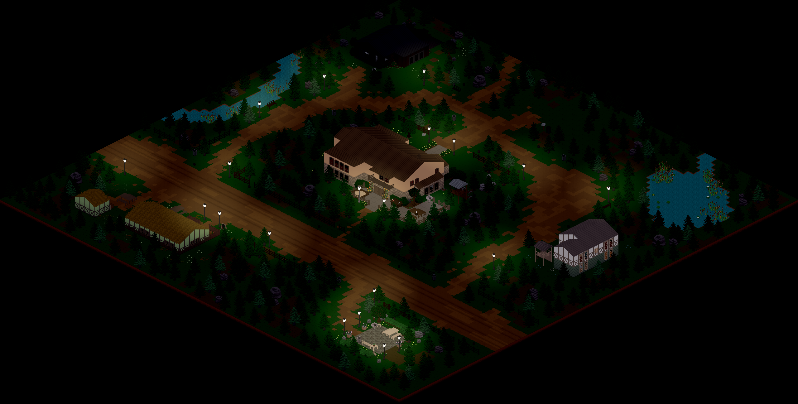

> Lunar Grove and Populated Homes

**Read the devlog [on the website](https://tinylifegame.com/devlogs/0.40.0/).**

Additions
- Added Lunar Grove, a lovely secluded forest town with buildings contributed by the lovely [Plumbella](https://www.youtube.com/@Plumbella)
- Added the ability for empty homes to be populated automatically with exported or randomly generated households during gameplay
- Added a backup management screen that allows creating, removing and restoring save backups from within the game
- Added on-screen camera zoom buttons
- Added a few new cakes

Improvements
- Display some important notifications as splashes in the center of the screen
- Display the reason an object can't be placed in build mode as a tooltip
- Display achievement progress in the achievements menu
- Improved the look of tooltips
- Made some foods incompatible for people who are pregnant
- Display food restrictions when they apply, rather than when they don't
- Moved chair spots slightly closer to their parent objects
- Disallow children from visiting a strange household with no children in it
- Made people discard their held item automatically before going out of town
- Display relationship levels in the people selection menu
- Avoid households with more household members also receiving more visitors
- Display which items were changed in the steam content notification
- Made people go on parental leave automatically if necessary when giving birth
- Made people stay at home and on lots longer
- Don't require a table for children to do homework
- Display rooms on lower floors a bit darker to make depth clearer for open floor sections
- Highlight the selected person more thoroughly compared to other people when using the highlight tinies option
- Display an auto-save indicator at the top of the screen

Fixes
- Fixed doors opening for people on different floors
- Fixed people being allowed to use doors when they weren't invited in
- Fixed the Maple Plains City Campers' Lane 2 living room area being inaccessible in new saves
- Fixed a rare crash when loading a save with complex fencing setups
- Fixed existing work relationships not improving if the ai relationships option is off
- Fixed a rogue black pixel in the rhombus rug
- Fixed the ability to make the UI scale so large that reverting was impossible
- Fixed depth rendering issues for people with a lot of clothes layers equipped
- Fixed UI blinking briefly when a person is selected using right-click
- Fixed mail carriers and trash collectors not going home after their route is done
- Fixed children being able to apply furniture upgrades
- Fixed outfit previews in the character creator ignoring hidden layers
- Fixed the cheat history storing empty strings when invoking an empty cheat
- Fixed lots being marked as visited when walking over them, causing people to stick around lots they weren't meant to
- Fixed removing maps from saves causing people to spawn at map borders and getting stuck

API
- Added SimpleBehavior action, an action type that allows easily creating behavior-based actions without a custom class
- Improved the way special action types, like talk actions and project actions, are constructed
- Game content initialized through static constructors is now explicitly loaded in order. If a mod disrupts the order by accessing content earlier than expected, a warning is emitted.
- Generified the color system to allow all objects with colors to have a color map and default colors

# 0.39.1
*February 4, 2024*

Improvements
- Display a roadmap information box about household selection area colors

Fixes
- Fixed the MonoGame About link in the credits
- Fixed mods not being able to register actions correctly

API
- Reverted static constructor game content loading change from 0.39.0
- Added code documentation for changes since 0.38.0

# 0.39.0
*February 2, 2024*

> An Upgrade to Your Tiny Life

**Read the devlog [on the website](https://tinylifegame.com/devlogs/0.39.0/).**

Additions
- Added the tinkering skill and the ability to discover upgrades
- Added the ability to upgrade various furniture items
- Added a variation of the wooden stairs that doesn't have wallpaper

Improvements
- Improved the visual style of the character creator
- Made the family-focused personality's emotions also take close friends into account
- Only allow admitting to romance with someone else for seven days after it happened
- Renamed "Add a Little Something" to "Enhance Flavor"
- Made energy loss and the chance of splinters lower when woodworking
- Made people not stand in the same spot when multiple people visit a lot at the same time
- Improved the Tiny Bucks logo to be more easily decipherable as TB

Fixes
- Fixed the furniture tool considering possible parent objects on different floors
- Fixed moving to a different map not moving people there correctly
- Fixed a crash when moving ceiling-hung objects out of bounds using the furniture tool
- Fixed the same map being able to be in a save twice
- Fixed help actions not working correctly when the person is being held
- Fixed notifications not being able to be dismissed when clicking their icon
- Fixed object selection not working correctly on higher floors
- Fixed objects at map borders causing a crash when checking for free interaction spots
- Fixed an exception when the sink or baby is missing while cleaning up a baby
- Fixed objects still being highlighted while placing stairs
- Fixed collision issues with stairs

API
- Game content initialized through static constructors is now explicitly loaded in order. If a mod disrupts the order by accessing content earlier than expected, a warning is emitted.
- Made TestedVersionRange property mandatory for mods
- Refactored particle and light property names to be more consistent

# 0.38.4
*January 7, 2024*

Additions
- Added pantyhose and semi-transparent pantyhose leg accessories
- Added leggings for adults and children

Improvements
- Automatically populate Steam item descriptions with data from the shared item
- Use the household split panel when inviting someone into your household
- Made it more difficult to die from being too brewed
- Display untested mods info as a proper warning popup so players miss it less easily
- Removed the name "Nazi" from the naming database. Being a reasonably popular middle-eastern/asian name, it was part of the database of popular international names Tiny Life used. Because of obvious connotations, we've decided to remove it.

Fixes
- Fixed an issue where Tinies with partners that aren't in the world are inconsistently marked as single
- Fixed an error when trying to move a Tiny to their home location but there aren't any empty spaces around
- Fixed being able to change your pronouns in a language that doesn't include them
- Fixed Tinies thinking they'd reached their destination already when being on a different floor
- Fixed being able to add the same map to the list of maps in a save twice, causing a crash
- Fixed an exception when putting down a painting on the easel you're about to start a new painting on
- Fixed being able to walk through stairs in certain situations

API
- Added leg accessory clothing category
- Allow mods to add custom names to name collections
- Added GetRooms methods to Map and Lot

# 0.38.3
*December 19, 2023*

Changes that weren't included in preview versions are written in **bold**.

Improvements
- Made people automatically discard items (put them down or put them away) before starting actions that they need empty hands for

Fixes
- Fixed people getting stuck on stairs when canceling an action sometimes
- **Fixed a rare exception when pathfinding upstairs**

API
- Added some UI initialization events
- **Expose ModLoader.LoadedMods**

# 0.38.3-pre.1
*December 16, 2023*

This is a preview version. If you want to try it out, you can find more info on [the documentation](https://docs.tinylifegame.com/articles/preview.html).

Improvements
- Made people automatically discard items (put them down or put them away) before starting actions that they need empty hands for

Fixes
- Fixed people getting stuck on stairs when canceling an action sometimes

API
- Added some UI initialization events

# 0.38.2
*December 14, 2023*

Fixes
- Fixed an error when people try to visit a lot while none are within visitation hours

# 0.38.1
*December 13, 2023*

Additions
- Added an in-game hint that warns players about deadly emotions
- Added the ability to easily change people's pronouns by selecting them

Improvements
- Rebalanced painting sale prices a bit
- Disallow visitors entirely outside of lot visitation hours
- Made energy and hygiene loss a bit lower when woodworking

Fixes
- Fixed the modern crib not showing its front
- Fixed a crash when undoing actions related to furniture and roofing
- Fixed people entering town in cars appearing to teleport
- Fixed a rare exception when changing the amount of household members while pathfinding is in progress
- Fixed lot staff idling around objects on lots other than their work lot

# 0.38.0
*December 6, 2023*

> Get Cozy Indoors and Lock Out Your Friends

**Read the devlog [on the website](https://tinylifegame.com/devlogs/0.38.0/).**

Additions
- Added various clutter items, including jars, palettes, washing up stuff, book stacks, sandbox decor
- Added various outdoor decorations, including sunflowers and clover patches
- Added five new wallpapers and three new tiles
- Added the poetic genius life goal
- Added the ability to disallow friends and strangers visiting by selecting a home lot's front door

Improvements
- Display a warning when mods haven't been tested on the current game version
- Display other maps as part of the main menu background
- Display the influence of an emotion on a skill in the skill tab
- Improved depth calculations for big ground objects like rugs
- Display a dropdown in the pronoun selection area that suggests default pronouns
- Slightly rebalanced skill item quality outcomes
- Display when a person is currently on vacation in their job tab
- Only start new jobs with an active vacation day if they should be at work immediately when getting the job

Fixes
- Fixed mod error notification not being localized fully
- Fixed tooltips for missing lot conditions not being displayed when using a gamepad
- Fixed the name of the in-game hint for multiple floors being missing
- Fixed people claiming beds on other people's home lots
- Fixed TVs with more than one layer looking incorrect when displaying content
- Fixed the ability to load saves that don't have per-save options files
- Fixed lots at map borders causing a crash
- Fixed a crash when having an invalid language selected in the options
- Fixed being able to watch TV on different floors
- Fixed being entirely unable to order from lot staff
- Fixed the running animation showing while still stationary when jogging

API
- Added Mod.TestedVersionRange, a new property that mods are expected to implement, which allows specifying a SemVer version range of Tiny Life versions that the mod has successfully been tested with
- Overhauled the memories system to allow for multiple memories of each type to be present
- Updated to .NET 8
- Generified pathfinding code to allow using it for non-Person objects
- Allow launching into a save directly using the --save or --load argument
- Allow using the --ansi argument to include console colors in log files for modders
- Mods are now loaded in order of their DLL's name

# 0.37.5
*November 18, 2023*

In preparation for the Steam Autumn Sale, here's a bugfix update that addresses a lot of common issues!

Improvements
- Try to avoid walking over lots to get to a goal
- Only allow toggling newspaper deliveries at your home lot's mailbox
- Allow painting low-level paintings with higher skill level too
- Put an upper bound on flood filling tiles to avoid issues when creating custom worlds

Fixes
- Fixed being unable to jog on dirt paths
- Fixed fireflies spawning out of bounds
- Fixed lights from particles staying around when switching the viewed map
- Fixed being able to place furniture in fences
- Fixed people being able to put down babies on empty tiles on higher floors
- Fixed notification history lag when closing
- Fixed help action exception when a partner is missing
- Fixed an exception when genetic influences have no hair

# 0.37.4
*November 6, 2023*

We've been making some changes to how tiles and wallpaper draw in the world, and it turns out that it caused a lot of issues that we neglected to test for. This is a really embarrassing one, though. Sorry everyone!

Fixes
- Fixed auto-tiles and water tiles straight up not working

# 0.37.3
*November 5, 2023*

Fixes
- Fixed 0.37.2's new depth implementation breaking rugs
- Fixed being unable to apply wallpaper to walls on lower floors if they're close to the border of the lot
- Fixed wallpaper on roofs intersecting with walls incorrectly
- Fixed all lights on upper floors drawing incorrectly if they have a camera offset

API
- Integrate furniture ceiling and floor attachment into the ParentInfo system

# 0.37.2
*November 4, 2023*

Additions
- Added the ability to apply wallpaper to the areas below stairs

Improvements
- Increase the size of various previews in build mode
- Improved depth calculations for wallpaper and tiles

Fixes
- Fixed wallpaper and tile previews rendering incorrectly in build mode
- Fixed a rare crash when people with map-wide lot employments visit other maps
- Fixed people with lot employments visiting other maps causing them to get stuck
- Fixed a birthday notification being displayed for adults even though they can't age up

# 0.37.1
*October 30, 2023*

Improvements
- Also show people's age in their tooltip when there's no relationship yet
- Don't cancel repairing objects when uncomfortable

Fixes
- Fixed the tile tool not being able to flood when there are no tiles on a level yet
- Fixed walls not drawing their shadow gradient on higher floors
- Fixed being able to have leading and trailing spaces in various names
- Fixed not being able to ask lot staff to leave when invited
- Fixed being able to order from lot staff when invited
- Fixed particles from rooms above rendering on lower floors
- Fixed a crash when loading a demo save in the full game for the first time

# 0.37.0
*October 25, 2023*

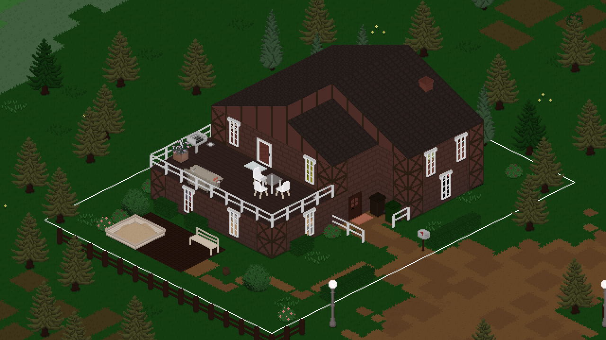

> Multiple Floors and Fences Galore

**Read the devlog [on the website](https://tinylifegame.com/devlogs/0.37.0/).**

Changes that weren't included in preview versions are written in **bold**.

Additions
- Added the ability to build additional floors on lots, allowing up to 5 floors in the full game, and 2 in the demo
- Added a proper wall-like fencing system, including a new metal fence, and marked furniture-style fences as obsolete for future removal from the game
- Added a wide three-layer shelf, a small stack of books, and a rhombus rug
- Added a proper sand tile, which looks a lot better than the yellow dirt path color
- Added the ability to play online games with specific other tinies
- Added the ability to adopt babies as well
- Added a few more hair and skin colors
- Added Simplified Chinese translation, courtesy of [Zhao Huaye](https://space.bilibili.com/67102871). Thanks so much for your hard work!

Improvements
- **Overhauled emotion stings and lower music volume while they're playing**
- **Add the exported version as a tag when uploading items to Steam workshop**
- **Automatically remove outdated custom content on game startup**
- Allow chatting on the phone with multiple people at once
- Allow inviting over multiple people at once
- Made the AI choose from available people based on their relationship
- Paths at the borders of the map will now also count as exit points
- Improved auto-tile visuals, and made path colors auto-tile with each other
- Persist object repair progress between attempts
- Display thought bubbles when reading
- Allow people with lot employments to visit when being asked
- Display a person's age on their tooltip
- Snap wall-attached furniture to appropriate walls automatically in build mode
- Start jobs off with an active vacation day so that work doesn't start immediately
- Allow adoptive parents to take parental leave as well
- Allow undoing using ctrl+shift+z as well
- Display vehicle ownership as a tooltip
- Automatically create a save backup when game version or mods change
- Display destroy particles for walls and tiles on higher floors
- Display a wide new game button when there are no saves, rather than graying out the load button
- Inverted default steam cloud behavior, causing newly created saves to be cloud synced by default
- Use the natural placement sound for water objects
- Use newer masters of Leiss' soundtrack, which also includes some previously missing bits
- Changed the furniture tool's name and icon to "Objects" to accommodate the fact that it also contains plants and other decorations
- Reduced the time it takes for new Steam subscriptions to be reflected in the game
- Display an info that the game needs to be restarted when enabling or disabling mods
- Remove roofs that intersect with newly created rooms

Fixes
- **Fixed two people repairing an object breaking repair progress**
- Fixed wall-related undos and redos not correctly restoring old rooms
- Catch any validation exceptions for map objects
- Fixed fairy lights crashing when not on a wall
- Fixed out-of-town actions counting as visible for babies
- Fixed the tile tool having visual issues in some camera rotations
- Fixed an exception when an enqueued social action has no valid partner
- Fixed collisions not updating correctly when moving some furniture
- Fixed undoing a room deletion not restoring the room correctly
- Fixed an exception when a person stops having a lot employment and then tries to go home
- Fixed a crash when a lot has no free tiles around the front door
- Fixed mods with broken localizations crashing the game on startup
- Fixed interior walls not displaying as down straight after placement
- Fixed people autonomously reading skill books that don't interest them
- Fixed regular visitors being deleted from maps removed from saves
- Fixed moving lots allowing roofs to be out of bounds
- Fixed a crash when loading an invalid save file in the demo

API
- Added MultiActionHandler initialize event
- Replaced action varieties with a new system, action arguments, which allows multiple arguments to be passed at once
- Allow adding more actions to the set of actions used by the Clean Everything action
- Dead people are now stored in their gravestone, rather than on the map the gravestone was first on

# 0.37.0-pre.3
*October 18, 2023*

This is a preview version. If you want to try it out, you can find more info on [the documentation](https://docs.tinylifegame.com/articles/preview.html).

Additions
- Added Simplified Chinese translation, courtesy of [Zhao Huaye](https://space.bilibili.com/67102871). Thanks so much for your hard work!

Improvements
- Use the natural placement sound for water objects
- Use newer masters of Leiss' soundtrack, which also includes some previously missing bits
- Changed the furniture tool's name and icon to "Objects" to accommodate the fact that it also contains plants and other decorations
- Reduced the time it takes for new Steam subscriptions to be reflected in the game

Fixes
- Fixed wall-related undos and redos not correctly restoring old rooms

# 0.37.0-pre.2
*October 12, 2023*

This is a preview version. If you want to try it out, you can find more info on [the documentation](https://docs.tinylifegame.com/articles/preview.html).

Improvements
- Display an info that the game needs to be restarted when enabling or disabling mods
- Remove roofs that intersect with newly created rooms

Fixes
- Catch any validation exceptions for map objects
- Fixed fairy lights crashing when not on a wall
- Fixed newly created rooms blocking stairs with tiles

# 0.37.0-pre.1
*October 11, 2023*

This is a preview version. If you want to try it out, you can find more info on [the documentation](https://docs.tinylifegame.com/articles/preview.html).

Additions
- Added the ability to build additional floors on lots, allowing up to 5 floors in the full game, and 2 in the demo
- Added a proper wall-like fencing system, including a new metal fence, and marked furniture-style fences as obsolete for future removal from the game
- Added a wide three-layer shelf, a small stack of books, and a rhombus rug
- Added a proper sand tile, which looks a lot better than the yellow dirt path color
- Added the ability to play online games with specific other tinies
- Added the ability to adopt babies as well
- Added a few more hair and skin colors

Improvements
- Allow chatting on the phone with multiple people at once
- Allow inviting over multiple people at once
- Made the AI choose from available people based on their relationship
- Paths at the borders of the map will now also count as exit points
- Improved auto-tile visuals, and made path colors auto-tile with each other
- Persist object repair progress between attempts
- Display thought bubbles when reading
- Allow people with lot employments to visit when being asked
- Display a person's age on their tooltip
- Snap wall-attached furniture to appropriate walls automatically in build mode
- Start jobs off with an active vacation day so that work doesn't start immediately
- Allow adoptive parents to take parental leave as well
- Allow undoing using ctrl+shift+z as well
- Display vehicle ownership as a tooltip
- Automatically create a save backup when game version or mods change
- Display destroy particles for walls and tiles on higher floors
- Display a wide new game button when there are no saves, rather than graying out the load button
- Inverted default steam cloud behavior, causing newly created saves to be cloud synced by default

Fixes
- Fixed out-of-town actions counting as visible for babies
- Fixed the tile tool having visual issues in some camera rotations
- Fixed an exception when an enqueued social action has no valid partner
- Fixed collisions not updating correctly when moving some furniture
- Fixed undoing a room deletion not restoring the room correctly
- Fixed an exception when a person stops having a lot employment and then tries to go home
- Fixed a crash when a lot has no free tiles around the front door
- Fixed mods with broken localizations crashing the game on startup
- Fixed interior walls not displaying as down straight after placement
- Fixed people autonomously reading skill books that don't interest them
- Fixed regular visitors being deleted from maps removed from saves
- Fixed moving lots allowing roofs to be out of bounds
- Fixed a crash when loading an invalid save file in the demo

API
- Added MultiActionHandler initialize event
- Replaced action varieties with a new system, action arguments, which allows multiple arguments to be passed at once
- Allow adding more actions to the set of actions used by the Clean Everything action
- Dead people are now stored in their gravestone, rather than on the map the gravestone was first on

# 0.36.2
*September 17, 2023*

Improvements
- Display character creator and build mode tooltips immediately
- Only display leaving notification if a person was invited in

Fixes
- Fixed a crash when creating a new save file without saving
- Fixed a concurrent modification issue when adding maps to a save
- Fixed roofs not being validated properly, causing crashes when previewing lots
- Fixed being unable to mop a puddle on natural ground indoors
- Fixed chatting not working correctly with people on other maps

# 0.36.1
*August 25, 2023*

We're taking a development break for a few weeks! This is a little bugfix update to tide yall over, though. ❤️

Improvements
- Avoid people bunching up when visiting a household by choosing a unique goal location

Fixes
- Fixed being unable to select disabled build mode buttons using a gamepad
- Fixed an exception when a social action fails due to a missing partner
- Fixed children being unable to complete the Friend of Everyone life goal
- Fixed people repeatedly trying to prepare food when failing

# 0.36.0
*August 15, 2023*

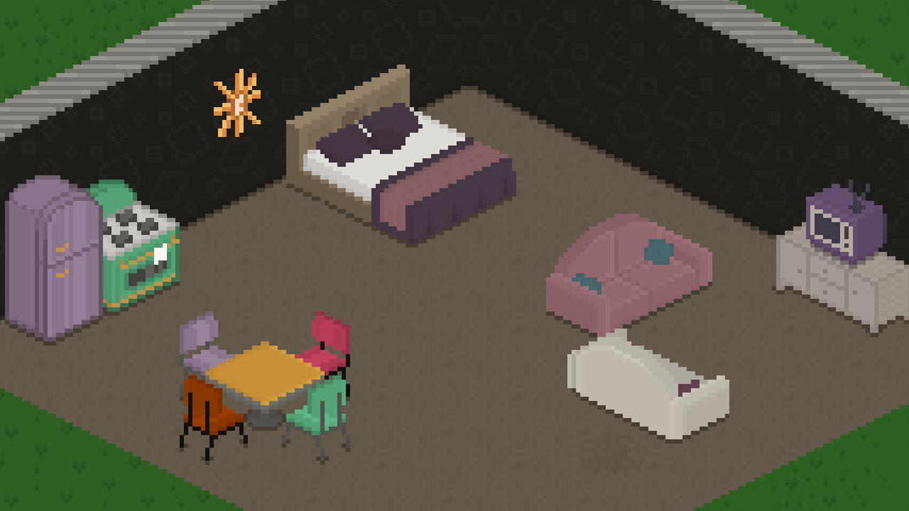

> Retro Rarities and Stopped Starvation

**Read the devlog [on the website](https://tinylifegame.com/devlogs/0.36.0/).**

Additions
- Added the Retro Rarities set with art by [clovedove](https://clovedove.tumblr.com/), which includes various new furniture and clothing items in a retro style
- Added ambient firefly particles to forested areas
- Added two new funky wallpapers
- Added large concrete tiles tile

Improvements
- Display variation textures for concrete, roads and dirt paths
- Increased default and allowed regular visitor amounts
- Added emotions for babies following adults and cleaning up babies
- Added emotions for babies reading story books and adults helping them
- Display custom content info in multi-map selection options menu
- Improved unemployment display in relationship infos
- Link new community showcase site in custom content menus
- Localized exported household, person and lot names
- Improved friendship and romance string displays in relationship panel
- Allow the espresso machine to break
- Improved passive update timing for unplayed maps

Fixes
- Fixed jungle gym not being obstructed by roofs
- Fixed debug teleport action not working if the person is on the same map
- Fixed content not being properly validated when lots are exported
- Fixed various issues when adding additional maps to the current save
- Fixed tile grid being hidden behind multi-layer tiles
- Fixed depth positions of scaled particles on parents
- Fixed people not finding out someone's job when meeting them at work
- Fixed moving to a new lot causing the household to be added on the wrong map occasionally
- Fixed unpaid bills info displaying for inactive households
- Fixed skill achievements not working due to baby skills
- Fixed being unable to go home on a different map if standing in the same location as the home lot
- Fixed people not fully reaching their destinations on high speeds, causing subsequent actions to fail
- Fixed regular visitors failing to appear at their jobs, causing them to get fired regularly

API
- Made Walk and Drive actions typeless
- Allow roofs to have multiple layers and colors
- Allow actions to be enqueued as priority by the AI

# 0.35.4
*August 2, 2023*

This one's a little embarrassing. Sorry everyone!

Fixes
- Fixed a crash when creating a new save.

# 0.35.3
*August 1, 2023*

Fixes
- Fixed an exception when loading very old saves, or saves with corrupted options
- Fixed being able to open the world switch menu using a gamepad when only one world is present
- Fixed a crash when a Tiny dies in another world
- Fixed a rare exception when trying to visit a lot in another world

# 0.35.2
*July 28, 2023*

Additions
- Added ambient leaf particles that occasionally fall from trees

Improvements
- Made furniture storage amount display easier to read, and display it even when no items are stored

Fixes
- Fixed a crash when multiple objects are removed while updating
- Fixed being able to enter build mode while on another map
- Fixed border tile selection being incorrect, causing weird looking paths in Demoville

# 0.35.1
*July 22, 2023*

Improvements
- Clarified popup that displays when the game crashed
- Improved path cost modifiers for tiles slightly
- Clarified map selection in new game menu for multi-maps

Fixes
- Fixed an occasional crash when trying to import a household
- Fixed a crash when validating lot employments on an old custom map
- Fixed an exception when picking up a person that was deleted

API
- Also use dictionaries for map neighborhood

# 0.35.0
*July 20, 2023*

> Multiple Maps and Fabulous Phones

**Read the devlog [on the website](https://tinylifegame.com/devlogs/0.35.0/).**

Additions
- Added the ability for saves to have multiple worlds in them, as well as the ability to travel between them
- Added mobile and landline phones, as well as the ability to use them to invite people over
- Aded a bills breakdown list to the notification
- Added Creative Kid life goal
- Added two new achievements
- Added thought bubbles which display in some situations, like when sleeping
- Added the ability to use emoji in text (currently only pasting is supported, not direct input through the operating system's emoji keyboard)

Improvements
- Stagger minor object updates for much improved overall performance in play mode and less lag spikes
- Display a notification when meeting new people at work or school
- Improved the mod list view in the game options
- Allow using up and down arrow buttons to navigate the cheat history
- Made some more baby actions emotion-dependent
- Made Tinies wait to be invited in when they visit so that they don't go jogging randomly
- Improved mail delivery order so that the mail deliverer doesn't wander aimlessly through the world
- Made the notification display and history menu slightly wider
- Display weekday separations in the notification history menu
- Allow changing the cheats keybind in the options
- Nerfed painting sale prices slightly again
- Cleaned up the debug menu
- Improved achievement names

Fixes
- Fixed Steam icon being missing from Steam notifications
- Fixed outdated rooms causing a crash when making a map smaller
- Fixed counters and fences rendering ghostly when a lot preview is created
- Fixed another genealogy issue when having children
- Fixed flower grass connecting to paths incorrectly
- Fixed being able to ask babies to taste child food
- Fixed main menu warnings being displayed again when exiting to the main menu
- Fixed doors opening visually for people who have not been invited in
- Fixed an exception when trying to do an inappropriate action on a lot without a household
- Fixed front door calculations taking into account trash bins as well as mailboxes
- Fixed some strings, like family-focused, not splitting properly due to length

API
- Due to the addition of the ability to have multiple maps, action infos now have a current map and a goal map, rather than just a single map
- Updating objects now have three updating states: always minor, major if the map is active, and always major
- Allow mods to interact with the game's SaveData when saving and loading through new events in SaveHandler

# 0.34.0
*June 25, 2023*

> Of Bars, Brews and Progress Bars

**Read the devlog [on the website](https://tinylifegame.com/devlogs/0.34.0/).**

Additions
- Added the ability to make drinks using the Mixology Kit
- Added a Bar lot type with a bartender
- Added the Dive Bar by the Lake lot by [AngelofAcid](https://steamcommunity.com/id/AngelofAcid/myworkshopfiles/?appid=1651490) to Maple Plains City
- Added Now You See It All window and door
- Added Solid Paint with Baseboard wallpaper and ColorCo Cute Cacti wallpaper
- Added progress displays to some actions

Improvements
- Improved the lot staff tooltip to add more information
- Made conversation partners walk back to the initiator if they walk away after being talked to
- Made protein shakes also count towards the Drink Mixing skill
- Allow selecting a Tiny in the active household by right-clicking them in the world
- Improved lot visitation priorities for the AI
- Some performance improvements for pathfinding
- Allow daily goal for teachers to also be fulfilled through skill books
- Display an open book texture when people are reading
- Allow water tiles to connect to dirt paths as well
- Pause the game while the notification history is open
- Order lot employment menu by first name
- Made gender options and clothes on randomly generated Tinies have a higher chance to be more consistent with Western
  gender norms

Fixes
- Ensure vehicles are removed when an action is canceled or fails
- Fixed children being unable to take days off school
- Fixed the gnocchi being too cheap
- Fixed "map unavailable" tooltip not being displayed when using a gamepad in the demo
- Fixed the quality of baked goods being influenced by the cooking skill
- Fixed lot staff sometimes not finding their lot and getting stuck
- Fixed lots momentarily being invisible when a Tiny in the household goes home
- Fixed sleeping in a crib causing an exception when the crib is removed
- Fixed people only going to the corners of public lots when visiting, instead of the entrance
- Fixed people being called to meal if they haven't been invited in yet
- Fixed Perfect Painter life goal being available for children
- Fixed work and school emotions displaying the wrong source

API
- Added the ability for lot types to define their own visitation hours
- Added Map.OnEventsAttachable event
- Added a basic style preference system for clothes

# 0.33.2
*May 29, 2023*

Fixes
- Fixed a rounding error in amount-based goals
- Fixed an exception when trying to pick up a person that a Tiny doesn't know
- Fixed children and babies repeatedly asking for food when food is already being prepared
- Fixed an exception when adding a baby as the 8th household member
- Fixed visitors leaving to do other things upon being invited in

API
- Added some more emote categories for better distinction
- Added a warning for when the issue tracker URL for a mod isn't set

# 0.33.1
*May 27, 2023*

Fixes
- Fixed an occasional UI crash when exiting Play Mode
- Fixed vacation days being awarded daily rather than weekly (embarrassing)

# 0.33.0
*May 26, 2023*

> The Quality of Life Update

Read about this update in last week's post [on the website](https://tinylifegame.com/devlogs/launch_postmortem/).

Additions
- Added the ability to invite visiting Tinies into your house (they shouldn't enter otherwise)
- Added the ability to take vacation days and family leave
- Added ColorCo Modular Curtains
- Added Turkish translation by Archura Localization Group

Improvements
- Made adults take leftovers from the fridge rather than cooking new food when asked for food
- Added some more modern and hair colors
- Moved some computer actions into subcategories
- Disable the AI for a little bit when a manual action is started
- Handle mod initialization issues more gracefully
- Made babies not lose social effectiveness when using a social multiple times in a row
- Made some clothes intentions unavailable for babies
- Bold some text in the in-game hints to make it easier to skim
- Allow Tinies to do inappropriate things if they're close to the lot's household members
- Made people more likely to put down items before doing things
- Improved the City Dweller reward personality by causing it to give discounts on public lots
- Allow potties to get dirty

Fixes
- Fixed babies being able to have sophisticated emotions
- Fixed mods being able to add objects to incorrect map sections
- Fixed households not automatically getting a job if there is a primary school student
- Fixed Play action displaying as "too sad" for every object if too sad
- Fixed Tinies deleted from the character creator not being removed from relationship panels
- Fixed still being able to order food and drinks at the café with no money
- Fixed being able to fool around while holding something
- Fixed a rare exception when baking food

API
- Removed IPricedObject interface
- Made more Register methods return the registered objects
- Allow mods to specify an issue tracker URL
- Added an event for when the play mode tool stats panel updates
- Added support for having multiple jobs at the same time
- Added SaveHandler.OnSaveLoadError event
- Added OnGetPrice event for food items

# 0.32.4
*May 11, 2023*

Additions
- Added Czech translation thanks to [Pavlína Šeborová](https://steamcommunity.com/id/Paviinka/)
- Added an accessibility setting to highlight Tinies in the world
- Added woodworking recipes for some newer items like the changing table

Improvements
- Made pregnancy-based energy loss a bit less high
- Don't display pronouns in places where they're not really useful
- Show lot outlines when zoomed all the way out in Play and Build modes
- Show lot type icons in the Visit Lot action name
- Show skill description tooltips in job promotion requirements

Fixes
- Fixed some transitive genealogy calculations
- Fixed a rare exception when pathfinding a very short car route
- Fixed choice prompts not having a default selected element when using a gamepad
- Fixed a rare crash when publishing items on the Steam workshop

API
- Easily allow mods to change the game's default textures through TextureHandler events
- Allow for mods to extend the Person class through a protected constructor and various virtual methods
- Allow for clothes to have an additional description in the character creator

# 0.32.3
*May 8, 2023*

Improvements
- Reduced Steam thumbnail sizes, which should mitigate upload issues for some people
- Updated localizations

Fixes
- Fixed Steam usernames not being saved correctly for downloaded items
- Fixed the usage of reserved file names being allowed on Windows
- Fixed a rare crash when opening and closing the life goals menu too quickly
- Fixed the fitness level 3 goal actually requiring fitness level 5 in the Gym Rat life goal
- Fixed the log file not being able to be opened by other programs, causing a crash
- Fixed a crash when trying to pick up a book from a deleted bookshelf
- Fixed a crash when playing with a custom map that was removed from the game
- Fixed romance with only partner sometimes counting as romance with someone else if the household was exported and then imported again
- Fixed an exception when reading a skill book while quitting and then loading the game
- Fixed being able to watch TV from the location we're standing if no other locations are available

API
- Harmony for mods is now optional to avoid issues on ARM devices. If you use Harmony, please return true on RequiresHarmony in your mod class.

# 0.32.2
*May 3, 2023*

Additions
- Added a popup with additional information when uploading an item to the Steam workshop
- Added an accessibility option to move the pronoun display to before a Tiny's name

Improvements
- Made it much more likely for Tinies to get leftovers rather than cook something

Fixes
- Fixed a missing "too angry" localization string
- Fixed lot previews being offset in some camera rotations
- Fixed being unable to remove lots that are intersecting
- Fixed a lot of issues when trying to move a map in a negative direction
- Fixed impossible actions for wall-hanging paintings being available

# 0.32.1
*May 2, 2023*

This is a small update to fix some major bugs people have reported since the Early Access release earlier today! Thanks so much for all the kind words and lovely feedback today, we're so grateful to have such a kind and loving community <3

Fixes
- Fixed a rare crash when a person is out of bounds in a vehicle
- Fixed a crash when a map loads very quickly
- Fixed a rare crash when a food item's parent furniture is removed while eating
- Addressed a crash when trying to resize the cursor on some devices

# 0.32.0
*May 2, 2023*

> Tiny Life is out now!

This is the initial version of Tiny Life's [Steam Early Access release](https://store.steampowered.com/news/app/1651490/view/3702565493872455898). The following changelog only covers changes in the Tiny Life Demo since 0.31.4.

Improvements
- Made autonomously getting a job be affected by the "AI Important Actions" gameplay option

Fixes
- Fixed walls sometimes being drawn as down in the lot movement preview
- Fixed a rare crash when animations and clothes are mismatched
- Fixed some actions taking a tiny bit less time than their intended amount, causing goals not to complete
- Fixed a rare crash when the same song is played repeatedly

# 0.31.4
*April 27, 2023*

Improvements
- Prioritize the cooking action when asking an adult for food

Fixes
- Fixed objects out of bounds being able to crash the game
- Fixed a rare exception when spawning an item from a bookshelf or toy box
- Fixed Tinies being kind of addicted to getting jobs on their own

# 0.31.3
*April 26, 2023*

Fixes
- Fixed some actions with varieties never being started by the AI

# 0.31.2
*April 26, 2023*

Additions
- Added the Revive cheat to revive dead Tinies
- Added a Randomize button to the pronoun selector
- Added some more socials between children and adults

Improvements
- Render roofs and objects that have a parent in the lot movement preview
- Store texture pivots for Tinies in a file rather than in code

Fixes
- Fixed portrait layout hiding pronouns if a Tiny's name is very long
- Fixed long names causing issues in the household split menu
- Fixed changing ages in the character creator not updating clothes previews correctly
- Fixed a rare exception when throwing an item away
- Fixed multiple text fields being able to be selected in the character creator sometimes
- Fixed memories not being saved correctly

# 0.31.1
*April 17, 2023*

Additions
- Added the ability to disable the "Unavailable in Demo" info boxes in the hints options
- Added "On the Roadmap" boxes in appropriate places that tease upcoming features (which can also be disabled in the hints options)

Improvements
- Made clock time format be based on the selected language
- Allow languages to specify that a Tiny's last name should be displayed in front of their first name

Fixes
- Fixed spanish localization using the wrong language code, causing a crash
- Fixed the character creator soft-locking the game when editing outfits for a Tiny who is incomplete

# 0.31.0
*April 14, 2023*

> Small Update, Big Pronouns

No devlog this time! Keep an eye out for a big announcement soon, though...

Additions
- Added the ability to set pronouns for Tinies. To set pronouns for your already existing Tinies, use the `EditPerson` [cheat](https://docs.tinylifegame.com/articles/cheats.html).

Improvements
- Display the price for a new painting on the Paint action
- Avoid creating portraits for Tinies who aren't seen unnecessarily
- Improved the way relationship type names are displayed
- The camera now rotates around the cursor rather than the center of the screen
- Hide personality types that aren't available for the Tiny's current age
- Display a notification when a relationship's romance type changes

Fixes
- Fixed adults being able to be randomly generated with child voices
- Fixed being able to start a new painting when not having enough money
- Fixed primary students being able to get a raise
- Fixed children being able to die from too much protein
- Fixed copying outfits causing the color to change on the outfit copied from as well
- Fixed food/drink orders at cafés being random items rather than the ones ordered

# 0.30.1
*April 2, 2023*

Additions
- Added shadows to Tinies (which were the only objects that didn't have any)
- Added the ability to order tea at cafés

Fixes
- Fixed Tinies not sitting down properly while watching TV
- Fixed Linux and Mac builds crashing due to a localization file name inconsistency

# 0.30.0
*March 31, 2023*

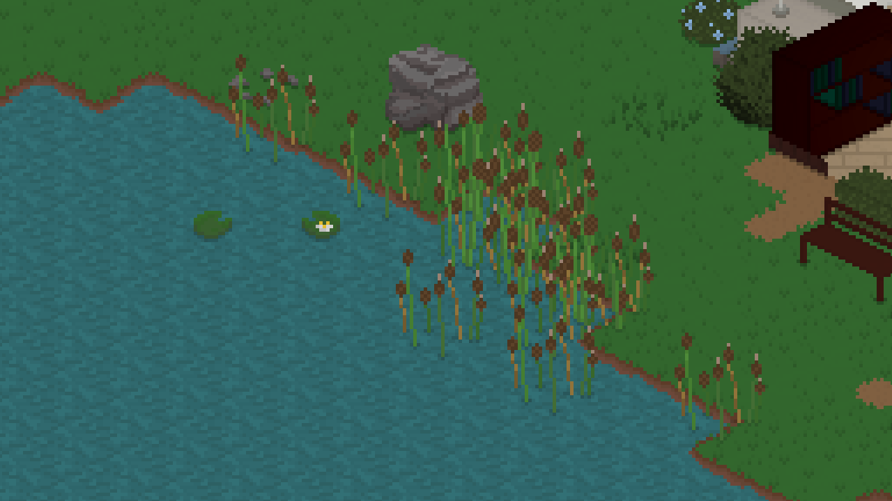

> Big Steps Towards Release

**Read the devlog [on the website](https://tinylifegame.com/devlogs/0.30.0/).**

Additions
- Added a few more decorative objects, including two lamps, cattails and lily pads
- Added a flat sheet metal roof
- Added the ability to set initial relationship data in the character creator
- Added a tea maker and various types of tea
- Added the ability for children to ask for help with their homework
- Added the ability to move to a different lot in play mode
- Added the ability to ask people about their jobs
- Added polish localization by [HugBeast](https://www.instagram.com/hugbeast00), Kalme and [TeaMaki](https://bsky.app/profile/teamaki.bsky.social)
- Added french localization by [YenSide](https://instagram.com/candice_mlng)

Improvements
- Cause links to be opened in the Steam overlay on Steam Deck
- Improved social action pathfinding, causing people to stop less
- Allow changing the cursor size in the accessibility options
- Made people much more likely to eat the food they cooked immediately
- Display a popup with info on how to add additional tinies when first pressing the Done button in the character creator
- Headscarves will now hide a Tiny's hair rather than entirely removing it
- Deflate save files to decrease their size
- Tinies with a partner will now try to sleep in a double bed that their partner has claimed a side of
- Replace the "Alternate Number Keys" option with keybinds for switching between Play Mode tabs (which default to Q and E)
- Allow rotating flat roofs
- Rebalance the amount of frienship and romance gain that actions give
- Massively reduce the markup of custom paintings
- Draw the build mode grid on the entire lot, rather than just in rooms
- Allow navigating the interaction menu's pages with the shoulder buttons when using a gamepad
- Randomly add items to trash cans at midnight occasionally to allow for special rummaging finds
- Made food quality and saturation not influence eating speed, but hunger need restoration speed
- Increase the friendship gain from random interactions with coworkers at work
- Improved the look and layout of update notifications in the main menu
- Made grilled cheese vegan-friendly
- Updated from .NET 6 to .NET 7

Fixes
- Fixed people being able to steal held items from other people
- Fixed big objects not being selected properly near section boundaries
- Fixed "This is Inappropriate" action not having a properly localized string
- Fixed maki rolls looking awful
- Fixed forced actions sometimes being able to exceed the action queue's length limit
- Fixed macros like keybinds not displaying properly on the loading screen's hints
- Fixed some default couples not having had their first kisses yet
- Fixed a rare crash when resizing the window while in a loading screen
- Fixed techie tinies being unable to play video games when they're sad
- Fixed the Ask if Single notification having the wrong order
- Fixed out-of-town actions failing if there's an item on the ground near the map border
- Fixed some actions claiming a required object is missing when the Tiny is too far away
- Fixed being unable to close the Life Goal menu if all life goals are completed when using a controller
- Fixed Tinies watching TV through walls
- Fixed a crash when removing a TV that someone is currently watching
- Fixed Tinies using the toilet and washing their hands while holding an item
- Fixed some more issues with transitive genealogy calculations

# 0.29.5
*February 20, 2023*

Fixes
- Fixed the mouse button not being hidden properly when using a gamepad
- Fixed a crash when pressing buttons on a gamepad during a transition
- Fixed jogging not being available in the demo
- Fixed Split and Export button being available in the demo, deleting households
- Fixed a rare exception when using a gamepad in the emotions tab
- Fixed some issues with transitive relationship calculations
- Fixed lot staff being invited into a household still maintaining their position
- Fixed a rare exception when opening the character creator through an action

# 0.29.4
*February 14, 2023*

Improvements
- Allow regular visitors to enter town more quickly after a new save is created
- Always allow blowing out birthday candles when aging is disabled
- Added program arguments for cheats (`--cheats`) and a custom game directory (`--game-dir`)

Fixes
- Fixed large objects like trees not being selectable near section boundaries
- Fixed big screenshots not working in non-default camera rotations
- Fixed animated tiles being drawn onto the selection target unnecessarily
- Fixed arm accessories on children looking incorrect
- Fixed drinks making people pee themselves very quickly
- Fixed hair not being consistent with multiple outfits when aging up
- Fixed blurred map rendering being triggered based on the wrong camera size
- Fixed control characters being added to text boxes when pressing unrecognized keyboard keys
- Fixed progress arrows causing a crash when using a gamepad sometimes

# 0.29.3
*January 26, 2023*

Improvements
- Explain that other default maps are unavailable in the demo
- Improved error handling for Steam cloud save issues

Fixes
- Fixed people in Demoville cleaning up items from the picnic spot while cleaning at home
- Fixed the load menu staying open after the last save is deleted, causing gamepad controls to get stuck
- Fixed natural objects not being removed when a new room is created
- Fixed a rare crash when switching between gamepad and mouse controls
- Fixed old cloud saves crashing the game if Steam is open (thanks so much [Owlynn](https://twitter.com/OY_TheGeniusD) for their help fixing this issue)

# 0.29.2
*January 19, 2023*

Improvements
- Made hint popups be displayed per-save, and allow skipping them more easily
- Only display 10 saves at a time in the Load Game menu to avoid lag
- Added gamepad scrolling to the New Game menu to allow easily reading worlds' descriptions
- Updated default money amounts for various households to be more in line with their stories

Fixes
- Fixed breakable furniture taking a while to show that it's broken
- Fixed vehicles sometimes getting stuck in default maps when exporting

# 0.29.1
*January 17, 2023*

Improvements
- Made reading jokes in the newspaper raise the humor skill
- Don't hide the mouse cursor automatically when a tooltip is showing
- Lower the amount that the toilet need is reduced by when eating
- Made working as a programmer affect the Techie personality's emotions

Fixes
- Fixed info about an unreleased set showing in the demo
- Fixed out-of-town children affecting the Hates Children personality
- Fixed emotes sometimes clipping into walls and roofs

# 0.29.0
*January 16, 2023*

> Say Hi to the Demo

**Read the devlog [on the website](https://tinylifegame.com/devlogs/0.29.0/).**

Additions
- Added the Demoville world, including its community-made lots and households
- Added the Exploring Demoville life goal to the demo
- Added a default long hairstyle for children
- Added a progress arrow display to skills, relationships, job performance and needs
- Added the ability to clean out all of a fridge's empty or expired items
- Added the ability to view a lot's opening hours by hovering over the café sign furniture item

Improvements
- Made TVs play sounds when they're on
- Improved performance when first drawing a map's static objects
- Render with anti-aliasing on low zoom levels to create a mipmap-style effect
- Made cafés require a food display case
- Don't draw room content that isn't visible, improving performance on maps with houses that have a lot of rooms
- Made it much more likely for people to go home when their needs are low
- Preload emotion sting sound effects to mitigate lag when the first one is played
- Improved the way a skill's max level looks
- Enable gamepad repeats to allow holding buttons to press them multiple times
- Made food in the fridge last much longer
- Allow children to order food from cafés
- Hide clothes occasions that were unused
- Added a maximum amount of money for a household to have
- Made it a bit more likely for choice prompts to be successful
- Display a tooltip when there's not enough money to copy an outfit

Fixes
- Fixed various crashes when loading save files with missing objects or clothes
- Fixed the tile tool not drawing previews properly in some locations
- Fixed a crash when importing a lot that was exported on a bigger map
- Fixed tiles not being visible when using the lot movement tool
- Fixed a texture region bleeding issue on chairs
- Fixed an exception when trying to talk to someone who is at the border of the map
- Fixed keybind names being moved into multiple lines even though they have enough space
- Fixed lighting causing artifacts on some older graphics cards
- Fixed color selection in the character creator not working correctly with a gamepad
- Fixed no elements being selected after switching a person's age using a gamepad
- Fixed cakes with candles being able to be put into the fridge
- Fixed long life goal titles going under the abandon button
- Fixed a crash when a duplicate object is added to a map and the map is loaded

# 0.28.3
*December 28, 2022*

Additions
- Added the option to use a 12-hour clock

Improvements
- Improved the mod options button and menu layout
- Removed the itch community button from the main menu
- Improved pathfinding on pathways by taking diagonal costs into account
- Improved performance of outside tile rendering

Fixes
- Fixed the interaction menu's back button not displaying in the correct location
- Fixed "do you want to enable mods" notification never displaying on startup
- Fixed a lot's home location not being correct for non-residential lots, causing Tinies to walk into weird places
- Fixed rocky ground and grassy dirt being favored for walking

# 0.28.2
*December 23, 2022*

Additions
- Added the ability to use window border scrolling, which can be enabled in the Controls options

Improvements
- Improve rendering performance by not animating outside tiles while zoomed out
- Don't slide notifications in and out when UI animations are disabled

Fixes
- Fixed Tinies avoiding walking on rugs
- Fixed a crash when copying or pasting text in a text field fails
- Fixed the tile placement preview not rendering indoors

# 0.28.1
*December 20, 2022*

Fixes
- Fixed localizations from mods not being loaded on startup

# 0.28.0
*December 20, 2022*

> The Last Beta Update Ever

**Read the devlog [on the website](https://tinylifegame.com/devlogs/0.28.0/).**

Additions
- Added jungle gym, coloring book, and festive tree objects
- Added the thrifty personality
- Added goofy and confident emotions
- Added the perfect painter life goal
- Added an accessibility menu with some new options
- Added the ability to ask someone if they're single
- Added the ability to cheat, admit to cheating, and possibly be broken up with as a result
- Added more emotions for existing interactions, such as children seeing adults kiss
- Added some more painting types to the easel and some more woodworking recipes
- Added a gym trainer to gym lots that occasionally encourages people who are working out
- Added some more of Leiss' songs
- Added a proper loading screen so that the window doesn't stay closed while loading the game

Improvements
- Made romantic actions less likely to go well if the partner is already dating someone else
- Also use pixel-based selection for roofs, allowing more intuitive roof selection and removal
- Improved pathfinding by considering multiple locations for when driving to a goal, which should mitigate unnecessary driving
- Improved the visuals of the Tiny Bucks logo
- Improved some AI priorities for certain actions
- Display a green background for items that are cheaper in build mode and the character creator
- Tinies will now try to avoid walking over gravestones and puddles
- Increased the default and maximum amounts of regular visitors
- Made it less likely for randomly generated people to wear helmets for their daily outfits
- Introduced some memory and CPU usage improvements
- Made held items swing less wildly during the walking animation
- Display a warning when a lot employment has to be removed due to a lot import

Fixes
- Fixed an incorrect border when drawing auto-tiles next to concrete
- Fixed the "Toggle All Lights in Room" action being available for lights that are outside
- Fixed people who are out of town still displaying particles
- Fixed homework books getting stuck on the ground if the action fails early
- Fixed some z-fighting issues with objects on desks, as well as hanging lamps
- Fixed the game sometimes staying open in the background after being closed
- Fixed the incorrect emotions being added when friends and family members die
- Fixed people being able to cross double doors diagonally
- Fixed paintings contributing to the Capable Carpenter life goal
- Fixed chimney particles being affected by indoor light and hiddenness
- Fixed lag when pressing the Steam cloud sync button
- Fixed abandoned vehicles sometimes being left forever
- Fixed a rare exception when quitting to the main menu while a notification is being displayed
- Fixed regularly visiting children not having the student job
- Fixed being able to store others' creations in the household storage
- Fixed a rare exception when loading a skill book action from disk
- Fixed a rare exception when closing the move tool while an item is on the cursor

API
- Improved the ActionBehavior pattern by merging MultiActionBehavior
- Added the ability to add custom data to relationships
- Added ActionPriorities cheat that prints every action priority for a person

# 0.27.0
*November 12, 2022*

> Trashy Techie Library

**Read the devlog [on the website](https://tinylifegame.com/devlogs/0.27.0/).**

Additions
- Added a double-sided bookshelf, a book cart, a small indoor trash can, an outdoor wheelie bin, a vertical planter box, and a simple nightstand
- Added a library lot type with a librarian Tiny, as well as the Maple Plains Library by Vortis
- Added the techie personality type
- Added the ability to take out the trash from indoor trash cans
- Added a lot more emote images
- Added the ability to short-press the right mouse button to rotate objects

Improvements
- Display particles when children are playing in the sandbox
- Display smoke particles when someone is angry
- Display particles when using a sink
- Display an "Are You Sure" panel when changing lot types if there's staff on the lot
- Made roofs have a maximum size so that they don't cause issues on big lots
- Made some food types more friendly to other diets
- Slightly improved the espresso machine's steam wand texture
- Children now gain skills at school based on an internal schedule
- Force residential lots to have outdoor trash cans on them (they have to be added upon first entering build mode after this update)

Fixes
- Fixed skill books giving skill points while still walking with the book
- Fixed an exception when a food item gets removed while someone is eating it
- Fixed being able to attempt to kiss strangers
- Fixed households not being removed properly when everyone dies, causing issues later on
- Fixed some ground items (like books and gravestones) being non-walkable, causing Tinies to get stuck
- Fixed some static objects not being drawn properly after the map is updated to a new version
- Fixed a possible stall when a map is updated with custom lots present

API
- Added the ability to specify clothes depths based on the layer
- Archive projects instead of fully removing them when they don't pay out anymore
- Removed TypelessAction in favor of allowing normal actions to be typeless

# 0.26.0
*October 18, 2022*

> Lights, Camera, Music

**Read the devlog [on the website](https://tinylifegame.com/devlogs/0.26.0/).**

Additions
- Added the first of many of [Leiss](https://leiss.bandcamp.com)'s songs for the Tiny Life Soundtrack
- Added the outdoorsy personality type
- Added two headscarves
- Added some more skill-related socials

Improvements
- Improved custom content import menus
- Automatically update import menu content if underlying files change
- Change a lot's name to the imported lot's name when importing
- Ask for a name when exporting a lot or a household
- Children without a complete household are now added to the adoption pool instead of being exported
- Made choice prompts also be influenced by a Tiny's skills
- Hide small updates in the main menu's changelog panel by default
- Made the old computer a bit more square looking
- Cooking shows will now have a chance to yield the baking skill in addition to the cooking skill
- Made Tinies meet and gain friendship with their coworkers while they're both at work
- Mark visually held items (like sponges and spanners) as fake so they don't inhibit action queueing

Fixes
- Fixed diagonal keyboard camera movement being too fast
- Fixed failed undo/redo attempts crashing the game
- Fixed a crash when getting up out of bed after a Tiny's outfits have been edited
- Fixed a crash when a modded personality type was removed since the last session
- Fixed an ignored exception when exiting the character creator
- Fixed the mouse cursor still activating the UI while it was hidden
- Fixed Admire being called Admirar (for some reason)
- Fixed food item effects not being applied if the eat action is not completed fully
- Fixed a crash when multiple emotion modifiers run out at the same time

API
- Added a clothes compatibility system to allow for certain clothes to be automatically removed if others are selected
- Added Ben.Demystifier to make stack traces more legible

# 0.25.3
*September 19, 2022*

Fixes
- Fixed a crash when abandoning a life goal
- Fixed adults being able to blow out candles, causing a crash
- Fixed a rare crash when a notification popup slides away
- Fixed being able to slide away notifications in the history menu

# 0.25.2
*September 17, 2022*

Improvements
- Also follow a person when left-clicking their button again while they're already selected
- When saving custom households, files will now append a number rather than a large amount of dashes if they conflict

Fixes
- Fixed a rare crash when opening an interaction menu too fast
- Fixed the skill book action not being able to be loaded from disk, causing an exception
- Fixed options not saving when pressing the X button on them

# 0.25.1
*September 13, 2022*

Improvements
- Animate notifications when they appear and disappear
- Allow clicking on notifications to make them go away
- Search for custom content recursively, rather than in just the topmost folder
- Increased rendering performance, especially when rotating and moving the camera while zoomed out

Fixes
- Fixed roofs being duplicated when undoing and redoing
- Fixed a rare crash when a Tiny tries to face another Tiny in a conversation

API
- Added the ability for mods to add an options file and menu
- Added a proper build script to the Example Mod, allowing for more control and ease of use when modding

# 0.25.0
*September 5, 2022*

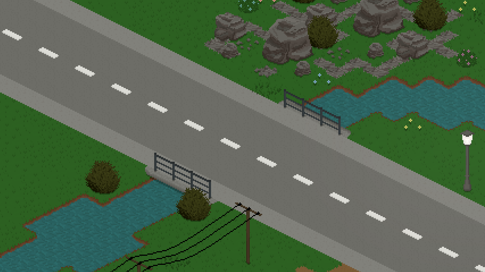

> Water, Stuff and Skill Books

**Read the devlog [on the website](https://tinylifegame.com/devlogs/0.25.0/).**

Additions
- Added the ability for primary school students to study at a bookshelf
- Added the ability to get raises after reaching level 10 of a career
- Added some decorations, including maple fairy lights, three rocks, a shelf with three layers, big bushes
- Added some wooden siding wallpaper
- Added water, grassy dirt and stone ground tiles
- Added large glass windows and a large glass door
- Added skill books for every skill in the game
- Added businessperson, retail worker, doctor, and scientist daily tasks
- Added required promotion skills for primary school students
- Added icons for jobs
- Added the ability to disable newspaper deliveries at mailboxes
- Added a keybind to change wall modes

Improvements
- Extended the map with a house by Macy and a household by Vortis
- Adjusted death emotions to be less severe for acquaintances
- Adjusted the introvert personality to get less overstimulated less quickly
- Slightly rebalanced energy and entertainment need gain
- Made higher job levels require higher amounts of performance to be promoted again
- Expanded the color palette for sofas and some wallpapers
- Made lot boundaries display with proper depth related to objects intersecting them
- Improved rendering performance by drawing some objects in a static batch, rather than every frame
- Order keybind menu by name
- Display a notification when a lot can't be imported due to an error
- Display portraits of people who are out of town as slightly transparent

Fixes
- Fixed an exception when trying to load mail from disk
- Fixed being unable to put the homework book away
- Fixed a rare exception when creating a painting
- Fixed undo/redo hints not displaying in keyboard mode
- Fixed various objects still executing an in-world action when in the household storage
- Fixed a rare exception when a Tiny tries to pick up an object that has been removed
- Fixed visitors not going home properly after being out of town sometimes
- Fixed an exception when trying to make fun of people who don't have a job
- Fixed an incomplete options file causing the game to crash on startup
- Fixed border tiles not being added to the static sprite batch properly, causing rendering issues
- Fixed an exception when trying to take an object from the fridge that has already been removed
- Fixed keyboard camera movement not allowing diagonal movement
- Fixed the feedback form not working when the log file is large and a lot of info has been input
- Fixed the job tab displaying a dollar sign in addition to the tiny bucks sign
- Fixed the ability to place walls without enough money

API
- Allow furniture to specify whether it should fit in an object spot or not
- The game version that a save was saved with is now stored

# 0.24.1
*August 2, 2022*

> Various Fixes and Improvements

Improvements
- Made randomly generated outfits match their intention better
- Made lots replace the ground with their default tile type rather than grass when moving them
- Added info text to homes that are too expensive for starter households
- Added a notification for when a mod fails to load

Fixes
- Fixed mods being unable to contain custom furniture

# 0.24.0
*July 28, 2022*

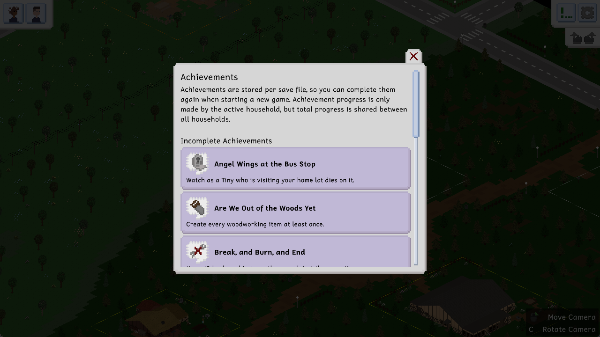

> Undo, Redo, Fridge Achievements

**Read the devlog [on the website](https://tinylifegame.com/devlogs/0.24.0/).**

Additions
- Added the ability to store leftovers in the fridge
- Added the ability to undo and redo actions in build mode
- Added achievements
- Added a paper lantern furniture item
- Added the reasoning skill
- Added some facial hair
- Added the ability to adopt children using the computer

Improvements
- Display a notification when first acquiring a new skill
- Display a button in the job panel for going to work
- Clarify when you can click on a person to head to work
- Randomly generate new people for regular visitors and lot employments if exported ones run out
- Allow children to be regular visitors too
- Added a lot more random names, including various international ones
- Improved performance of saves with a lot of people in them
- Automatically set transitive genealogies when changing the genealogy of a relationship in the character creator

Fixes
- Fixed an exception when getting a job from a newspaper after it has already been removed
- Fixed lot employment navigation on lots being incorrect when using a gamepad
- Fixed new notifications not being added to the top of the notification queue
- Fixed a rare exception when displaying interactions with multiple pages
- Fixed death notifications not having an icon
- Fixed keyboard camera movement not clearing the following person
- Fixed children being able to get the capable carpenter life goal
- Fixed ordering from lot staff not working correctly
- Fixed being unable to click in the world when the cheats menu is open

API
- Objects in a person's hand or in the household storage will now also have their Update methods called
- Improved auto-goal triggering system
- Added the ability to change an action spot's main direction
- Made time a map-based property rather than a game-based one

# 0.23.0
*July 4, 2022*

> Job Choices, Aging Up and Furniture Fun

**Read the devlog [on the website](https://tinylifegame.com/devlogs/0.23.0/).**

Additions
- Added choice prompts for jobs and students, which appear randomly and allow the player to influence the situation
- Added the ability for children to age up into adults
- Added a baking skill and several food items that can be baked
- Added the ability to add candles to cake to celebrate someone's birthday
- Added a bigger version of the fitness rug
- Added a cheaper computer
- Added two new chairs
- Added four new flower vases
- Added two new small lamps
- Added a taller wooden fence
- Added a small coffee table and a new TV stand
- Added two new roof textures
- Added the ability to rummage through trash to dig up thrown away items
- Added kissing
- Added a search bar to the hint history menu
- Added more actions for people that have diet personalities
- Added decorative power poles to the default map

Improvements
- Clarify that puddles on natural ground can't be mopped
- Allow wall sinks to get dirty
- Display some important tooltip information properly when using a gamepad
- Disallow sleeping when stunned
- Go back to the starting location after jogging
- Improve the action variety screen when other people are involved by increasing the size of their portrait
- Allow using WASD to control the camera by default
- Made trash cans fill up with trash
- Order action varieties by name
- Display learned recipes and woodworking recipes when leveling up the cooking and woodworking skills
- Display a security disclaimer when enabling mods
- Play sounds for broken objects

Fixes
- Fixed people's shoes rendering above the picnic table when sitting
- Fixed lights being clipped early, causing them to disappear visually
- Fixed people sometimes putting objects down on surfaces with the wrong rotation
- Fixed some issues on the default map, including walden household duplications and a missing chair
- Fixed diet personalities not being incompatible with each other
- Fixed issues with the smoke particle displaying behind objects
- Fixed people doing the walking animation while their pathfinding is still calculating
- Fixed people sometimes not leaving a lot when asked to
- Fixed "got food somewhere else" notifications being displayed for every household
- Fixed emotion stings playing if the same person is selected again
- Fixed children being able to tinker with stuff
- Fixed being unable to place rugs under tables that have something on them
- Fixed lamps in storage lighting up the place they used to occupy when reloading a save

# 0.22.2
*June 9, 2022*

> Small Improvements, Important Fixes

Improvements
- Deliver newspapers to new households on the first day
- Slightly reduced passive toilet and energy need reduction
- Moved weekly bills to Friday
- Display clothes occasions in the outfit tooltip in the character creator
- Added a lot staff in-game hint when opening the menu
- Made people lose energy more slowly if they're feeling energetic

Fixes
- Fixed pathfinding sometimes failing for long distances
- Fixed outfit tooltip not displaying in the character creator

# 0.22.1
*June 9, 2022*

Fixes
- Fixed a crash when a person that doesn't have a household dies

# 0.22.0
*June 9, 2022*

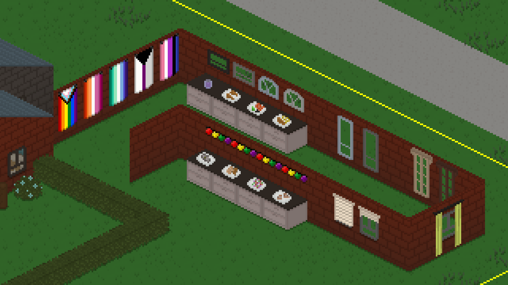

> Some Pride and Some Diet Choices

No devlog this time, but we want to take this moment to wish you all a Happy Pride Month! If you're in a position to, please consider donating to charities like [The Trevor Project](https://www.thetrevorproject.org/) which make an effort to support LGBTQIA+ people.

Additions
- Added four new window designs
- Added a few additional Pride flags
- Added three curtain/blind furniture items
- Added paper lantern fairy light furniture
- Added pescetarian, vegetarian and vegan personality types
- Added a lot of food types to accomodate the new personality types
- Added uneasy and relaxed emotion types

Improvements
- Speed up game launch by improving texture packing performance
- Made drywall a bit less ugly in terms of decorative rating
- Added particles for death-related emotions, as well as showers
- Added protein shakes for creative and relaxed emotions
- Improved the look of the corners on grassy auto-tiles
- Renamed Options button to Options and Hints
- Allow cleaning dishes for the household hero life goal's first stage

Fixes
- Fixed a crash with gamepad controls and in-game hints
- Fixed rendering issues with wall-hanging objects that were placed off the grid
- Fixed a crash when all household members die and UI animations are enabled
- Fixed objects not being able to get dirty

API
- Added the ability for map objects to influence need regeneration speed

# 0.21.3
*May 26, 2022*

Improvements
- Skip packing empty wallpaper textures unnecessarily, improving load times

Fixes
- Fixed a crash when using a mouse button that has no icon in the game
- Fixed rare exceptions with the Add a Little Something, Cook, and Ask to Taste actions
- Fixed a rare crash when opening the in-game menu
- Fixed Thomas Walden spawning in the wall on the default map

# 0.21.2
*May 26, 2022*

Improvements
- Display an on-screen keyboard for input fields when playing on the Steam Deck
- Added a padding to the wallpaper texture to reduce graphical issues with odd screen sizes

Fixes
- Fixed woodworking actions not saving and loading properly
- Fixed a rare crash with the "Ask to Taste" action
- Fixed in-game news being impossible to navigate to using a gamepad

# 0.21.1
*May 26, 2022*

Fixes
- Fixed public street lamps not working when updating an older map
- Fixed a crash when trying to start a woodworking action on an unfinished woodwork

# 0.21.0
*May 24, 2022*

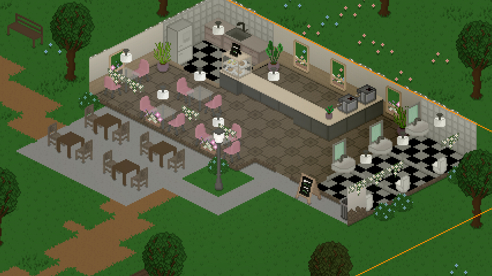

> Two Years of Tiny Life: Cafés, Gamepad Controls and More

**Read the devlog [on the website](https://tinylifegame.com/devlogs/0.21.0/).**

Additions
- Added the ability to control the entire game using a gamepad
- Added newspapers, and the ability to get jobs from them
- Added two street lamps, a stone wall fence, a coffee machine, a food display case, a staff-only door, a café sign, big and small glass dinner tables, a small wooden dinner table, a modern chair, a coat rack, a wall-attached shower
- Added a café lot type, a playground lot type, and a barista lot employment
- Added the Coffees and Trees Café to Maple Plains City
- Added some additional sweet speech sounds
- Added controls hints, which display useful controls in the bottom right corner (and can be disabled in the hints options)
- Added the ability to tinker with objects to increase repair skill
- Added the foodie personality
- Added the ability to "add a little something" to food with cooking level 8 or higher
- Added the ability to create and share custom maps with the community (this is not documented yet, however)
- Added the ability for children to run around for fun
- Added the ability to add a second binding for each keybind
- Added the ability to clear the notification history

Improvements
- Hide the mouse cursor after five seconds of movement inactivity
- Reduced the tooltip delay from half a second to a quarter of a second
- Made grass tiles have visual variations
- Moved portraits down to avoid them being hidden by the emotion name
- Improved the way wall-hanging objects are rendered, causing them to look wrong less often
- Show the amount of items in the household storage on the icon
- Added particles for grilling, being stinky, chimneys, and breaking things in build mode
- Added an option to allow or disallow loading mods (which is disabled by default)
- Added a tooltip displaying who claimed a bed
- Made stunned emotion go away when showering rather than sleeping
- Added a deselect button to the move tool
- Display a link to the game's roadmap in the main menu
- Added a protective wear clothes intention that gets used when driving on an e-scooter for kids

Fixes
- Fixed a crash with regular visitors if there are broken exported households
- Fixed debug food items crashing the game
- Fixed children being able to do lot employments
- Fixed the game crashing when the OS doesn't allow opening folders in the explorer
- Fixed large benches occluding walls
- Fixed a crash that sometimes occured when deleting the last tiny in the character creator
- Fixed people trying to sleep in beds that other people had claimed
- Fixed some issues with Vortis' households and lots
- Fixed people holding paint brushes wrong in some rotations
- Fixed a rare crash when grabbing a serving from a nonexistent platter
- Fixed notifications forgetting their icons when quitting and reloading a save

API
- Converted a lot of enumerations to other types, allowing for custom values to be added
- Allow openings to have multiple layers

# 0.20.4
*April 27, 2022*

> Fix Me, Please!

Improvements
- Moved portraits down a bit to avoid them occluding the current emotion
- Made it twice as likely for objects to break during use
- Added proper error handling to action display names, which avoids unnecessary crashes
- Made required match percentage for clothes occasions much less severe

Fixes
- Fixed mailbox sounds not playing in various circumstances
- Fixed projects being removed by daily pay before they are finished
- Fixed a crash when no front door is found on a lot
- Fixed items on the cursor being deleted when selecting an item from the household storage
- Fixed saves not being deleted correctly when Steam is open
- Fixed a crash when grabbing a serving from a platter on the ground
- Fixed the "pay bills" action causing a crash if someone else already paid them
- Fixed the "go to work" action causing a crash if the person doing so doesn't have a job anymore
- Fixed body parts counting towards the clothes occasions match percentage

API
- Allow adding new colors into existing color schemes

# 0.20.3
*April 4, 2022*

> More Fixes and Fancier Grass

Here's another small set of bugfix updates, along with a nice visual improvement that makes the world's grassy ground look a little more interesting.

Improvements
- Reduced the delay at which tooltips display to a quarter of a second
- Added variations to grass tiles

Fixes
- Fixed a crash when people are told to leave a very tiny room
- Fixed paintings being too expensive to buy sometimes at the easel
- Fixed brazillian portuguese not being recognized on some computers, causing a crash
- Fixed a rare exception when a chair is deleted while someone is occupying it
- Fixed actions sometimes being disallowed with a "??Actions.??" tooltip

API
- Added a debug option to skip preloading pathfinding data when entering a save

# 0.20.2
*March 29, 2022*

Fixes
- Fixed the emergency food mail crashing the game if retrieved after a game relaunch
- Fixed roof-attached objects being removed when a roof is replaced with a new one
- Fixed the household panel not updating when a household is deleted

# 0.20.1
*March 28, 2022*

Improvements
- Don't force-cancel any actions of the currently selected person when someone tries to socialize with them

Fixes
- Fixed actions that can be multitasked being force-canceled when other people try to socialize
- Fixed the character creator's "take off" button don't scrolling properly

# 0.20.0
*March 9, 2022*

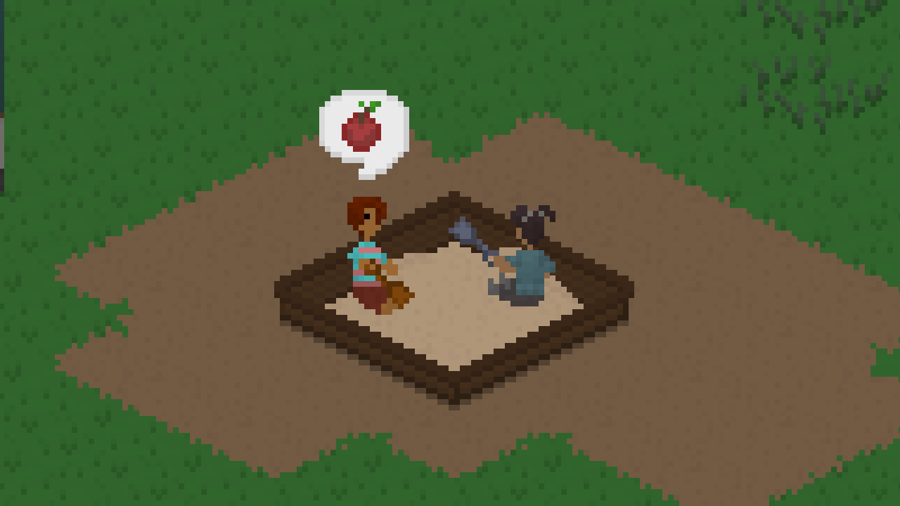

> The Children Update, it's finally here!

**Read the devlog [on the website](https://tinylifegame.com/devlogs/0.20.0/).**

Additions
- Added the Children age group, which includes several new gameplay features, including new interactable furniture items, school, homework and the start of parenting interactions
- Added the Familiar Attire set with art by [Tector](https://www.instagram.com/tectorpixel/), which includes several new clothing items and accessories for children and adults
- Added multiple new furniture items, including three plants, two decorative objects, a smaller picnic table, a sandbox, a jigsaw puzzle, a stove for kids, and a toy box
- Added a top hat clothing item
- Added two new personality types: Family-Focused and Hates Children
- Added a speech type system which includes a more feminine voice style spoken by [SyrinixSoul](https://www.twitch.tv/syrinixsoul)
- Added an option to allow complex social relationships between AI Tinies
- Added a grid to build mode (which can be toggled using the G key)
- Added keybinds to move the camera (arrow keys by default, but can be changed to WASD in the controls menu)
- Added a crash detection system which displays a notification when the game starts up the next time
- Added a world selection to the "New Game" menu

Improvements
- Added the "failed joke" emotion modifier to all jokes
- Organized the gameplay options menu better
- Increased the default brightness increase to 25%
- Moved the notification history button to where options and build mode are
- Display a warning when a save is loaded with missing mods
- Bundle all errors into one notification when loading or saving
- Display the reason that actions in a subcategory are unavailable straight away if they are all the same
- Made accessories less likely to be randomly generated on newly created people
- Some memory usage improvements
- Ordered the furniture tool's "All" tab by the category that furniture items are in
- Added notifications for when cheats are turned on or off
- Allow Tinies to get jobs automatically if important actions are enabled
- Display which color scheme is currently selected
- Allow using ALT for objects that are attached to walls
- Display the loading progress in the loading screen
- Allow stoves to get dirty
- Allow editing and changing outfits at mirrors

Fixes
- Fixed a rare exception when people grabbed a serving of food
- Fixed camera rotation buttons not having a highlight color
- Fixed a crash when trying to talk to a person who just died
- Fixed an exception that occurred when there was no mailbox on a residential lot
- Fixed lot imports breaking if the import button is pressed too many times in a row
- Fixed the household preview being too wide for large households

API
- Added Harmony, allowing for mods to inject custom code into the game

# 0.19.2
*January 8, 2022*

Fixes
- Fixed a crash when opening the woodworking menu

# 0.19.1
*January 8, 2022*

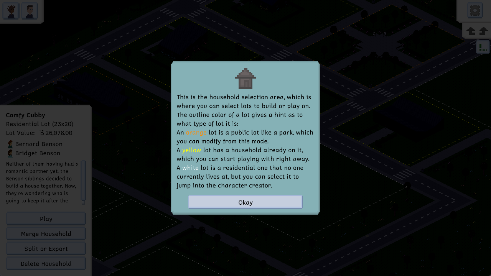

> Better Hints, Better Food, Better Names

This is a small (devlog-less) update that fixes some issues and adds some small features. Enjoy!

Additions
- Added the ability to create and sell apps with a high Programming skill
- Added an emergency food system where rations are delivered to a household whose funds are very low

Improvements
- Improved in-game hints by turning them into a popup and adding icons
- Restore Entertainment need for skills based on how high the skill level is
- Display the names of food plates and woodworking objects in the action and hover descriptions
- Made the lot movement tool less scary when first opened
- Always auto-save, even when lot or character creator conditions are unmet

Fixes
- Fixed a rare crash when changelog images fail to download
- Fixed being able to pick up food plates that other Tinies are currently eating
- Fixed ambient sounds not fading properly between day and night
- Fixed the sell action not being saved and loaded properly
- Fixed the ability to create new outfits even when funds are too low to do so

# 0.19.0
*January 1, 2022*

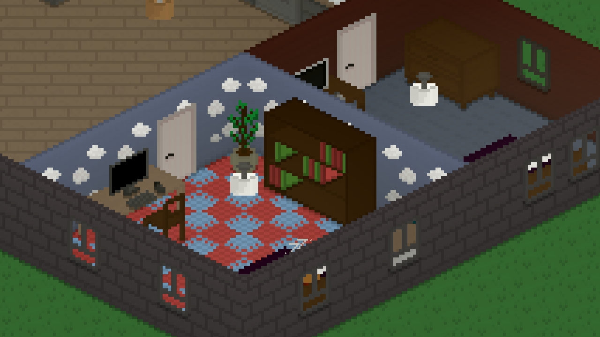

> Ui, Sound and Improvements Abound

Happy new year! **Read the devlog [on the website](https://tinylifegame.com/devlogs/0.19.0/).**

Additions
- Added carpet and puzzle piece floorings
- Added a cloud wallpaper
- Added UI transitions when switching between game modes
- Added ambient sounds which play based on where the camera is
- Added sounds for fireplaces as well as lamp, trash can and woodworking interactions
- Added additional colors for skin, eyes, as well as pastel and modern furniture and clothes
- Added a "Store in Household Storage" action to paintings
- Added a splash screen at the start of the game

Improvements
- Changed all cases of "person" and "people" in the game's text to "Tiny" and "Tinies", respectively
- Display a fade animation when a person dies
- Allow setting desired occasions for each outfit manually
- Made natural tiles (dirt, path, grass) connect to grass smoothly
- Only spawn particles if they'll be visible on screen
- A lot of performance improvements in various areas of the game

Fixes
- Fixed unfinished woodwork items escaping the action preview area
- Fixed additional VRAM being used the more tiles are edited during a single play session
- Fixed the high bun hairstyle not having the workout set icon
- Fixed colors overflowing out of the character creator screen for complex clothing items
- Fixed an exception when trying to fool around in occupied beds
- Fixed some actions throwing an exception when their action object is removed before the action starts

# 0.18.1
*November 26, 2021*

> Changelog Images, News Panel for Main Menu

Improvements
- Added images to the changelog that also display in-game
- Added a news panel to the bottom left corner of the main menu, which will be used for game-related announcements and updates
- Added a cheat to display a list of all cheats (Help, Cheats or List)

API
- Replaced most GameSpeed usage with a speed multiplier float
- Turned some Action methods into properties

# 0.18.0
*November 23, 2021*

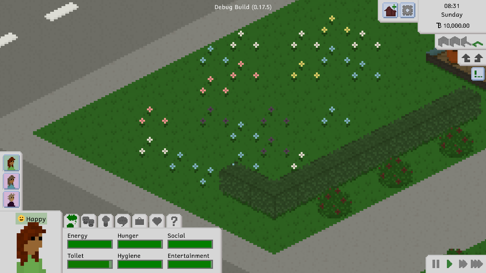

> Animations, Food and Sources

**Read the devlog [on the website](https://tinylifegame.com/devlogs/0.18.0/).**

Additions
- Added emotion sources that display when hovering over an emotion modifier
- Added cool UI animations
- Added a hint history menu to the options
- Added a tab to the character creator which allows writing custom descriptions for people and households
- Added a scientist job
- Added keybinds for zooming in and out
- Added a button to delete a household entirely
- Added some more emotion modifiers that trigger in social situations
- Added some more breakfast foods
- Added a lovely flowery grass tile
- Added a cute scarf

Improvements
- Made skill building activities fun if the skill level is high enough
- Improved memory usage in various cases
- Improved the way relationships between imported people are handled
- Dispose raw versions of packed textures, which reduces VRAM usage
- Limit the length of the notification history to 1024 entries
- Added the website's scrolling background to the main menu
- Replace all natural tiles with concrete when creating a room (not just grass)
- Replace alpha-based particles with scale-based particles to avoid rendering issues
- Also allow AI skill building when a person's job requires it
- Rebalanced job payouts and bills slightly
- Allow loading mods from a zip archive
- Made sounds in hidden rooms quieter
- Improved the look of the mouse cursor

Fixes
- Fixed daily job tasks not working correctly in some cases
- Fixed introverts being happy about being at home when they're not actually at home
- Fixed interaction menus displaying partly off-screen when opened sometimes
- Fixed chatting with people displaying the friendship particle constantly
- Fixed particles being lit from the outside despite being inside in some cases

# 0.17.5
*October 20, 2021*

Fixes
- Fixed mods crashing the game on startup

# 0.17.4
*October 20, 2021*

Improvements
- Move natural objects to household storage when new room is built

Fixes
- Fixed inside tiles being hidden for newly built rooms until the game is restarted

# 0.17.3
*October 19, 2021*

Improvements
- Default names of lots on the map are now localized when creating a new save
- Added an option to disable camera rounding, which helps with visual fragments on some screen sizes

Fixes
- Fixed a crash when rotating the camera on some machines
- Fixed visual fragments on the terrain on some screen sizes

# 0.17.2
*October 18, 2021*

Improvements
- Turned the mac build into an app bundle
- Improved video ram usage of outside tiles

# 0.17.1
*October 18, 2021*

Fixes
- Fixed an exception when putting away books

# 0.17.0
*October 14, 2021*

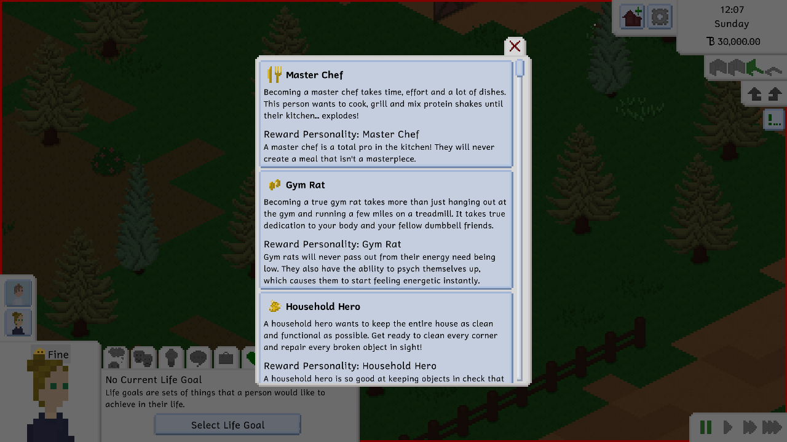

> Life Goals, Reward Personalities and Daily Tasks

**Read the devlog [on the website](https://tinylifegame.com/devlogs/0.17.0/).**

Additions
- Added Life Goals
- Added 5 new personality types that can be obtained by completing life goals
- Added a Daily Task system to some jobs
- Added Dutch translation ([Alexander Stekelenburg](https://twitter.com/superaxander))

Improvements
- Added an in-game hint that explains out of town actions
- Made pivot points pixel-perfect for people to avoid visual alignment inconsistencies
- Added Twitter button to main menu
- Improved GPU memory usage for tiles
- Improved the visual layout of the credits menu
- Added a minor personality types system and moved asexuality and aromance from separate properties to minor personalities
- Renamed Lazy personality to Laid-Back
- Automatically fill empty lot employments and only bring up the menu if there are no available exported people
- Made the language menu display the completion of localizations

Fixes
- Fixed newly placed tiles looking weird sometimes
- Fixed an action exception when someone is fired while at work
- Fixed character creator crashing when someone is bald
- Fixed the scrap action being shown as unavailable on all objects if a person is holding an item
- Fixed scrapping an object failing if the item is held
- Fixed three-seater sofas not actually having three seats
- Fixed food items missing creator information in their tooltip
- Fixed concurrency issues when saving occasionally
- Fixed people displaying particles when hidden

# 0.16.1
*September 9, 2021*

Additions
- Added "[Give Feedback or Report Bug](https://ell.lt/tlfeedback)" buttons to the in-game and main menus
- Added [a cheat](https://docs.tinylifegame.com/articles/cheats.html) to take a full-size screenshot of the map
- Added a Distant Relative genealogy
- Added a tooltip for when buttons are grayed out due to lot requirements being incomplete in build mode
- Added dutch translation ([Alexander Stekelenburg](https://twitter.com/superaxander))

Improvements
- Made reporting non-crashing exceptions easier by pre-filling the form automatically
- Allow pressing Escape to open and close menus
- Allow scrapping objects by clicking their parents (the woodworking table or the easel) too
- Allow removing the last person from the household in the character creator to delete it
- Improved depth calculations of roof-attached objects
- Moved wisteria to the Outside tab in the furniture tool
- Improved the visuals of the cheat ui
- Renamed "Disable Hints" to "Skip Hints" in the options

Fixes
- Fixed color selector not updating when cloning wallpaper, openings, tiles or roofs
- Fixed some table and desk positions causing chairs to be seen as invalid or unavailable

# 0.16.0
*August 30, 2021*

> Woodlands and Visitors

**Read the devlog [on the website](https://tinylifegame.com/devlogs/0.16.0/).**

Additions
- Added the Woodlands Set with art by [faellynna](https://www.instagram.com/faellynna/), which includes a Woodworking skill and a large variety of new build mode items:
  - 34 new furniture items, including the woodworking table and new types of decorative items
  - 4 flooring tiles
  - 5 wallpapers
  - 2 roof styles
  - 8 character creator items
- Added a large new forested area with dirt footpaths to the eastern part of town, along with some new houses and empty lots
- Added emotion sting sound effects by the lovely [Jamal Green](https://jamalgreenmusic.com)
- Added a regular visitors system that allows for people from exported households to visit and interact with the town without living there
- Added a few households that are exported by default to populate the visitors system
- Added the ability for furniture to get dirty and having to be cleaned
- Added an "Invite into Household" interaction
- Added a way to scrap other people's crafts on public lots
- Added italian translation ([SchiavoAnto](https://twitter.com/schiavoanto))

Improvements
- Improved the chatting interaction on the computer, now allowing people to chat with specific people
- Added more in-game hints for various build mode tools
- Added a configurable keybind for increasing and decreasing game speed
- Cleaned up the localization of money and always display money amounts with decimals
- Allow easily deleting items in the move tool by pressing the Del key when hovering over them
- Split the Import menu into custom and default content and improved the household import menu
- Move invalidly placed objects into the furniture storage instead of selling them
- Made people leave the room on their own if they see someone being inappropriate
- Rebalanced bills slightly
- Made people tell others to leave the room when they start fooling around
- Disallow trees from being placed below roofs
- Made trees have a minimum distance from walls
- More gracefully handle Steam cloud sync exceptions
- Color lots on the map based on whether people live there
- Added the ability to clone roofing, openings, wallpapers and tiles in build mode

Fixes
- Fixed paintings being placed on easels incorrectly at fast game speeds
- Fixed a crash when hovering over people with lot employments whose personality is known
- Fixed 3D sounds breaking on camera rotation
- Fixed depth calculations being incorrect for larger and oddly-shaped objects
- Fixed the ability to hack yourself
- Fixed roofing having incorrect display names
- Fixed a crash when exiting the move tool with an item from storage selected
- Fixed hidden (out of town) people still spawning particles and emotes
- Fixed the ability to ask lot employment people to leave not working
- Fixed furniture with parents sometimes not being imported correctly
- Fixed people turning around visually for a single frame when starting social actions while sitting
- Fixed roofs having incorrect depth calculations in some camera rotations
- Fixed people not leaving occasionally when being asked to leave
- Fixed money not being subtracted when importing new households
- Fixed practice speech and jokes actions going on forever if done automatically

# 0.15.0
*July 27, 2021*

> Barbecue Trash Cleaning

**Read the devlog [on the website](https://tinylifegame.com/devlogs/0.15.0/).**

Additions
- Added a barbecue and some grillable food items
- Added a picnic table with attached benches
- Added a new nature-style park with picnic tables and barbecues to the map
- Added an outdoor trash can and a Throw Away interaction
- Added a cleaning skill and some new, related actions
- Added chinese translation ([Rosareven](https://github.com/rosareven))
- Added multiple new funny actions
- Added a few personality-related emotions and actions
- Added a trash collector global employment which will go around public lots and clean up trash that was left behind

Improvements
- Made off the grid (ALT) furniture placement pixel-based
- Improved font smoothing, making small text and tooltips easier to read
- Made sounds in hidden rooms a lot quieter
- Made households on the default map know the personality types of their members
- Don't let people that are hidden from the player starve to death
- Rebalanced jobs, making them give you less ridiculous amounts of money
- Made people with global lot employments have slower need decay, stopping the mail deliverer from passing out constantly
- Made tooltips on invalid actions display instantly

Fixes
- Walls will now only be removed using the Remove tool when there is a line drawn through them, or when both sides are contained in a rectangle
- Disallow wall hanging objects from being placed off the grid
- Fixed paintings on easels being hidden with the Hide Hanging Objects option enabled
- Fixed people trying to get ingredients to cook when there were no available counters to prepare the food on
- Fixed people stuttering visually when on their way to social actions
- Fixed cars being spawned erroneously when the map is loaded

# 0.14.0
*July 15, 2021*

> Lamps, Lot Movement, Speech Sounds!

**Read the devlog [on the website](https://tinylifegame.com/devlogs/0.14.0/).**

Additions
- Added dynamic lighting and two lamps, a ceiling and a floor one
- Added speech sounds and a way to change a person's voice pitch in the character creator
- Added skill requirements for job promotions
- Added information to skill levelup notifactions that lists what actions are now unlocked
- Added an option to increase the overall brightness of the world at night
- Added an option to hide objects attached to walls and ceilings

Improvements
- Overhauled the Move Lot tool, allowing for much easier lot movement and rotation
- Made it likelier for people to pay the bills if their needs are extremely low
- Improved performance of in-world rendering
- Require the "Allow AI Important Actions" option to be turned on for people to repair things automatically in the active household
- Made hints and loading screen info display the current keybind for actions, not the default one
- Made puddles evaporate and disallowed mopping on natural ground
- Improved the volume of in-world audio (temporarily, there are still [more issues to fix](https://github.com/MonoGame/MonoGame/issues/7532))

Fixes
- Fixed the ring menu breaking with a single action on the second page
- Fixed romantic actions displaying for family members if someone is too sad (yikes)
- Fixed incorrect furniture collisions between wall- and floor-based objects
- Fixed action prompts having close buttons when not exitable
- Fixed some visual inconsistencies with particles that are attached to objects
- Fixed held items being deleted when switching out of the Move tool
- Fixed corner-based furniture being able to connect incorrectly, especially counters
- Fixed a wall rendering inconsistency in some camera rotations

# 0.13.1
*July 8, 2021*

> It's the little things

Additions
- Added the ability to ask people about their personalities

Improvements
- Wait longer until a partner is ready for social actions if the action was invoked by the player
- Improved positioning of some objects

Fixes
- Fixed the visual position being incorrect when running on treadmills
- Fixed most foods not having to be cooked
- Fixed some actions not completing correctly, causing cars to get left behind after traveling
- Fixed an action exception if a chair becomes occupied

# 0.13.0
*July 6, 2021*

> Camera Rotation and a Larger Map!

**Read the devlog [on the website](https://tinylifegame.com/devlogs/0.13.0/).**

Additions
- Added camera rotation, which can be used using the C key or the rotation buttons in the top right
- Added a new, more commercial-looking area to the game's map that currently features a park and a new resident
- Added Steam cloud syncing when playing while Steam is open
- Added some more social actions, especially ones related to emotions and skill levels
- Added a proper logo to the game, created by [Tector](https://www.instagram.com/tectorpixel/)
- Added getting water and washing your hands at sinks

Improvements
- Improved action navigation by adding pages to the ring menu
- Added some more plant and wood color schemes
- Added an "are you sure" screen for map employment changes
- Made objects be worth less when sold after being used
- Improved the roofing tool by displaying what's going on
- Made people a little less fast when feeling energetic
- Handle more action-related issues gracefully by displaying a notification about them
- Improved the options menu by adding tabs to it
- Made all emotion modifiers have higher values by default to allow for more nuanced emotions
- Improved rendering performance
- Added more info about the progress of map loading to the loading screen
- Added food preview icons to the food creation menu
- Made people display emotes while practicing speech or jokes
- Order stuff in the buy menu ascending by price
- Added some error handling for loading broken save games

Fixes
- Fixed a crash if asexual people tried to start new relationships
- Fixed a crash when modded furniture is removed from the world
- Fixed people being able to "go here" into walls
- Fixed some furniture items always reverting to their default colors when loading a save
- Fixed people being able to place wall-hanging items like paintings on the ground
- Fixed placing computers on desks (and similar stuff) being difficult
- Fixed some depth inconsistencies with rugs and wall-hanging objects like paintings

# 0.12.2
*June 22, 2021*

This is a small update that features several accessibility features based on information gathered in the [Tiny Life Roadmap Survey](https://ell.lt/tinysurvey). If you haven't taken part in the survey yet, you can still do so now!

Additions
- Added lot rotation to the Move Lot tool
- Added an in-game hints system, which can be disabled in the options for more experienced players
- Added a chance for angry people to autonomously do mean actions
- Added a Controls section to the options
- Added an X button to menus to make it clear that you can close them
- Added an error handler for when actions break, causing them to display a notification instead of crashing the game
- Added a way to delete the held object in build mode (by pressing the delete key)

Improvements
- Improved the saves menu by adding rename and delete buttons
- Improved visual feedback on the household selection ui
- Improved the way furniture looks when not placeable
- Increased the size of notification text

Fixes
- Fixed relationship changes being displayed for both people involved
- Fixed the top right corner of the screen not allowing for in-world interactions
- Updated German localization

# 0.12.1
*June 18, 2021*

- Fixed Make Mod and Write Book actions crashing the game
- Updated German localization

# 0.12.0
*June 17, 2021*

> The Fitness Set

Watch [the trailer](https://www.youtube.com/watch?v=e86RRKPNLv0) and **read the devlog [on the website](https://tinylifegame.com/devlogs/0.12.0/).**

Additions
- Added the Fitness Set, with art by [Tector](https://www.instagram.com/tectorpixel/), which includes a fitness skill and several new furniture and clothing items:
  - Five new hairstyles
  - One new pair of pants and shoes
  - Three new tops
  - 11 new furniture items, including a treadmill, a standing desk, a protein shaker and some decorative items
- Added aromance and asexuality, both of which can be set in the character creator
- Added two additional windows and one additional door
- Added an outfit system that allows you to create multiple outfits for a person and switch between them anywhere

Improvements
- Made social actions less likely to be executed by the AI if they've been done recently
- Made people mop more puddles after mopping a puddle automatically
- Made people more likely to do the dishes, so that they actually do the dishes
- Fixed a few memory leaks that caused more RAM to be used the more saves were loaded/exited in one session
- Improved map rendering performance

Fixes
- Fixed some visual inconsistencies with the in-game ui
- Fixed held items being on a lower layer, causing them to look incorrect
- Fixed negative social actions taking away from relationships too little
- Fixed the ability to place ground objects on other ground objects
- Fixed the position of the coffee table being slightly off in one rotation
- Fixed covered tiles not being included in a lot's covered area
- Fixed people going to weird locations when visiting non-residential lots

# 0.11.0
*June 5, 2021*

> More Actions, More Skills, More Personalities, More Pride!

**Read the devlog [on the website](https://tinylifegame.com/devlogs/0.11.0/).**

Additions
- Added a lot more social actions in various categories
- Added Introverted, Extroverted and Thinker personality types
- Added a Gaming skill and associated actions
- Added an Angry emotion
- Added doors, and the ability to lock them
- Added several LGBT flags as wall decorations
- Added multiple TV stations which each have their own effects
- Added Brazillian Portuguese localization (PinguinAnimation)
- Added a Credits menu
- Added the ability for people to put items on the ground

Improvements
- Made using the same social actions over and over get boring
- Made people hold a mop when mopping floors
- Made people display emotes when waking someone up
- Made people's current emotions be displayed under their portrait
- Replaced all frames on new saves with doors
- Slightly rebalanced Writing royalties

Fixes
- Fixed people making group meals too often
- Fixed people using objects in different rooms if they're technically closer
- Fixed people cleaning up in-progress food automatically
- Fixed being unable to move objects if the furniture storage contains furniture
- Fixed people getting up from chairs for one frame inbetween actions
- Fixed smelly particles appearing below objects
- Fixed hair changing colors when selecting a different hairstyle
- Fixed multiple invalid game states which could cause crashes

# 0.10.1
*May 22, 2021*

> In-depth writing skill and more AI depth!

**Read the devlog [on itch](https://ellpeck.itch.io/tiny-life/devlog/256150/0101-in-depth-writing-skill-and-more-ai-depth).**

Additions
- Added an option that causes people in unplayed households to do skill building activities automatically (if their personality or existing skills allow it)
- Added a confirmation prompt for quitting your job

Improvements
- Rebalanced some actions and skills, especially in respect to skill building speed
- Made people clean more dishes automatically after cleaning a dish
- Updated the descriptions of all personality types
- Updated the map (when creating a new save file) to give every household jobs by default

Fixes
- Fixed mirrored objects (like paintings) looking incorrect
- Fixed issues with migrating from older save files
- Fixed sitting on sofas and benches looking wrong
- Updated German localization

# 0.10.0
*May 17, 2021*

> New colors, clothes and many fixes!

**Read the devlog [on itch](https://ellpeck.itch.io/tiny-life/devlog/254608/0100-new-colors-clothes-and-many-fixes).**

Additions
- Added two new tops, four new bottoms, and four new hairstyles
- Added keyboard lighting for logitech, razer and corsair keyboards
- Added various new color schemes to objects

Improvements
- Made more emotions influence social actions
- Made wallpapers and windows easier to apply by highlighting any part of the wall
- Made drywall free, but ugly to people

Fixes
- Fixed people queueing up actions with people who have already gone home
- Fixed importing households doubling their money
- Fixed the ability to have infinitely large households when importing
- Fixed a crash when grabbing an empty serving
- Fixed various depth rendering issues with small objects
- Fixed family meals costing the same as single servings
- Fixed people being able to talk through walls and doors

API
- Simplified clothing textures by removing redundant frames
- Added various events for people and actions

# 0.9.0
*April 30, 2021*

> Kick Out Your Annoying Aunt and Sofas

**Read the devlog [on itch](https://ellpeck.itch.io/tiny-life/devlog/248431/090-kick-out-your-annoying-aunt-and-sofas).**

Additions
- Added new furniture: A sofa, a coffee table, and a bathroom sink
- Added tabs to the furniture tool
- Added the ability for food to expire
- Added a food platter and a "call to meal" action for large households
- Added an option to allow people to do important actions, like paying the bills, automatically
- Added an option to merge and split households (from and to exported households)

Improvements
- Improved zoomed out rendering performance by hiding small items like grass
- Improved exported households, which will now contain the furniture storage and maintain relationships with other people
- Improved the build tool and lot outlines (to be isometric)
- Improved the color picking abilities of the bookshelf
- Updated German localization

Fixes
- Fixed an issue on some operating systems where textures were mixing visually
- Fixed the Paint action being on too many objects when a person is uncomfortable

# 0.8.2
*April 18, 2021*

Fixes
- Fixed a crash if an object had no default rotation assigned
- Fixed a hang when loading a game with an object of invalid rotation
- Fixed a crash when picking up non-rotating furniture

# 0.8.1
*March 29, 2021*

Fixes
- Fixed in-world sounds being a lot quieter than menu sounds
- Fixed a rare crash on load when removing outdated objects
- Fixed a crash with the skills menu on certain window sizes

# 0.8.0
*March 27, 2021*

> Mail Carriers, Bills and New Screenshots

**Read the devlog [on itch](https://ellpeck.itch.io/tiny-life/devlog/236301/080-mail-carriers-bills-and-new-screenshots).**

Additions
- Added a mail carrier that delivers mails daily
- Added bills that are delivered and need to be paid
- Added a water and electricity rating system that determines how expensive bills are
- Added bar counters that can be sat and worked at
- Added game hints to the loading screen
- Added dirt flooring and two new wallpapers

Improvements
- Made power and water be shut off if bills are not paid, disabling many actions
- Made job levelups give an additional monetary bonus

Fixes
- Fixed walls not having their shadow
- Fixed the bookshelf intersecting with another texture
- Fixed some crashes related to loading and saving
- Fixed camera scaling being incorrect when launching in fullscreen

# 0.7.0
*February 18, 2021*

> Breaking Furniture, Programming, and Many Improvements!

**Read the devlog [on itch](https://ellpeck.itch.io/tiny-life/devlog/223659/070-breaking-furniture-programming-and-many-improvements).**

Additions
- Added food quality, which is influenced by the cooking skill
- Added object reliability, objects breaking and a repair skill
- Added a programming skill and some related actions
- Added the ability to try to gauge the relationship level of others
- Added Focused and Creative emotions
- Added a furniture storage to build mode
- Added a TV furniture item
- Added a "fool around" action for people who are romantic with each other
- Added a large amount of new food types
- Added a white outline around highlighted objects
- Added visual borders to the map
- Added an option to change the auto-save interval
- Added a few new flooring options
- Added the modern single bed
- Added the ambitious personality type
- Added three more job types
- Added two default exported households that ship with the game
- Added a button to choose a random first and last name for a person
- Added hotkeys for switching people (tab) and opening different tabs (number keys)
- Added the ability to give lots names

Improvements
- Made the last played household display in the Load Game menu
- Made clothing cost money
- Made computer screens display images for each action
- Made Uncomfortable emotion get worse the lower a need is
- Improved some existing personality types

Fixes
- Fixed getting embarrassed at yourself when showering or on the toilet
- Fixed non-sellable objects like gravestones being removed when importing a lot
- Fixed people placing items far away on large tables
- Fixed the sleeping pose displaying in the wrong location in beds sometimes
- Fixed being able to sell other people's paintings
- Fixed some sounds being too quiet or too loud
- Fixed being able to take food that someone else is currently eating
- Fixed off-the-grid objects (placed using Alt) having incorrect visual depth

API
- Allow mods to have icons
- Allow clothes to have multiple texture layers

# 0.6.0
*January 27, 2021*

> Romance, Sounds and a Lot More!

**Read the devlog [on itch](https://ellpeck.itch.io/tiny-life/devlog/216521/060-romance-sounds-and-a-lot-more).**

Additions
- Added romance, romantic interactions and the Frisky emotion
- Added sound effects to various actions and objects
- Added job leveling based on work performance
- Added trees and grass patches and a new house to the map
- Added actions to wake someone up and quit your job
- Added some more positive emotions
- Added working animations
- Added a lot of skin and hair colors

Improvements
- Improved the lot and household import and export menus
- Notification history is now saved to file per save
- People can now only sleep in the same bed as someone they're romantic with
- Gameplay options are now stored per save
- Made it less likely for people to visit other lots at night

Fixes
- Fixed being able to remove openings and walls on other lots
- Fixed portraits not updating in the charcter creator
- Fixed plants not being removed when placing concrete or wood tiles
- Fixed being able to do several things (like showering) while holding something
- Fixed positive emotions taking precedence over negative ones if their total amounts are equal

# 0.5.2
*January 14, 2021*

Improvements
- Improved the changelog panel on the main menu
- Made the current emotion be more logically based on modifiers (by separating emotions into general categories)

Fixes
- Fixed people getting stuck in social actions occasionally
- Fixed unplayed disbanded households kicking you to the map select screen
- Some performance and RAM usage improvements

# 0.5.1
*January 12, 2021*

Improvements
- Improved the Person AI to drastically decrease the chance of people passing out and dying from low needs

# 0.5.0
*January 11, 2021*

> Emotions!

**Read the devlog [on itch](https://ellpeck.itch.io/tiny-life/devlog/212031/050-emotions).**

Additions
- Added emotions
  - Added 7 emotion types
  - Made 22 events cause emotions
  - Made some actions and skills be affected by emotions
- Added a new family and house to the map
- Added genealogy (which has no effect yet)

Improvements
- Improved the look of the character creator's icons
- People will now leave the room when someone uses toilets or showers

Fixes
- Fixed the console displaying when launching the game
- Fixed a crash when launching the game for the first time

API
- Added some events

# 0.4.1
Fixes
- Fixed phantom cars when starting a new game

# 0.4.0
> Consequences! Death!

**Read the devlog [on itch](https://ellpeck.itch.io/tiny-life/devlog/210682/040-consequences-death).**

Additions
- Added low need consequences:
  - Passing out from low energy need
  - Peeing yourself from low toilet need
  - Starving from low hunger need
- Added death and gravestones
- Added a tool to move the contents of a lot
- Added some mean actions and action icons
- Added various particles, including for sleep
- Added an in-game menu and a ui scale option
- Added a tool to move existing furniture

Improvements
- Changed the game's currency to "Tiny Bucks"

# 0.3.1
> Jobs! Hyperspeed!

**Read the devlog [on itch](https://ellpeck.itch.io/tiny-life/devlog/206044/031-jobs-hyperspeed).**

Additions
- Added jobs: You can get a job at the computer and earn money by going to work
- Added negative relationships
- Added an extreme speed setting that can be used when everyone is sleeping or working
- Added texture packing to increase rendering performance

Fixes
- Fixed some crashes and deadlock issues involving actions and pathfinding

API
- Finished documentation
- Texture packing introduces a breaking change

# 0.3.0
> More skills, more stuff to do!

**Read the devlog [on itch](https://ellpeck.itch.io/tiny-life/devlog/203072/030-more-skills-more-stuff-to-do).**

Additions
- New skills: Painting, charisma and humor
- New furniture: Mirror, bookcase and books
- Added descriptions for needs and skills
- Added a destruction tool for build mode
- Added action categories

Improvements
- Back up the save file before loading

# 0.2.3
> Personality Types!

**Read the devlog [on itch](https://ellpeck.itch.io/tiny-life/devlog/201694/023-personality-types).**

Additions
- Added painting and selling paintings
- Added personality types. To add personality types to your existing people, press F1 and type "EditPerson"
- Added a visual effect for money gain/loss

Improvements
- Increased the starting funds
- Improved the map by adding a park

Fixes
- Various action bugfixes

API
- More documentation

# 0.2.2
> Nicer menus, more mod abilities!

**Read the devlog [on itch](https://ellpeck.itch.io/tiny-life/devlog/199801/022-nicer-menus-more-mod-abilities).**

Additions
- Added mod list and "Open Game Folder" button to Options menu
- Added a long hairstyle

Improvements
- Improved some menus visually
- Allow for mods to add tiles and wallpapers

API
- Started on modding API documentation

# 0.2.1
Fixes
- Fixed a launch crash that was affecting some people

# 0.2.0
> Custom Mods!

**Read the devlog [on itch](https://ellpeck.itch.io/tiny-life/devlog/198831/020-custom-mods).**

Additions
- Added the ability to create mods!
- Added more social actions
- Added a system for public spaces (currently only parks)
- Added household exporting and importing
- Added the easel and (secret) paintings, neither of which do anything yet

Improvements
- Show particles when the friendship status changes

Fixes
- Fixed a few minor bugs

# 0.1.2
Additions
- Added an options menu, including a language selection
- Added lot exporting and importing, allowing you to share lots

Improvements
- Made lots have value: Families can now only be created for cheap enough lots
- Some visual improvements, including a new font
- When searching for spots to put down items, people now look for closest locations correctly

Fixes
- Fixed being able to cheat money by deleting rooms

# 0.1.1
**Read the devlog [on itch](https://ellpeck.itch.io/tiny-life/devlog/193425/version-011).**

Additions
- Added gridless placement by holding the alt key
- Added furniture picking using the middle mouse button

Improvements
- Made certain actions count as inappropriate on other lots (like sleeping and showering)
- Made social actions and notifications display portraits
- Made objects slotted into object spots not count for path finding
- Moved the game directory to local app data

Fixes
- Fixed the current household data persisting when going to build on another map
- Fixed an issue with driving causing crashes occasionally

# 0.1.0
- Initial alpha release
