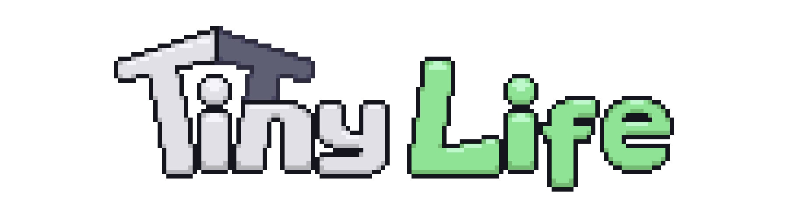

Welcome to the source code for the Tiny Life documentation site! On the site, you can find the full modding API documentation, a bunch of modding tutorials, as well as an online version of the game's changelog.

# What next?
- To install a mod, custom lot or custom household, check out the [custom content installation](https://docs.tinylifegame.com/articles/getting.html) tutorial.
- To create your first mod, check out the [modding basics](https://docs.tinylifegame.com/articles/mod_basics.html) tutorial or the [example mod](https://github.com/Ellpeck/TinyLifeExampleMod).
- This site features a web version of the modding API's [documentation](https://docs.tinylifegame.com/api/TinyLife) as well, which is a verbatim copy of the XML documentation that you can find in the API's source.

# Contributing
If you've made a mod for Tiny Life before, and you think you know what you're doing, you can help others by contributing your own tutorial articles or improving existing ones. You can get started doing so by [submitting a pull request](https://github.com/Ellpeck/TinyLifeDocs/pulls). If you found an error in the game's API documentation, you can also [submit an issue](https://github.com/Ellpeck/TinyLifeDocs/issues).

Thank you for supporting Tiny Life's custom content community!