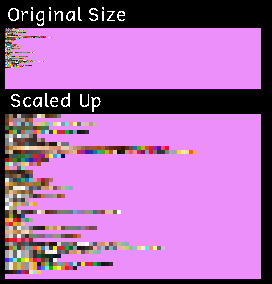
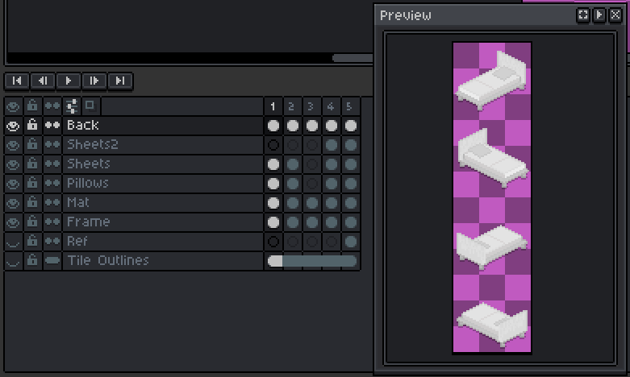
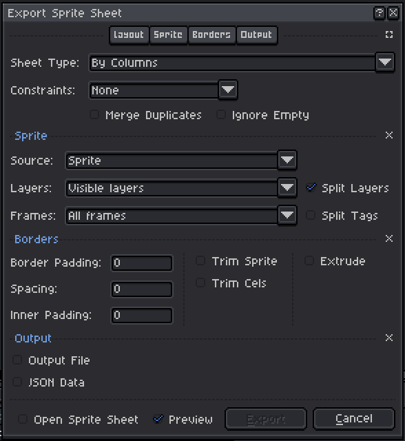

# Creating Textures
When creating textures, either for custom mods or to change the game's default textures, there are several things that you will have to look out for. This article provides some guidelines and explanations. Note that this article is not exhaustive, so don't hesitate to [let us know](https://link.tinylifegame.com/discordweb) if there's anything you're confused by. For more info, you can also check out the [community resources section on asset creation](community_resources.md#asset-creation).

## Composition and Colors
### General Notes
- Items that should be able to have color schemes applied to them in games should use a grayscale texture. The individual colors will then be applied to the grayscale texture when drawing.
- When making a mod, the layout, size or positioning of custom texture regions generally doesn't matter. There are some exceptions to this, which will be noted in this article.
- Items that should be able to have multiple distinct color schemes applied (like a table with a stone surface but wooden legs) need to be split up into multiple layers, with each layer being colored by its corresponding color scheme. These layers need to be laid out **horizontally**, with the `n`th layer of the item being placed `n * width` pixels to the right of the base layer's position.

### Furniture
- Furniture items generally have four distinct directions they can be placed in if they're more complex, or just one or two if they have symmetry in one or both axes.
- Layers (see general notes) can also be used to determine which parts of a furniture item will be occluded by Tinies and which won't. This is useful, for example, for the backrests of chairs, which should be drawn above a Tiny when looking at them from behind.

### Clothes
- Clothes have multiple poses that they have to be compatible with, some of which have multiple animation frames. The ordering and positioning of these frames cannot be changed, so it's best to use the reference textures below for creating news clothes and hairstyles.
- Clothes have four rotations, which are laid out in a Right-Down-Left-Up fashion.
- When layers are laid out for clothes, each layer should contain the Right-Down-Left-Up ordering before the next layer is started.
- Different clothing types and age groups use different sets of poses, since some of them can be reused in different cases. For example, since all working poses use the same arm animations, tops only need one working animation.
  - Hair, facial hair, accessories, head accessories, face accessories and makeup only use the four walking frames as well as the laying pose. Starting with Tiny Life 0.45.2, they only use the first walking frame and the laying pose.
  - Tops and arm accessories only use the four walking frames, the laying pose, the two working frames, and the four walking with arms out frames. Tops for babies additionally include a frame for sitting. Starting with Tiny Life 0.45.2, the four walking with arms out frames are no longer used.
  - Pants and shoes only use the four walking frames, the sitting pose, and the sitting on ground pose. Pants and shoes for babies additionally include frames for sleeping and standing.
  - Babies don't use the walking with arms out frames at all.

## Color Schemes
- A color scheme is essentially a set of colors, one of which can be chosen by the player to be assigned to a grayscale layer.
- The game stores all of its color schemes in a texture where each row is a set of colors, one pixel for each color, which can be selected for an object or layer.
- The most up-to-date version of the game's color schemes can be found in the [ColorScheme class](xref:TinyLife.Utilities.ColorScheme).

The following image contains all color schemes available in the game as of version 0.47.10 in their original layout:

## Using Aseprite
The layout that Tiny Life textures use was originally chosen to work well with the sprite editor [Aseprite](https://www.aseprite.org/) (which can be compiled manually from their [GitHub](https://github.com/aseprite/aseprite/) for free as well). While not required, using Aseprite makes exporting textures with multiple layers very easy.

Let's imagine you create a mod that adds a set of new single beds. To make editing easy, you can use Aseprite's **layers** to differentiate between colorable regions of the beds. To create multiple distinct beds on the same sprite sheet, you can then use one **frame** (which are usually intended for animations) for each bed, while laying out the four rotations **vertically**. If you add five single beds, your layout may look something like this:

Now, you can use Aseprite's **Export Sprite Sheet** dialog to export this set of beds into a file that has the correct layout for the game, as outlined in the [general notes](#general-notes) above. Specifically, the options you should select are
- the Sheet Type **By Columns**,
- the **Visible Layers** option (which is especially useful if you have reference layers or a layer for tile outlines),
- and the **Split Layers** option.

This combination will generate a sprite sheet where all layers for each bed are laid out horizontally, and all beds (our frames) are laid out vertically. 

