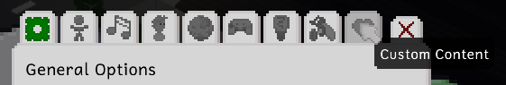
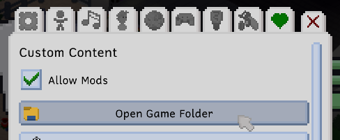

# Tiny Life's Data Folder
Tiny Life's data folder contains several useful folders and files:
- `Custom Lots`, `Custom Households`, `Custom Maps`, and `Mods` are the folders that you can put [custom content](getting.md), including [custom maps](custom_maps.md), into.
- `Logs` is the folder where the game's log files are stored. When you experience an issue like a crash, the information about it is stored in the most recently modified log file. If you restart the game, a new log file is created, so the one that contains the information about the issue becomes the second most recently modified file, and so on.
- `Saves` is the folder where your save files are located. If you want to share a save file with a friend, or back it up manually, you can do so from there.
- `Screenshots` is the folder where the game's screenshots (captured using `F12` by default) are stored.
- There are several files that are also stored in the data folder, like the game's options and installation information.

There are several ways of locating this folder, and its location differs based on the operating system you're using.

## From Within the Game
You can open the data folder easily from within the game by going to the options menu and opening the rightmost tab ("Custom Content"). The tab contains a button to quickly open the data folder.





## From Your Computer
### Windows
On Windows, you can simply open a file explorer window and paste the following text into its location field:
```
%LocalAppData%\Tiny Life
```
This should automatically cause the explorer to navigate to the appropriate folder.

### Linux
On Linux, you have to navigate to your home folder (also known as `~`) first. This is usually `/home/username`. From there, you can navigate to `.local/share/Tiny Life`.

Since `.local` is usually a hidden folder, you might have to configure your file explorer to display hidden files as well.

You can also use a command line to navigate to the folder directly using the following command:
```
cd ~/.local/share/Tiny Life
```

### Mac
On Mac, you have to navigate to your home folder (also known as `~`) first. This is usually `Macintosh HD/Users/username`. From there, you can navigate to `.local/share/Tiny Life`.

Since `.local` is usually a hidden folder, you might have to configure your finder to display hidden files by pressing `Cmd + Shift + .` together.

You can also use a command line to navigate to the folder directly using the following command:
```
cd ~/.local/share/Tiny Life
```
