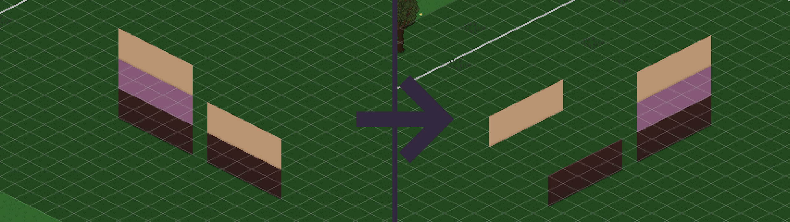
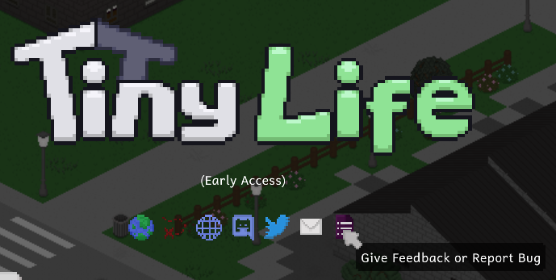

This is a list of commonly faced problems when downloading, installing and playing the game. Please read this list carefully before reporting an issue. 

If you're struggling with solving any of these issues yourself, feel free to ask for help in [the Discord server](https://link.tinylifegame.com/discordweb).

# 🪨 A Tiny is stuck or stopped taking care of their needs
There's a rare bug going around where Tinies who are regular visitors or from a different household will get stuck and stop taking care of their needs. There are several steps you can take to fix these Tinies:
- First of all, please **dump their data** and share it through [the feedback form](https://tinylifegame.com/bugreport) so we can get this issue fixed. You can dump their data through the `DumpObjectInfo` [cheat](https://docs.tinylifegame.com/articles/cheats.html) or, with the `ShowDebugActions` cheat enabled, by selecting "Dump Info" on them. Instead, you can also share the entire [save file](https://docs.tinylifegame.com/articles/game_dir.html) through the feedback form before fixing them.
- Reset their action queue using the `ClearActions` [cheat](https://docs.tinylifegame.com/articles/cheats.html) or, with the `ShowDebugActions` cheat enabled, by selecting "Clear Actions" on them.
- Force them to go home using the `GoHome` [cheat](https://docs.tinylifegame.com/articles/cheats.html) or, with the `ShowDebugActions` cheat enabled, by selecting "Force Go Home" on them.
- Reset their location entirely using the `ResetLocation` [cheat](https://docs.tinylifegame.com/articles/cheats.html) or, with the `ShowDebugActions` cheat enabled, by selecting "Reset Location" on them.

# ☁️ My save files aren't synchronized through Steam Cloud
Cloud storage in Tiny Life has to be enabled individually for each save file that you want to back up and synchronize.

To do so, make sure that you have Steam running, and then go into the Load Game menu on the game's title screen. From there, simply press the button that has a little cloud icon on it for each save file that you want to store in the cloud. If you ever want to stop saving a file to the cloud, just press the button again.

While Steam Cloud storage is enabled for a save file, it will automatically be uploaded whenever the game is saved, and newer versions will automatically be downloaded every time you launch the game.

# 🎥 When I rotate the camera, stuff isn't where it should be
You're likely encountering a problem that is quite common with humans and trying to understand isometric projections (which is what you see in Tiny Life). Isometric projection means that objects don't change their apparent size or shape when you move or rotate the camera (unlike they do in perspective projection, which is generally what 3D games use), and so it can be difficult to understand what **height** an object is at. 

For Tiny Life, this usually means that you're currently building **on the wrong floor**, likely one or two floors higher than where you should be building. To help you grasp what floor you're currently on while building, you can use the G key (or the D-pad up button on a gamepad) to display a grid overlay that also darkens objects on lower floors.

Here's a little visualization of the effect that the game's camera projection has on walls on different floors after rotating the camera. Note that walls that are on the same floor use the same wallpaper in this example!

The [Limitations of parallel projection](https://en.wikipedia.org/wiki/3D_projection#Limitations_of_parallel_projection) section of the 3D projection article on Wikipedia also has a good illustration of this effect.

# 👾 I get an error or crash with mods installed
**For issues that only happen with mods, please contact the mods' developers.** You can narrow down which mod is causing an issue by looking at the [log file](https://docs.tinylifegame.com/articles/game_dir.html) or by uninstalling mods until the issue stops happening. Most mods have a button to open their issue tracker in their description, which you can find in the rightmost tab of the game's options menu.

When reporting an issue to Tiny Life developers, please make sure that you have **no mods installed** at the time that the issues occur. You can also disable the loading of mods in the rightmost tab of the game's options menu if you don't want to uninstall your mods to reproduce an issue.

# 💥 The game won't start correctly
This can have multiple reasons:
- When downloading the game from **itch**, make sure to **extract the zip archive** before starting the game executable within it.
- Some ARM-based distributions of **Linux** and **Mac** (like newer MacBooks that use Apple Silicon) don't support Tiny Life without installing additional tools (like [Rosetta](https://en.wikipedia.org/wiki/Rosetta_(software)) or [QEMU](https://www.qemu.org/)) to translate instructions correctly. You might have to do additional research to figure out what these are for your device.
- Some **older operating system versions** don't support Tiny Life, which currently runs on .NET 8. Unfortunately, especially Mac is known for having very short lifecycles for supported versions. To see if your operating system version is supported by .NET 8, you can take a look at [the official list](https://github.com/dotnet/core/blob/main/release-notes/7.0/supported-os.md).
- When downloading the game from itch on a Mac, your device might warn you about the application's **security**, since Tiny Life is not signed by Apple. If you want to run the game anyway, hold the Option key, then right-click and select Open.
- If the game briefly starts up but crashes during the loading screen, there may be issues with your **graphics or audio drivers**. Please make sure that all of your graphics and audio drivers are on the latest stable versions and that you do not have any extraneous device drivers installed. Specifically, a device driver that seems to be causing problems for a small set of players is "Asus utility" under the "Sound, video and game controllers" section in Windows' Device Manager, disabling which should fix this issue.

# 🧾 There's no log file to attach to my bug report
If the game is crashing when you try to launch it, but there's no log file in [the logs folder](https://docs.tinylifegame.com/articles/game_dir.html), the game might be crashing too early or it might be unable to create a log file due to permission issues.

If this happens, the game will create a file next to the game's executable called `_UnhandledException.txt` instead. Please include this file's content in your report.

# 🧬 My Tinies automatically get assigned wrong genealogies
Transitive genealogies are automatically calculated in the character creator. For example, adding a parent and a child for a Tiny automatically causes them to have a grandparent/grandchild relationship. The current implementation of this system may contain some oversights causing incorrect transitive genealogies to be calculated automatically. To fix this issue temporarily and be able to set your own genealogies manually, you can enable the `IgnoreTransitive` [cheat](https://docs.tinylifegame.com/articles/cheats.html).

# ⁉️ My issue isn't listed here
If your issue isn't listed here, it might mean that no one has encountered it yet, or it hasn't been reported by anyone yet. If that is the case, please **report it through [the feedback form](https://tinylifegame.com/bugreport)**. When doing so, please try to include as much information about the circumstances around it as possible.

If the game launches correctly for you, you can also access the feedback form through the buttons on the main menu or the in-game pause menu, which will automatically fill out parts of the form for you.

