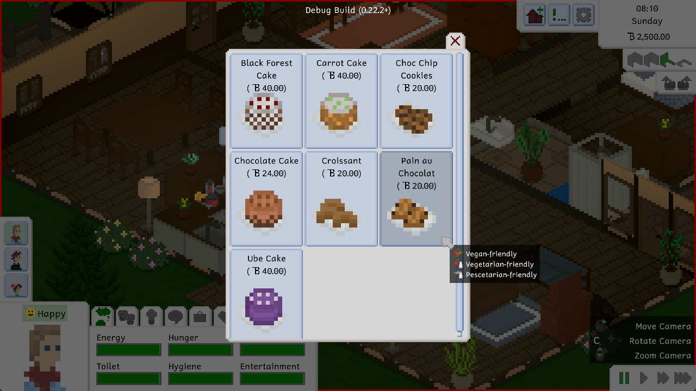
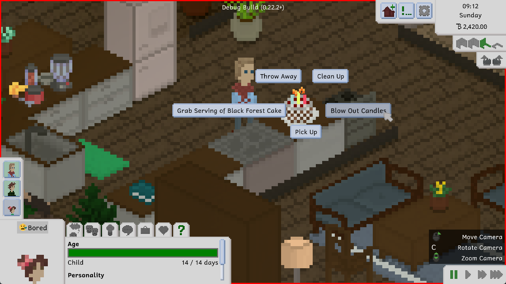
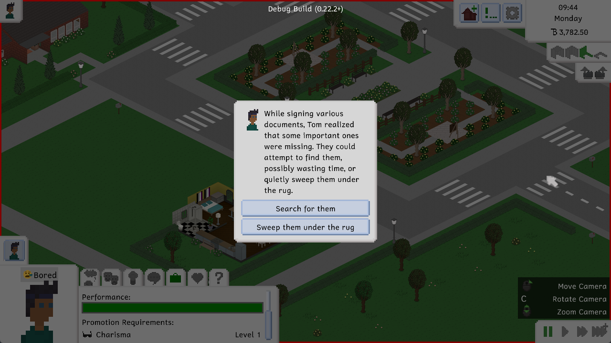
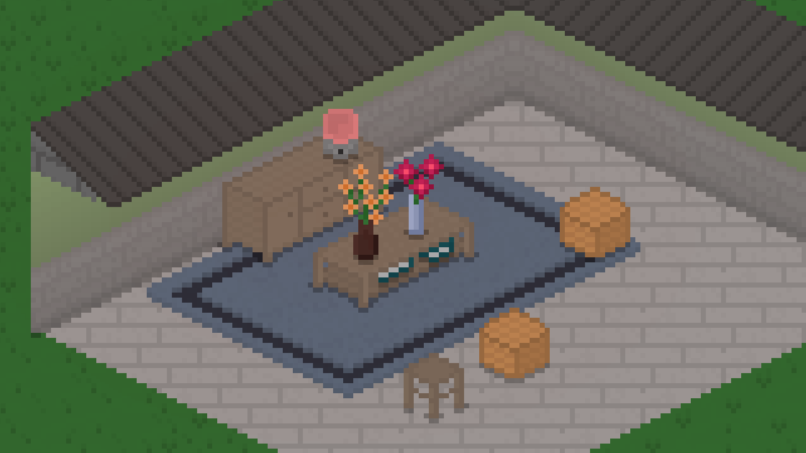
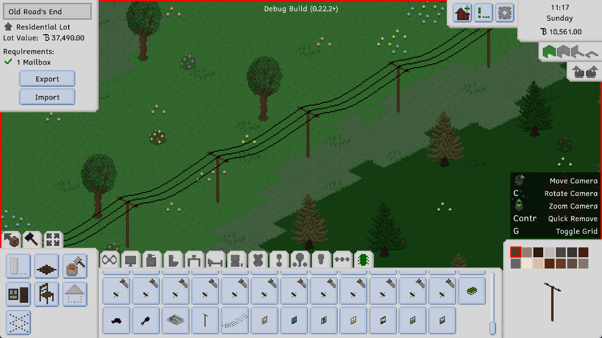
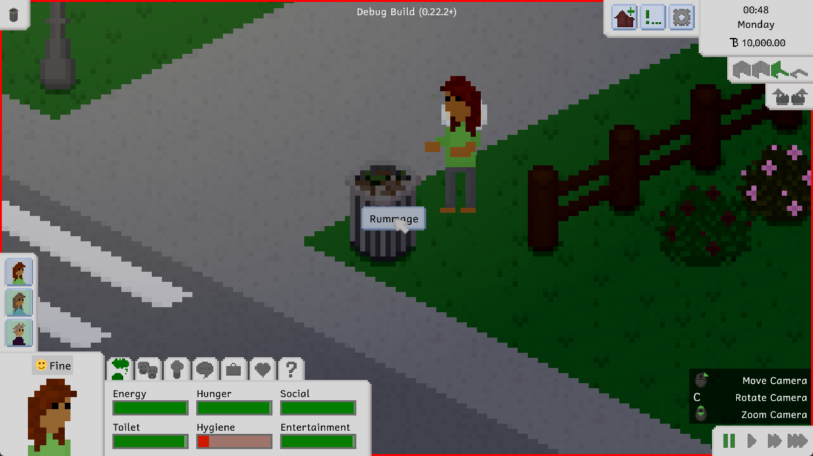

Hi everyone! Between our [Twitter hot takes](https://twitter.com/TinyLifeGame/status/1540355510788055040) and a few [smaller updates](https://docs.tinylifegame.com/Changelog), it's been a while since the last devlog post. We apologize for that, but to make it up to you, here's a pretty big devlog for a pretty big update. Enjoy!

# Baking The Cake
We added baking! Not only that, but we added a ton of new baked goods along with the feature. What baked goods, you ask? These!

Baking can be done from the fridge, just like cooking, but it's a different skill altogether. Children can also level up in the baking skill by using the small stove and making cookies on it. Tasty!

You can use cake on someone's birthday (more about that in a bit) by adding candles to one, which then allows the birthday Tiny to age up then and there, similarly to how it works in The Sims.

# Choices For Jobs
Something that a few players have been requesting in the past has finally been added to the game: While a Tiny is at work, and they're part of the currently played household, there is now a chance that an interaction menu called a choice prompt will show up, which poses the player with a problem that has two or three possible courses of action.

Each one of these actions has a chance of being successful, and they each affect your job performance in different ways. Each job also has a different set of choice prompts available, so if you're into the choice prompt lore, you can try out different jobs to see them all!

# New Furniture
Since the previous update, we've taken some time to add a bunch of new furniture items. None of these are new *types* of furniture, but they're new variations of existing items: Chairs, decorative vases, lamps, and more! Check out this screenshot which features some of them:

We also added some decorative power poles that make Maple Plains city look a bit more like a place that might exist in the real world. They don't do anything, and you can only get them using cheats, but they look nice, and that's what matters!

# Rummaging Through... Trash?
Yea. This is a weird one. It's kind of cool, though.

You can now rummage through trash cans that have previously had stuff thrown into them, which allows you to retrieve that very stuff. Of course, if it's just an empty platter or some food that's gone off, it's not necessarily the most useful thing. But a discarded painting or an unfinished woodwork? Those might be valuable to some!

Every other day, however, the town's trash collector will come by and empty every trash can that has had stuff thrown into it. So you have to be quick if you want to find that hidden trashy treasure!

# Politics, And What Mods Can Do
This part isn't necessarily related to this update, but we want to talk about it here anyway, because it is very important to us. We already mentioned this in our aforementioned [tweet](https://twitter.com/TinyLifeGame/status/1540355510788055040), but there's some extra information we'd like to share with you all.

There is absolutely no doubt in our minds that abortion is something that people in real life, as well as Tinies in Tiny Life, should be able to receive legally and easily if they need or want it. The right to control what happens inside your own body should not be questioned, or be able to be questioned, and we are appalled to see that that is exactly what is happening in the USA as we speak. Tiny Life **will**, once pregnancy is added to the game in one of the next updates, have the ability to end a pregnancy if the player desires.

There will be **no** option to permanently disable this feature. This is a really important point.

Tiny Life has, for a long time, had a [Modding API](https://docs.tinylifegame.com/api/TinyLife.html) that allows players to add custom content to the game, and change the content that the game offers. Additionally, the game will have various official ways of distributing these mods, including Steam Workshop support, once it is officially released. **However**, there will be a stern moderation policy in place that removes any mods, and bans any mod creators, that involve or suggest removing or hiding features from the game that promote body positivity, freedom of control, queer people, gender equality, and racial diversity. This includes mods that remove the ability to end a Tiny's pregnancy.

If you play video games to "escape politics", or you're upset with our decision to feature "queer propaganda" heavily in our game, then you fundamentally misunderstood what these issues are about. They're not "politics" or "propaganda", they're representation of millions of people that *actually exist*, and whose stories deserve to be told just as much as yours does.

# The Full Changelog
Anyway, in case we distracted you enough to forget that this was originally a post about a Tiny Life update, here's the full changelog for your perusal. As we said, there's a lot of stuff this time around.

Additions
- Added choice prompts for jobs and students, which appear randomly and allow the player to influence the situation
- Added the ability for children to age up into adults
- Added a baking skill and several food items that can be baked
- Added the ability to add candles to cake to celebrate someone's birthday
- Added a bigger version of the fitness rug
- Added a cheaper computer
- Added two new chairs
- Added four new flower vases
- Added two new small lamps
- Added a taller wooden fence
- Added a small coffee table and a new TV stand
- Added two new roof textures
- Added the ability to rummage through trash to dig up thrown away items
- Added kissing
- Added a search bar to the hint history menu
- Added more actions for people that have diet personalities
- Added decorative power poles to the default map

Improvements
- Clarify that puddles on natural ground can't be mopped
- Allow wall sinks to get dirty
- Display some important tooltip information properly when using a gamepad
- Disallow sleeping when stunned
- Go back to the starting location after jogging
- Improve the action variety screen when other people are involved by increasing the size of their portrait
- Allow using WASD to control the camera by default
- Made trash cans fill up with trash
- Order action varieties by name
- Display learned recipes and woodworking recipes when leveling up the cooking and woodworking skills
- Display a security disclaimer when enabling mods
- Play sounds for broken objects

Fixes
- Fixed people's shoes rendering above the picnic table when sitting
- Fixed lights being clipped early, causing them to disappear visually
- Fixed people sometimes putting objects down on surfaces with the wrong rotation
- Fixed some issues on the default map, including walden household duplications and a missing chair
- Fixed diet personalities not being incompatible with each other
- Fixed issues with the smoke particle displaying behind objects
- Fixed people doing the walking animation while their pathfinding is still calculating
- Fixed people sometimes not leaving a lot when asked to
- Fixed "got food somewhere else" notifications being displayed for every household
- Fixed emotion stings playing if the same person is selected again
- Fixed children being able to tinker with stuff
- Fixed being unable to place rugs under tables that have something on them
- Fixed lamps in storage lighting up the place they used to occupy when reloading a save
