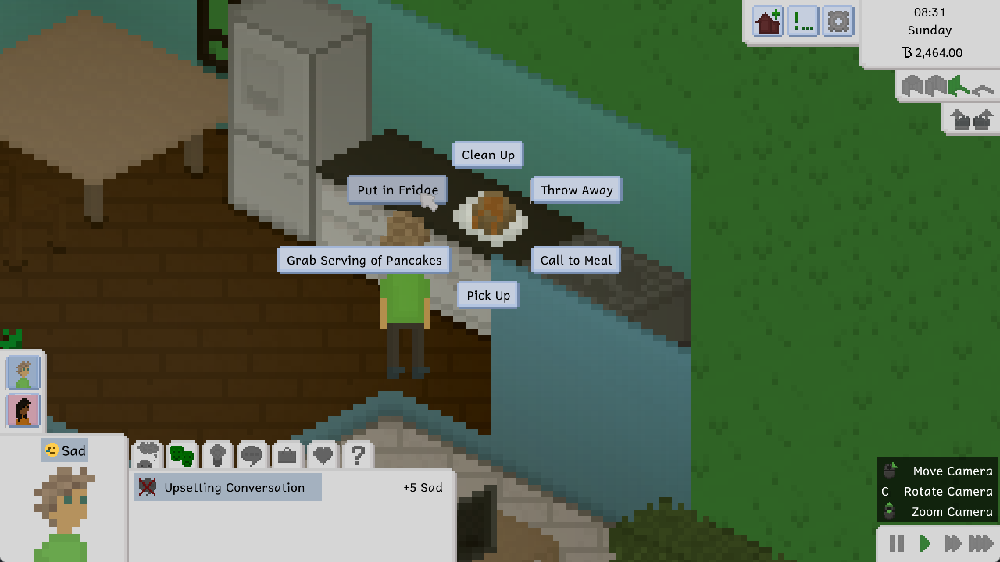
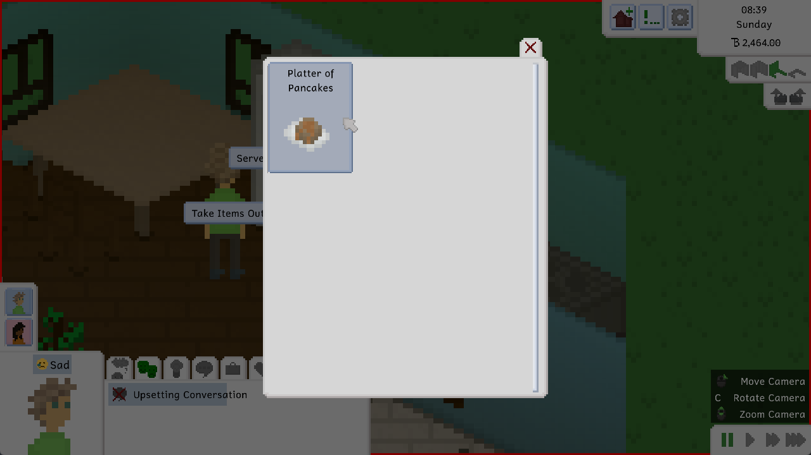
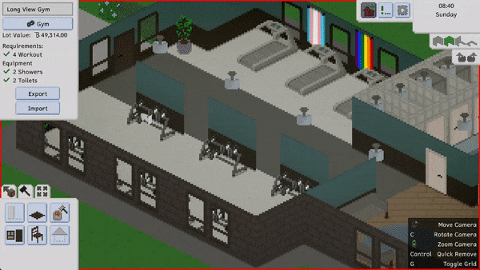
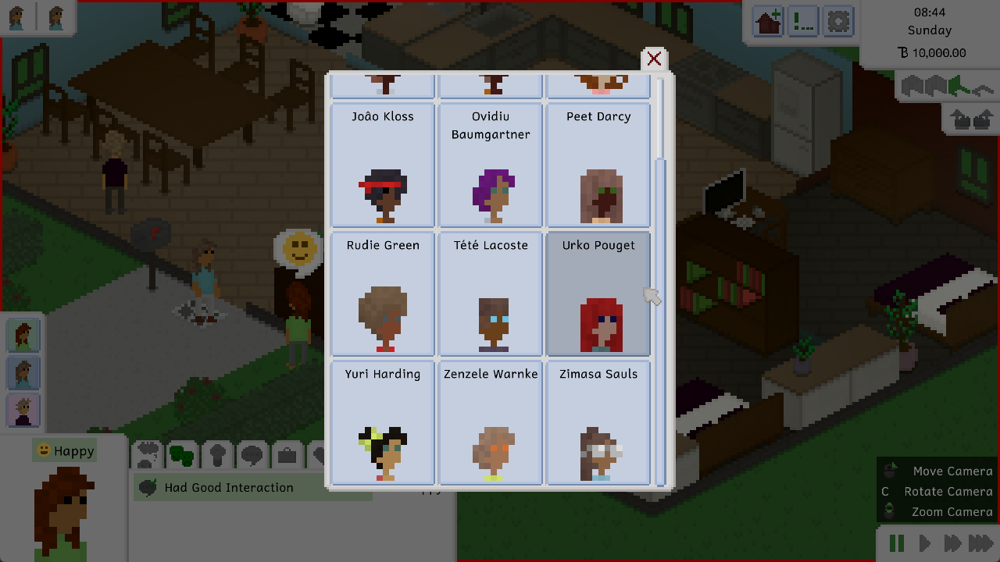

At least for the ones of us who reside in Central Europe, it's been a tough couple of weeks with the constant, devastating heat. However, in our everlasting pursuit to give you new content to play with, the heat has not stopped us from working on this update.

Granted, it took a lot longer than we would've liked, and it doesn't actually contain everything that we planned for it to contain, but here we are.

Here's some of what we *did* do, though.

# Fridges and Leftovers
For a long time now, players have been asking us to add the ability to store leftovers in the fridge, where they'll go bad much less quickly than out in the open. You can now do exactly that.

After storing some leftovers in the fridge, you can select the fridge to Get Leftovers, which will automatically cause your selected Tiny to grab a random food item from the fridge. You can also look at the contents of the fridge and tell a Tiny to take out a specific item, which is especially useful if the fridge starts filling up with empty platters from all the food they ate.

Right now, fridges are bottomless, meaning you can store as much food in them as you like. You can't store anything else there, though. Sorry.

# Undo and Redo
To a non-programmer, it might sound incredibly easy to just add an undo-redo feature into a thing. You do a thing, you go back to a previous state, you do the thing again in reverse. What's the holdup?

As it turns out, the holdup is quite a lot. Not only do you have to take care that stuff is undone and redone in the right order, but you also have to make sure that funds are deducted and re-added properly. That undoing and redoing doesn't lead to impossible states. That there aren't gaps in the undo-redo feature that allow stuff to slip through the gaps while other stuff gets undone. That you don't weep in a corner while infinite recursion is causing your computer to explode. That sort of thing, you know?

We did it, though. But it might also be a little broken at the start. Hopefully not, though.

Look at this cool GIF that shows this feature in action!

# Achievements
Tiny Life now has achievements! There's only eleven of them as we speak, but throughout development and until release, we'll be adding quite a few more.

Achievements are unique per save file, meaning you can try your hand at re-completing all the achievements whenever you start a new save file. Achievement progress will always be made by the active household you're currently playing with, but if you switch between households in the same save file, achievement progress will be maintained and made with the new household you selected.

The achievements are also already integrated with Steam, but only with the release version of the game, so anyone who's playing the demo (which is everyone right now) won't have access to the Steam version of the achievements. Sorry!

# Adoption
Unfortunately, we didn't get a chance to add pregnancy to the game for this update like we'd originally planned. Instead, we decided to settle for something a bit less spectacular that still allows you to get new children into your household without cheats or exported merges: adoption!

You can click on the computer to adopt one of twelve children. We're not going to get into the lore of where these children come from, because there isn't one yet. They're randomly generated, okay?

As a side note, we also added a lot more random first and last names in this update, especially a lot of international ones. Currently, the first and last name's source nationality won't be matched, which is why some names sound a little wacky. To see it positively, these r names give us a reason to believe that Tiny Life is set in a universe where society has come far enough to allow anyone to have any name without fearing to be discriminated against. Right?

# The Full Changelog
As always, here's the full changelog for your perusal. This time around, we also tried to include a more in-depth API changelog, since the game's API is starting to be somewhat stable, so hopefully modders will find this useful for updating their mods.

Additions
- Added the ability to store leftovers in the fridge
- Added the ability to undo and redo actions in build mode
- Added achievements
- Added a paper lantern furniture item
- Added the reasoning skill
- Added some facial hair
- Added the ability to adopt children using the computer

Improvements
- Display a notification when first acquiring a new skill
- Display a button in the job panel for going to work
- Clarify when you can click on a person to head to work
- Randomly generate new people for regular visitors and lot employments if exported ones run out
- Allow children to be regular visitors too
- Added a lot more random names, including various international ones
- Improved performance of saves with a lot of people in them
- Automatically set transitive genealogies when changing the genealogy of a relationship in the character creator

Fixes
- Fixed an exception when getting a job from a newspaper after it has already been removed
- Fixed lot employment navigation on lots being incorrect when using a gamepad
- Fixed new notifications not being added to the top of the notification queue
- Fixed a rare exception when displaying interactions with multiple pages
- Fixed death notifications not having an icon
- Fixed keyboard camera movement not clearing the following person
- Fixed children being able to get the capable carpenter life goal
- Fixed ordering from lot staff not working correctly
- Fixed being unable to click in the world when the cheats menu is open

API
- Objects in a person's hand or in the household storage will now also have their Update methods called
- Improved auto-goal triggering system
- Added the ability to change an action spot's main direction
- Made time a map-based property rather than a game-based one
