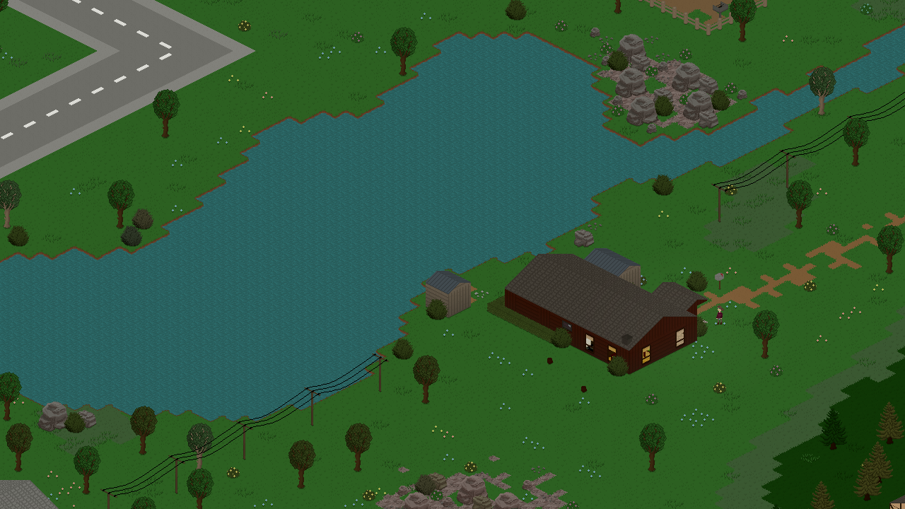
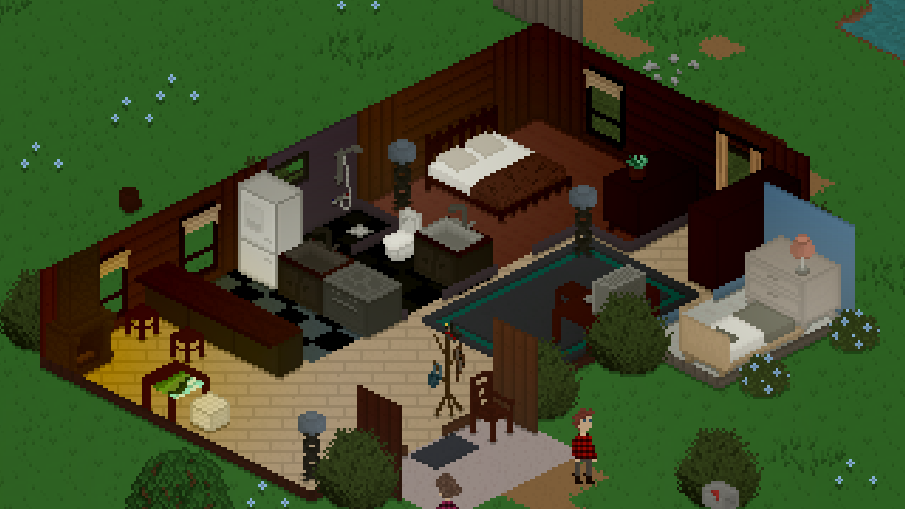
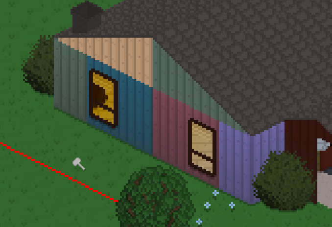
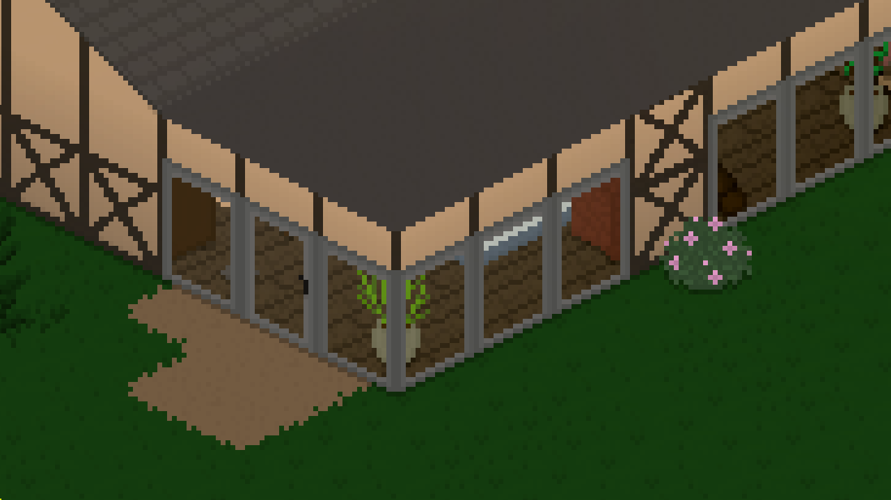
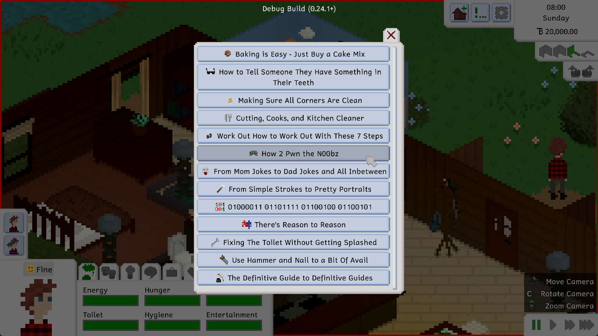

Hi everyone! It's been a little over a month since the last update, which isn't really the update schedule we try to stick to, but it is what it is. We've been doing a lot of internal changes, as well as a lot of planning related to Tiny Life's Steam Early Access release, which is currently planned for the first quarter (Q1) of 2023. Of course, we'll keep yall updated about any changes and plans related to that.

Anyway, let's get to the update!

# Water Fun
There's water in the game now! Well. There was water before, but it was severely limited in terms of what you could do with it, mainly showering and drinking. But now, there's water *tiles* that you can place using the tile tool, and it allows you to create cute little lakes and rivers!

Maple Plains City got updated as well and now features a bunch of watery places, including a little river that feeds into a bigger lake in the center of the map. Along with the lake, a house by [Macy](https://twitter.com/DesertStranded) with a matching household by [Vortis](https://steamcommunity.com/id/vortis95) have been added.

As always, opening a save file you created before this update will cause the map to be updated and the new stuff to be added to your save file, without any of your stuff being removed.

# New Objects
We also added a bunch of new objects in this update, including some tiles, siding, bigger windows and doors, as well as the rocks and big bushes you can see scattered around the map.

As you can see, the siding features some more colorful... colors, and these colors have also been added to some existing siding, wallpapers and furniture. All the sofas in the game have also gotten a small upgrade: they now feature some more colors as well!

# Skill Books
This is a feature that people have been requesting for a long time, probably heavily inspired by the fact that The Sims series also has books like this.

However, it's always bugged us that, in The Sims, you can become a full-on expert in a skill by simply reading a bunch of books on the topic. If you've ever tried to learn something like programming, writing or woodworking, you know that that's not how it works; you have to actually get your hands dirty and put the skill you're learning into action!

So, in Tiny Life, skill books will help you increase the progress of the *current level* that you have in the skill. Once the green skill bar is filled up fully, you'll be unable to continue reading the skill book until you make use of the skill and level up to the next level. At that point, you'll be able to go back to reading a skill book until the level progress bar fills up again.

We think this strikes a good balance between skills books being too overpowered and removing any requirement for making use of a skill, and skill books being completely pointless. As always, we'd love to hear what you think about this, though!

# Early Access
A while back, we did a survey that allowed players to give feedback on the current state of the game, when they think it should be released, and what they would pay for it. Unfortunately, surveys like this generally have a high likelihood of only being filled out by people that *don't* think the game is ready for release. However, this one still gave us some insight into what people think and what features they think are missing, or required, before release.

So we've decided that we'll be making use of Steam's Early Access system for Tiny Life upon release, rather than going for a "full" release straight away. As I pointed out in the introduction to this post, we'd like to make this happen in Q1 2023.

Here's the Early Access description for Tiny Life, which is already available on the Steam page, which explains some details and the reasoning behind this decision.

**Why Early Access?**
Tiny Life is an open-ended sandbox game, which is a genre perfectly suited to Early Access, in our opinion. Early Access allows players to play the game during development, give feedback on existing and upcoming features, and see the game grow and develop. We want Early Access to be an opportunity for the game to grow with its community, through active involvement, custom content and modding, and frequent surveys for community feedback.

**Approximately how long will this game be in Early Access?**
We hope to be able to implement enough features to comfortably deem the game ready for a full release by 2024. We don't want to rush the game's full release, and we want to grasp its readiness through the community's response to the game during Early Access.

**How is the full version planned to differ from the Early Access version?**
The roadmap for Tiny Life can be seen on its website, and contains plenty of small and large features alike. We plan to implement all of these throughout development, but not necessarily during Early Access. Since Tiny Life is a sandbox game, there is no final feature or story element at which the game will be finished. Throughout Early Access, more objects, clothes, skills, and other gameplay features will be added continually.

**What is the current state of the Early Access version?**
Tiny Life's Early Access version already features hours of in-game content and near-infinite replayability due to its sandbox structure. Each Tiny is unique, from their looks to their personality to their skills and relationships. Each lot and house you build or get from the community can feature hundreds of items with unique interactions and abilities.

**Will the game be priced differently during and after Early Access?**
Throughout Early Access, as more and more features and gameplay elements are added, Tiny Life's price will probably be raised gradually. Upon leaving Early Access, we don't plan for the price to change drastically, and so it will stay in the same region as it is now.

**How are you planning on involving the Community in your development process?**
Tiny Life already features plenty of ways to involve the community. This includes the ability to share custom mods, lots, households, and maps with the community, a public feedback and issue report form, and frequent surveys that involve the community in decision-making for the game's upcoming features and changes.

# Full Changelog
As always, here's the full changelog for this update. Enjoy!

Additions
- Added the ability for primary school students to study at a bookshelf
- Added the ability to get raises after reaching level 10 of a career
- Added some decorations, including maple fairy lights, three rocks, a shelf with three layers, big bushes
- Added some wooden siding wallpaper
- Added water, grassy dirt and stone ground tiles
- Added large glass windows and a large glass door
- Added skill books for every skill in the game
- Added businessperson, retail worker, doctor, and scientist daily tasks
- Added required promotion skills for primary school students
- Added icons for jobs
- Added the ability to disable newspaper deliveries at mailboxes
- Added a keybind to change wall modes

Improvements
- Extended the map with a house by Macy and a household by Vortis
- Adjusted death emotions to be less severe for acquaintances
- Adjusted the introvert personality to get less overstimulated less quickly
- Slightly rebalanced energy and entertainment need gain
- Made higher job levels require higher amounts of performance to be promoted again
- Expanded the color palette for sofas and some wallpapers
- Made lot boundaries display with proper depth related to objects intersecting them
- Improved rendering performance by drawing some objects in a static batch, rather than every frame
- Order keybind menu by name
- Display a notification when a lot can't be imported due to an error
- Display portraits of people who are out of town as slightly transparent

Fixes
- Fixed an exception when trying to load mail from disk
- Fixed being unable to put the homework book away
- Fixed a rare exception when creating a painting
- Fixed undo/redo hints not displaying in keyboard mode
- Fixed various objects still executing an in-world action when in the household storage
- Fixed a rare exception when a Tiny tries to pick up an object that has been removed
- Fixed visitors not going home properly after being out of town sometimes
- Fixed an exception when trying to make fun of people who don't have a job
- Fixed an incomplete options file causing the game to crash on startup
- Fixed border tiles not being added to the static sprite batch properly, causing rendering issues
- Fixed an exception when trying to take an object from the fridge that has already been removed
- Fixed keyboard camera movement not allowing diagonal movement
- Fixed the feedback form not working when the log file is large and a lot of info has been input
- Fixed the job tab displaying a dollar sign in addition to the tiny bucks sign
- Fixed the ability to place walls without enough money

API
- Allow furniture to specify whether it should fit in an object spot or not
- The game version that a save was saved with is now stored
