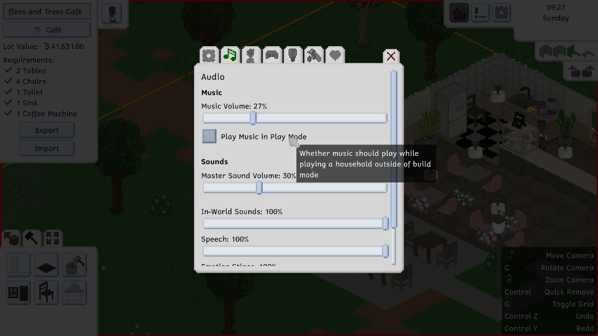
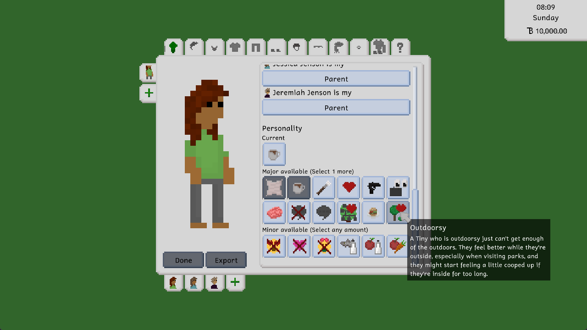
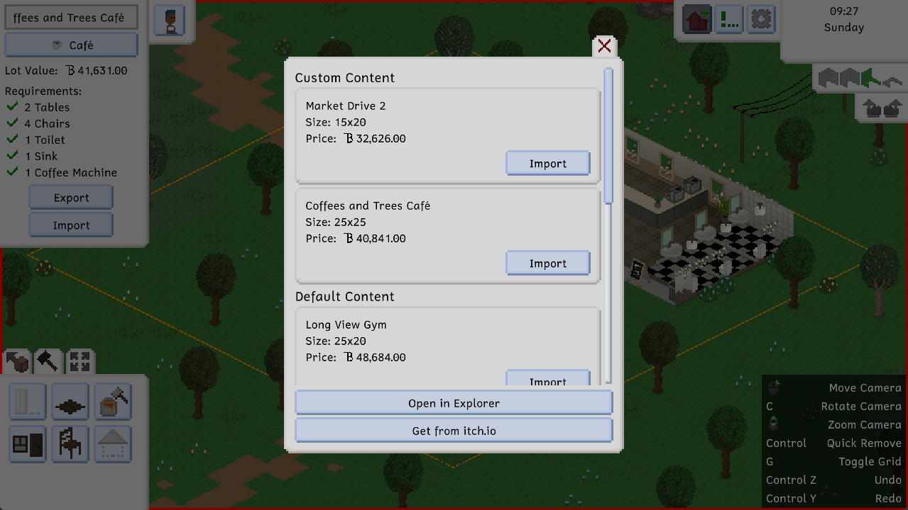
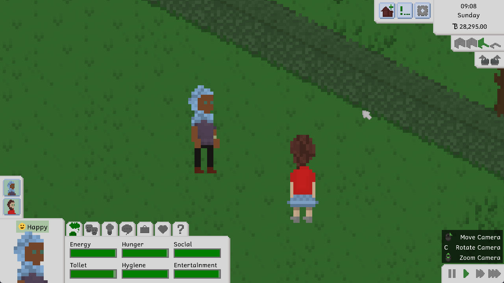

Hi everyone! We've been busy recently working on a lot of things that won't be released for a while, so this update is a little smaller. Nevertheless, it still adds some cool features, and finally introduces music into the game, courtesy of our lovely musician [Leiss](https://leiss.bandcamp.com)!

# Lights, Camera, Music
Except for sounds and the lovely, ambient forest soundscapes, Tiny Life has been all but silent, which was especially noticeable in build mode and the character creator. Well, not anymore! Our lovely musician [Leiss](https://leiss.bandcamp.com) has been working on Tiny Life's Soundtrack for a long while now, and she's been posting updates and sneak peeks about it on [her Twitter](https://twitter.com/leissMusic/status/1581418663814795264) occasionally.

Now, the music that we added into the game so far is not the full extent of the soundtrack. There are still a lot more songs to come!

By default, there will be music playing in the game's main menu, the character creator, the household selection, and build mode. If you want there to be music while controlling your Tinies, too, you can tick this little box in the options menu's sounds & music section.

# Feeling Outdoorsy
There's a new personality type in this update as well: The Outdoorsy personality! The in-game description reads as follows:

> A Tiny who is outdoorsy just can't get enough of the outdoors. They feel better while they're outside, especially when visiting parks, and they might start feeling a little cooped up if they're inside for too long.

Along with this, we've also been making an effort to add some more personality-based actions into the game, especially in the social category. There are now additional actions for the charisma, writing and humor skills, which allow for higher success rates and friendship or romance gains at higher skill levels.

# Some UI Polish
The household and lot import and exports menus have gotten a bit of a makeover in preparation for the game's Early Access release next year. The release will ship with Steam Workshop support, which is currently in very active development, and so we've decided to clean up the menus involved a little bit.

While you'll be getting these menu improvements in this update, please note that Steam Workshop support is not publicly released yet, and won't be publicly released until the game's official Early Access release.

# Cool Clothes
Last but not least, we added two new clothing items into the game: Headscarves!

While the looks and feels of these headscarves are heavily inspired by hijabs, they're able (and supposed) to be worn by anyone who likes having their head and/or hair covered for any reason! You can find them in the Head Accessories category of the character creator.

In the future, we plan on adding a lot more clothing items that celebrate the styles and items of various cultures, including some of the player suggestions we collected a while ago [on Twitter](https://twitter.com/TinyLifeGame/status/1559556652344426496). Please don't hesitate to [give feedback](https://tinylifegame.com/feedback) on the items we add, especially ones that you regularly wear or know more about, since it's important to us to get these items right.

# The Full Changelog
As you're probably used to by now, here's a copy of the full changelog for your perusal. You can view this changelog from the game's main menu's bottom right corner, as well.

Additions
- Added the first of many of [Leiss](https://leiss.bandcamp.com)'s songs for the Tiny Life Soundtrack
- Added the outdoorsy personality type
- Added two headscarves
- Added some more skill-related socials

Improvements
- Improved custom content import menus
- Automatically update import menu content if underlying files change
- Change a lot's name to the imported lot's name when importing
- Ask for a name when exporting a lot or a household
- Children without a complete household are now added to the adoption pool instead of being exported
- Made choice prompts also be influenced by a Tiny's skills
- Hide small updates in the main menu's changelog panel by default
- Made the old computer a bit more square looking
- Cooking shows will now have a chance to yield the baking skill in addition to the cooking skill
- Made Tinies meet and gain friendship with their coworkers while they're both at work
- Mark visually held items (like sponges and spanners) as fake so they don't inhibit action queueing

Fixes
- Fixed diagonal keyboard camera movement being too fast
- Fixed failed undo/redo attempts crashing the game
- Fixed a crash when getting up out of bed after a Tiny's outfits have been edited
- Fixed a crash when a modded personality type was removed since the last session
- Fixed an ignored exception when exiting the character creator
- Fixed the mouse cursor still activating the UI while it was hidden
- Fixed Admire being called Admirar (for some reason)
- Fixed food item effects not being applied if the eat action is not completed fully
- Fixed a crash when multiple emotion modifiers run out at the same time

API
- Added a clothes compatibility system to allow for certain clothes to be automatically removed if others are selected
- Added Ben.Demystifier to make stack traces more legible
