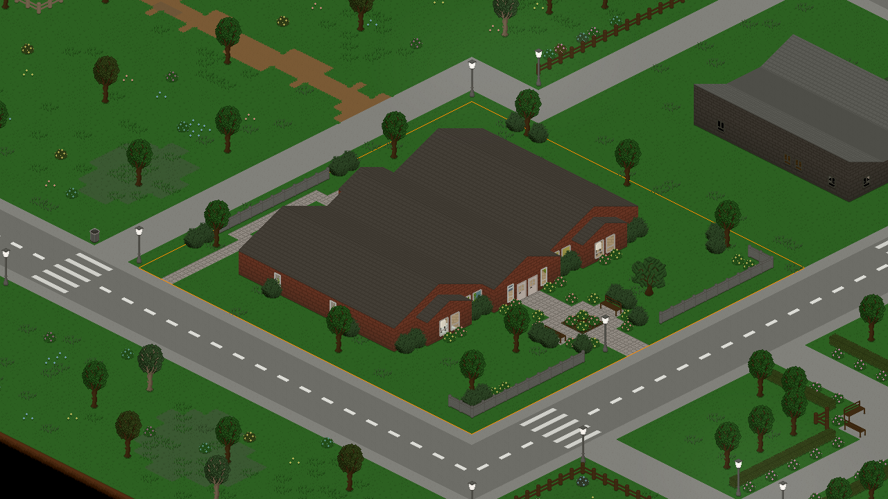
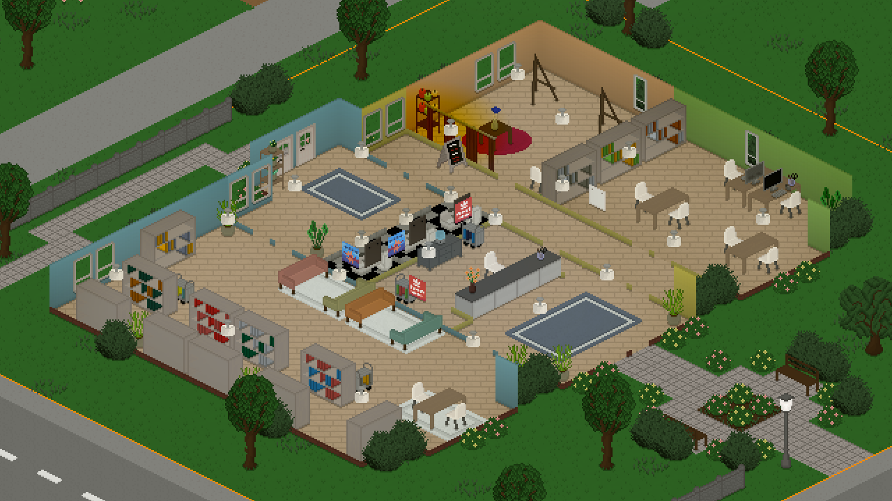
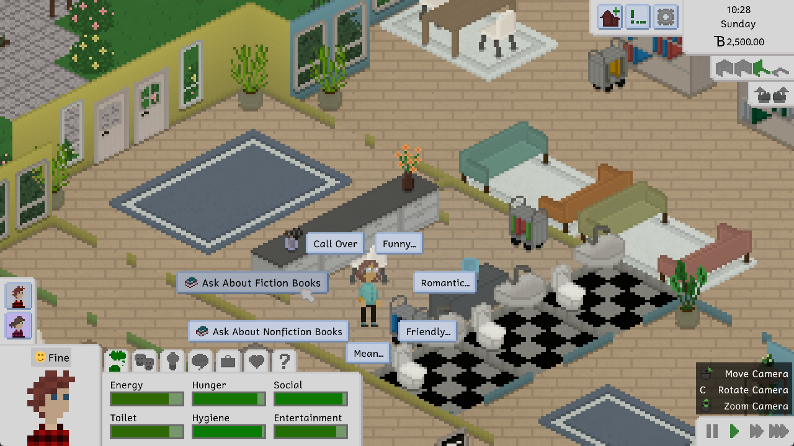
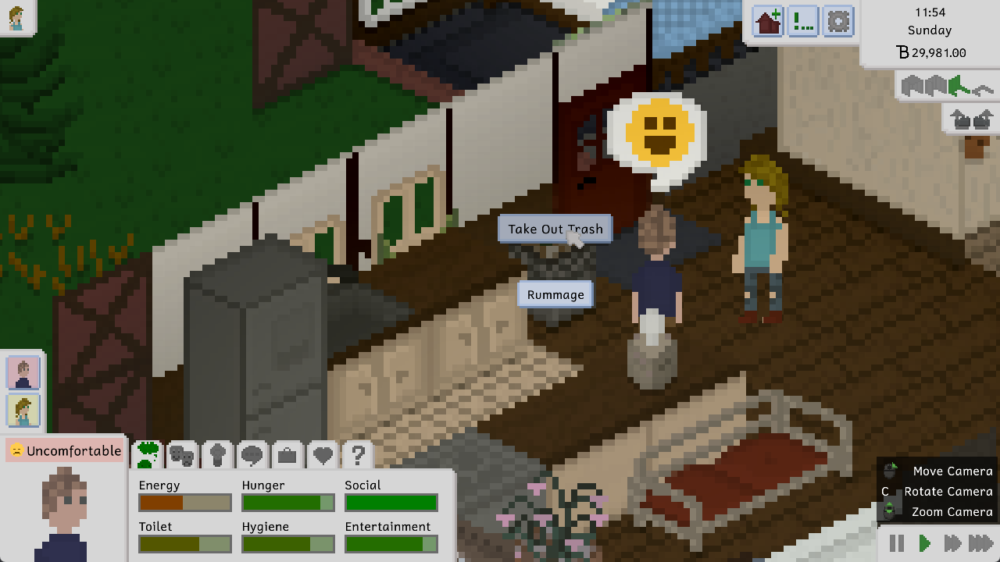
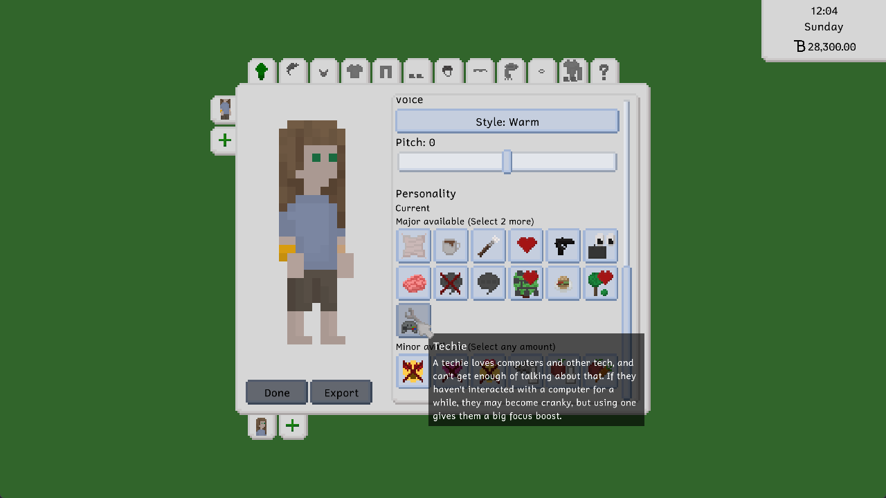

Hi everyone! It's that time again where we share a lovely little update that we made for you all. We're still working hard on secret release features in the background, so this is another somewhat smaller update. It's still very nice, though, so get ready for some neat stuff.

# The Library
Libraries have been one of the most requested lot-related feature so far. I guess there's just something about us nerds wanting a cozy place to hang out. So now you have one!

Not only have we added the library lot type, which features a librarian staff position, but we've also added a beautiful library lot created by [Vortis](https://steamcommunity.com/id/vortis95/), who has previously created some lovely lots and households for the game.

Part of the cute interior, as eagle-eyed players might have already spotted, are two new furniture items: A bookshelf that is double-sided (i.e. open on the back), allowing for it to be placed in the middle of a room, as well as a cute book cart that also doubles as a bookshelf interactable.

There's also a librarian position for each library, with the default one for Maple Plains City being filled by the lovely Barbara Bookerson, who likes to go by Barb. While Barb is at work, you can ask a few questions about books to get your Tiny excited about them.

While you're not interacting with them, librarians will simply idle around the library and walk from bookshelf to bookshelf, inspecting the books they have stocked.

# The Trash
Listen, we could make a lot of jokes about Tiny Life and trash here. But instead, we're going to make some proclamations: Trash is gross! Trash cans are too far away! Having to go outside to throw something away is a hassle!

Let's fix all that. Indoor trash cans!

These trash cans will fill up similarly to the existing outdoor trash cans, with the difference being that the trash collector doesn't come and empty them for you. You have to take the trash out yourself. Doing so will cause your Tiny to deposit it in the nearest outdoor trash can, where the trash collector *will* eventually come to pick it up. Keeping this in mind, it's a good idea to keep your lot's trash can in an accessible location, and not behind any locked doors.

Oh, also, you're now *required* to have a trash can on your residential lots. Once you first enter build mode after installing this update, you'll be forced to place one before you're allowed to exit again. Sorry, it's city policy!

# The Techies
This devlog already called you a nerd earlier, so we don't think it's too unreasonable to call you one again. Of course, we do this very lovingly; we're all nerds here, right?

If you're a very specific kind of nerd, you can now share that truth with your Tinies by giving them the new Techie personality type.

This personality causes Tinies to enjoy using tech, including TVs and computers, but they'll also get quite cranky if they've been away from their computer for a while. Isn't that a mood?

There's also some excellent insults that Techie Tinies can use. Not that we encourage insulting people or anything. We're just very proud of the jokes.

# The Full Changelog
That's pretty much it! As we said, it's a bit of a smaller update again this time around, but we're really gearing up for releasing the game into Steam Early Access early-ish next year, so there's a lot of stuff going on in the background that we're not sharing with you all yet.

Anyway, here's this update's full changelog, as always, for your enjoyment!

Additions
- Added a double-sided bookshelf, a book cart, a small indoor trash can, an outdoor wheelie bin, a vertical planter box, and a simple nightstand
- Added a library lot type with a librarian Tiny, as well as the Maple Plains Library by Vortis
- Added the techie personality type
- Added the ability to take out the trash from indoor trash cans
- Added a lot more emote images
- Added the ability to short-press the right mouse button to rotate objects

Improvements
- Display particles when children are playing in the sandbox
- Display smoke particles when someone is angry
- Display particles when using a sink
- Display an "Are You Sure" panel when changing lot types if there's staff on the lot
- Made roofs have a maximum size so that they don't cause issues on big lots
- Made some food types more friendly to other diets
- Slightly improved the espresso machine's steam wand texture
- Children now gain skills at school based on an internal schedule
- Force residential lots to have outdoor trash cans on them (they have to be added upon first entering build mode after this update)

Fixes
- Fixed skill books giving skill points while still walking with the book
- Fixed an exception when a food item gets removed while someone is eating it
- Fixed being able to attempt to kiss strangers
- Fixed households not being removed properly when everyone dies, causing issues later on
- Fixed some ground items (like books and gravestones) being non-walkable, causing Tinies to get stuck
- Fixed some static objects not being drawn properly after the map is updated to a new version
- Fixed a possible stall when a map is updated with custom lots present

API
- Added the ability to specify clothes depths based on the layer
- Archive projects instead of fully removing them when they don't pay out anymore
- Removed TypelessAction in favor of allowing normal actions to be typeless
