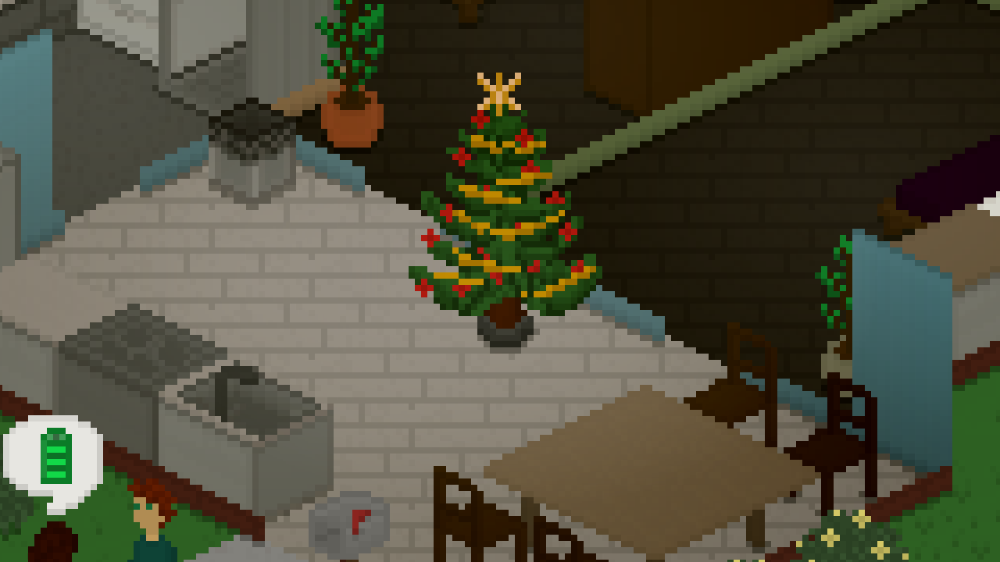
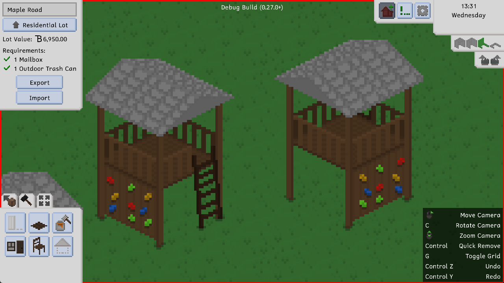
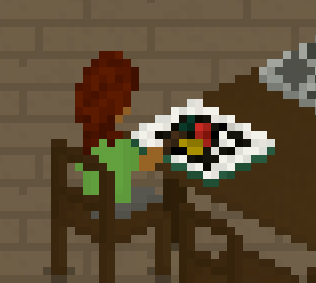
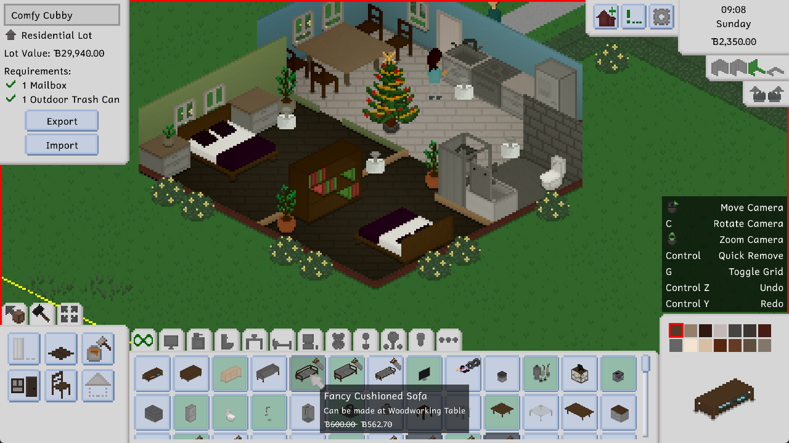
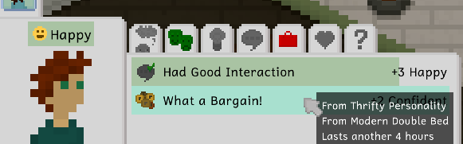
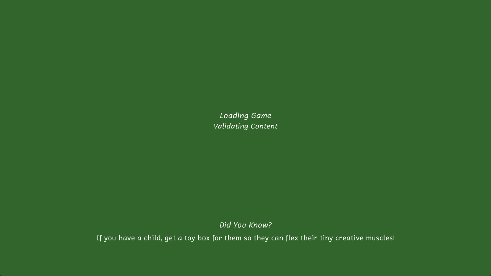
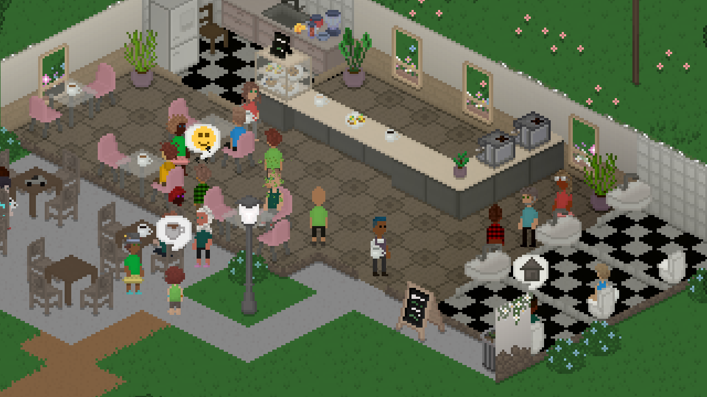
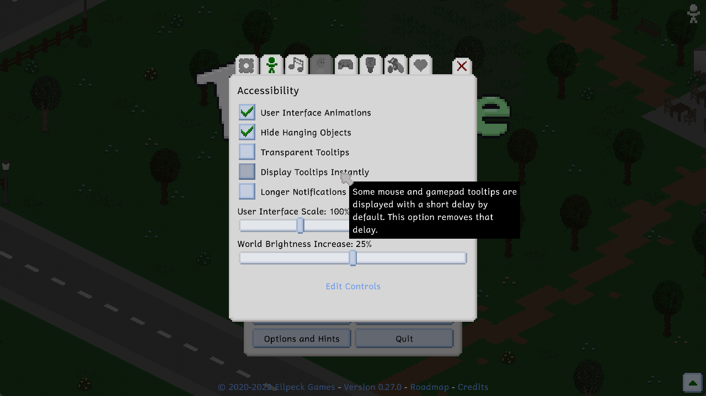

Hi everyone! We just released version 0.28.0 of Tiny Life, and with it, a bunch of cool new stuff. This is a pretty big update, and we think that this devlog definitely reflects that.

Be sure to stay tuned until the end, since we also have a pretty big announcement to make!

# 'Tis the Season
It's winter! Well, on some parts of the earth. It's Christmastime! Well, in some cultures.

We want to celebrate this time, regardless of its cultural and religious ambiguity, because regardless of whether and what you celebrate, it can be a beautiful time to spend with your (chosen or original) family and other loved ones.

To symbolize this aforementioned celebration, we added a cute new furniture piece into the game, which also serves as a light source: the Festive Tree!

In addition, we've also added some other furniture items and objects that are pretty cool in our opinion. First, there's a jungle gym (slash climbing frame, whichever term you prefer) now, which is a perfect addition to the sandbox and which allows children to have some additional fun!

Second, you can now get relaxed (or up your painting skill as a child or an adult!) using the new coloring book. Coloring books are a great tool for all ages to become relaxed and gain some additional precision staying in those lines.

Here's Joe trying one out for you.

# I Feel So Many Things
As part of this update, we added a new personality type and two new emotion types! Along with this, some existing emotion modifiers have also been changed to match the new emotions better. As always, our friend [Jamal Green](https://jamalgreenmusic.com) has created some beautiful sting sound effects for them, which you'll be able to hear in-game.

The two new emotions are Goofy and Confident. The former is especially useful for children and those whose Entertainment needs are a little low. The latter can be very helpful when you're trying to rekindle a relationship (more on that later), because it really helps get those friendship and romance points up.

We also added the Thrifty personality type, which is an idea we recently had that'll help to make build mode more of an active gameplay element for those who enjoy that kind of thing. Households with a thrifty Tiny in them will get random price reductions on items in build mode and the character creator each in-game day. Checking them might be a good idea if you want to save some of those Tiny Bucks.

This is also the perfect example to see the Confident emotion in action!

# A Load of Changes
Those of you with an older or a slower computer might especially know this feeling: some games load most of their content before their window even opens, and when that takes a little while, you may start to wonder if the game even opened correctly in the first place. Well, we're sorry to admit that Tiny Life used to do this too.

But not anymore! There's now a loading screen when first starting up the game, so you'll know exactly what the game is doing in those first few seconds. Yay!

# A Crowded Place
This is a smaller change, but it's one that has a big impact on gameplay: we've increased the default amount of regular visitors that will visit your town occasionally! It used to be set to 15 by default, but we increased it to 25.

Keep in mind that you can always increase this number in the gameplay options to further populate your public spaces like parks, cafés, and libraries. If the game runs out of exported households, it'll start randomly generating new regular visitors instead. When changing this option, keep in mind that the more people run around your world, the more performance intensive Tiny Life will be. Feel free to play around with the option and see what works best for you!

Here's Coffees and Trees Café on an average day with the regular visitor amount set to 100.

# Easy Access
Lastly, we *finally* added an accessibility menu. The game has always had a fair few accessibility-related options, but they were always scattered throughout the options tabs. In addition to adding this new, dedicated menu, we've also added some more accessibility options that should help those of you with vision or movement impairments navigate the game a little better.

Of course, please don't hesitate to let us know if there are any more accessibility options you'd like to see in the game.

# The Last Beta Update Ever
So, this might come as a bit of a shock to some of you, but 0.28 will be the last beta update we ever release. We're not stopping development *by any means*, so please don't worry about that!

Tiny Life is slowly reaching a point where we're confident that it's ready for Steam Early Access, which is a topic we've talked about, and conferred with you the community with, multiple times before. Now, it's finally happening! Tiny Life will release into Steam Early Access with the remaining pre-release [roadmap features](https://tinylifegame.com/roadmap) within the first half of 2023.

Because there are quite a few features on that list left to add, namely pregnancy, babies and marriage, we want to take this remaining time before release to get those features right. Of course, if any major bugs appear before release, 0.28 will get one or more bugfix updates, but there won't be any more content updates before the Early Access release.

We haven't set an exact price yet, but we expect Tiny Life's Early Access price to be somewhere between $10 and $20. Additionally, anyone who has paid for the game [on itch](https://ellpeck.itch.io/tiny-life) will likely receive a free Steam key for the game when it releases. If you want to keep up to date with information about the game's release, you can follow on Twitter, join the Discord, or subscribe to the mailing list. You can find links to all of those places on [the website's social section](https://tinylifegame.com/social).

# The Full Changelog
As always, here's a copy of the full changelog for your perusal. There's some features in here we haven't talked about in this devlog, so definitely check this one out!

Additions
- Added jungle gym, coloring book, and festive tree objects
- Added the thrifty personality
- Added goofy and confident emotions
- Added the perfect painter life goal
- Added an accessibility menu with some new options
- Added the ability to ask someone if they're single
- Added the ability to cheat, admit to cheating, and possibly be broken up with as a result
- Added more emotions for existing interactions, such as children seeing adults kiss
- Added some more painting types to the easel and some more woodworking recipes
- Added a gym trainer to gym lots that occasionally encourages people who are working out
- Added some more of Leiss' songs
- Added a proper loading screen so that the window doesn't stay closed while loading the game

Improvements
- Made romantic actions less likely to go well if the partner is already dating someone else
- Also use pixel-based selection for roofs, allowing more intuitive roof selection and removal
- Improved pathfinding by considering multiple locations for when driving to a goal, which should mitigate unnecessary driving
- Improved the visuals of the Tiny Bucks logo
- Improved some AI priorities for certain actions
- Display a green background for items that are cheaper in build mode and the character creator
- Tinies will now try to avoid walking over gravestones and puddles
- Increased the default and maximum amounts of regular visitors
- Made it less likely for randomly generated people to wear helmets for their daily outfits
- Introduced some memory and CPU usage improvements
- Made held items swing less wildly during the walking animation
- Display a warning when a lot employment has to be removed due to a lot import

Fixes
- Fixed an incorrect border when drawing auto-tiles next to concrete
- Fixed the "Toggle All Lights in Room" action being available for lights that are outside
- Fixed people who are out of town still displaying particles
- Fixed homework books getting stuck on the ground if the action fails early
- Fixed some z-fighting issues with objects on desks, as well as hanging lamps
- Fixed the game sometimes staying open in the background after being closed
- Fixed the incorrect emotions being added when friends and family members die
- Fixed people being able to cross double doors diagonally
- Fixed paintings contributing to the Capable Carpenter life goal
- Fixed chimney particles being affected by indoor light and hiddenness
- Fixed lag when pressing the Steam cloud sync button
- Fixed abandoned vehicles sometimes being left forever
- Fixed a rare exception when quitting to the main menu while a notification is being displayed
- Fixed regularly visiting children not having the student job
- Fixed being able to store others' creations in the household storage
- Fixed a rare exception when loading a skill book action from disk
- Fixed a rare exception when closing the move tool while an item is on the cursor

API
- Improved the ActionBehavior pattern by merging MultiActionBehavior
- Added the ability to add custom data to relationships
- Added ActionPriorities cheat that prints every action priority for a person
