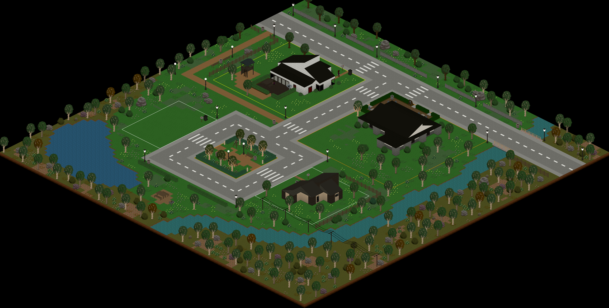
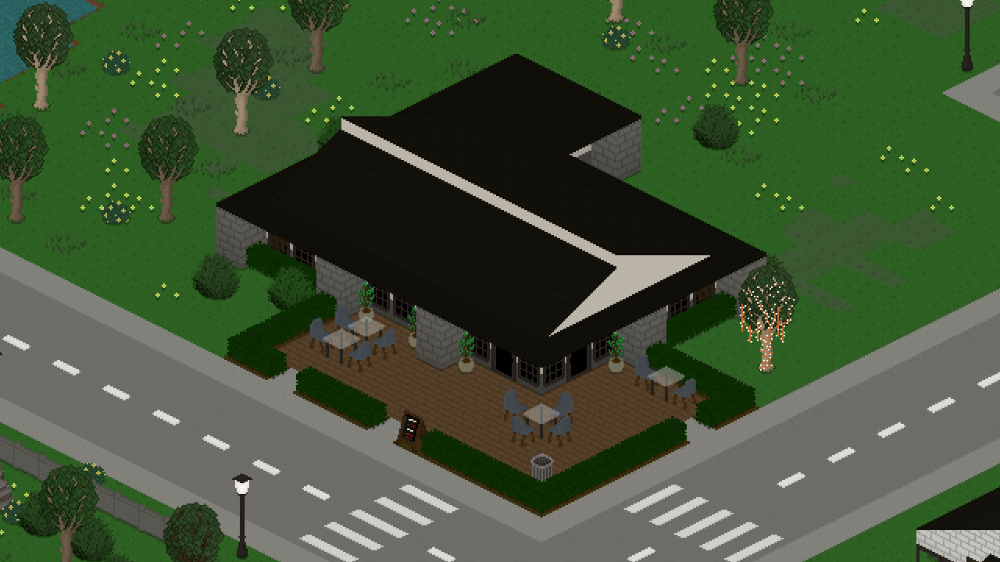
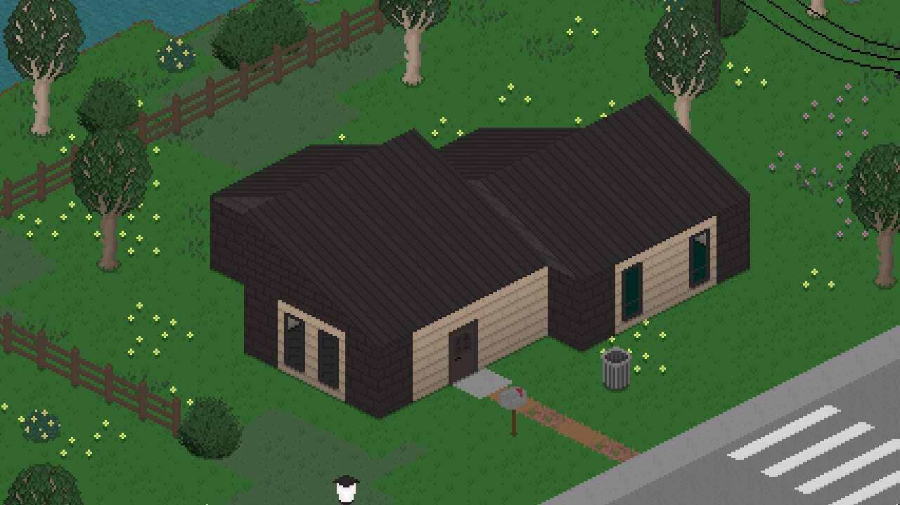
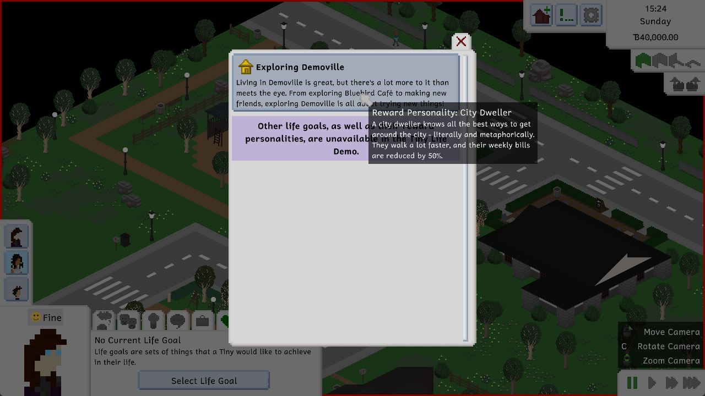
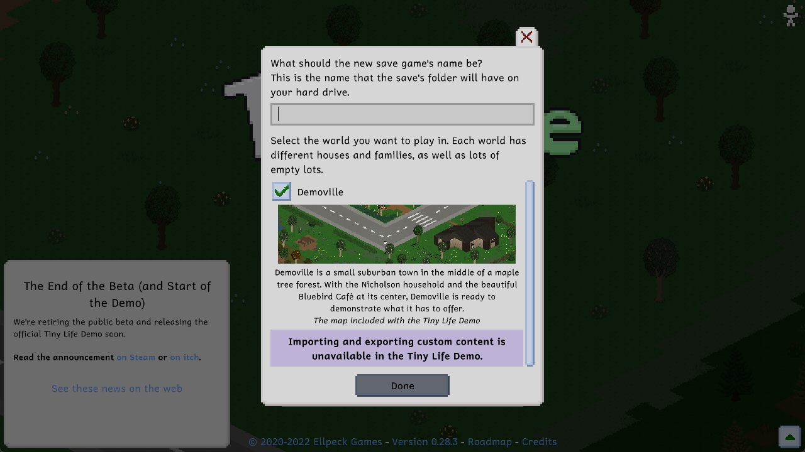
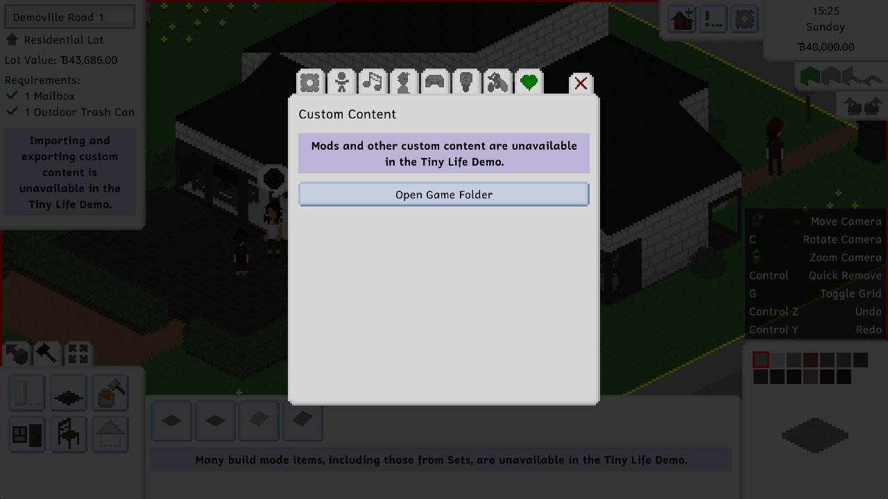

Today is finally the day you've all been waiting for. Well, okay, it's not *that* day yet. It is, however, the day that we're releasing the official Tiny Life Demo, for free, for everyone, forever!

The Tiny Life Demo will be replacing the public beta both on itch and on Steam for now, as we discussed in our [previous post](https://store.steampowered.com/news/app/1651490/view/6132247440450013862) about our plans for the demo. You don't have to read that post if you missed it, though, because we'll be summarizing everything in as much detail as we can here.

The most important thing that we want to say about the public beta is that **you won't be able to download it on itch and Steam anymore**. It also won't be receiving any more updates until the game's official Early Access release a little later this year. When the Early Access version is released, you'll be able to continue playing in your old saves from the demo and the public beta as well, if you like.

Anyway, let's get on with what we have for you today!

# Welcome to Demoville
Demoville is the first new world that we're adding into Tiny Life after our initial, and still very beloved, Maple Plains City. While the full version of the game will feature both maps on Early Access launch, the Demo will only come with Demoville.

Demoville features some beautiful creations from some of our amazing community members, who have volunteered to work on the world with us. We want to show off the full world here, as well as the community-created lots, as we think they deserve some extra spotlight.

Here's all of demoville, first and foremost.

This beautiful house (that is inhabited by the Nicholson household) was created by [CringePotato](https://steamcommunity.com/profiles/76561198086827058).

This is Bluebird Café, which a lot of Tinies will frequent, maybe even including you! It was created by [8dat](https://www.tumblr.com/8dat), who also created its barista, Liam Lungo.

And lastly, this is Demoville Square 2, which is a small starter home that you can move into when starting a new save if you don't feel like building your own house. It was built by [DonZekane](https://twitter.com/DonZekane).

# A Demoville Native
Along with Demoville, we're also introducing a new life goal to the game that'll **only be available in the demo**. The cool thing about that is that the reward personality, City Dweller, will persist with your Demo tinies if you decide to move into the full game with them.

As you can see, all of the other life goals are unavailable in the demo - more on that now.

# What the Demo Has
As you might be able to tell from the screenshot above, the life goals menu looks a little lackluster compared to what you're used to from the public beta.

As discussed in our previously mentioned announcement, the demo will feature most of the game's regular content, with a few caveats that are meant to incentivize buying the full game if you're enjoying the demo enough to warrant spending money on Tiny Life. Here's a brief summary of what those differences are:

- The demo only features one world, Demoville.
- The demo does not feature any of the build mode and character creator items from the three Sets that the game has, or any future Sets that will be added to the game after the Early Access release. For those of you who aren't in the loop, Sets are groups of themed content whose art was created by a member of the community. The sets currently in the game are the Woodlands Set, the Familiar Attire Set, and the Fitness Set. The Early Access version will ship with all current and future Sets included *without any additional downloads or payments necessary*.
- The demo only features one (demo-exlucsive) life goal, Exploring Demoville.
- The demo does not allow importing or exporting any custom content or mods, and it does not allow editing Demoville outside of existing lots.

As previously mentioned, once the game's Early Access release is out, you'll be able to **continue demo save games in the full release**, or export households and lots from your demo save games and move them into Maple Plains City or custom maps.

We've taken care to explicitly state what content is missing from the demo in-game in all the places that it is missing from. While playing, look out for these little purple boxes that'll tell you what you can expect when buying the full game.

# The Full Changelog
As with every update, there are a few new features and improvements to existing features as well, but we really wanted to use this post to highlight the content that is specific to the Tiny Life Demo. If you want to know more about what changed since the last public beta version, though, here's the full changelog that contains all of the info you need!

Additions
- Added the Demoville world, including its community-made lots and households
- Added the Exploring Demoville life goal to the demo
- Added a default long hairstyle for children
- Added a progress arrow display to skills, relationships, job performance and needs
- Added the ability to clean out all of a fridge's empty or expired items
- Added the ability to view a lot's opening hours by hovering over the café sign furniture item

Improvements
- Made TVs play sounds when they're on
- Improved performance when first drawing a map's static objects
- Render with anti-aliasing on low zoom levels to create a mipmap-style effect
- Made cafés require a food display case
- Don't draw room content that isn't visible, improving performance on maps with houses that have a lot of rooms
- Made it much more likely for people to go home when their needs are low
- Preload emotion sting sound effects to mitigate lag when the first one is played
- Improved the way a skill's max level looks
- Enable gamepad repeats to allow holding buttons to press them multiple times
- Made food in the fridge last much longer
- Allow children to order food from cafés
- Hide clothes occasions that were unused
- Added a maximum amount of money for a household to have
- Made it a bit more likely for choice prompts to be successful
- Display a tooltip when there's not enough money to copy an outfit

Fixes
- Fixed various crashes when loading save files with missing objects or clothes
- Fixed the tile tool not drawing previews properly in some locations
- Fixed a crash when importing a lot that was exported on a bigger map
- Fixed tiles not being visible when using the lot movement tool
- Fixed a texture region bleeding issue on chairs
- Fixed an exception when trying to talk to someone who is at the border of the map
- Fixed keybind names being moved into multiple lines even though they have enough space
- Fixed lighting causing artifacts on some older graphics cards
- Fixed color selection in the character creator not working correctly with a gamepad
- Fixed no elements being selected after switching a person's age using a gamepad
- Fixed cakes with candles being able to be put into the fridge
- Fixed long life goal titles going under the abandon button
- Fixed a crash when a duplicate object is added to a map and the map is loaded
