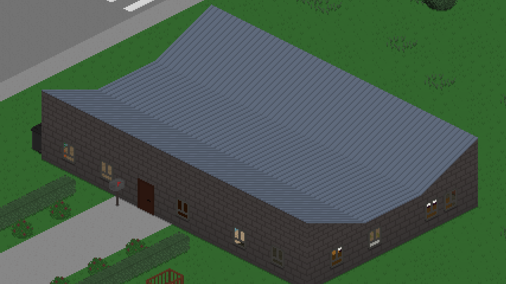
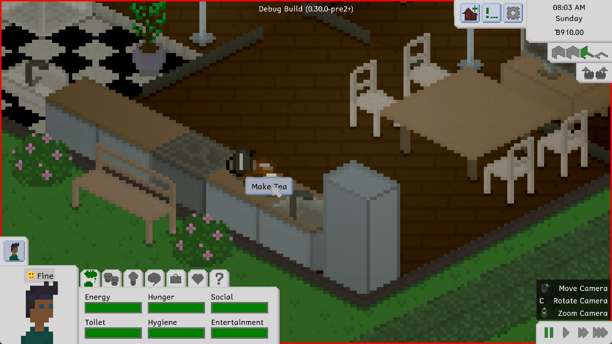
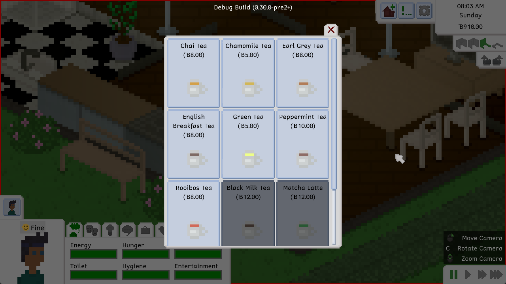
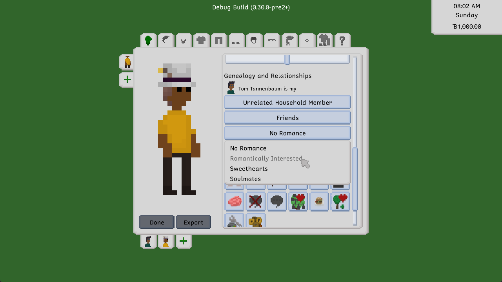
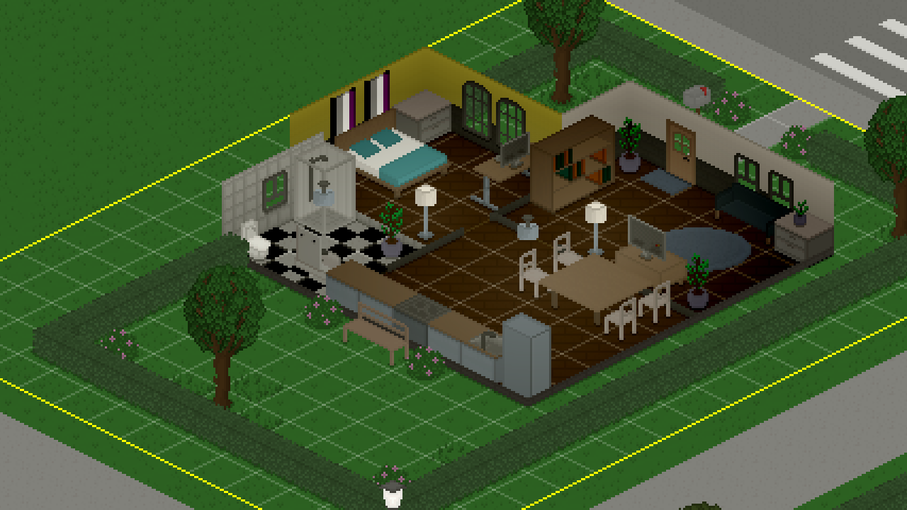
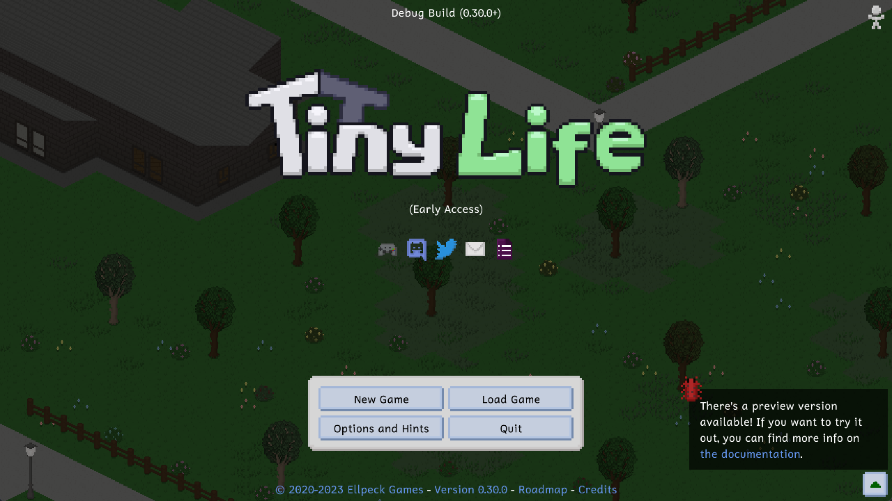
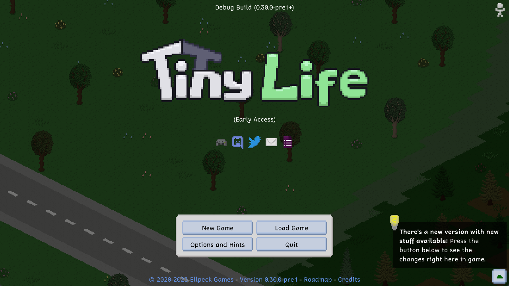

Hi, cool people! Since the last demo update, Tiny Life has gone through Steam Next Fest, Plumbella's amazing video, and PAX East, the latter of which ended just a few days ago. This whole journey has been a blast, and if you missed any of it, you can check out the other devlogs for more information!

Now, though, we'd like to introduce you to a cool new update for the demo, which also has a lot of backend changes in preparation for the Early Access release. This is the first update since 0.29.0 that actually includes these backend changes, which have been in development for quite a while now. Because of these changes, there might be more issues with existing interactions than you're used to, so please stay tuned for bug fix updates and report anything you find on the [bug report form](https://tinylifegame.com/bugreport).

Now let's get into the changes!

# Some new stuff to place
We added a few new cute bits and bobs! This includes these cat tails and lily pads. The lily pads come in two variations: one with and one without the flower on top. The cat tails come in two variations as well: a dense and a sparse version. While lily pads can only be placed on water, cat tails can be placed anywhere!

The lily pads also bob up and down in play mode, which is pretty cute.

We also added a new flat roof type that matches the already existing sheet metal roof. We also added the ability to rotate flat roofs, so that you can have your sheet metal laid out the way you want!

# Quali-tea
You can now make tea! This might seem like a bit of a random feature, but we've had coffee in the game for a while now, so it only seemed fair to have the ability to drink tea as well!

To make tea, you can buy a Tea Kit in build mode, place it down and get to work! The tea kit includes a cute little kettle, as well as some boxes of tea bags. There are plenty of teas to choose from, and the better your cooking skill is, the more you're able to make!

A feature we haven't implemented yet is the ability to order tea in cafés. This feature will be included in the near future, so don't worry about being unable to get your daily fix!

# Localization updates
Everyone has been doing a ton of work on the game's localization, including updates to the German and Spanish versions, but also the inclusion of two new languages:

- French, by [YenSide](https://instagram.com/candice_mlng)
- Polish, by [HugBeast](https://www.instagram.com/hugbeast00), Kalme and [TeaMaki](https://www.fiverr.com/ioderuntcapulus)

Thanks so much to these awesome community members for helping out! If you're also interested in contributing localizations, please check out the [documentation article](https://docs.tinylifegame.com/articles/localization.html)!

# Many small improvements
We made a lot of small improvements to the game since 0.29.0, including the previously discussed backend changes. Here are some of the more notable ones that we felt important to include, many of them based on yall's feedback.

We rebalanced the friendship and romance gains of almost every social action, doubling their effectiveness. This is based on some feedback that a lot of you had, pointing out that it was very difficult and time-intensive to make new friends.

You can now set initial friendship and romance values in the character creator! A lot of people were requesting this feature, and we always pointed them to the [cheats](https://docs.tinylifegame.com/articles/cheats.html) that you can also do this with. You can still use cheats for more fine-grained control of initial relationship values, but you can now decide what relationship your Tinies should have in the character creator too!

The build mode grid is now displayed on the entire lot! When introducing the grid, we were originally planning on this, but didn't end up including it because of technical limitations with the way the grid was being rendered. A ton of people requested this, though, so here it is now!

You can also help kids with homework now! This is part of a new system we've been implementing for the babies we've been working on. Kids can request help with homework by selecting an adult Tiny, and adult Tinies can offer to help kids with homework by selecting them. Getting help with homework increases the speed that homework is done at and the speed that homework skills are gained with, and it also increases the relationship between the two people!

# Preview versions
Eagle-eyed players will already have noticed that we released two preview versions of the 0.30.0 update in the last few days! This is a new system we've been trying out that allows us to test upcoming versions easily, while still allowing players to revert to the original, more stable version. From 0.30.0 on, you'll be notified in the bottom-right corner of the main menu if a new preview version is available. The notification for new full versions is still available, as well, but it now also has an icon to be able to easily differentiate between the two.

For more info on preview versions, you can check out [this documentation article](https://docs.tinylifegame.com/articles/preview.html) about them.

# The full changelog
As we said at the top, a lot changed in this update. Way more than we can cover in a devlog! So here's the full changelog, as always, for your enjoyment.

Additions
- Added a few more decorative objects, including two lamps, cattails and lily pads
- Added a flat sheet metal roof
- Added the ability to set initial relationship data in the character creator
- Added a tea maker and various types of tea
- Added the ability for children to ask for help with their homework
- Added the ability to move to a different lot in play mode
- Added the ability to ask people about their jobs
- Added polish localization by [HugBeast](https://www.instagram.com/hugbeast00), Kalme and [TeaMaki](https://www.fiverr.com/ioderuntcapulus)
- Added french localization by [YenSide](https://instagram.com/candice_mlng)

Improvements
- Cause links to be opened in the Steam overlay on Steam Deck
- Improved social action pathfinding, causing people to stop less
- Allow changing the cursor size in the accessibility options
- Made people much more likely to eat the food they cooked immediately
- Display a popup with info on how to add additional tinies when first pressing the Done button in the character creator
- Headscarves will now hide a Tiny's hair rather than entirely removing it
- Deflate save files to decrease their size
- Tinies with a partner will now try to sleep in a double bed that their partner has claimed a side of
- Replace the "Alternate Number Keys" option with keybinds for switching between Play Mode tabs (which default to Q and E)
- Allow rotating flat roofs
- Rebalance the amount of frienship and romance gain that actions give
- Massively reduce the markup of custom paintings
- Draw the build mode grid on the entire lot, rather than just in rooms
- Allow navigating the interaction menu's pages with the shoulder buttons when using a gamepad
- Randomly add items to trash cans at midnight occasionally to allow for special rummaging finds
- Made food quality and saturation not influence eating speed, but hunger need restoration speed
- Increase the friendship gain from random interactions with coworkers at work
- Improved the look and layout of update notifications in the main menu
- Made grilled cheese vegan-friendly
- Updated from .NET 6 to .NET 7

Fixes
- Fixed people being able to steal held items from other people
- Fixed big objects not being selected properly near section boundaries
- Fixed "This is Inappropriate" action not having a properly localized string
- Fixed maki rolls looking awful
- Fixed forced actions sometimes being able to exceed the action queue's length limit
- Fixed macros like keybinds not displaying properly on the loading screen's hints
- Fixed some default couples not having had their first kisses yet
- Fixed a rare crash when resizing the window while in a loading screen
- Fixed techie tinies being unable to play video games when they're sad
- Fixed the Ask if Single notification having the wrong order
- Fixed out-of-town actions failing if there's an item on the ground near the map border
- Fixed some actions claiming a required object is missing when the Tiny is too far away
- Fixed being unable to close the Life Goal menu if all life goals are completed when using a controller
- Fixed Tinies watching TV through walls
- Fixed a crash when removing a TV that someone is currently watching
- Fixed Tinies using the toilet and washing their hands while holding an item
- Fixed some more issues with transitive genealogy calculations
