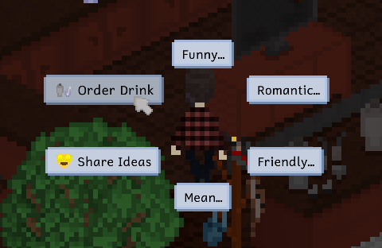
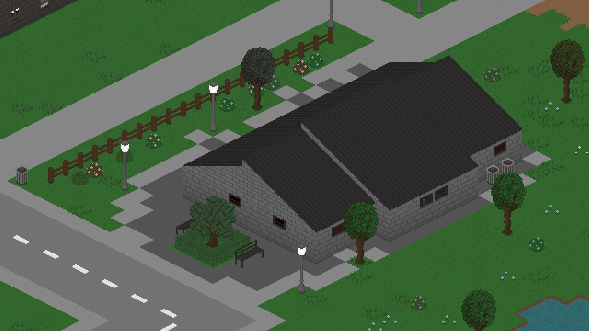
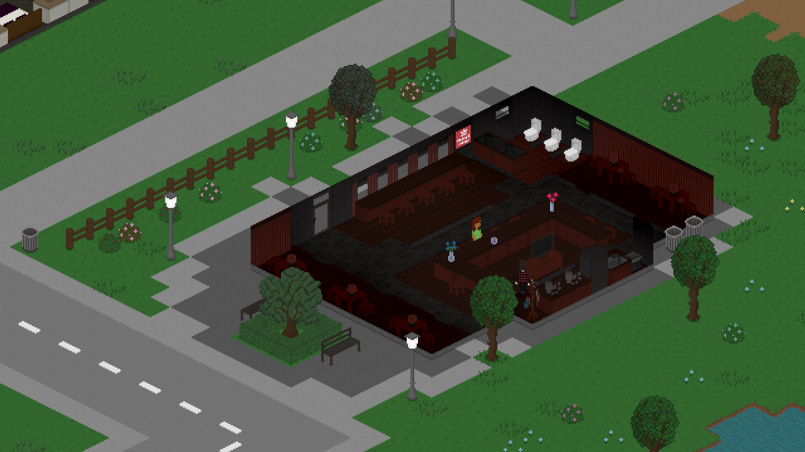
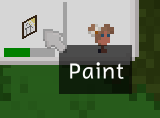
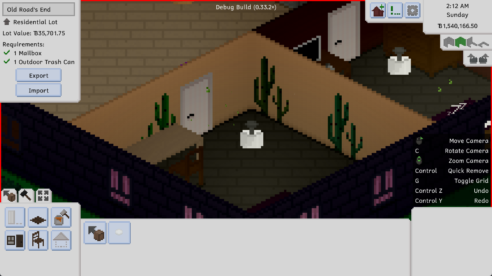
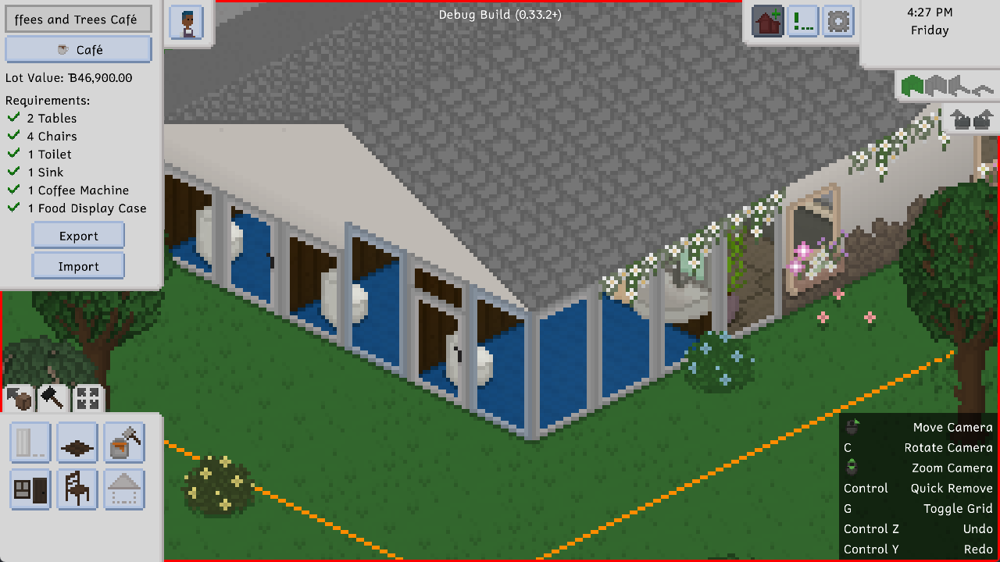

---
title: "0.34.0: Of Bars, Brews and Progress Bars"
itch: "https://ellpeck.itch.io/tiny-life/devlog/550844/0340-of-bars-brews-and-progress-bars"
steam: "https://store.steampowered.com/news/app/1651490/view/3683429634497560974"
---

Hi everyone! It's been a hot minute since the last proper devlog for an update, partly because so much stuff happened since the last one (the game's release and all that), but also because the last few updates didn't really feel devlog-worthy.

This one is, though! We hope you agree. We put quite a bit of work into this update, but we also didn't have as much time as we maybe would've liked to work on it due to a bunch of outside factors. I don't want to drone on about that though, instead, I want to show you all the exciting improvements and additions, and then also talk about some other fun stuff surrounding Tiny Life!

# Bars and Brews
Remember the Mixology Kit? It's been in the game for quite some time, and we'd always been planning on making it functional. That day has finally come!

When you select the Mixology Kit, you can now make one of a large variety of drinks. There's Brew, Brew with Lemonade, and of course some cocktail staples a well!

Take care, though! Drinking too much brew at once might have some *very* negative effects on your Tiny's... aliveness.

Along with the ability to make various types of drinks, we also added a new lot type: the bar! The bar lot type has a bartender who will hang around the lot from 3PM to 4AM and serve up some lovely drinks for you. Just ask them!

To make it easier for yall to get started, the new version of Maple Plains City has a new lot called Dive Bar by the Lake, built by the lovely [AngelofAcid](https://steamcommunity.com/id/AngelofAcid/myworkshopfiles/?appid=1651490), who constantly submitts some absolutely stunning lots to the workshop - definitely check out some of their other builds!

After updating, loading an existing save file from Maple Plains City will cause the new lot to be added automatically, without anything else about your world being changed.

# Action Progress Bars
This has been an incredibly long-requested feature, and it's still kind of in the making and will be added onto slowly over time: progress bars for some actions!

Right now, the only actions that display a progress bar like this are ones that pertain to an object or project that is being completed, like painting, woodworking, programming a mod and writing a book.

Over time, additional progress bars will be added, though, so absolutely keep the requests coming!

# Additional Additions
There were also a bunch of other additions and improvements, so here's some of them.

An adorable new wallpaper called ColorCo Cute Cacti!

Full-height versions of the Now You See Me doors and windows, called Now You See It All doors and windows!

# Style in Style
We added a basic style preference system for clothes, none of which is directly exposed to the player. This system is intended to make randomly generated Tinies a bit more coherent and feeling less "wacky", while still maintaining the same amount of diversity that the game already has.

The way this style system works, in short, is that clothes now have one of three internal flags set: feminine, masculine and gender-neutral. Based on the internal preference of a randomly generated Tiny, the likelihood of them choosing a clothing item that matches their preference is 75% higher. This system is also used when randomly generating pronouns, voice styles, and pregnancy abilities.

The main change that this system introduces is that about 66% of Tinies will conform slightly more to Western gender norms. While this seems contrary to the goals of the design of the customizability of Tinies, it's important to keep in mind that this 66% of Tinies will still only have a 75% chance of choosing a clothing item that matches their preference. Additionally, a lot of clothing items have the neutral preference set, and a third of randomly generated Tinies will not have a preference at all, and thus choose from all clothing as before.

What this boils down to is this: a few more Tinies will now feel more "coherent" to a lot of players that are used to cisgender people. While we want Tiny Life to be as inclusive as it possibly can be, we also realize that it's easier to get into a topic if it feels familiar and relatable in some way. For a lot of players (me included), that means Tinies that are fun, wacky and queer, but for many players, it also means Tinies that conform more to traditional gender norms. So before diving into the wild and wacky, this feature gives the oldsters a second to adjust.

# Celebrating Pride
I thought long and hard about how to include both topics in this devlog: the style preference system, which, in a way, lowers queer representation, and our Pride '23 charity special, which is meant to celebrate Pride in a genuine and supportive way.

I didn't have much time, unfortunately, to celebrate Pride with Tiny Life this year. The last two years, there were updates that specifically added Pride-themed items and features, including the flags and asexuality and aromance. With the game's release, University and two large family events, I didn't have the capacity to work on Pride-specific features and release them in a timely manner, so I decided to do something small and easy that still celebrates Pride in a meaningful way.

At the start of July, Ellpeck Games will donate 23% of all of Tiny Life's earnings throughout June to charities like The Trevor Project and Outright International. These charities support queer people all over the world, and help them overcome some of the many challenges that they still have to face.

We announced this [on Twitter](https://link.tinylifegame.com/pride23) and on Discord at the start of June. However, Tiny Life is still a reasonably small indie project, and a lot of the game's sales revenue goes to Steam and our publisher. Because June was only our second month of selling Tiny Life, throughout it, we have realized that 23% (which we originally picked because of the year 2023) doesn't actually end up amounting to that much. That's why we've decided to double the donation amount, from 23% to 46%.

We'll be making our donations at the start of July, so keep an eye out on [the Twitter thread](https://link.tinylifegame.com/pride23) where we'll be announcing it.

# A Proper Blog, Finally
Where are you reading this post right now, by the way? Might it be on Steam? On itch? In your newsletter reading program of choice?

Maybe it's on [the new Tiny Life blog](https://tinylifegame.com/#devlogs), which is now finally up and running on the website! We're super excited to finally have a unified place to publish posts about the game, without having it scattered across different sites. The blog also features the ability to switch between light and dark modes, so you can feast your eyes on a much more relaxing way to read our devlog posts. Yay!

That being said, we're still going to continue publishing all of our devlogs on Steam and itch, as well as on [the mailing list](https://tinylifegame.com/#subscribe) and [the Atom feed](https://tinylifegame.com/feed.xml) for the blog.

# The Full Changelog
Before I go, I want to thank all of you again for the amazing support you have given me and Tiny Life since its release, and I really hope wholeheartedly that you enjoy this update and the additions and improvements it brings, and that you're excited for the future of the game!

Ell ❤️

Lastly, and as always, here's the full changelog for this update, which you can also view in the bottom-right corner of the game's main menu.

Additions
- Added the ability to make drinks using the Mixology Kit
- Added a Bar lot type with a bartender
- Added the Dive Bar by the Lake lot by [AngelofAcid](https://steamcommunity.com/id/AngelofAcid/myworkshopfiles/?appid=1651490) to Maple Plains City
- Added Now You See It All window and door
- Added Solid Paint with Baseboard wallpaper and ColorCo Cute Cacti wallpaper
- Added progress displays to some actions

Improvements
- Improved the lot staff tooltip to add more information
- Made conversation partners walk back to the initiator if they walk away after being talked to
- Made protein shakes also count towards the Drink Mixing skill
- Allow selecting a Tiny in the active household by right-clicking them in the world
- Improved lot visitation priorities for the AI
- Some performance improvements for pathfinding
- Allow daily goal for teachers to also be fulfilled through skill books
- Display an open book texture when people are reading
- Allow water tiles to connect to dirt paths as well
- Pause the game while the notification history is open
- Order lot employment menu by first name
- Made gender options and clothes on randomly generated Tinies have a higher chance to be more consistent with Western  
  gender norms

Fixes
- Ensure vehicles are removed when an action is canceled or fails
- Fixed children being unable to take days off school
- Fixed the gnocchi being too cheap
- Fixed "map unavailable" tooltip not being displayed when using a gamepad in the demo
- Fixed the quality of baked goods being influenced by the cooking skill
- Fixed lot staff sometimes not finding their lot and getting stuck
- Fixed lots momentarily being invisible when a Tiny in the household goes home
- Fixed sleeping in a crib causing an exception when the crib is removed
- Fixed people only going to the corners of public lots when visiting, instead of the entrance
- Fixed people being called to meal if they haven't been invited in yet
- Fixed Perfect Painter life goal being available for children
- Fixed work and school emotions displaying the wrong source

API
- Added the ability for lot types to define their own visitation hours
- Added Map.OnEventsAttachable event
- Added a basic style preference system for clothes
