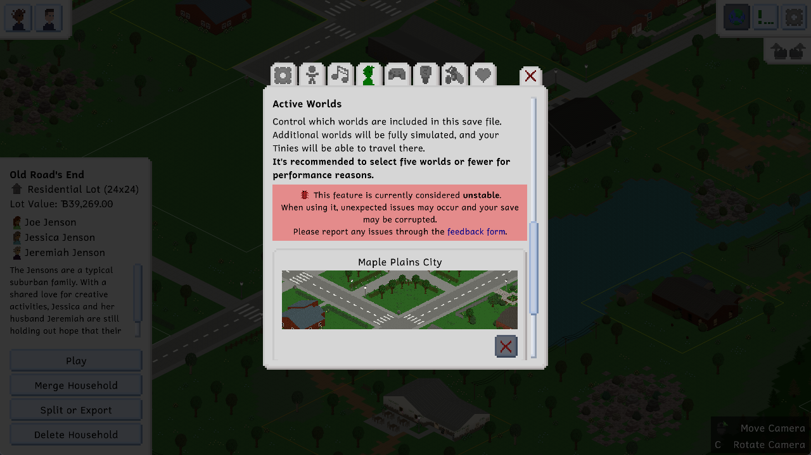
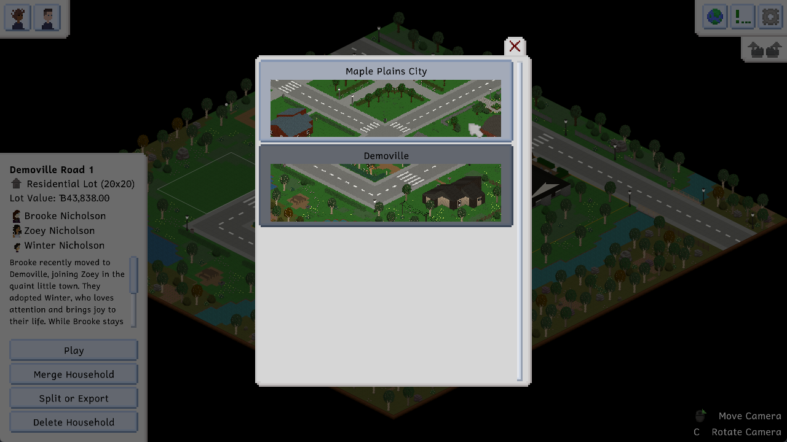
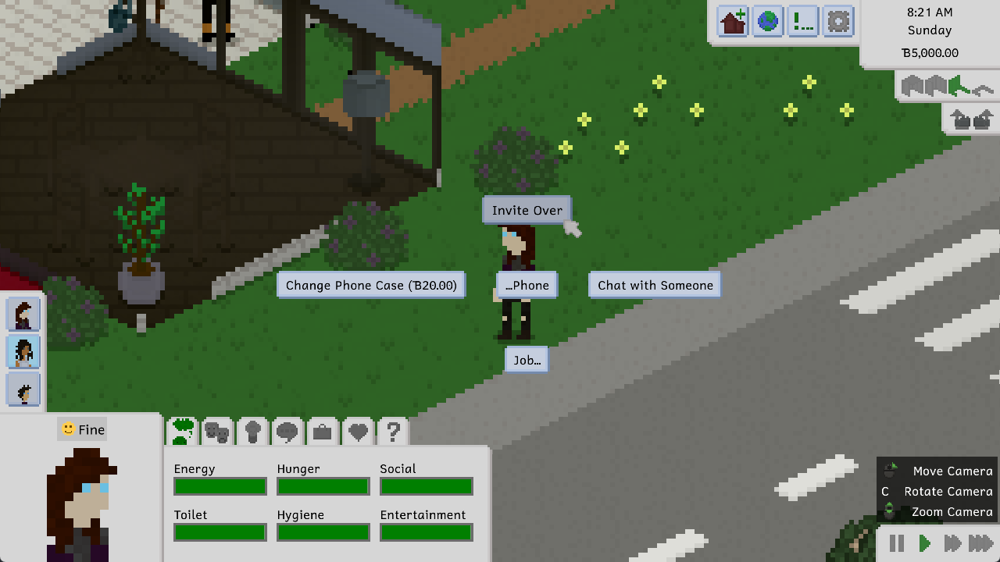
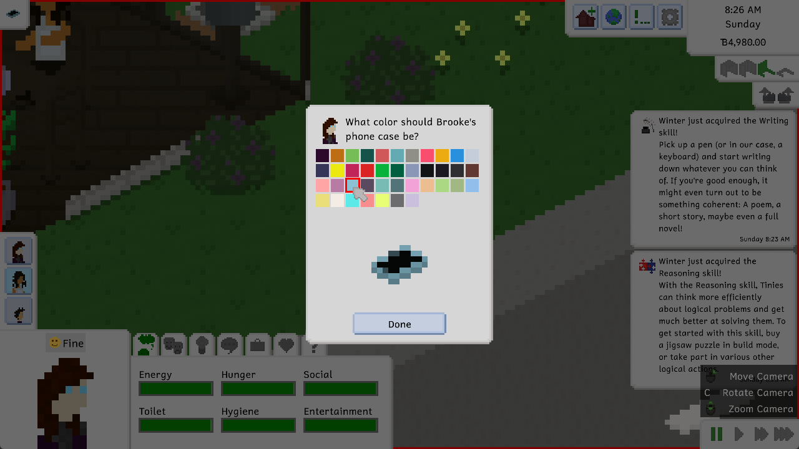
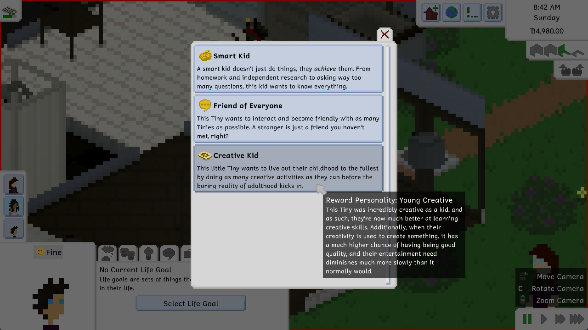

Hi everyone! Today, there's another super exciting update coming to you, which features a lot of improvements and two major new features, as well as some smaller stuff. So let's get right into it!

# Multiple Worlds Per Save
What? Multiple worlds per save? What does that even *mean*? Why did you suddenly add this feature that isn't even on your *public roadmap*, you **FOOLS**!!

Before we get started, please note that this feature is still **experimental** and, as such, **unstable**. A lot of additional unexpected issues may occur when traveling between maps and having households on multiple maps, so please report all of them through the feedback form if you encounter them. Also, we advise that you avoid using this feature on a save that is really important to you without making a backup first.

Now, let's get into it! Up until now, when creating a new save file, you had to select the world you wanted to play in. While this was all well and good, it lacked a lot of flexibility. When adding new worlds down the road, we'd have to continue updating older worlds with additional lots, households and decorations, which would become incredibly messy and cumbersome at some point. Now, this feature doesn't mean that we won't *ever* update older worlds anymore, but it does mean that there's not as much pressure to feature new features on older worlds as well.

But *now*, you can bask in the glory of having as many worlds in your save as you want! You can select the worlds you'd like to include in your save through the gameplay section of the options menu. We recommend a maximum of three or five, based on your computer's specs, and we'll get into why a little later in this post.

Once you've done so, you'll now be able to do two major things: you can select your active Tiny and select the "Travel to World" action, which allows you to travel to any of the worlds you have in your save. Instead of doing that, you can also select the little globe button in the top right (or press the X button on your gamepad) to open the world switcher, which allows moving the camera to a different world. Once you're there, you can then select any Tiny in your active household and tell them to do things in that world, and they'll automatically travel there!

Tinies will take about 15 minutes of in-game time to travel between worlds for the sake of a bit more realism. This means that, while Tinies from other households will occasionally travel between worlds to visit other lots, they will do so a little less frequently than visiting their own neighborhood.

# Phones
Phones? Phones! Tinies of all ages (other than babies) now have access to mobile phones, as well as landline phones! They will always have their mobile phone on them, and you can interact with it by selecting the current Tiny and going into the "Phone..." category.

The fun thing about phones is that each Tiny has a differently colored phone case, and you can choose which phone cases your Tinies should have through the "Change Phone Case" action. It costs 20 tiny bucks, so maybe don't go too crazy with it, but you can pick a color from the pastel or modern color schemes.

With phones, we also added the ability to invite people over! You can do so through your mobile or landline phone. Based on friendship and the person's needs and current actions, they may or may not be able to visit you. If they are, they'll travel to your household and ring the doorbell as soon as they're around. Yay, friends!

# Little Life Goal
A while back, there was an issue report for the fact that children were able to have the painting-specific life goal, but weren't actually able to complete it due to the easel only being accessible for adults. While this issue was fixed in the last update, it gave us the idea to add a new creativity-focused life goal for children, so we did just that!

The life goal is called "Creative Kid", and it gives a cool reward personality that allows them to be much more creatively gifted as an adult, as well as lowering their passive entertainment need reduction. Pretty useful!

# The Full Changelog
That's pretty much it for major features for this update! The full list of changes ended up being quite long, because we also fixed a lot of bugs and added a lot of little quality-of-life improvements. We're super excited about this update, and we hope that you are too!

As always, we'll round out this devlog with the full changelog for this update. You can also see the full changelog in the bottom-right corner of the game's main menu, or on the documentation site. Enjoy!

Ell ❤️

Additions
- Added the ability for saves to have multiple worlds in them, as well as the ability to travel between them
- Added mobile and landline phones, as well as the ability to use them to invite people over
- Aded a bills breakdown list to the notification
- Added Creative Kid life goal
- Added two new achievements
- Added thought bubbles which display in some situations, like when sleeping
- Added the ability to use emoji in text (currently only pasting is supported, not direct input through the operating system's emoji keyboard)

Improvements
- Stagger minor object updates for much improved overall performance in play mode and less lag spikes
- Display a notification when meeting new people at work or school
- Improved the mod list view in the game options
- Allow using up and down arrow buttons to navigate the cheat history
- Made some more baby actions emotion-dependent
- Made Tinies wait to be invited in when they visit so that they don't go jogging randomly
- Improved mail delivery order so that the mail deliverer doesn't wander aimlessly through the world
- Made the notification display and history menu slightly wider
- Display weekday separations in the notification history menu
- Allow changing the cheats keybind in the options
- Nerfed painting sale prices slightly again
- Cleaned up the debug menu
- Improved achievement names

Fixes
- Fixed Steam icon being missing from Steam notifications
- Fixed outdated rooms causing a crash when making a map smaller
- Fixed counters and fences rendering ghostly when a lot preview is created
- Fixed another genealogy issue when having children
- Fixed flower grass connecting to paths incorrectly
- Fixed being able to ask babies to taste child food
- Fixed main menu warnings being displayed again when exiting to the main menu
- Fixed doors opening visually for people who have not been invited in
- Fixed an exception when trying to do an inappropriate action on a lot without a household
- Fixed front door calculations taking into account trash bins as well as mailboxes
- Fixed some strings, like family-focused, not splitting properly due to length

API
- Due to the addition of the ability to have multiple maps, action infos now have a current map and a goal map, rather than just a single map
- Updating objects now have three updating states: always minor, major if the map is active, and always major
- Allow mods to interact with the game's SaveData when saving and loading through new events in SaveHandler
