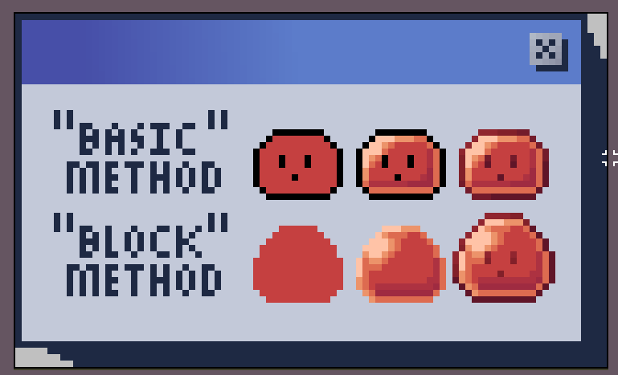
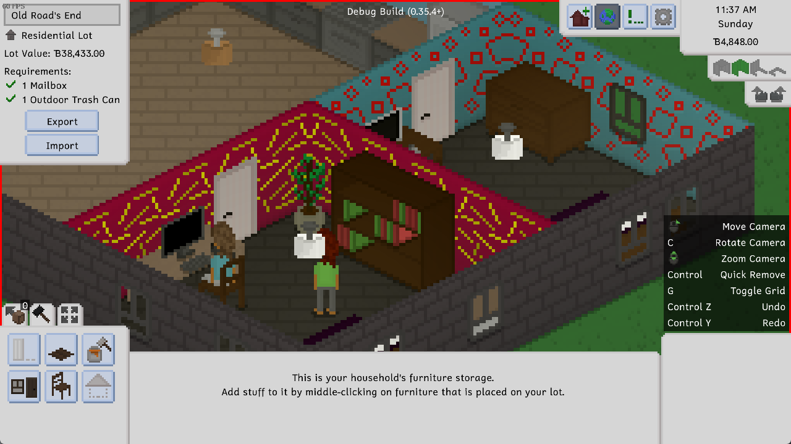
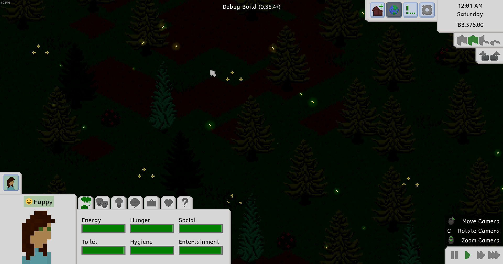
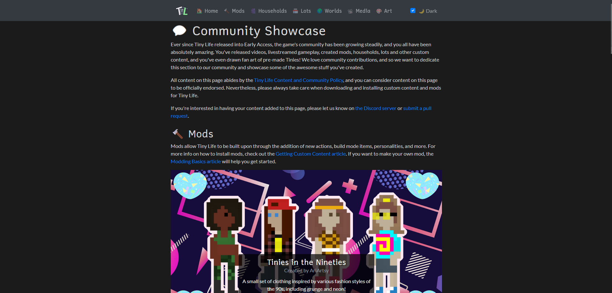

Hi friends and strangers alike! I'm excited today to share with you all an update that has been in the making for quite a while: the Retro Rarities Set! Along with this set, this update features a fair share of improvements, bug fixes (especially related to multi-world saves), and more.

Let's get into it!

# Retro Rarities
The art for the Retro Rarities Set was created by the lovely [clovedove](https://clovedove.tumblr.com/), who worked with me to create a group of content themed around the aesthetic of the 70s through 90s, and we're incredibly happy with the result.

The Set features over 10 new furniture items and over 5 new hairstyles, and all of them have a range of beautiful bright and muted pastel colors to go with them.

I asked clovedove to tell you all a bit about her process when creating this art, and she gave us some lovely insight into it.

> When making the set, I drew inspiration from 1970s furniture, specifically retro kitchen appliances, simple in design but iconic with their pastel colors. The unique furniture of that period with the muted yet colorful palettes has always been an inspiration for me, reminding me of a dusty woolen blanket; cozy and nostalgic, yet dated.
>
> My process in my work is a little different from the norm: whereas others first outline, color and shade, I block out the silhouette of the item, shade it, and finally outline with a few small adjustments to the silhouette. With my method, I can fully focus on lighting and the perspective of the object, making it look more organic. Outlines come last, as they enhance the shading, it’s my favorite part of the process, and it brings it all together!

Here's a little example to illustrate what she means:

As with all other Sets, the Retro Rarities Set is included in the game for free, but is not featured in the Tiny Life Demo. To get the Set, just download this update and you're all *Set*!

# Other New Stuff
Along with the cool Set art by clovedove, I also added some new art of my own: two new wallpapers that fit the Retro Rarities Set, as well as a new concrete tile flooring.

The wallpapers come in a variety of colors, both vibrant and muted, and you can select similar colors for the background and the highlights, so making them look more subdued is easy as well.

As part of one of the minor updates for 0.35, we added some cute falling leaf particles to trees. The feedback on these has been very positive, and a lot of players loved how they improved the atmosphere and liveliness of the game, especially in the forested area of Maple Plains City. In this update, we added another ambient effect that shows up at night: fireflies!

These can't be interacted with (yet?), but they add a bit of subtle lighting and movement to Tiny Life's nights, and we hope you enjoy them!

# Multi-World Fixes and Improvements
Throughout 0.35 and its minor updates, the multi-world saves feature was officially considered unstable, and for good reason. As we learned just a few days ago, the way that Tinies in other worlds were updated caused a lot of issues, including many a starvation situation.

We have now remedied a lot of these issues and conducted multiple long-term AI tests, and everything should work a lot less flawed...ly now!

We also fixed a nasty bug that caused regular visitors with jobs to be fired constantly because they wouldn't actually show up to work, choosing to stay at home instead. Oops.

# Community Showcase
As I talk about a lot, I'm constantly overwhelmed and blown away by the support and love that the Tiny Life community gives not only the game, but also its developers. Because of this, we've decided to give back to the community in a way by more actively promoting your lovely creations.

We created the Tiny Life Community Showcase page, which is part of the [Tiny Life website](https://tinylifegame.com/community)! This site shows off a variety of community creations, including mods, households, lots, custom worlds, media like YouTube videos and stream highlights, and even some fan art that you all have been creating!

Currently, the site is still a little barren, but the introductory section at the top explains how you can add your own entries to it - don't be shy!

In addition to this site showing off community creations, it also serves to give new players an easier introduction to finding and installing custom content. A button to open the community showcase site will now be displayed in-game when installing new custom content, and it can be used as a more officially endorsed location to get trusted custom content items.

# Full Changelog
As always, I hope you enjoy this update and especially the new Retro Rarities Set by the amazing clovedove.

❤️ Ell

Lastly, here's a copy of the full changelog for your perusal, which you can also find on the game's documentation website, and in the bottom-right corner of the game's main menu.

Additions
- Added the Retro Rarities set with art by [clovedove](https://clovedove.tumblr.com/), which includes various new furniture and clothing items in a retro style
- Added ambient firefly particles to forested areas
- Added two new funky wallpapers
- Added large concrete tiles tile

Improvements
- Display variation textures for concrete, roads and dirt paths
- Increased default and allowed regular visitor amounts
- Added emotions for babies following adults and cleaning up babies
- Added emotions for babies reading story books and adults helping them
- Display custom content info in multi-map selection options menu
- Improved unemployment display in relationship infos
- Link new community showcase site in custom content menus
- Localized exported household, person and lot names
- Improved friendship and romance string displays in relationship panel
- Allow the espresso machine to break
- Improved passive update timing for unplayed maps

Fixes
- Fixed jungle gym not being obstructed by roofs
- Fixed debug teleport action not working if the person is on the same map
- Fixed content not being properly validated when lots are exported
- Fixed various issues when adding additional maps to the current save
- Fixed tile grid being hidden behind multi-layer tiles
- Fixed depth positions of scaled particles on parents
- Fixed people not finding out someone's job when meeting them at work
- Fixed moving to a new lot causing the household to be added on the wrong map occasionally
- Fixed unpaid bills info displaying for inactive households
- Fixed skill achievements not working due to baby skills
- Fixed being unable to go home on a different map if standing in the same location as the home lot
- Fixed people not fully reaching their destinations on high speeds, causing subsequent actions to fail
- Fixed regular visitors failing to appear at their jobs, causing them to get fired regularly

API
- Made Walk and Drive actions typeless
- Allow roofs to have multiple layers and colors
- Allow actions to be enqueued as priority by the AI
