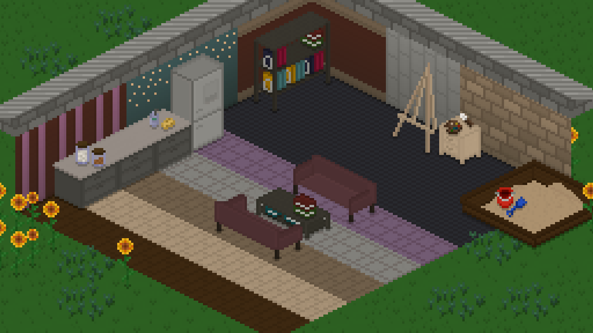
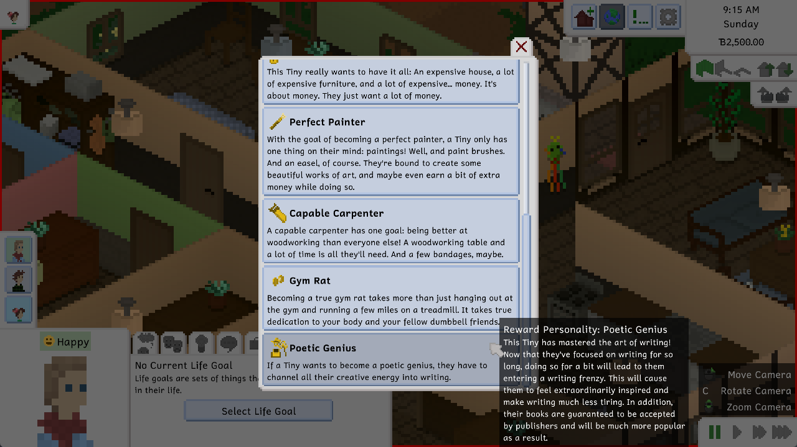
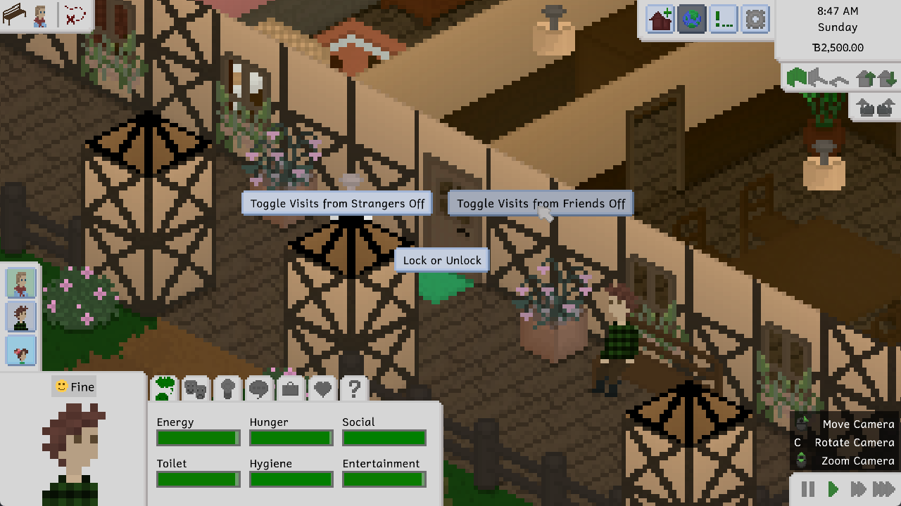
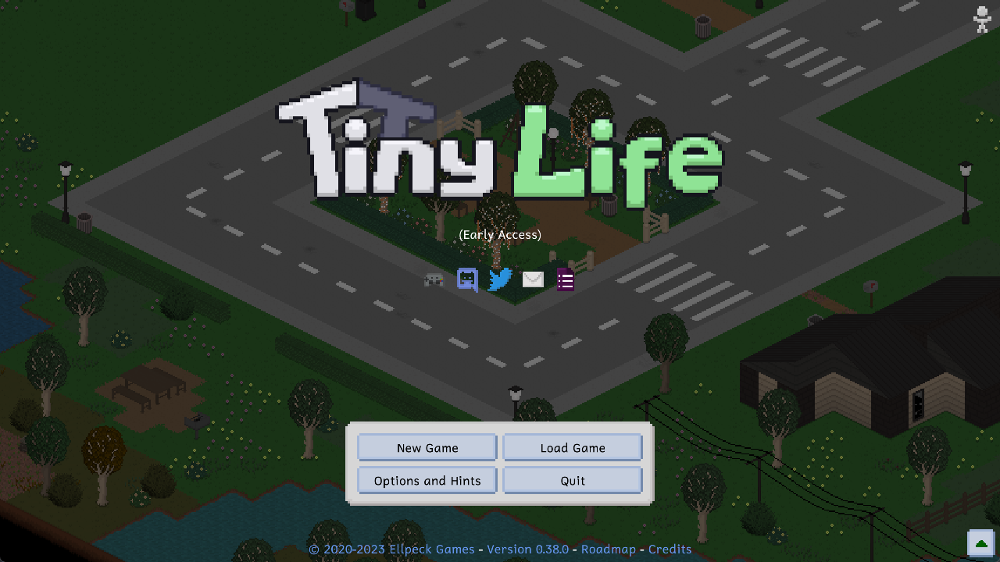
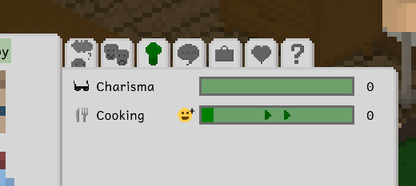
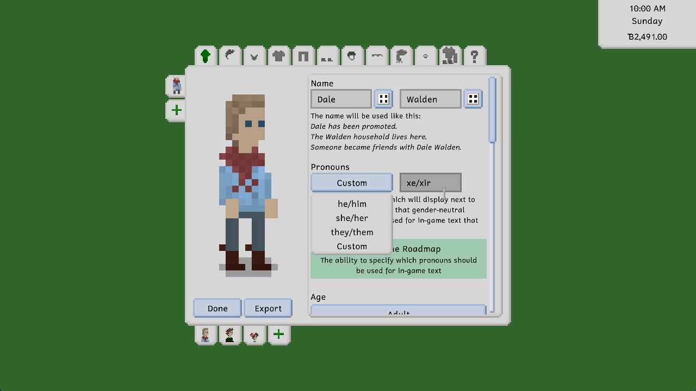

---
title: "0.37.0: Multiple Floors and Fences Galore"
itch: "https://ellpeck.itch.io/tiny-life/devlog/646318/0380-get-cozy-indoors-and-lock-out-your-friends"
steam: "https://store.steampowered.com/news/app/1651490/view/3883855041905172042"
---

Hi everyone! It's been a minute since we released the last big update. Quite a bit has happened since then, both in the game and out! Let's dive right into it, (not really) as usual.

# Tiny Life and the Jingle Jam
I was approached a few months ago with an email that, admittedly, got me really excited. Apparently, the folks from Jingle Jam wanted Tiny Life to be part of their bundle! In case you don't know what Jingle Jam is, it's a holiday- and gaming-themed charity drive largely contributed to by The Yogscast. It features a reward bundle for donators that contains a ton of awesome games, including our very own Tiny Life!

It's an honor for Tiny Life to be included in the bundle, especially with donations going to such amazing and topically diverse charities as CALM, Comic Relief, War Child, and Whale and Dolphin Conservation.

If you haven't gotten the bundle or watched any of the streams yet, you can check out [the Jingle Jam website](https://www.jinglejam.co.uk/) for more info!

# A Bunch of Decor
Let's play a game. No, not Tiny Life, silly! Let's play a game of "spot the new items that we added since the last update, but not, like, the last small update but the last big update, like 0.37.0, not any of the ones after that!" It's a bit of a mouthful to say, but the game is fun, I promise!

Spotted anything yet? We hope so, because we included five new clutter items, two new outdoor decorations, five new wallpapers and three new tiles!

# Getting Poetic
Have you ever thought to yourself "wow, I have a Tiny who really wants to become an author but there's no way to make them really want to become an author"? Well, this update's for you, then! If you enjoy life goals, you'll be pleased to hear that we added a new one this time around: the Poetic Genius life goal!

This life goal also features a cool reward personality that allows your Tinies to get into the zone while writing, causing them to make much faster progress and don't lose energy as quickly. Yay!

# Keeping Out Your Friends (and Strangers)
Now, for a change that y'all have long been requesting. And I mean *long*. Like, *really long*. You can now lock friends and strangers out of your house entirely!

Actually, kind of weird that everyone wanted that so much. Is everything okay at home?

For the record, this feature doesn't actually cause friends *or* strangers to be locked out entirely. It just causes them to stop visiting you on their own, in the middle of the night, at 3 am, and also just in general. You can toggle this setting at your house's front door.

# Cool, but Smaller, Changes
This update also includes a lot of smaller changes that are pretty cool, but not worthy of their own section in this devlog. Here are some of them!

The main menu background for Maple Plains City has been updated to feature some of the new stuff that has been added to it since the last one was taken. In addition, there are now new main menu backgrounds for all of the other maps in the game. Which means just Demoville. We'll get on that soon, I promise. Maybe we already are. Don't tell anyone, though!

Have you ever wondered what emotions influence what skills? We sure have! Actually, we haven't because we made the game, and we know everything about it. We also know everything about you. Okay, that's not true either. Sorry.

Anyway, you can now see what emotions influence what skills by heading into your Tiny's skills tab. While building the skill, if the current emotion boosts its progress, you'll now see the emotion's icon next to it with a little plus on the forehead.

The boost that emotions give this way is actually quite significant, so you shouldn't skimp out on it. For example, feeling creative for a skill like painting or writing *doubles* your skill building speed, as well as the speed at which you make progress on your books!

Lastly, a lot of people have been requesting a way to make it quicker and easier to select a Tiny's pronouns if they use one of the default sets. We've updated the pronoun selection menu so now, there's a dropdown with all the default pronouns available in your selected language, as well as a "Custom" option that brings back the text box you're used to.

Along with this feature, creating a new Tiny in the character creator will now also set some default pronouns for them, which means the box won't be empty when you start on a new Tiny.

# The Full Changelog
That's it for this update! We hope you thoroughly enjoy it. We're also excited for the next round of new features; we have a very cool *upgrade* planned.

As always, here's a copy of the full changelog, which you can also view on the website or in the bottom-right corner of the game's main menu.

Ell ❤️

Additions
- Added various clutter items, including jars, palettes, washing up stuff, book stacks, sandbox decor
- Added various outdoor decorations, including sunflowers and clover patches
- Added five new wallpapers and three new tiles
- Added the poetic genius life goal
- Added the ability to disallow friends and strangers visiting by selecting a home lot's front door

Improvements
- Display a warning when mods haven't been tested on the current game version
- Display other maps as part of the main menu background
- Display the influence of an emotion on a skill in the skill tab
- Improved depth calculations for big ground objects like rugs
- Display a dropdown in the pronoun selection area that suggests default pronouns
- Slightly rebalanced skill item quality outcomes
- Display when a person is currently on vacation in their job tab
- Only start new jobs with an active vacation day if they should be at work immediately when getting the job

Fixes
- Fixed mod error notification not being localized fully
- Fixed tooltips for missing lot conditions not being displayed when using a gamepad
- Fixed the name of the in-game hint for multiple floors being missing
- Fixed people claiming beds on other people's home lots
- Fixed TVs with more than one layer looking incorrect when displaying content
- Fixed the ability to load saves that don't have per-save options files
- Fixed lots at map borders causing a crash
- Fixed a crash when having an invalid language selected in the options
- Fixed being able to watch TV on different floors
- Fixed being entirely unable to order from lot staff
- Fixed the running animation showing while still stationary when jogging

API
- Added Mod.TestedVersionRange, a new property that mods are expected to implement, which allows specifying a SemVer version range of Tiny Life versions that the mod has successfully been tested with
- Overhauled the memories system to allow for multiple memories of each type to be present
- Updated to .NET 8
- Generified pathfinding code to allow using it for non-Person objects
- Allow launching into a save directly using the --save or --load argument
- Allow using the --ansi argument to include console colors in log files for modders
- Mods are now loaded in order of their DLL's name
