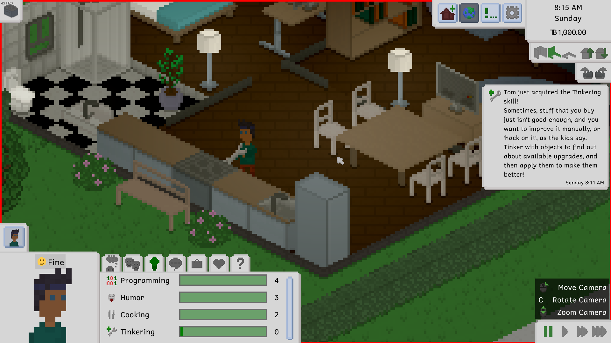
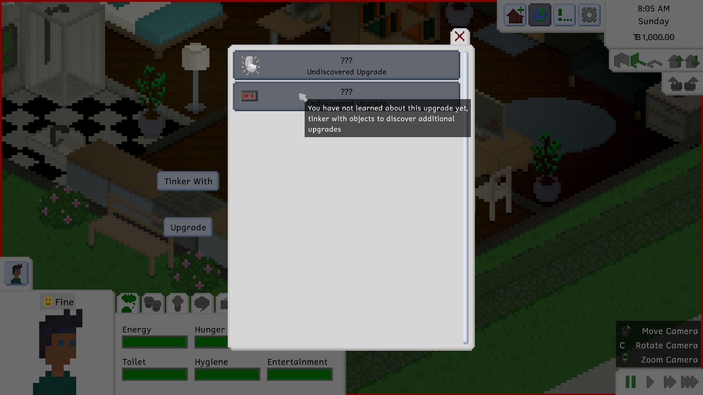
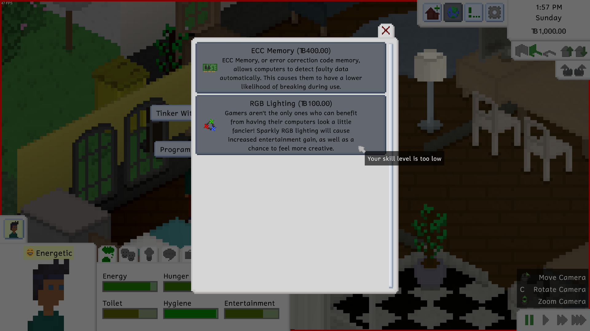
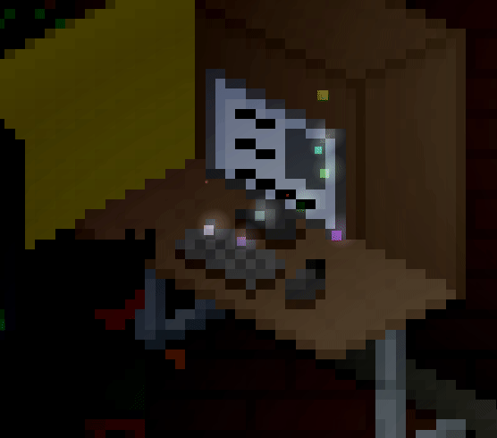
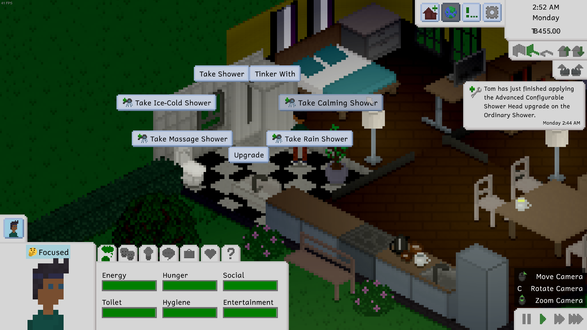
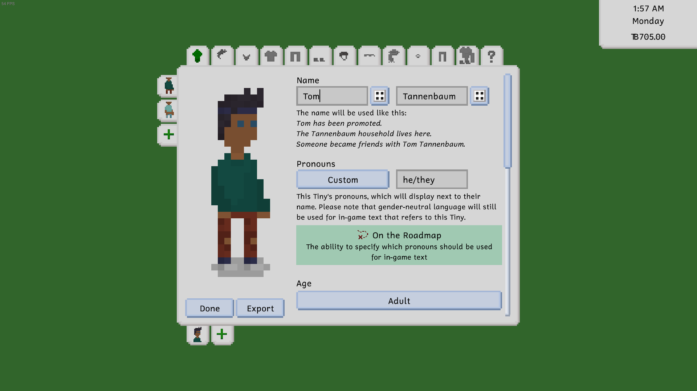
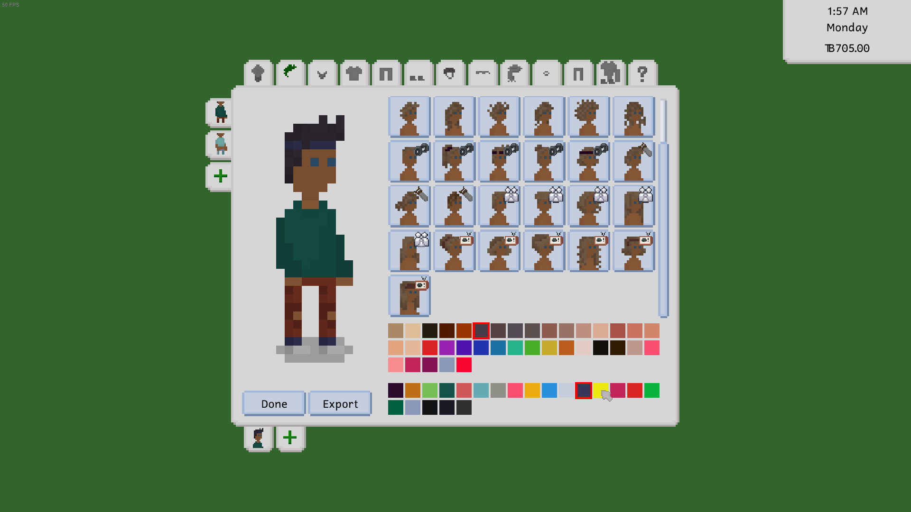

---
title: "0.39.0: An Upgrade to Your Tiny Life"
tags: [Devlogs]
image: "Tiny_Life_H6aK32Qi58.png"
itch: "https://ellpeck.itch.io/tiny-life/devlog/675666/0390-an-upgrade-to-your-tiny-life"
steam: "https://store.steampowered.com/news/app/1651490/view/4017842368454821242"
---

Hi Tiny Life community!

It's been a minute since the last update that featured a devlog, but why that is, and why development speed will be a bit slower for a while, will be explained as part of this devlog. So don't worry, we're not ghosting on yall!!

First, though: The fun stuff! This update mainly features various improvements and a lot of bug fixes, but it also has a very exciting new feature that was never really part of the public roadmap, but was always something we'd been wanting to add: Upgrades for your appliances!

# Let's Tinker and Upgrade
If you know about upgrades from The Sims, you know that they're usually applied through some skill and then allow you to either do special actions you weren't previously able to do, or they make actions more efficient somehow. Upgrades in Tiny Life do pretty much the same, but the way you discover and apply them is a bit different. Let's run you through the system!

To get started with upgrades, you first have to acquire the new Tinkering skill, which can be done by tinkering with objects. The Tinker With action previously leveled up your Repair skill, but not anymore: It now gives the new Tinkering skill instead.

Tinkering with objects still has a chance to break them, but now, it also has a chance to unlock a new upgrade you can apply to the type of appliance you're tinkering with! Unlocking the upgrade causes your Tiny to be able to install it on the appliance, as well as all other appliances that the upgrade works on.

Keep in mind that discovering the upgrade is not enough: You also have to have a Tinkering skill level high enough to be able to install the upgrade on your appliances. In addition to these two requirements, upgrades also cost a bit of money per application - usually between TB100 and TB400.

As part of this release, there are already plenty of upgrades to be discovered and installed. Some of these upgrades make actions faster and more efficient, and some add entirely new actions for you to play with. Some of them also include some fun visuals that make your objects more enjoyable to look at.

For example, check out the RGB Lighting upgrade, as well as the Advanced Configurable Shower Head upgrade:

Of course, throughout Early Access and beyond, more upgrades will slowly be added, both for existing appliances and for newly introduced ones!

# Character Creator Coolness
The character creator used to have a bit of a weird layout - okay, it *still* has a bit of a weird layout, but at least now, the layout fits in with the game's UI style more!

Previously, the character creator featured panel-inside-panel action, which looked a bit silly and unnecessarily took up space between your Tiny and their information and clothes. Now, the entire panel is a little wider, and because there's not a panel-inside-panel thing going on anymore, there's also a lot more space for content.

We're still not 100% happy with the way the character creator looks - especially the fact that you have to remove all Tinies from the household you're creating to close it without saving - but it's slowly getting to a nicer place.

# About Development Speed
You may have noticed that, over the last few months, development on Tiny Life has slowed down a bit compared to the previous year or so. For transparency, and so you don't feel like we're not giving you all the content you deserve, we want to talk about that!

If you don't know, Tiny Life is developed by a single developer: me, Ell, who is also writing this devlog post right now! While some content is created by community members, and the music is created by the lovely Leiss, pretty much everything else is done by me! As you can imagine, this is quite a big undertaking for a single person, and so getting stuff done takes quite a bit of time.

In December, a big chunk of my time has been taken up with celebrations and family, which is why development was - as with many other projects - slow over the holidays.

I am also a student (studying computer science!), and - this is really the main part - I've recently started a part-time job as a research assistant at my university, which takes up about ten hours a week, with additional time spent traveling and trying to finally figure out how git rebase works. This job has been incredibly fun so far, and it's also going to be a great way to get myself a topic and an advisor for my bachelor's thesis, so it's very important to me.

Nevertheless, I am still committed to Tiny Life and its community, and I plan on maintaining the "one major update with a devlog per month" schedule that I've been trying to stick to for the last two years. However, please be prepared for these updates to potentially be a little less major than they've previously been.

I hope you, as the community, understand, and are still excited for future updates and the general future of the game and its development!!

# Tiny Lifestreams
Lastly, I want to mention a fun little thing that I've been planning on doing: livestreaming on Twitch more again! While I used to do this quite frequently (I actually became a Twitch affiliate in 2017-ish), my streams have slowed to a trickle, and I've been interested in picking it back up more frequently again.

Since Tiny Life development, and engaging with the Tiny Life community, takes up a big chunk of my free (!?) time, I plan on encorporating those things into my livestreams as well. Some of the ideas I've had are working on pixel art and code for new Tiny Life features, potentially fixing bugs and refactoring code, but also doing fun community engagement stuff like modding tutorial and custom content exploration livestreams!

If you're interested in any of that sort of stuff, you should follow me [on Twitch](https://twitch.tv/ellpeck), and then eagerly await my "getting back into livestreaming" era.

# The Full Changelog
Yall are probably used to this by now, but: as always, here's the full changelog for your perusal. You can also always check it in the bottom-right corner of the game's main menu, if you want a reminder of recent changes and fixes!

Other than that, that'll all for this devlog. Thanks so much for reading, and I hope you enjoy this update!!

❤️ Ell

Additions
- Added the tinkering skill and the ability to discover upgrades
- Added the ability to upgrade various furniture items
- Added a variation of the wooden stairs that doesn't have wallpaper

Improvements
- Improved the visual style of the character creator
- Made the family-focused personality's emotions also take close friends into account
- Only allow admitting to romance with someone else for seven days after it happened
- Renamed "Add a Little Something" to "Enhance Flavor"
- Made energy loss and the chance of splinters lower when woodworking
- Made people not stand in the same spot when multiple people visit a lot at the same time
- Improved the Tiny Bucks logo to be more easily decipherable as TB

Fixes
- Fixed the furniture tool considering possible parent objects on different floors
- Fixed moving to a different map not moving people there correctly
- Fixed a crash when moving ceiling-hung objects out of bounds using the furniture tool
- Fixed the same map being able to be in a save twice
- Fixed help actions not working correctly when the person is being held
- Fixed notifications not being able to be dismissed when clicking their icon
- Fixed object selection not working correctly on higher floors
- Fixed objects at map borders causing a crash when checking for free interaction spots
- Fixed an exception when the sink or baby is missing while cleaning up a baby
- Fixed objects still being highlighted while placing stairs
- Fixed collision issues with stairs

API
- Game content initialized through static constructors is now explicitly loaded in order. If a mod disrupts the order by accessing content earlier than expected, a warning is emitted.
- Made TestedVersionRange property mandatory for mods
- Refactored particle and light property names to be more consistent
