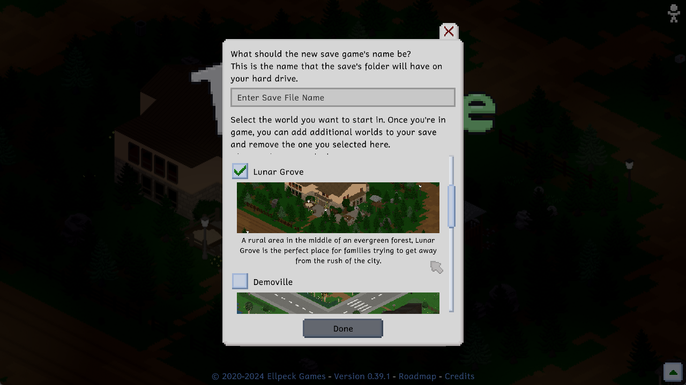
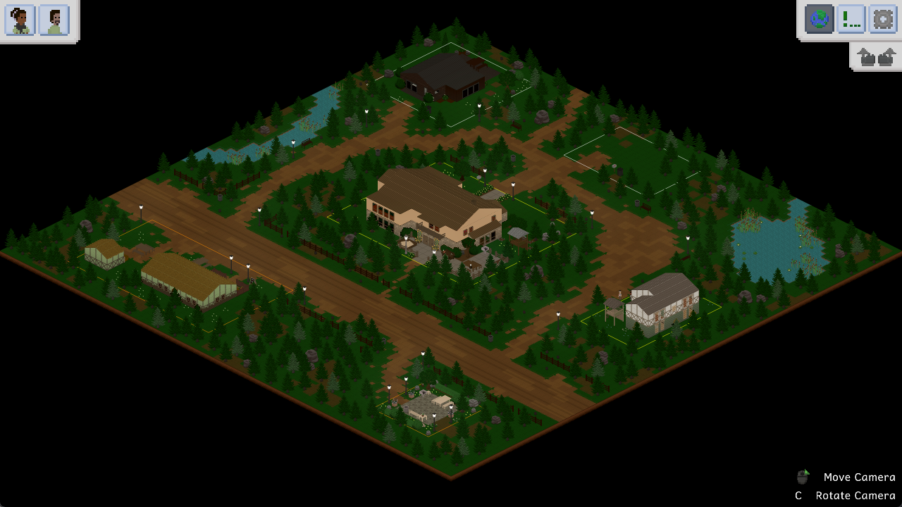
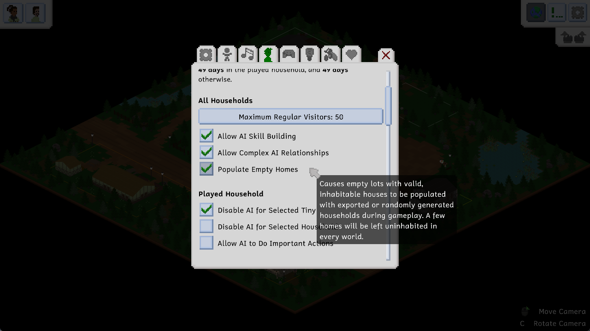
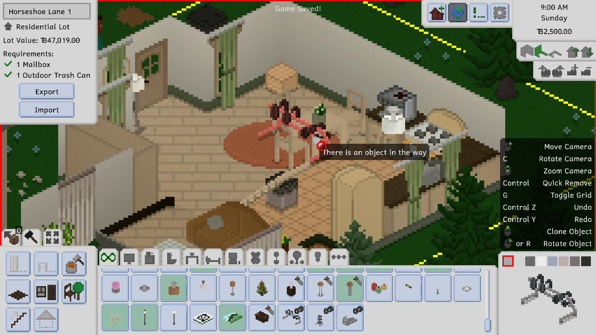
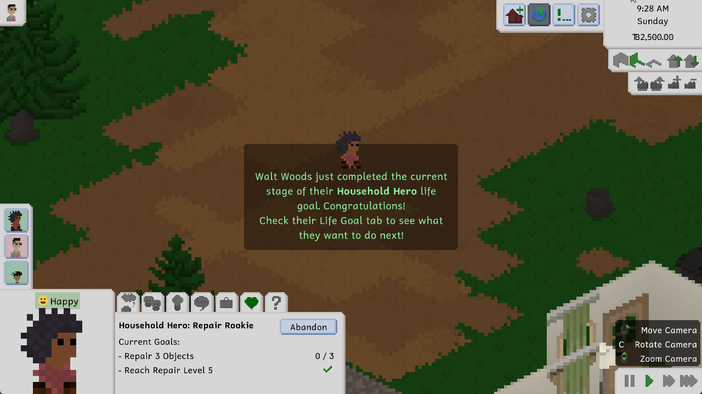
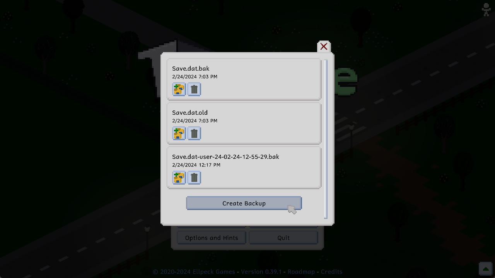

---
title: "0.40.0: Lunar Grove and Populated Homes"
itch: "https://ellpeck.itch.io/tiny-life/devlog/695073/0400-lunar-grove-and-populated-homes"
steam: "https://store.steampowered.com/news/app/1651490/view/4114672767168819010"
---

Hi cool Tiny Life enjoyers! There's an awesome new update out now, and it features a ton of improvements and fixes (seriously, check the changelog once you're done reading this devlog), but it also has some exciting new features and a whole new map to explore.

Let's get into it!

# Welcome to Lunar Grove
Picture this: You've lived in Maple Plains City your whole life, and all that you're looking for at this point is a blissful escape out of the suburbs. You consider moving to Demoville but, well, that's the suburbs too! Of course, you could explore the Steam workshop to find a new place to live, but you're looking for a very special place. One that you can relax in, one that is secluded but easy to reach, one that stuns you with its beauty at night.

So you learn about Lunar Grove. A rural area in the middle of an evergreen forest, this small town is the perfect place for families trying to get away from the rush of the city. Once you arrive there, you look up at the night sky, the moon glowing and glistening with reflections from the sun. You're finally home, you think to yourself.

Lunar Grove is a beautiful new world that is now a permanent part of Tiny Life, and that can be added to your save file by heading to the gameplay options menu, just as any other world can be. It's a beautiful small forest town with a bar, a park, and four residential lots, two of which are inhabited, and one of which has a starter home that is ready for you to move into.

Honestly, it looks especially beautiful at night. Just look at this.

All the buildings and lot furnishings for this new world were created by the lovely [Plumbella](https://www.youtube.com/@Plumbella), who kindly agreed to build create buildings and populate the small park for Lunar Grove. They turned out incredible, and we are so happy and proud to have collaborated with her on this project. Thanks so much again, Jesse, for all your hard work on this.

# Populate Those Empty Homes
In preparation for some other [upcoming features](https://tinylifegame.com/roadmap) that would have the ability to pretty quickly rid all of a world's homes of inhabitants, we've been working on a lovely new feature to be ready: The Populate Empty Homes option.

This option, which is enabled by default, but can be disabled in the gameplay options, will cause most of the empty homes in your save file to be populated automatically after a few days of in-game time, either with an exported household or with a randomly generated one.

As to avoid any problems involving a lack of beds, a lack of food, or a lack of toilets, homes will only be populated if they have a certain number of basic amenities, and only ever with families that the house can fully provide for. For example, a house with a single double bed will only be given to a single Tiny, or a pair of Tinies that are close enough to be able to sleep in a double bed together.

Randomly generated households - which are an entirely new system that we added as part of this update - can have one of several default constellations (with mods being able to add additional constellations if so desired), causing them to have meaningful and logical genealogies and relationships. As an example, there is a constellation (internally called the coparenting constellation) that is able to generate with one or two adults (who can be friends or romantically involved), zero to three children, and one to two babies, all of which can be the children or niblings of one or more of the adults.

# Total Tooltip
There have been quite a few tooltip- and UI-related improvements in this update in general, but there are two major ones that we'd like to mention.

First of all, and this has been an incredibly frequently requested one, there will now be a tooltip that explains the reason a furniture item or other object cannot be placed in the highlighted location in build mode.

We hope that, with this tooltip, the reasons on why a potential home location for an object is blocked should be clearer to everyone now!

Secondly, while watching gameplay content from people playing Tiny Life for the first time, we noticed that a common occurrence was people missing important notifications because they were being overshadowed by other, less important notifications. To remedy this issue, we've introduced a whole new type of notification: a sort of center-of-the-screen splash notification that grabs your attention straight away.

In-game, it'll be used for important events like life goal updates, achievement completion, pregnancy announcements, and a few more.

# Backup Management
Pretty much ever since the first public alpha release of Tiny Life came out, the game has had an automatic backup creation feature. The game would create a backup of a save before loading it, and it would create a backup of the last save before saving over it with new save data. A few updates ago, the game has also started to, additionally, create a backup every time you load a save after a game version change, or after your list of installed mods changed.

However, up until this update, there was no way to look at, edit or remove these backups from within the game, and so players had to painstakingly head into the game files and rename backup files until they got the one they wanted to load. There was also no ability for players to create backups from within the game, either.

But now, introducing the backup management screen!

You can head to the screen using the new two-folder-and-a-plus button in the Load Game menu, and it lists all of the backups that your save currently has. At the bottom, you can create a new backup, and you can use the Restore as New Save button to, well, restore any backup as a new save file. Doing so will not remove the backup, nor will it alter or overwrite your current save.

# The Full Changelog
And that's about it for the major new features for this update! As I said at the top, there are quite a lot of additional improvements and fixes, and also some new cakes as well. Tasty!

If you're interested in that sort of thing, feel free to read the full changelog below. Please also keep in mind what I said in [the last devlog](https://tinylifegame.com/devlogs/0.39.0/#about-development-speed) regarding development speed going forward, since I am still enjoying and thriving at my new research assistant job.

Thanks for sticking with me, and thanks for being so kind and lovely about updates and everything else Tiny Life.

❤️ Ell

Additions
- Added Lunar Grove, a lovely secluded forest town with buildings contributed by the lovely [Plumbella](https://www.youtube.com/@Plumbella)
- Added the ability for empty homes to be populated automatically with exported or randomly generated households during gameplay
- Added a backup management screen that allows creating, removing and restoring save backups from within the game
- Added on-screen camera zoom buttons
- Added a few new cakes

Improvements
- Display some important notifications as splashes in the center of the screen
- Display the reason an object can't be placed in build mode as a tooltip
- Display achievement progress in the achievements menu
- Improved the look of tooltips
- Made some foods incompatible for people who are pregnant
- Display food restrictions when they apply, rather than when they don't
- Moved chair spots slightly closer to their parent objects
- Disallow children from visiting a strange household with no children in it
- Made people discard their held item automatically before going out of town
- Display relationship levels in the people selection menu
- Avoid households with more household members also receiving more visitors
- Display which items were changed in the steam content notification
- Made people go on parental leave automatically if necessary when giving birth
- Made people stay at home and on lots longer
- Don't require a table for children to do homework
- Display rooms on lower floors a bit darker to make depth clearer for open floor sections
- Highlight the selected person more thoroughly compared to other people when using the highlight tinies option
- Display an auto-save indicator at the top of the screen

Fixes
- Fixed doors opening for people on different floors
- Fixed people being allowed to use doors when they weren't invited in
- Fixed the Maple Plains City Campers' Lane 2 living room area being inaccessible in new saves
- Fixed a rare crash when loading a save with complex fencing setups
- Fixed existing work relationships not improving if the ai relationships option is off
- Fixed a rogue black pixel in the rhombus rug
- Fixed the ability to make the UI scale so large that reverting was impossible
- Fixed depth rendering issues for people with a lot of clothes layers equipped
- Fixed UI blinking briefly when a person is selected using right-click
- Fixed mail carriers and trash collectors not going home after their route is done
- Fixed children being able to apply furniture upgrades
- Fixed outfit previews in the character creator ignoring hidden layers
- Fixed the cheat history storing empty strings when invoking an empty cheat
- Fixed lots being marked as visited when walking over them, causing people to stick around lots they weren't meant to
- Fixed removing maps from saves causing people to spawn at map borders and getting stuck

API
- Added SimpleBehavior action, an action type that allows easily creating behavior-based actions without a custom class
- Improved the way special action types, like talk actions and project actions, are constructed
- Game content initialized through static constructors is now explicitly loaded in order. If a mod disrupts the order by accessing content earlier than expected, a warning is emitted.
- Generified the color system to allow all objects with colors to have a color map and default colors
