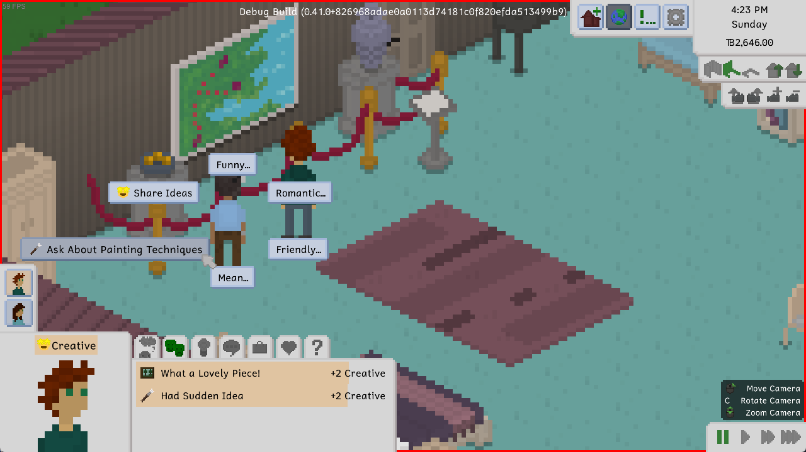
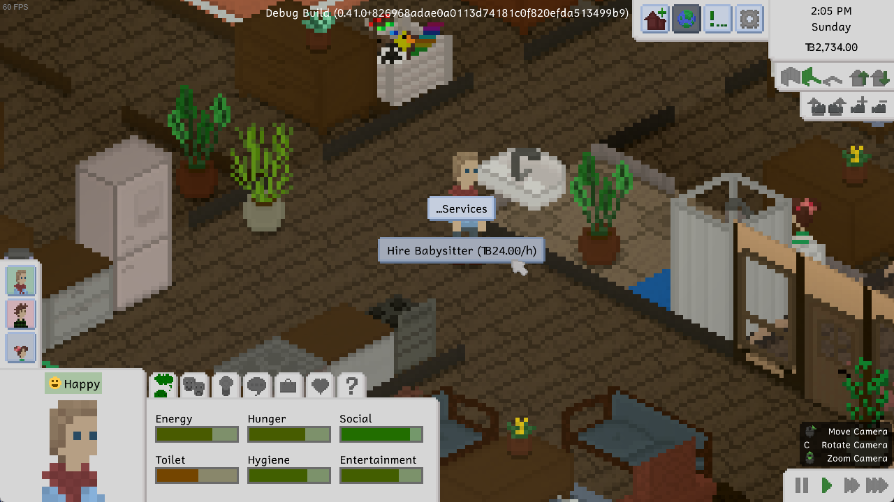
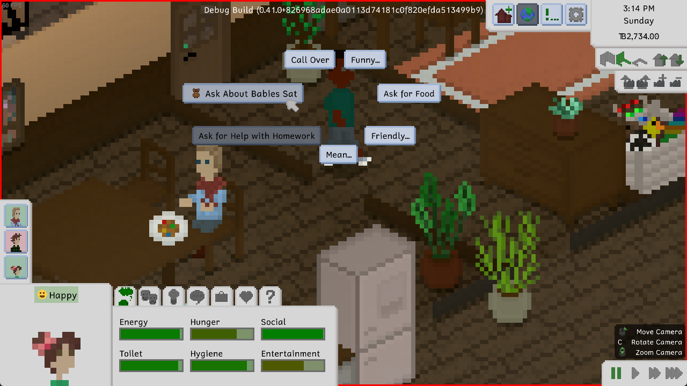
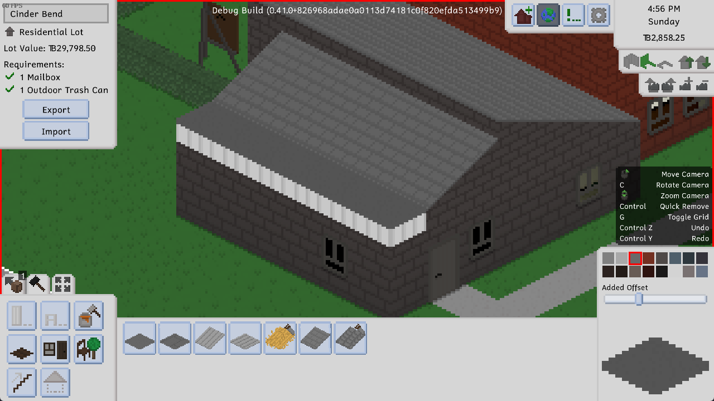
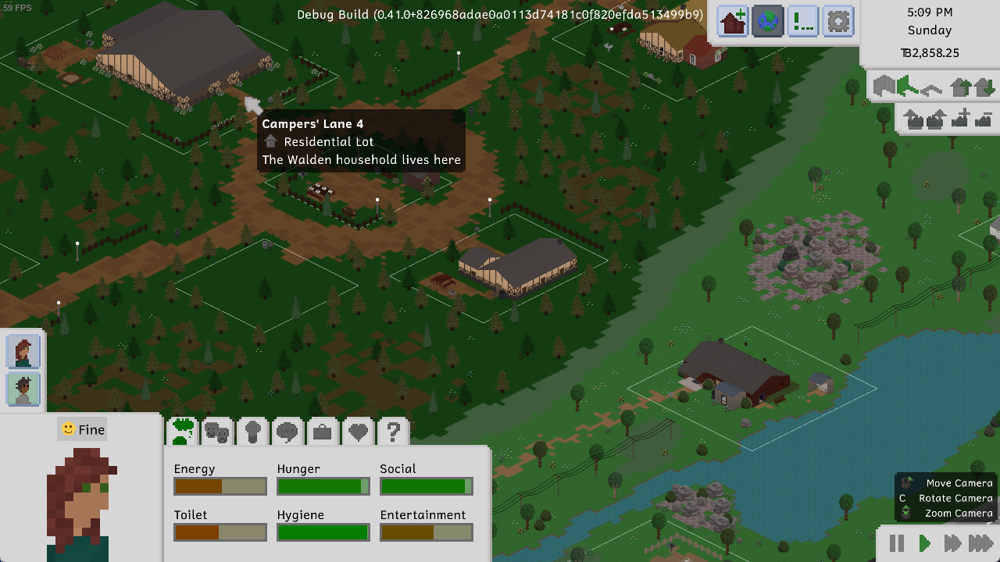

---
title: "0.41.0: Huge New Set, Babysitters, Museums, More Stings, and More"
tags: [Devlogs]
itch: "https://ellpeck.itch.io/tiny-life/devlog/714782/0410-huge-new-set-babysitters-museums-more-stings-and-more"
steam: "https://store.steampowered.com/news/app/1651490/view/6928299975962713016"
---

Hi everyone! It's that time of the month again where we go through all the changes, additions, and improvements in Tiny Life, and then let you try them out yourselves. Exciting!

This time around, there are a lot of new features that haven't been worked on exclusively by me, so they deserve a massive shoutout to the people I collaborated with.

# Contemporary Complements
There's a new Set to join the collection! This time, I collaborated with the lovely [Gindew](https://linktr.ee/redgindew), who is an amazing artist, and we ended up creating a lot more pieces than we'd originally planned. What I'm trying to say is: this Set is *big*.

The Contemporary Complements Set contains a large amount of contemporary furniture, including beautiful beds, simple bars, boxy shelves, gorgeous pieces of art, and more. It also has the single cutest door that we've ever added into the game. It's, like, a rope curtain! Look at that!!

As part of the Set, we've also added a bunch of new museum-focused decorations, including the lovely rope fence you can see in the screenshot above. After Gindew pitched a bunch of these cute (and very customizable, by the way) art pieces to me, we decided that it would only make sense to turn them into a *whole thing*, which is why the next feature we'll talk about has found a place in the game as part of this update.

Oh, also: the Set contains a lot of bowls. Just decorative bowls. With various items in them. Yay?

I asked Gindew to relay his experience, and some information about his design and pixelart process, to you lovely readers. While he didn't comment on what's up with his obsession with bowls, he did have this to say:

> The moment Ell approached me to make a set, I whipped out my wish-list! We quickly agreed that a timeless contemporary style would suit us best. I was personally inspired by IKEA for its flexible furniture to fit any space. As both a builder and a pastel fan, I ended up creating some neutral, minimal, but also colorful furnishings!
>
> My process is actually really simple. I used existing objects as a base and expanded on them. This both kept the style consistent and helped keep the work quick! I highly recommend if you plan on modding, to take a look at the packed texture cheat in the game, you’ll see how all the objects are layered and how the style works.
>
> In addition to making a full set, I also helped with the new Museum lot type. I helped create a bunch of pedestals and even an ottoman, which happens to fit nicely in the set too. I hope you enjoy these objects as much as me and Ell have in making them!

I really recommend following Gindew on [his socials](https://linktr.ee/redgindew), as well, as he posts some lovely art from time to time, and also works on an awesome furniture mod for the game called [Moar Furniture!](https://steamcommunity.com/sharedfiles/filedetails/?id=3112564330).

# Museums
In a lot of life sim games, museums end up being, well... kind of boring. Let's be honest: this first iteration of Tiny Life's museums is also still a little bland, ***but*** not only does it have some fun features that'll have your artist Tinies coming back to it again and again, we're also planning on introducing some fun additional features to them in the future.

For now, a museum is a lot that you can view art at, make your own art at, and get advice from the museum curator that roams the lot.

Of course, we already know that feeling creative gives you a massive boost to your skill building and painting speed, but that's not all! Painting (or doing any creative activity, for that matter, including woodworking) on the museum lot will actually give your skill building another 50% speed boost as well! Isn't that lovely?

# Babysitters
You've been asking for it, and for good reason: Up until now, baby Tinies could be haphazardly left at home while all adult Tinies were at work or off visiting other lots.

Well, okay, that can *still* happen. But now, it's not the only option anymore!

Now, when you head to your phone, you'll find the new "Services..." option, and in it, the option to hire a babysitter!

A babysitter hire is a one-off action, and costs 24 tiny bucks an hour. After hiring the babysitter, they will arrive at your lot, hang out with your babies and children, and leave again when they deem appropriate. They'll stay for a minimum of five hours, and only leave when there is at least one adult household member on the lot. Of course, if you want them to leave earlier, you can always ask them to leave, as well.

A babysitter will, while on your lot, roam around and do the usual actions required of any Tiny. However, they'll have a much higher priority for interacting with your children and baby Tinies, and they'll be much likelier to take care of them over taking care of other things.

# Imp-roof-ments
Ever tried to build a roof in Tiny Life, and it just wasn't really going your way? Gables got you down, so to speak?

Well, now, there's some more flexibility with roof building! Specifically, you can now make your gabled roofs (and flat roofs, too!) start at a higher point than the default, all the way up to just before the next level up.

This allows you to build much more complex roof setups, and also allows you, for example, to have a roof that starts with a gable, becomes flat, and then continues going up again.

You can access the option by heading to the roof tool and using the slider below the color selection. If you're using a gamepad, you can access the slider the same way you access the color selection: by pressing the Y button, by default!

# Lot Tooltips
For the longest time, figuring out what lots did what and who lived where was... tedious, to say the least. It didn't help that, if you were colorblind or forgetful, the little outline color coding of lot types didn't really help all that much. Or at all. So we decided to get rid of it and come up with something better!

And what's better than tooltips, am I right?

Hovering over a lot, either in the household selection menu, or with the camera zoomed all the way out in play mode, will now show a tooltip with some information about the lot. Currently, this includes the lot's name, the lot's type, as well as, for residential lots, what household lives there. This should make it a lot easier to find the lots that you're looking for!

# New Stings and a New Voice
A now quite long while ago, we did a poll asking players what they think about the current emotion sting sound effects in the game, and whether they think there should be additional stings for important events. The consensus was: yes, there should be! But they should have their own volume setting. And it was so!

There are now sting sound effects for important events, like getting a promotion, reaching level 10 of a skill, reaching maximum friendship or romance with another Tiny, and more. These sound effects, much like the emotion stings, were contributed by the lovely [Jamal Green](https://www.jamalgreenmusic.com/).

Of course, if you don't like hearing stings during important events, or you prefer these over the emotion stings, you can head to the sound options menu and change them independently of one another.

Last, but certainly not least, there is a new, third adult voice in the game now! Before, we've had Sweet and Warm, but now Soft joined the party, too! Hm, that sounds kind of gross.

The soft voice was contributed by the lovely [Jason Hall](https://linktr.ee/jason11818), an independent voice actor who expressed interest in working with me on additional voices for Tiny Life. He did a great job, and so now you too can sound like Jason's impression of a Tiny. Or, well, your Tinies can.

# The Full Changelog
Okay, that's pretty much it for this update! It turned out to be quite a lot, but Gindew and I have been working on the Contemporary Complements set for a long while now, so we're very happy to get it out to you finally.

Last but not least, as always, here's a copy of the full changelog for your perusal. As you can see, there have been quite a few small improvements and a lot of bug fixes again this time around.

Additions
- Added the Contemporary Complements set with art by [Gindew](https://linktr.ee/redgindew), which includes a large amount of new furniture items, art pieces, and more
- Added the ability to hire a one-off babysitter using the phone
- Added a museum lot type, along with a museum curator lot staff, and the ability to view art pieces
- Added a new voice type, the soft voice, by [Jason Hall](https://linktr.ee/jason11818)
- Added event sting sound effects for various important events by [Jamal Green](https://www.jamalgreenmusic.com/)
- Added the ability to adopt someone as a parent
- Added the ability to set a height offset for roofs, allowing more advanced roof layouts
- Added cute little ambient bee particles around flowers and flower bushes

Improvements
- Improved center position when rotating the camera on higher floors
- Also allow storing furniture in the household storage while on the cursor
- Made it take much longer for family-focused people to miss their family
- Made people get uncomfortable if they eat the same food too often
- Display roadmap and wiki links in the main menu
- Made people discard their held item before sleeping
- Slightly decrease the size of the controls hints by default
- Made the money change overlay more prominent
- Allow making UI scale much smaller on high-res screens
- Made lot staff types have icons
- Move all furniture to its correct parent object spot position on load
- Cull roof filler walls that aren't visible
- Improved skill gain speed of the communication skill
- Display a tooltip when hovering over lots, rather than having to guess the type by the lot's outline color
- Improved the styling of in-world tooltips for the gamepad cursor

Fixes
- Fixed a bed that only has the current person in it saying you're not romantic enough with them
- Fixed TVs close to map borders causing an exception when trying to watch
- Fixed being unable to start interactions with people on different floors
- Fixed a crash when selecting a tile that is out of bounds
- Fixed an exception when opening a people selection menu from a small map
- Fixed content not being selected when switching furniture tabs using a gamepad
- Fixed gamepad tooltips being in the corner of the screen for one frame
- Fixed the played household's held furniture items being deleted when loading the game
- Fixed roof filler walls z-fighting when moving the camera
- Fixed a rogue wallpaper pixel being visible on gabled roofs in some camera rotations
- Fixed babies being unable to eat when the only seat is on a different floor
- Fixed people turning a weird direction sometimes when interacting with big furniture items
- Fixed ordering from staff not failing when the staff can't be reached, causing far-away interactions

API
- Localizers: the verbose log now displays mismatched newline characters between localizations
- Added a proper README to the API
