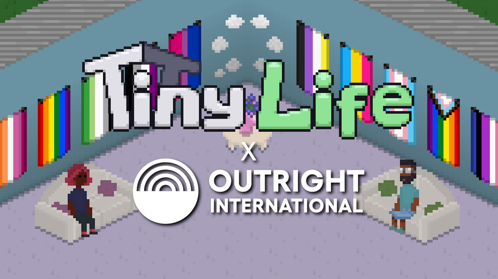
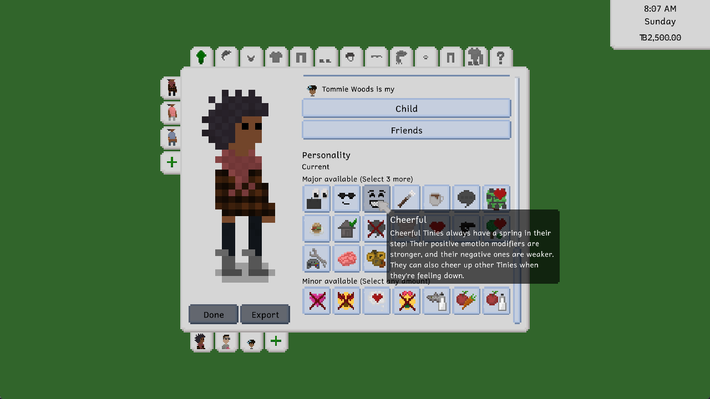
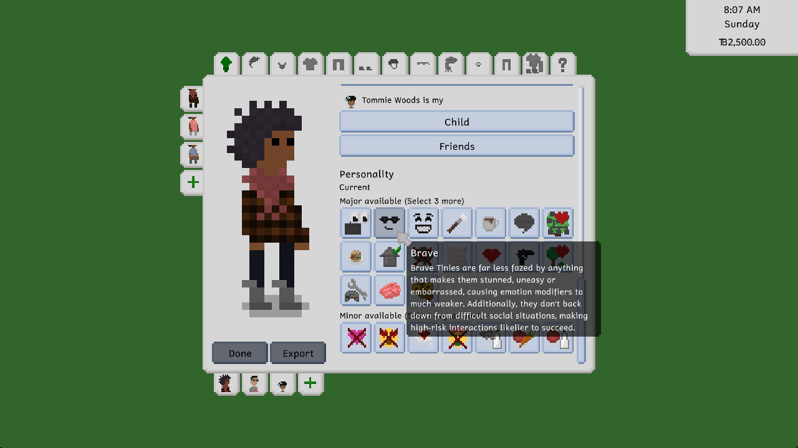
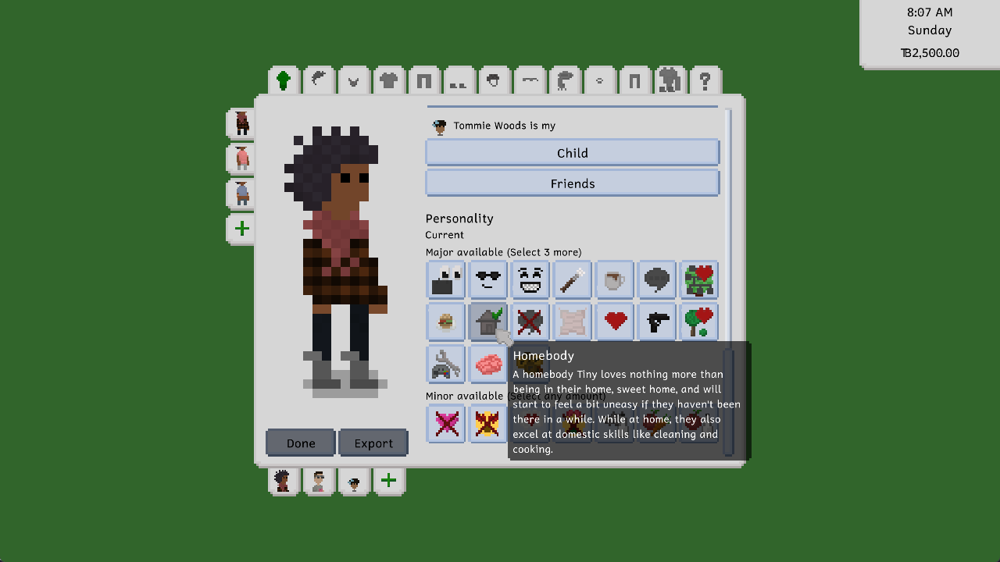
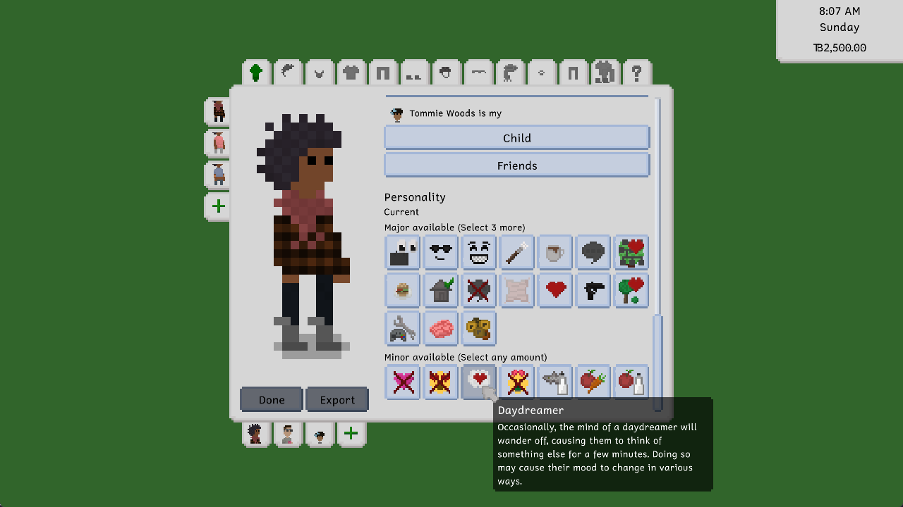
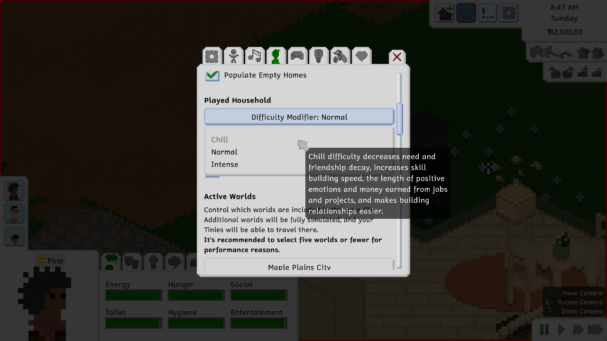

---
title: "0.42.0: Plenty of Personalities and Different Difficulties "
tags: [Devlogs]
image: "Cover.png"
itch: "https://ellpeck.itch.io/tiny-life/devlog/746300/plenty-of-personalities-and-different-difficulties"
steam: "https://store.steampowered.com/news/app/1651490/view/4170976002897553394"
---

Hi everyone! It's been a minute, but we're back with more fun updates to Tiny Life, as well as fun updates *related* to Tiny Life.

If you're not in the loop with the regular updates, you might be wondering why I'm starting to break Tiny Life's "one major update a month" stride. As discussed [a few months ago](https://tinylifegame.com/posts/0.39.0/#about-development-speed), I'm a solo developer who, at the start of the year, got a part-time job alongside my uni studies. On top of that, I've now also been roped into a fun game development project at my uni, for which I'm creating art and helping out with various other things. It's not super-duper public yet, but once it is, you'll be able to hear from it through [my personal website](https://ellpeck.de/#projects), should you be interested. Nevertheless, I'm still fully committed to working on Tiny Life, but updates will just be a little slower than they used to be.

That being said, let's get into this one!

# Outright Full of Pride

To celebrate this year's Pride Month, we've partnered up with the amazing LGBTQIA+ charity [Outright International](https://outrightinternational.org/), to bring you a fundraiser that will not only help queer people all around the world, but also bring cool new Pride-themed content into Tiny Life!

We're starting out small this first year with a goal of \$1000, but if the fundraiser goes well, we may introduce additional steps and increase the overall fundraising goal. All money donated goes directly to Outright - they're actually the ones hosting the fundraiser as part of their [Family Pride](https://outrightinternational.org/familypride) campaign.

As more money is donated, more items are confirmed to be added into an awesome Pride Set that'll launch after the fundraiser has completed. This content includes cool stuff like new Pride-themed decorations, body-positive clothing, identity-affirming interactions, and even a new lot type: the rec center!

You can find all the info [on the fundraiser's page](https://outrightinternational.donorsupport.co/page/TinyLifeOutrightPride2024), with regular updates also being posted [on Twitter](https://x.com/TinyLifeGame) as well as [the Discord](https://link.tinylifegame.com/discord).

# New Personalities
This update features four new personality types, which we're going to showcase briefly in this devlog post! In addition to that, the amount of major personality types a Tiny can have has also been increased. For adults, the previous maximum of two has been increased to three, and for children, the previous maximum of one has been increased to two! If you want to edit the additional personality types that your Tinies get randomly assigned when loading your saves after installing this update, you can use the `EditPerson` [cheat](https://docs.tinylifegame.com/articles/cheats.html).

> Cheerful Tinies always have a spring in their step! Their positive emotion modifiers are stronger, and their negative ones are weaker. They can also cheer up other Tinies when they're feeling down.

> Brave Tinies are far less fazed by anything that makes them stunned, uneasy or embarrassed, causing emotion modifiers to be much weaker. Additionally, they don't back down from difficult social situations, making high-risk interactions likelier to succeed.

The Cheerful and Brave personalities are the first two personalities to introduce a new type of change that personalities can bring: they increase or decrease the amount of an emotion that certain types of emotion modifiers give. For example, whereas normal Tinies get a +2 Happy emotion modifier from a nicely decorated room, a cheerful Tiny will get a +3 Happy emotion modifier instead.

> A homebody Tiny loves nothing more than being in their home, sweet home, and will start to feel a bit uneasy if they haven't been there in a while. While at home, they also excel at domestic skills like cleaning and cooking.

> Occasionally, the mind of a daydreamer will wander off, causing them to think of something else for a few minutes. Doing so may cause their mood to change in various ways.

This is the only minor personality out of these four. It's a fun personality that causes Tinies to randomly enqueue a Daydream action which, if not canceled, will cause them to receive an emotion modifier of a random type. This includes, with different likelihoods, Angry, Confident, Creative, Embarrassed, Energetic, Fine, Happy and Sad.

Adding more personality types and expanding the feature set that existing personalities have is an ongoing effort throughout development, so look out for additional improvements to these, as well as even more personality types, in upcoming updates!

# Different Difficulties

The ability to change the difficulty of a game is an accessibility feature that we think is very important, so we've been pondering for a while how to best include something like it in Tiny Life.

A type of feedback we get a lot on the feedback form is that needs decay too fast or too slow, that earning money in the game is too easy or too difficult, and so on. This shows that different players and play styles benefit from the game being balanced around different factors.

With this first revision of the difficulty feature, we've tried to take both of these factors into account. We also tried to make sure that the naming of these difficulties doesn't feel too punishing or patronizing, which is why we opted to stay away from "Easy" and "Hard", and decided to go for "Chill", "Normal" and "Intense" instead.

At the moment, these difficulties modify a few major things in the game:
- The speed at which breakable furniture breaks
- The hourly pay of jobs and projects like books
- The factor that needs reduce by
- The amount of friendship and romance that is gained and lost through social actions
- The amount of time that positive emotion modifiers last
- Whether households get emergency food when their funds are low, which now only happens on the Chill difficulty

In the future, difficulty settings will likely have a lot more effects, though. Please share your feedback as to what you think about this feature, as well as what things you think the difficulty settings should include or change. Please also share whether you think the Chill and Intense difficulties seem fair and balanced at the moment, or whether you think something (and what) needs to change about them.

# The Full Changelog
That's about it for this update in terms of gameplay features!

Unfortunately, this update also includes a lot of API changes, so sorry to any modders, who will likely have to update their mods. The main change in this update is that most of the code in the Person class has to be moved to the new PersonLike superclass. This is in preparation for additional types of person-like objects (like pets) being added in the future, but also to allow for mods to do that sort of stuff already! We also added a few events and made some more helper and extension methods accessible to mods, should you need them.

As always, here's the full changelog for your enjoyment!

🏳️‍🌈🏳️‍⚧️ ❤️ Ell

Additions
- Added the Homebody, Daydreamer, Cheerful and Brave personalities
- Added the ability to set the game's difficulty level between Chill, Normal and Intense modes in the gameplay options. Difficulty influences skill building, relationship gain, need reduction, and more.

Improvements
- Increased the maximum amount of personalities for adults from 2 to 3, and for children from 1 to 2. To edit the personalities of your existing Tinies, you can use the `EditPerson` [cheat](https://docs.tinylifegame.com/articles/cheats.html).
- Improved the way that lot staff chooses objects to prepare orders with
- Improved random generation style choices to make them a bit more consistent
- Make clear what exactly is missing when trying to exit the character creator
- Improved performance when adding and removing objects, walls, stairs, roofs and lights
- Made more specific emotion types with the same amount be prioritized over Happy, Uncomfortable and Fine
- Various actions now take a randomized amount of time, rather than a fixed amount
- Order personality types by name
- Made Tinies that live on lots with missing amenities automatically leave town to fill their needs elsewhere if they're unplayed
- Don't automatically generate a babysitter for a map when none are needed yet
- Change the baby's last name automatically when adopting or having one
- Scroll the color selection menu if necessary to avoid UI elements overlapping each other
- Made emergency food delivery only occur in the Chill difficulty
- Display a Tiny's pronouns and reproductive abilities in their About tab
- Made children not immediately eat food they made on the child stove
- Only focus the camera on dying people if at least one household member knows them
- Made the chance of fooling around failing lower the higher the romance level is
- Made the Illusion of Bridge debug object be only the ground part, rather than the ground and fence. Fences can now be placed on top to allow more variety in bridge styles.

Fixes
- Fixed an exception when a possible romantic partner is removed during an action
- Fixed the bar in Maple Plains City being inaccessible for ordering
- Fixed an exception when no valid position to order or view art from is found
- Fixed an issue where the game would sometimes stick around after closing
- Fixed babies being able to get some child-and-up emotions
- Fixed controls hint options box not having a correct default value
- Fixed people being able to put babies down through walls
- Fixed mean people not having higher success chances in social actions if their charisma skill is higher
- Fixed large objects escaping their build mode buttons
- Fixed various personality types not counting for both partners of an interaction
- Fixed chatting on the computer displaying friendship particles on the other person
- Fixed relationship bars in action argument menus being mouseable
- Fixed multiple outfits being generated for adoptable children, even if they don't match their intentions
- Fixed lot previous working incorrectly with auto-tiles like paths and water
- Fixed children being able to hire a babysitter
- Fixed Tinies leaving public lots immediately when asked to visit sometimes
- Fixed bees still going through walls
- Fixed babies not being able to interact with other babies
- Fixed getting unbalanced diet emotions from drinks

API
- Split Person out into Person and PersonLike to allow for mods and future game content to feature other person-like objects like animals, and allow actions, personality types and more to be restricted to specific PersonLike types
- Made some more helper and extension methods public
- Made actions have the ability to last a random amount of time easily
- Allow specifying emotes directly, rather than just categories
- Added events for selection handler selection changes
- More aggressively ensure that mods only use their assigned Harmony instances
- Fixed Harmony not working correctly due to an incompatibility with .NET 8
