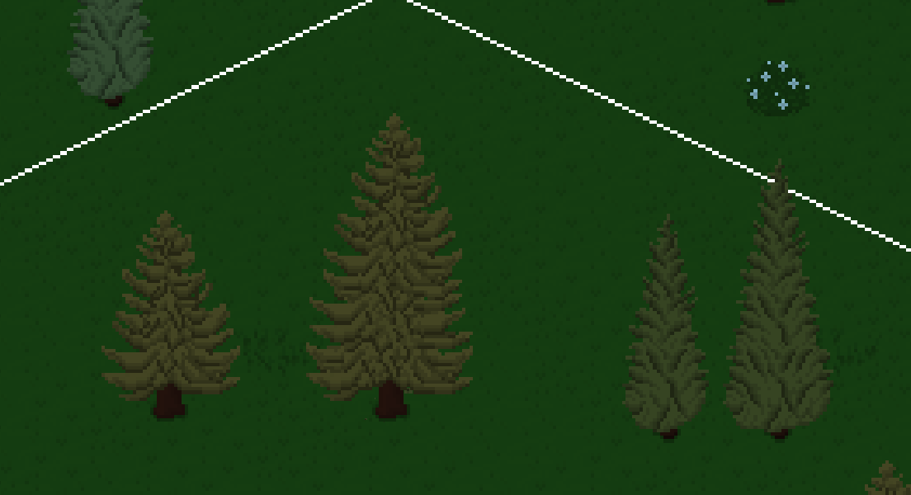
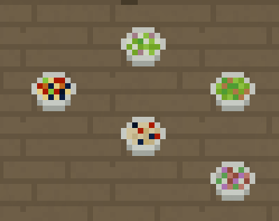
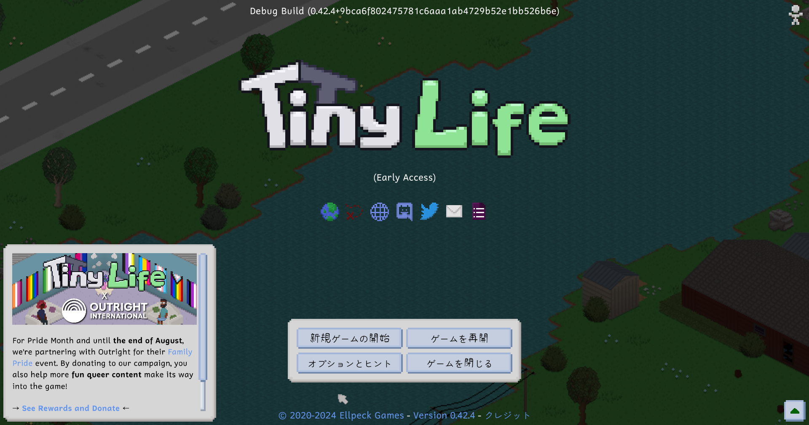
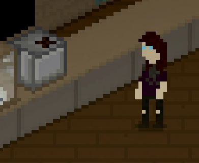

---
title: "0.43.0: New Plant Stuff, New Language and New Gross Stuff"
tags: [Devlogs]
image: "24-07-09_18-33-40.png"
itch: "https://ellpeck.itch.io/tiny-life/devlog/762467/0430-new-plant-stuff-new-language-and-new-gross-stuff"
steam: "https://store.steampowered.com/news/app/1651490/view/4237406000204173625"
---

Hi everyone! It's been a little bit since the last devlog-worthy update, but we're back with a bunch of small features, small improvements, and important bug fixes! Let's get right into it.

# Some New Objects
First up, we added a few new objects into the game, most of which are variations of or spins on existing objects!

First up, there are now larger versions of the evergreen and cypress trees! This will be especially nice for people wanting to make a map (or a lot) with a deep forest, or a mansion with glorious rows of cypresses in front of it.

Ever since the game first came out, there's been a "grass with flowers" tile available to place. This, I felt, was always a little clunky, but at the time it was implemented, the rendering engine wasn't nearly as feature-rich as it is now. Because of that, having objects batched statically was impossible, while having tiles was.

In rendering, putting something in a static batch is great for performance. That's because an object is only drawn once, and then that draw data is preserved and put on the screen several times. Compare that to dynamic batching (or no batching at all), where objects are drawn anew every frame, and you can see where the performance improvement comes from.

All that to say: the flowers that you can see on the "grass with flowers" tile are also available separately as a placeable object now, so you can put them on any natural tile you like.

We also added bowls. There's no new food in them (yet), but they're bowls! Not that interesting, we know, but they're very much meant for when we add foods in the future that don't make sense on a plate *at all*, like cereal or soup.

# Japanese!
Over the last few months, the lovely [mameketchup](https://linktr.ee/mameketchup) has been making steady progress on the Japanese translation of Tiny Life, and we now feel that it has enough content translated to be added into the game! You can find it, like all other localizations, in the options menu's general tab.

Thanks so much again to [mameketchup](https://linktr.ee/mameketchup), without whom the game wouldn't have a Japanese version to speak of at all.

# Ew, Why Would You Add This (Sorry)
Okay, this is maybe a bit of a weird one.

In the little free time that I've had recently, I've been playing a lot of OpenRCT2 again. RollerCoaster Tycoon 2 was one of the first games that really got me into video gaming, and its isometric perspective is also a main inspiration for the visuals of Tiny Life (despite the fact that RollerCoaster Tycoon 1 and 2's art is actually created from 3D models and just happens to *look* a bit like pixelart due to the low pixel density).

I'm bringing this up because, in RollerCoaster Tycoon, people that went on intense rides may start feeling nauseous and, as a result, throw up onto the ground. And while playing the game, I guess I thought: wow, wouldn't that be lovely to have in Tiny Life?

Yea.

Anyway, when your Tinies have had enough brew to start feeling very brewed, they may throw up, which, thankfully, also makes them feel a little bit better.

You then have to clean it up off the ground, or your Tinies will be pretty unhappy about their surroundings, for obvious reasons.

Isn't that just a lovely feature?

# The Full Changelog
That's it for this update! I've been really into working on smaller features as well as improvements for the game recently, so I haven't gotten around to starting on a new *big thing* yet. I've really been wanting to add gardening for a while, but it's not on the [public roadmap](https://tinylifegame.com/roadmap), and it's been a while since a new feature from that was implemented. Because of that, I kind of want to tackle social events first, which'll also pave the way for fun events like birthday parties and weddings. Feel free to let me know what you *really* want to see next, from the roadmap or otherwise!

Lastly, here's the full changelog for you to peruse, as always.

❤️ Ell

Additions
- Added the ability to throw up from being drunk
- Added a wealth tax, whose value is partly determined by the game's difficulty setting
- Added a flower bed object that looks the same as the flower tiles, but can be used on any tile
- Added larger versions of the evergreen and cypress trees
- Added bowls for food that makes more sense in bowls
- Added an ambient water sound, as well as a placement sound for water and water objects
- Added japanese translation by [mameketchup](https://linktr.ee/mameketchup)

Improvements
- Made the game's logo in the main menu animate
- Use the natural placement sound when placing natural tiles like grass
- Increase the flood fill limit for tiles
- Made water borders for sand have the color of the sand
- Made rummaging in the trash be considered inappropriate on other lots
- Display translation completion next to languages in the options menu
- Made objects verify their parent position on load
- Order the life goals menu by name
- Made the lot tooltip stationary above the lot
- Made pregnant people's bellies visually get bigger
- Disallow clicking the ground on water tiles and out of bounds
- Improved the autofill content for the feedback form when accessing it from within the game
- Allow multitasking social actions while playing with toys
- Made the lot outline thicker to look better when zoomed out
- Made the lilypad's bobbing animation look less stupid
- Improve the skill book selection ui
- Made adults carry babies to the food item after they make food for them
- Severely increased the priority of actions that help babies when they need help

Fixes
- Fixed street lamps not drawing correctly with higher floors nearby
- Fixed full release saves with babies in them causing the demo to crash on the load menu
- Fixed actions that have a list of selectable people ignoring their visibility
- Fixed all remaining potential causes of the game sticking around after being closed
- Fixed existing notifications animating again when changing game modes while they're on-screen
- Fixed rotating lots causing objects with a limited amount of rotations to have incorrectly placed children
- Fixed a rare exception when checking for rooms near the map borders
- Fixed the millionaire life goal's expensive lot goal only taking furniture into account
- Fixed primary school students saying they "work" as students
- Fixed bad child food emotion being granted to the food's creator
- Fixed children claiming they forgot their homework every day
- Fixed life goals' homework goal not updating when being helped with homework
- Fixed a bee particle crash when there are no valid positions to fly to
- Fixed chatting being able to start new relationships through the AI even when AI relationships are disabled
- Fixed babies getting stuck when unable to put down items on different floors
- Use optimal compression for saving, which takes a bit longer but saves a lot of space

API
- Allow different person types to support different age groups
- Added an event for when the game's game mode changes
- Added events for when people's animations are created and drawn
- Objects now always support all rotations, but display the texture that is the closest match for their rotation
- Added a cheat to dump portraits of all people
- Added a MinFloor constant for future use, which should be used over hardcoding 0
