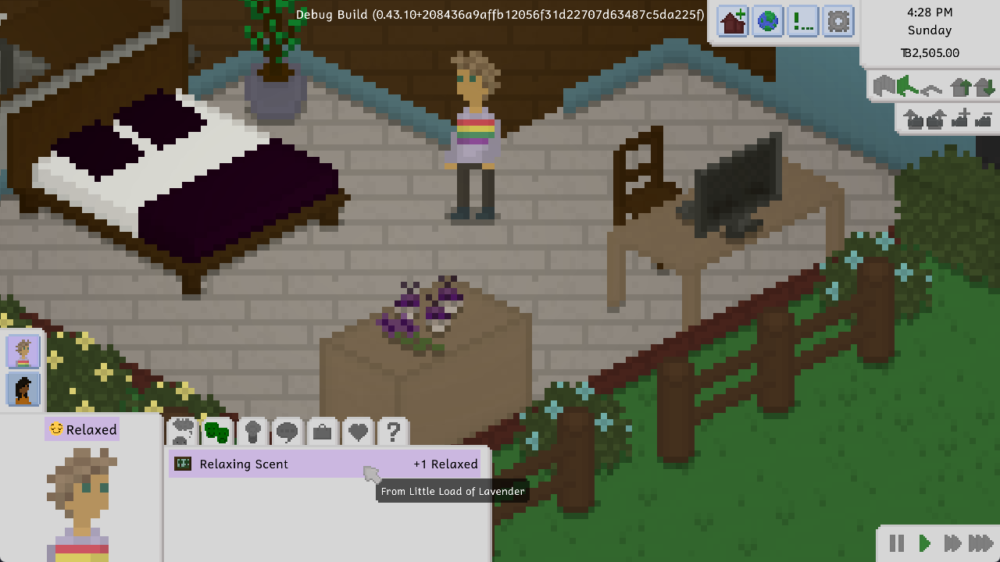
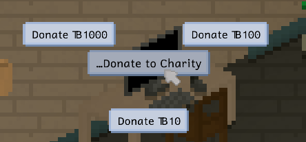
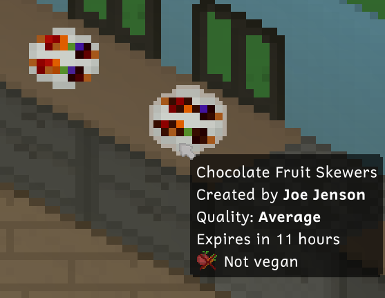
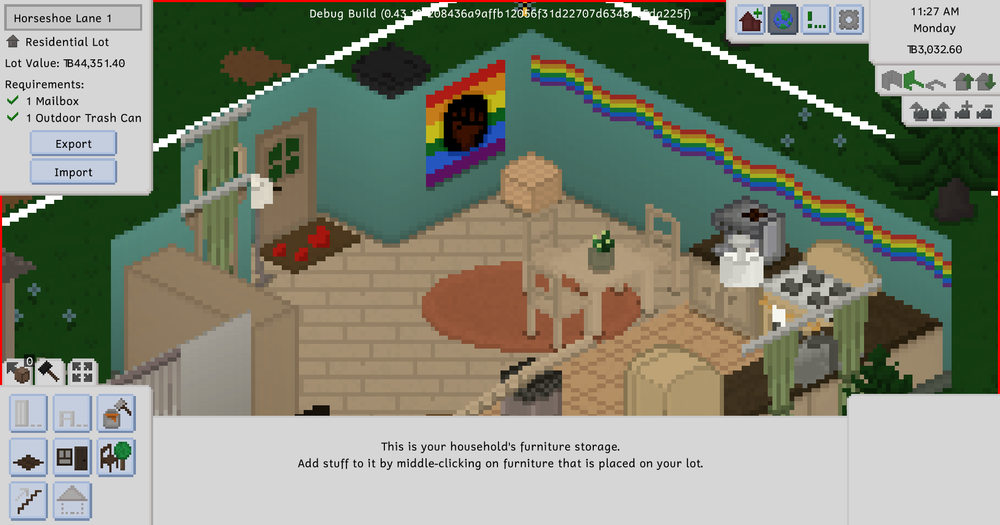
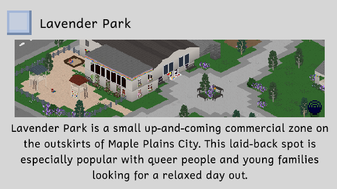
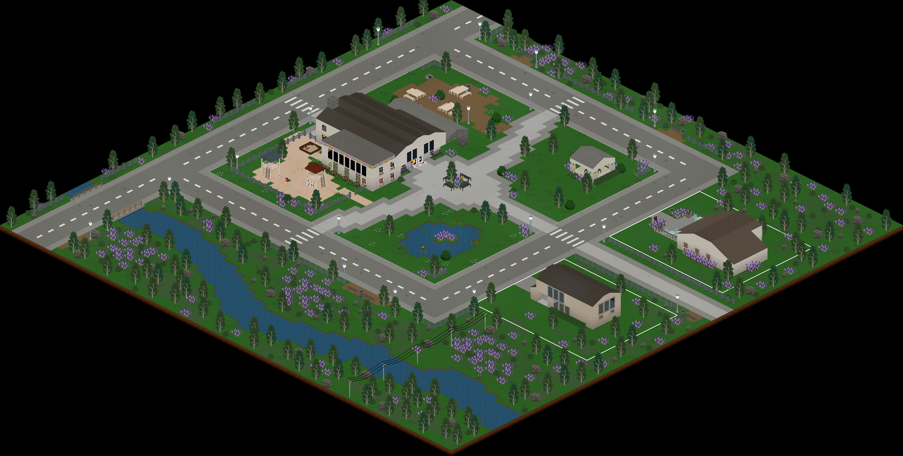
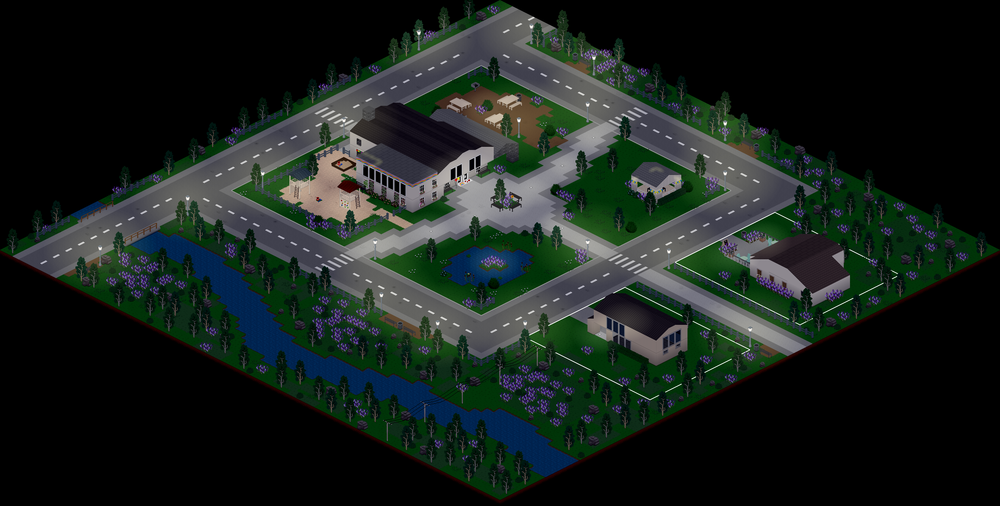
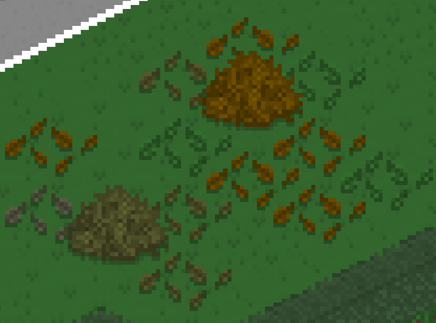
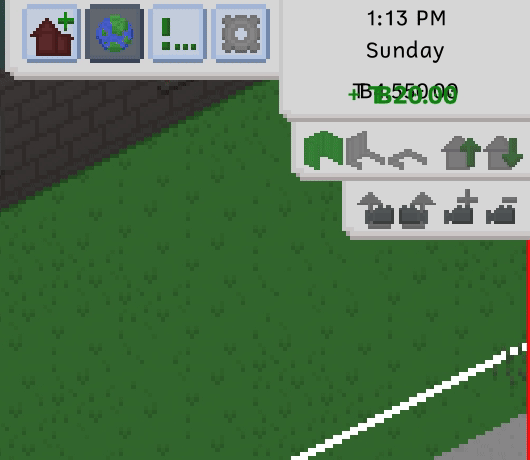
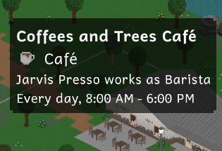

---
title: "0.44.0: Set the Vibe in Lavender Park"
tags: [Devlogs]
image: "Splash.png"
itch: "https://ellpeck.itch.io/tiny-life/devlog/817261/0440-set-the-vibe-in-lavender-park"
steam: "https://store.steampowered.com/news/app/1651490/view/4543660921240611602"
---

Hi everyone! It's been a while since the last devlog, but we've been hard at work on two major updates: this one, which features the Outright Pride 2024 set, and the next one, which will feature the elder life stage and death of old age.

Let's get right into this one, though!

# Outright Pride 2024 Set
Earlier this year, we teamed up with [Outright International](https://outrightinternational.org/) to host a charity event raising money for the protection of LGBTQIA+ rights and, as a result, LGBTQIA+ people around the world. As part of the fundraiser, we offered multiple tiers of in-game rewards: objects, clothes and interactions that would be added into the game if a certain amount was donated.

You, the Tiny Life community, while still small in numbers, raised over \$1000 for queer people and surpassed all the donation goals. As a reward, and to celebrate, of course, this update features the Outright Pride 2024 Set! It includes 7 new actions, 10 new clothes and accessories, 12 new furniture items, 2 new foods, 1 new wallpaper, the rec center lot type, and the Lavender Park world.

We won't show off all the new content in this devlog - we want to allow you to discover it all for yourself in-game -, but here are some highlights!

The new lavender bags gameplay item allows your Tinies to feel relaxed if refilled recently enough! Also, Benny is rocking one of the new clothing items: a rainbow flag hoodie!

With the Outright Pride 2024 set, you'll now be able to donate to charity! This allows for a variety of emotions based on the amount of money donated and the charity chosen! Outright International is also one of the options, of course.

Rainbow fruit skewers, as well as a chocolate-covered version, are such a perfect treat for celebrating Pride - or any party, really!

How many new things can you spot in this early sneak peek screenshot we shared with the community a few months ago?

As with every set before this one, you don't need to do anything to install it or add it to your game: it's included in the game by default, and you can play with the set's content any time! Though please remember that, if you're only playing the game's free demo, sets aren't included.

# Lavender Park
Along with the set, we added a new lot type to the game: the rec center! The rec center is the perfect place for families and young people to spend their days, allowing them to be creative, get fit or just hang out.

To try out this new lot type, you can add the new world to your saves: Lavender Park! This is a small commercial zone that features a rec center, as well as a café and a gym across the street. The new development is filled to the brim with wild lavender plants, hence the name.

Here it is during the daytime and at night!

The café and the gym also feature eccentric staff, including the cheerful Barbara Reesta and the energetic and extroverted Jim Weyts.

If you haven't done so before, you can add new maps to your existing saves by heading into the options menu under the gameplay tab. There, you can scroll down a little and press the + button on any map you'd like to add to your save! Then, you can tell your Tinies to travel by pressing on them, or by using the globe button in the top-right of the screen.

# Small Stuff
Along with the new set, this update also features a bunch of smaller improvements and new features. As always, you can read the full changelog at the bottom of this post, but we've collected up some of our favorite ones in this section.

To celebrate the season, we added three new decor items: two variations of a bunch of leaves scattered on the ground, as well as a big pile of leaves that someone must've raked together.

The money addition and subtraction animations also got a big overhaul! Previously, they would float up rather than down, and they had a less bouncy animation. This made them incredibly hard to notice. This new look should make them a lot easier to spot and read, and a lot more fun to look at!

The tooltips for lots on the household selection screen, as well as when zooming out all the way in play mode, got an upgrade as well: They now show the portraits of the people living there for residential lots, as well as the name and working times of the lot's staff.

# API Improvements
We also used this update to make some long-needed API improvements, one of which is pretty important, and one of which might be pretty useful to some of you!

Modded item names now have more rigid restrictions for their internal (registry) names. Before, item names could start with the mod's ID (the name of the type that extends `Mod`), or the mod's display name. Now, items names **have to** start with the mod's ID followed by a period. This allows a clear distinction between the mod name and the item name, and enforces more naming consistency overall. Of course, the display names you use for your items in the localization file are not affected.

Tiny Life now also contains a simple migration system, which allows data from older saves (or generally saves that were last saved in an earlier version of the game or mods) to be updated easily. Depending on the type of data, there might be changes or updates that aren't idempotent actions, meaning those updates might accidentally be applied to objects multiple times. Because of that, maps, exported households and exported lots now store a list of migrations that have already been applied to objects they contain, so all migrations will only be applied once. If you're curious about this system, check out the `Migration` class as well as the collections you can add migrations to, like `FurnitureType.TypeSettings.Migrations` or `PersonLike.Migrations`.

# The Full Changelog
That's pretty much it for this update! I thoroughly hope you think it was worth the wait, and that you enjoy all the new features and improvements. As always, here's a copy of the full changelog for your enjoyment.

I'm sorry that it took so long to get this update ready, but life has been crazy for me recently, and I haven't been able to work on Tiny Life as much as I'd have liked. I hope you still have faith in me and the game though, and you're excited for the next updates to come!

If you ever want to get info about upcoming updates or see work in progress screenshots and sneak peeks, make sure to join the game's Discord and/or follow the game's Twitter. You can find links to both of those [on the website](https://tinylifegame.com/social).

❤ Ell

Additions
- Added the Outright Pride 2024 set, which includes 7 new actions, 10 new clothes and accessories, 12 new furniture items, 2 new foods, 1 new wallpaper, and the rec center lot type
- Added the Lavender Park world, which is a small commercial zone with a rec center, a café and a gym
- Added fallen leaves and big leaf pile autumn decorations
- Added some additional blond hair colors

Improvements
- Improved the custom content import menu for use with gamepads
- Allow hovering over the entire emotion modifier rather than just its text to see the tooltip
- Only mark new upgrades, woodworking recipes and food as seen if they're now available
- Allow multi-tasking tinkering and social actions
- Display passive improvements when the cleaning skill is leveled up
- Allow non-colling objects like plates to sit in neighboring object spots
- Made people prefer eating at tables in the same room even if they don't have a free table spot
- Give various text boxes a maximum length
- Improve the dropdown panel's styling
- Made existing color schemes more consistent and less prone to breaking with color scheme updates
- Improved the money addition/subtraction animation to be much more noticeable
- Display color scheme display names on objects with a lot of color schemes
- Condense the emotion tab's gamepad display
- Also display the lot employment and inhabiting household's portraits in the lot tooltip
- Allow the small bush to have no flowers
- Mail carriers will now not be added to worlds that don't have any residential lots

Fixes
- Fixed being able to visit a lot in AI mode when clicking on self while hovering over an adjacent lot
- Fixed people with invalid memories being entirely deleted on load
- Fixed a computer in Lunar Grove being rotated incorrectly
- Fixed furniture with variations not being marked as seen correctly until the tab is reopened
- Fixed children being able to adopt each other as parents
- Fixed an exception when unable to hire a babysitter
- Fixed a rare crash when a social action ends unexpectedly
- Fixed bobbing furniture also bobbing in build mode previews
- Fixed lots with a lot of walls taking unnecessarily long to import

API
- Modded names now have to follow a more rigid format: they have to start wit the mod's ID (the name is not allowed anymore), followed by a period
- Added type-safe GoalTrigger subclasses
- Added a migration system which allows updating objects of various types in old saves to newer game versions easily
- Allow mods to specify sting sounds for their emotion types
- Added debug actions for setting romance and friendship between people
- Removed the ability to merge color schemes with each other
- Added ModLoader.GetOwningMod utility method
- Fixed MoveMap cheat crashing the game if the number passed is more than 7
- Disallow color schemes that have duplicate colors
