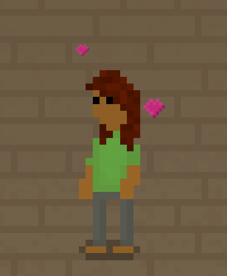
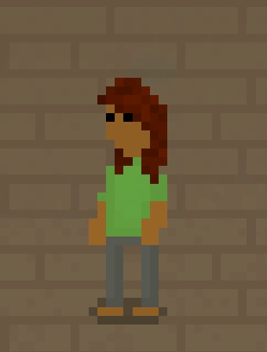
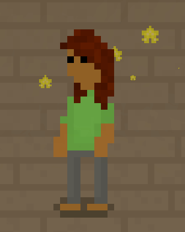
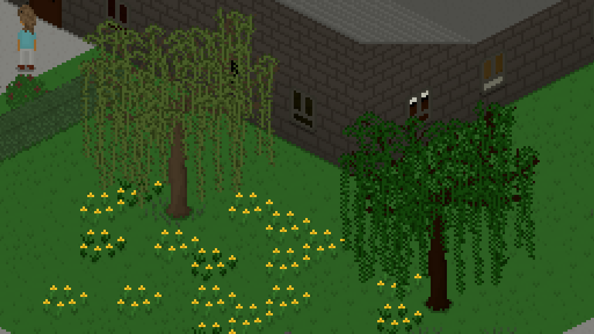
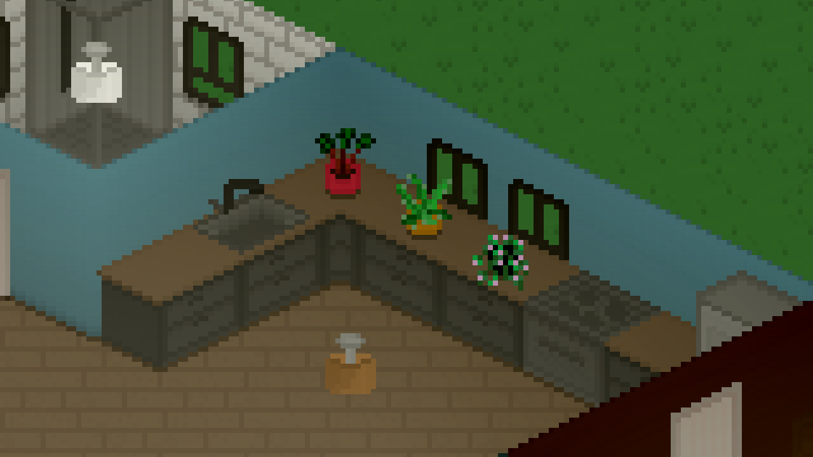
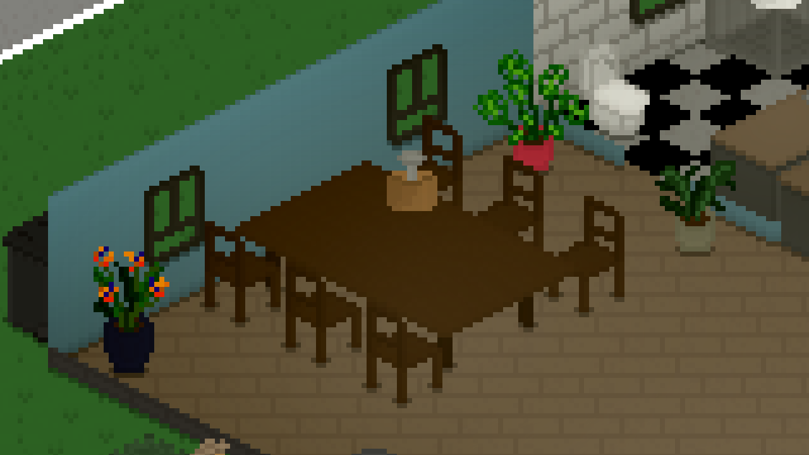

---
title: "0.45.0: Small Plants and Big Emotions"
tags: [Devlogs]
image: "24-11-29_14-12-58.png"
itch: "https://ellpeck.itch.io/tiny-life/devlog/841946/0450-small-plants-and-big-emotions"
steam: "https://store.steampowered.com/news/app/1651490/view/4441207839043617675"
---

Hi everyone! Today, there's another Tiny Life update coming at you that features some cool new plants, as well as a new visual feature: emotion particles!

It's a smaller update this time around, but I hope yall are still excited about it! I'm (finally) starting on my bachelor's thesis currently, I'm working on a paper, and I still have my research assistant job, lectures, and coursework going on - it's a lot, but I'm trying to save as much time as I can for Tiny Life development.

Anyway, let's get into this update!

# Emotion Particles
Some eagle-eyed players may be thinking "there's already emotion particles in the game, Ell! What about the sleep particles, and the anger smoke?" and you'd be right: those are the two types of emotion particles that were already in the game.

Emotion particles are meant to display visually what a Tiny is feeling like, especially for those in other households whose moods you can't just find out by selecting them. Ellpeck Games Discord user sleepysnail6 recently suggested expanding this system into, well, all the other emotions in the game, and we thought that was a brilliant idea!

For the first edition of this feature, we haven't covered *all* emotions yet, but there are now particles for the major ones! We're also not showing all of them off in this devlog post so you can discover them for yourself in game!

Joe is feeling frisky!

Hmm, now Joe is feeling a little sad. Should we make some sort of storyline out of this?

Sometimes, overwhelming sadness can really make you reflect on life and maybe, just maybe, start feeling a little creative! (That's not a feature in the game right now, I'm just trying to make these GIFs have some type of context.)

Actually, I'm leaving my very favorite one out of this post - once you checked this feature out for yourself, feel free to guess which one that is.

If you think these particles are too distracting for gameplay, or you have some other issue with them, you can also disable them in the game's options menu. This will also disable the previously available anger and sleep particles, for consistency.

# New Plants
In the little time I've had for development, I've mostly been enjoying doing pixelart recently, including some for Tiny Life! This resulted in one of the textures I'm, so far, most proud of in the game: The new weeping willow tree, which is now officially the largest tree in the game.!

In that picture, you'll also see one of the other additions: little dandelions that you can place as a ground cover, similar to the grass and flower patches that were already in the game.

But now, feast your eyes on some more fun objects, specifically more potted plants! Can never have enough of those.

Here are three new small ones, one of which looks a bit like rhubarb:

And here are three new large ones, one of which looks a bit like a bird of paradise plant (because that's what it is):

# The Full Changelog
And that's about it for this update, at least in terms of fun stuff to show off! As I said at the top, this turned out to be a much smaller update, as I'm still working on The Elder Update™️ in the background. I'm really hoping to be able to release that one before the end of the year, but honestly, it's not looking too likely, unfortunately. I'll keep yall updated, though, both on [the Discord](https://link.tinylifegame.com/discord) and the [new Bluesky](https://tinylifegame.bsky.social), the latter of which I've been posting on pretty regularly recently.

As always, here's the full changelog for you to enjoy.

❤ Ell

Additions
- Added three large potted plants
- Added three small potted plants
- Added a large weeping willow tree
- Added dandelion ground decorations
- Added various particles for different emotions, which can be disabled in the options menu

Improvements
- Improved the diagonal wood tile texture
- Moved world options to their own tab in the options menu
- Improved texture packing speed on startup
- Allow using the emotion cheat to get a specific emotion, rather than just emotion modifiers
- Also notify demo players of the floor restriction in the roof tool
- Made the amount of windows and doors determine the amount of natural light in a room
- Display a warning when a clothing item will be hidden under another
- Display open/closed arrows on dropdown menus
- Made randomly generated names have a high likelihood of matching the selected game language

Fixes
- Fixed various particles on people being in incorrect positions for certain ages and poses
- Fixed babies being able to use an easel
- Fixed being able to undo and redo in build mode when hovering the UI
- Fixed an exception when a transition is happening while starting another one
- Fixed center-aligned dropdown content in the character creator not being hoverable fully
- Fixed a crash when splitting households with a lot of money
