---
title: "0.47.0: Elders and Their Demise"
tags: [Devlogs]
image: "Splash.png"
itch: "https://ellpeck.itch.io/tiny-life/devlog/902183/0470-elders-and-their-demise"
steam: "https://store.steampowered.com/news/app/1651490/view/497189343402657030"
---

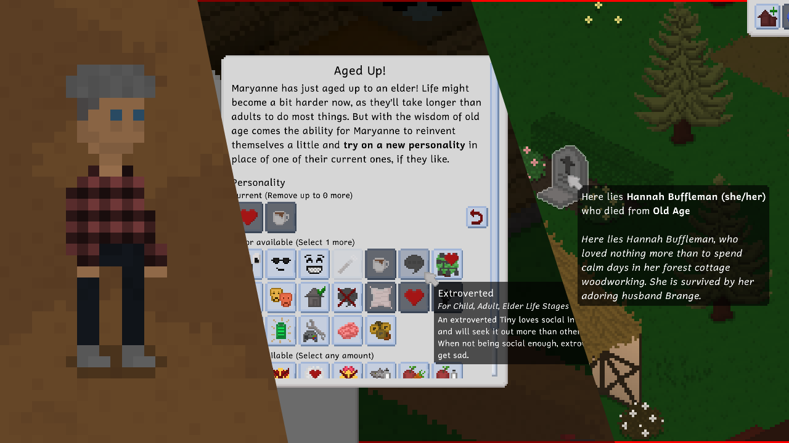

It's here, everyone! It's *finally here*! After months of working on it behind the scenes, I'm proud to announce that the elder life stage is finally part of Tiny Life! This is a pretty big update, as elders have a bunch of unique abilities, actions and personalities, so let's get right into it!

# Elders

A Tiny becomes an elder when aging up from an adult. That can now happen! Because of how the game's aging system works, you might notice that a bunch of adults will starting aging up to elders right away in your existing save files. That's normal, and it's just the game catching up to the new life stage.

Elders have a pretty distinctive look compared to adults because they feature a unique skin texture that includes wrinkles and droopy eyes. You can also spot an elder by the fact that they generally walk a lot more slowly and take longer to complete actions (except when they have the spirited personality - more on that a bit later).

Here's a quick comparison between the looks of an elder and a youngin (tucking your shirt into your pants is optional, but, I think you'll have to agree, very eldery):

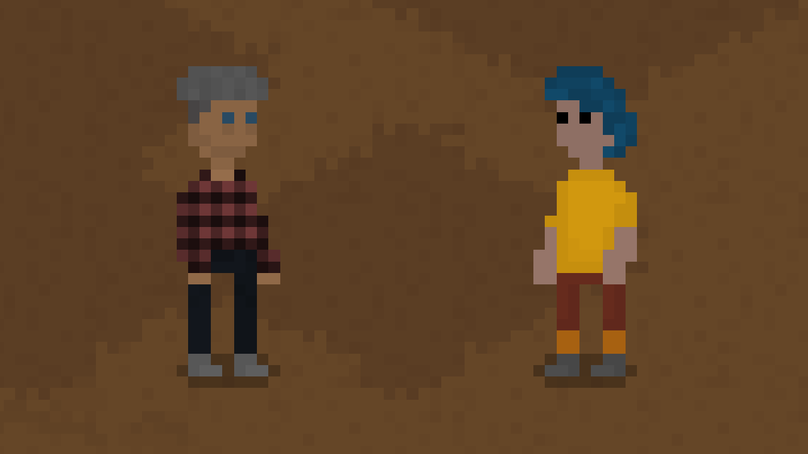

With this update, there are unfortunately no new elder-specific clothes, but this is very much a planned feature for an update in the near future! For now, you'll have to make do with the existing clothes and some new beigey pastel colors that have been added to some of them.

## Elders and the Demo

It should also be noted that, while most content added to the game also makes it into the game's demo in some way or another, elders will *not* be part of the demo. That version of the game will still only have children and adults, and, if you'd like to play with babies or elders, you'll have to get the full game!

## Elder Personalities

At the moment, there are two new personalities for elders: Grouch and Spirited!

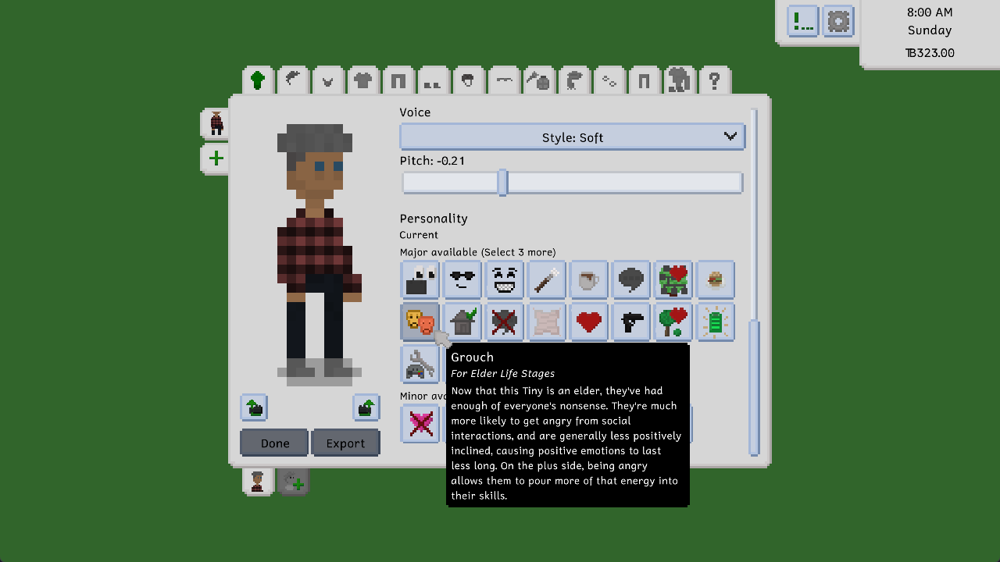

An elder with the Grouch personality will occasionally quietly grumble to themselves and generally be less satisfied with life and the world (especially when it comes to younger folks around them). Here's the in-game description for grouches:

> Now that this Tiny is an elder, they've had enough of everyone's nonsense. They're much more likely to get angry from social interactions, and are generally less positively inclined, causing positive emotions to last less long. On the plus side, being angry allows them to pour more of that energy into their skills.

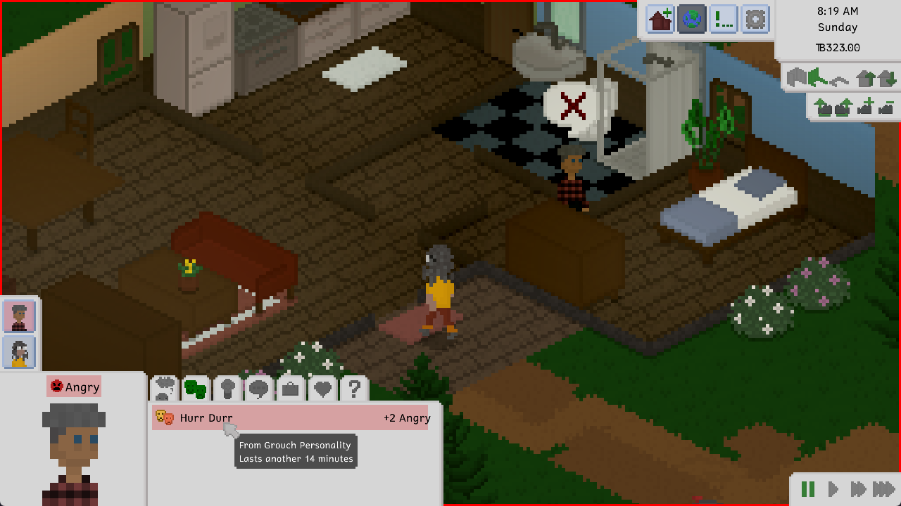

An elder with the Spirited personality will, in many ways, essentially live life like an adult. They won't walk as slowly as other elders, they won't be able to die of exhaustion (more on that in the next section!), and so on.

> An elder Tiny who is spirited doesn't have any issues keeping up with the youngins. They don't get tired as quickly as other Tinies their age, and they don't have to worry about the dangers of working out too much.

Now you may be wondering how to get your elders to have these personalities through normal gameplay! Well, the way this works in Tiny Life is that, when aging up from an adult to an elder, you can now optionally replace one existing personality with a new one, and also choose any number of minor personalities to add to your Tiny. This is especially useful, of course, for trying out these new personalities exclusive to elders!

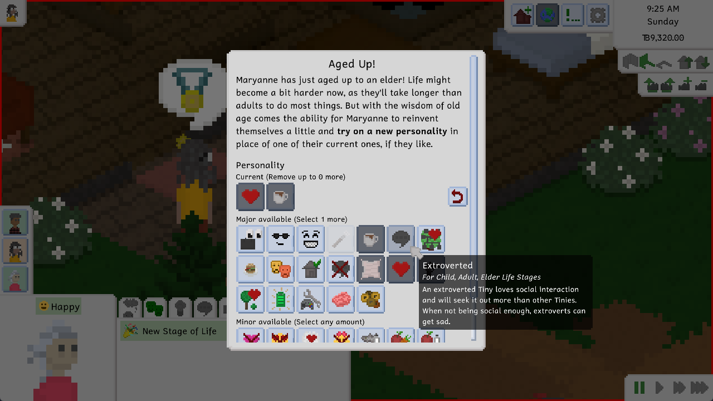

## Elder Deaths

There are two new ways to die in the game, both of which are exclusive to elders: Death of exhaustion, and death of old age! An elder can die of exhaustion by working out too much, or by fooling around too much with other Tinies - this is something you'll get a warning about through their emotion modifiers and an in-game hint though, so you shouldn't have to worry too too much about it. And of course, they'll die of old age once their time comes - there'll be several notifications leading up to the day and the moment, though, so you'll hopefully have plenty of time to help them get their affairs in order.

In addition to these new deaths, we've also upgraded the gravestone object a little bit! You can now engrave it with a custom message, and it'll show it when you hover over it in the world.

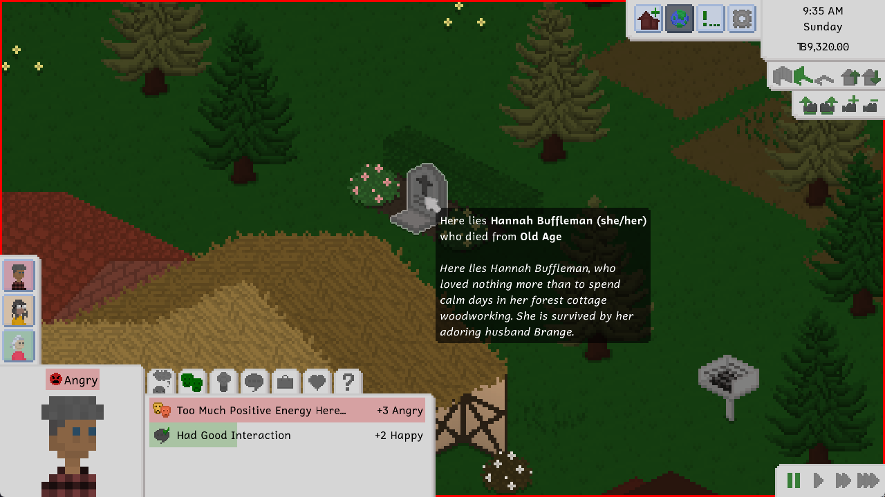

You can also now store gravestones in your household inventory should they have spawned outside of your home lot, and you can also permanently destroy gravestones through an interaction now. Be warned though, as this removes any ability for future features like ghosts and resurrections to affect your dead Tiny, since deleting their gravestone also deletes any information the game has about their remains.

## Special Elder Actions

Elders have a few special actions they can use, including various fun socials! In addition to your classic talking interactions, there are also some that have additional effects!

For instance, an elder can sneak treats to children in their household, which will make the child feel happy and the elder themselves feel a little bit goofy - after all, what's a grandy for if not to spoil the grandkids a little bit?

There are three new recipes - one of which is inspired by my own grandma's cooking - that only elders can cook. These recipes are all comfort foods that will make others feel especially happy.

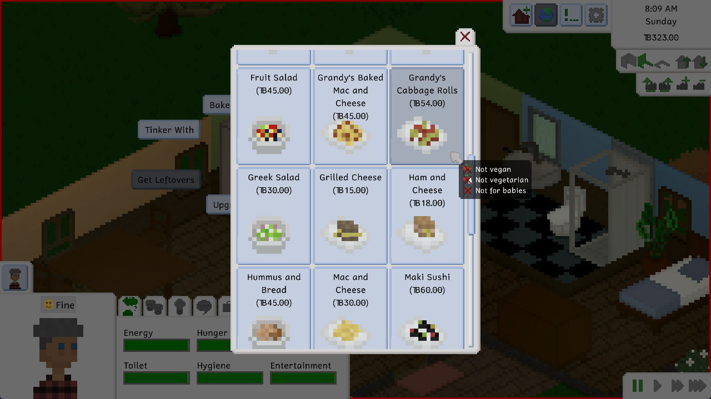

Elders can also choose to bestow these recipes onto their children and grandchildren to allow them to cook them before becoming an elder themselves!

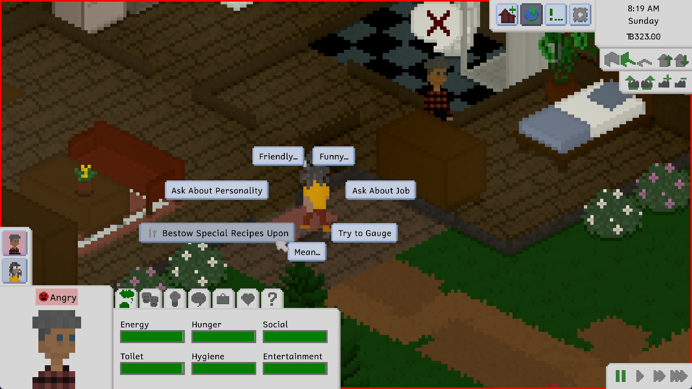

Also, while elders still have the ability to fool around - bearing in mind that they can get too exhausted if doing it too much - they have limited ability to conceive children. Specifically, elders who are usually able to get pregnant will not be able to anymore, while elders who are able to get others pregnant can still do so with adults. Always stay responsible, though!

Elders can also retire from their jobs, causing them to regularly receive a percentage of their original pay. Once they do, however, they won't be able to get a new job again. So choose wisely!

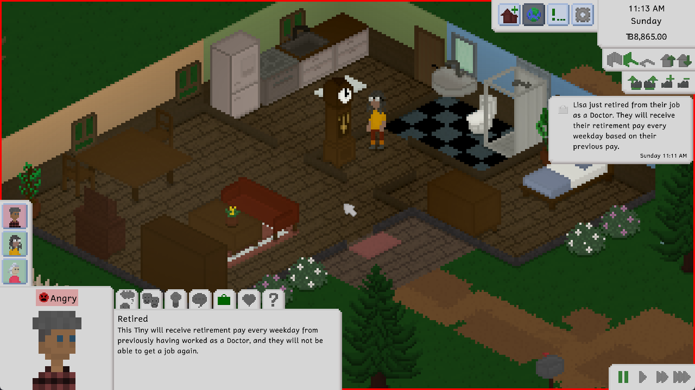

# New Fences and Grandfather Clock

This update also features two-and-a-half new decor items, some of which were... accidentally released as part of the last update. Oops. Let's showcase all of them anyway!

There are two new types of picket fence, which are a great way to decorate your little suburban family home - or really any home, to be honest!

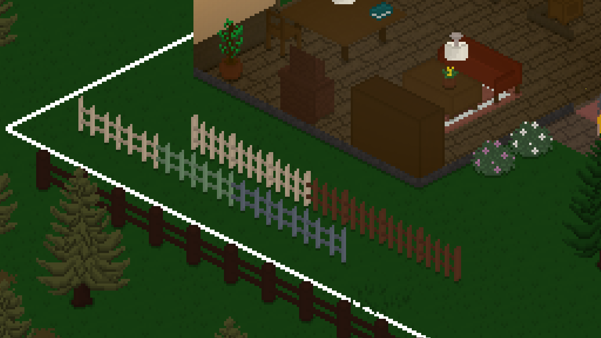

As you can see, one of them is a little more rickety and the other one is a little more fancy.

Additionally (and this is the item that was *actually* included as part of this update only), there's a grandfather clock now!

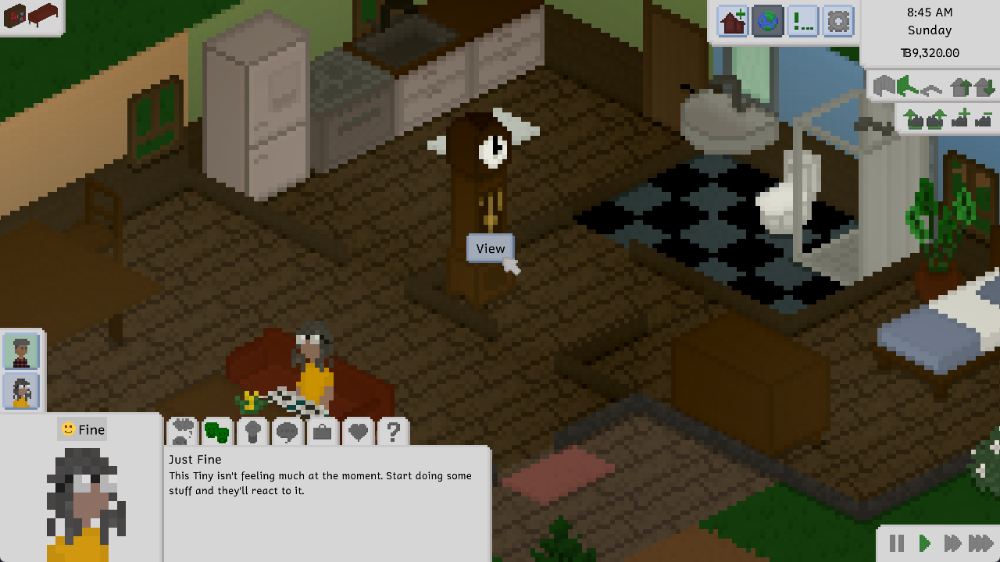

This clock may look unassuming at first, but rest assured that there may be a little more to it than you think...

# Future Plans

That's pretty much it in terms of the big features for this update! However, we have many plans for future features for the elder life stage, as well as the eventual introduction of the teenager life stage.

In the near future, we'd like to expand the selection of elder-exclusive personality types, and introduce a variety of new elder-specific clothes that really make them look the part.

## About Me and Development Speed

I'll be doing a bit of honest talk about my life here, and so if you're not into that, feel free to skip right to The Full Changelog below.

However, and this is something I've been talking about a lot in these devlogs recently, I've been extraordinarily busy recently, much more than I've really ever been in my life. I'm autistic, and I'm taking regular medication for my depression and anxiety disorder, so I generally don't have the biggest capacity for a lot of work. I'm currently working on my bachelor's thesis (which is going okay, but still taking a toll on my mental health and my free time), and, in addition to that and my part-time job as a research assistant at uni, there's also still an exam to write and a paper to finish.

All of this to say that I know you've all been anticipating the elder life stage for a long time, so I hope it lives up to your expectations! Please share any feedback you have about the update in [the Discord](https://link.tinylifegame.com/discordweb), especially if you really love it, or if you have major ideas for additional elder or general life stage features.

This means, however, that I'll be taking a little break from major developments to Tiny Life after this update, and focusing only on smaller features and bug fixes in the next few months. I'll be finished with my thesis in August, and I'm not sure yet what my plans for work and education are after that. While I'd love to be able to work on Tiny Life full-time, the income from the game just isn't there at the moment. This means that I'll either continue working as a research assistant (which is a job I really love, but for which I'll have to stay in uni and start my master's degree - something I'm still undecided about whether I even want to finish), or find a different job (which, knowing my mental health, is honestly incredibly harrowing for me).

With all of that said, please still rest assured that Tiny Life is moving forward and that I'm still incredibly passionate about the project and bringing it out of Early Access, onto consoles and into a lovely future. It just may take a little bit longer than I'd like, and a bit longer than I've predicted in the past.

# The Full Changelog

That's pretty much it for this update! I hope you all really enjoy it, and I can't wait to hear what you think!

As always, here's the full changelog for the update, which you can also find in the bottom-right corner of the main menu and [on the website](https://tinylifegame.com/changelog).

❤️ Ell

Additions
- Added the elder life stage, which includes several unique actions and personalities
- Added the ability for elders to retire from their jobs
- Added the ability for elders to pass down special recipes to their family members
- Added the ability for elders to die of old age
- Added the ability to engrave gravestones with custom text
- Added the grandfather clock furniture item

Improvements
- Allow gravestones to spawn off-lots
- Allow destroying gravestones permanently
- Allow storing gravestones in household storage if they're off-lot
- Improve the random name selection likelihood system, causing more common names from countries matching the current localization to be picked more often
