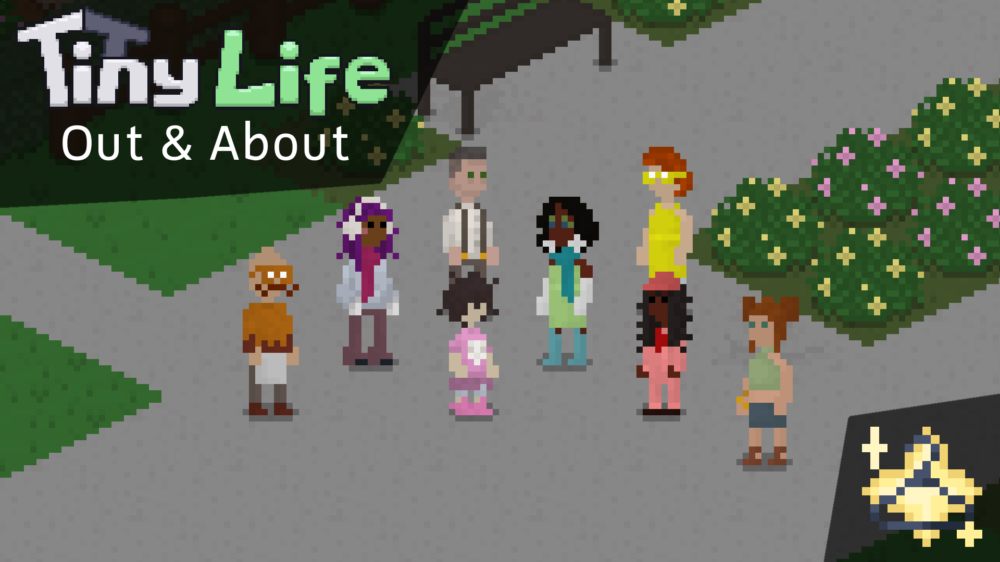
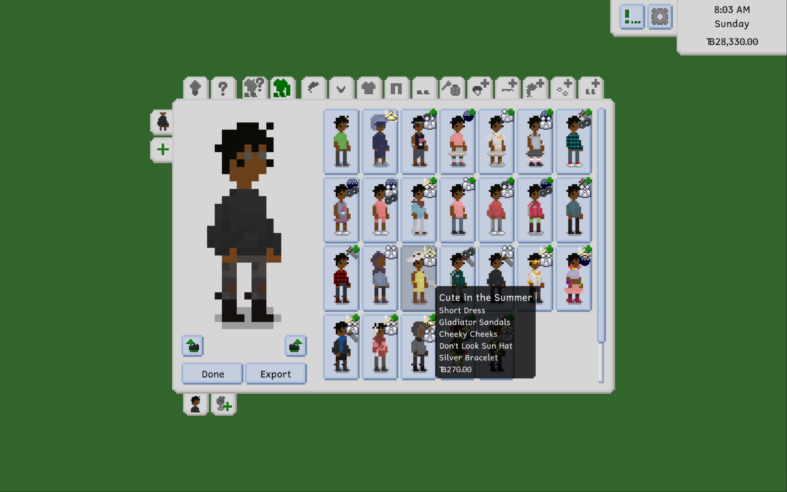
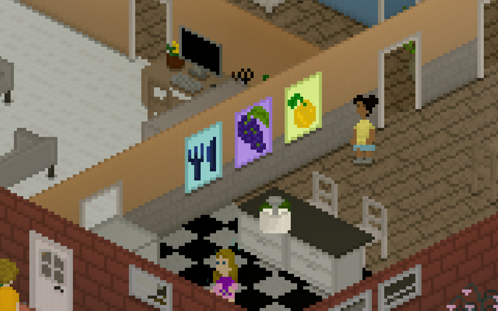
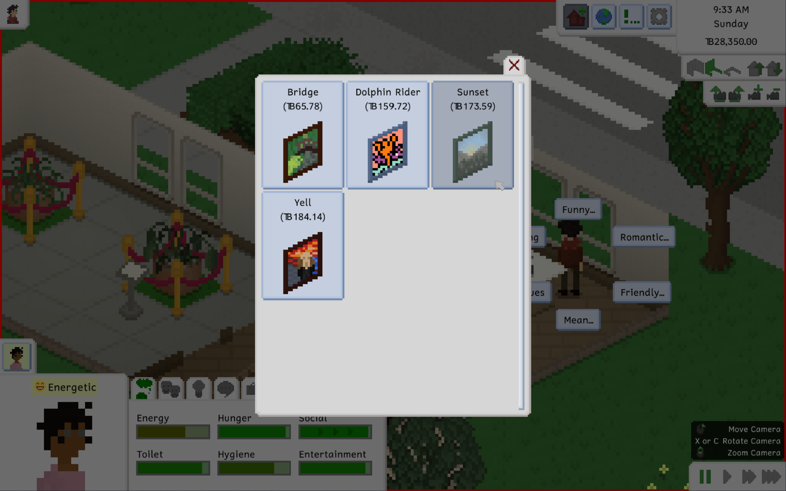

---
title: "0.48.0: The Biggest Set Yet (By Far)"
tags: [Devlogs]
image: "Thumbnail.png"
itch: "https://ellpeck.itch.io/tiny-life/devlog/1039308/0480-the-biggest-set-yet-by-far"
steam: "https://store.steampowered.com/news/app/1651490/view/529858195235015393"
---

Hi everyone! It's been a while since the last major update, and thus, since the [last devlog](https://tinylifegame.com/posts/0.47.0/). While there have been plenty of [smaller updates](https://tinylifegame.com/changelog/#04711) in the meantime, it feels great to get back to devlog writing and a larger update again.

I know a lot of you have been waiting for this update a long time, but I think it'll be well worth the wait. Let's get into it!

# The Biggest Set Yet (By Far)

You read that right. This update contains the biggest set yet in terms of amount of items added to the game. If you're out of the loop, sets are (usually) small groups of themed content that are included in the full game for free, with their art (usually) created through a one-off paid commission by a member from the Tiny Life community. Previous sets brought fun items like workout equipment, the woodworking table, as well as plenty of furniture items and clothing in various styles, including retro, modern, and rustic.

This update introduces the **Out & About Set**, with art lovingly created by the awesome [Snail](https://bsky.app/profile/sleepysnail6.bsky.social). To sum the set up in one sentence (as the game itself does in its Sets menu):

> It's all about fun fashion! With clothing that's striking, colorful and a little unconventional, Tinies will love to show off their outfits when they're out and about.

The Out & About Set comes with a total of 59 accessories, 9 full-body items, 23 hairstyles, 8 pants, 10 shoes, and 16 tops, including items for all age groups. Yea, that's quite a lot.

To get a good overview of what the set has to offer, I recommend checking out the trailer we put together for it, which was also shown at the Top Hat Studios Tokyo Game Show Showcase a bit earlier today.

<iframe width="560" height="315" src="https://www.youtube.com/embed/deKclDnbG1U?si=afevjoQeyjQ0QODh" title="YouTube video player" frameborder="0" allow="accelerometer; autoplay; clipboard-write; encrypted-media; gyroscope; picture-in-picture; web-share" referrerpolicy="strict-origin-when-cross-origin" allowfullscreen></iframe>

It's been an absolute blast working on this set with Snail, who not only contributed all of the art assets, but also brainstormed the set's content and the designs for so many of the items witih me. I hope you will love playing with this set and finally being able to give your Tinies the makeovers they deserve. Full-body outfits like dresses and jumpsuits, anyone?

As with all previous sets, the Out & About Set will be available for free through the 0.48.0 update of the full game. The set's items will not appear in the game's demo, however.

# Outfit Presets

In addition to the set, we felt it necessary to overhaul some of the character creator's features. In addition to polishes to the order and icons of the character creator's category tabs, we also added an entirely new category: **Outfit Presets**!

Outfit presets can be used by players like me, who don't particularly enjoy dressing up their Tinies in fancy outfits, and don't want to stick with the randomly generated outfit that a newly created Tiny comes with. Well now, you can select one of a large variety of pre-made outfits for your Tinies which cover them head to toe with beautifully matched clothes.

Of course, if you're so inclined, you can also use outfit presets as a basis for a custom outfit, and change only the parts that you feel particularly strongly about.

As time goes on, we'll obviously be adding more and more outfit presets, both with basegame items and a mix of current and future set items. For the time being, there are already plenty of outfit presets you can dress your Tinies up in, though.

# Paintings and Decor

In addition to character creator features, this update also features some new items and gameplay features that were added here and there during the Out & About Set's development time. It turns out that, for no reason in particular, most of them are focused on your Tinies' artistic endeavors.

When playing with the Painting skill, your Tinies are now able to paint 10 new paintings in various styles, nearly doubling the total amount of paintings available to paint and subsequently decorate your house with (or sell, of course).

Each of the game's paintable paintings now also have a display name, which helps in differentiating them especially if you're not quite sure what's depicted on them (in which case I won't be offended, I promise).

In addition to the new paintings, there are also 4 new non-paintable prints that you can buy straight from build mode, all of which are themed around kitchen items. These were inspired by the fact that I saw some cute prints while browsing a store a while back, and realized that I don't really have any free walls in my kitchen to hang such prints on.

Feel free to guess what four items these depict, though I think it's pretty obvious what they are... I hope.

# Useful NPCs

When creating lot employments for Tinies (which is our internal name for any Tinies that are staff on a public lot or in the world itself, such as baristas, bartenders, trash collectors, mail deliverers, babysitters, and so on), part of our goal with them is to make them useful to gameplay in some way, rather than just having them hang around and exist.

For some employments, there are obvious uses, like how a mail deliverer delivers mail and a barista allows buying coffee. But for some, like librarians and gym trainers, we tried to come up with special behaviors and interactions that enrich gameplay while visiting the public lots they staff. For example, gym trainers will occasionally come over to you while you're using a workout machine at the gym and attempt to encourage you, causing you to receive an energized emotion for a while and thus increase the speed at which you level up in the fitness skill.

The **museum curator**, who you can find on museum lots, now has an additional purpose: selling paintings! Every day, each museum curator in the world has a set of randomly selected paintable paintings available that they sell with varying prices. If you don't like having to paint your own paintings to decorate your house, or you're looking for a specific painting that you just can't get your Tiny to paint, why not head over to the nearest museum and ask the museum curator what they have in stock today?

# The Pace of Updates Moving Forward

A few weeks ago, [I finally finished my bachelor's thesis](https://ellpeck.de/blog/bachelors-thesis-postmortem/), which was a major factor in the slowed pace of updates over the last six months. This means that the pace of updates will be able to pick up once again.

In my excitement about the thesis, and my vague planning for my personal future, I have decided to stay at uni for a master's degree. While this means I'll be able to continue working on the game without having to get a full-time job, it does mean that I'll still have a lot of additional work to do on the side, with uni and the continuation of my student job.

So what does this mean for Tiny Life's future? Well, obviously I can't tell what the future holds in terms of workload and my mental health, but what I can say is that I'm still passionate about Tiny Life's development and future, and so the game will continue to receive regular updates as it always has. But for the foreseeable future, it'll just continue to be an up and down in terms of the speed at which these updates come out.

If you want to check in on the game's development progress at any point, please feel free to join the official [Ellpeck Games Discord](https://link.tinylifegame.com/discordweb), where I post semi-regular sneak peeks, and where you're also welcome to ask about the game's current state, update progress, as well as what I have planned for it.

I hope you're as excited about this update as I am, and I hope you'll stick with the game and I as we figure out the next few years on the road to the game's full PC release, as well as an accompanying console release, together.

❤️ Ell

# The Full Changelog

Additions
- Added the Out & About Set with art by [Snail](https://bsky.app/profile/sleepysnail6.bsky.social), which includes 59 accessories, 9 full-body items, 23 hairstyles, 8 pants, 10 shoes, and 16 tops, including items for all age groups
- Added the outfit preset system, as well as several outfit presets using items from the base game and sets
- Added 10 new paintings that can be painted using the easel
- Added 4 kitchen-themed print decorations
- Added the ability to buy paintings from museum curators
- Added the potty professional personality, which is awarded when growing up to a child with level 5 potty skill

Improvements
- Improve the visuals of the nudity censor effect
- Allow recoloring painting frames using the color tool
- Paintings now have display names
- The focused emotion now has a particle effect
- Improve the selection of matching households for household generation to make large houses be more likely to have large families inhabit them
- Improved the character creator's tab icons
- Display brief tooltips in the person selection and character creator when using gamepad or keybind navigation
- Fix particle textures sometimes bleeding into adjacent texture regions
- Made tooltips slightly less transparent
- Made it a lot likelier for random outfits to be generated using items that match the outfit's intended category
- Various food scraps are now displayed when a tiny uses a cutting board
- Food items are now categorized by time of day, and the AI will choose fitting food items with higher likelihood
- The maximum money amount per household has been reduced to 10 million to avoid excessive rounding errors at higher amounts
- An additional icon is now displayed on an action when a tiny is currently traveling to a different map

Fixes
- Fixed a crash when loading into the game before the news finish downloading
- Fixed a rare crash when using gamepad navigation from within the character creator
- Fixed the world button in the demo hanging off the edge of the in-game ui
- Fixed a rare issue where household imports and exports would cause relationships to be duplicated
- Fixed tinies washing their hands when canceling the toilet action before it starts
- Fixed tinies changing out of their non-everyday wear if bathing/showering is canceled before taking their clothes off
- Fixed tinies spamming park lots with grilled food if there is already a lot there
- Fixed various migration issues when importing lots that were exported in older versions

API
- Object icons now use the mod's icon by default, so icons don't need to be set manually by modders anymore
- All objects that are part of sets are now named according to mod item naming rules, with item names prefixed by the set name and a dot. Saves are automatically migrated using the migration system, and the owning set of an item can be queried through the GetOwningSet method in GameImpl.
- Random household generation now supports non-Person people
- Person-related cheats can now be used in the character creator
- The build tools panel now allows scrolling if there are more than 9 registered build tools
- Mods can now register woodworking recipes for items that don't belong to them
- Localization files can now additionally use a flat layout (separating category names from entries using a dot), or a deeper layout (using objects for modded items where previously a dot was required at the start of each key, similar to categories)
- Mods now require prefixing their custom object categories with the mod id
- The game now ensures a sufficient execution stack for error reporting in locations where indefinite recursion may become an issue, meaning stack overflow exceptions will also be caught and reported accordingly
