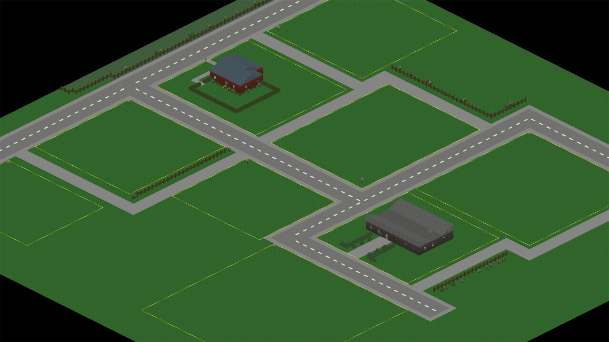
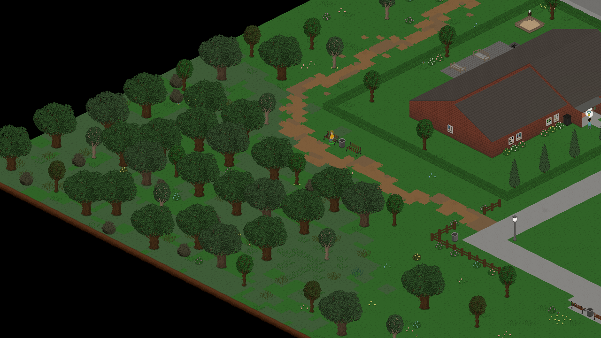
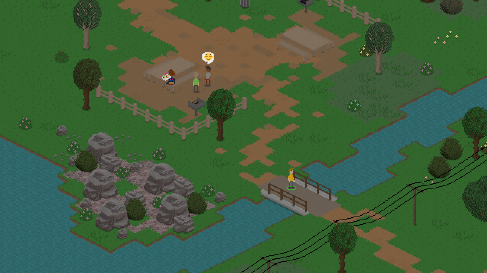
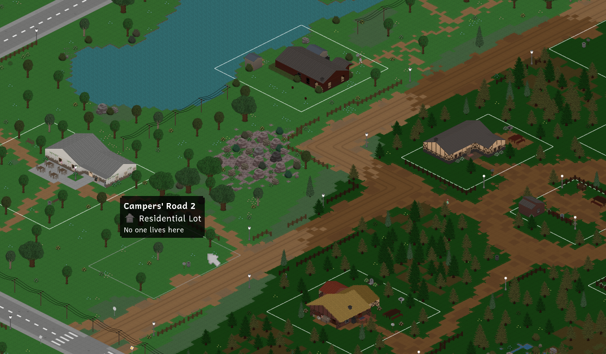
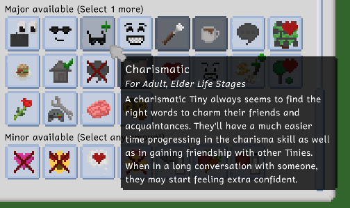
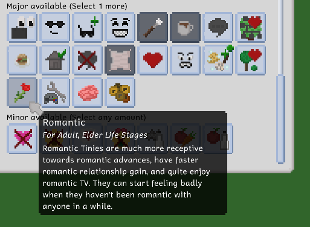
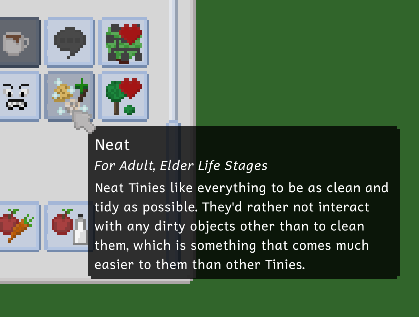

---
title: "0.49.0: Some Needed Personality"
tags: [Devlogs]
image: "TinyLife_GCPgAXfa0R.png"
itch: "https://ellpeck.itch.io/tiny-life/devlog/1309409/0490-some-needed-personality"
steam: "https://store.steampowered.com/news/app/1651490/view/538875544217846178"
---

Hi everyone! It's 2026 now, and doesn't that feel a little weird? Funny thing is, this isn't even the first Tiny Life blog post of the year, since that title goes to [the recent Community Showcase](https://tinylifegame.com/posts/making-tiny-louvre/) about the mod Tiny Louvre. Definitely give it a read if you haven't gotten a chance yet!

It's been a few weeks since the last update, but we've been hard at work adding a few new personalities in response to the Post-0.48 Feature Survey which explored what new features you all would be interested in. It turns out that, while a Gardening system won by a landslide, you also pointed out an interest in the addition of new personalities. And while we haven't gotten a chance to get started on Gardening yet (though we've been collecting some more concrete ideas for it), we did take the time to add three new personalities for this update.

This time, there are also a lot of other cool new things to show off, both small and large, so let's get started with my personal favorite!

# The History (and Future) of Maple Plains City
As most of you know very well by now, Maple Plains City is both the largest and oldest map in the game. I sometimes tell the anecdote that Maple Plains City resident Benny Banana was the first Tiny ever created for the game, and while that's not necessarily correct (since there were a lot of unnamed test Tinies before him that didn't get saved and/or named since those things didn't exist yet), Benny Banana is indeed the first Tiny to be created and stick around. He's lived in Rose Origin with his partner Carmen Cashew since his creation as well, which just goes to show how old Maple Plains City really is.

It's gotten a lot of improvements and revisions over the last few years, with Tiny Life now being over five years old. Maybe this incredibly ancient screenshot will give you a feeling of just how barebones Maple Plains City was back in the game's public alpha days in 2020.

Well, as I'm also sure you know, Maple Plains City has looked much different and a lot more lived-in recently, but it was still never *my favorite*. For one, the pine-forested area was always a little empty in my opinion, and there were parts of the map, especially around the lake and the Coffees and Trees Café, that always felt a little lifeless to me. That's why, in this update, we've gone around the map to place a bunch more objects, paths, and even two new lots!

We won't show all of the improvements in this post, since those are for you to discover, but here are some of the highlights!

There's a bigger forested area in the corner now.

Maple Plains Park has received a cute little pedestrian bridge.

The forested area has received a dirt road inspired by the one in Lunar Grove, along with a few new paths to connect existing paths to it, and two new (currently unoccupied) residential lots!

For future updates, we're still planning on doing some more minor improvements to these new areas, such as adding more pre-built houses, especially now that there are two additional empty lots.

When loading an existing save for the first time after downloading the update, you should notice that loading the game will take a little longer than usual. That's because, as always with map updates, existing saves will be updated to receive decorative off-lot features from map updates without overriding anything that makes your save file unique (such as your lots or modified households). We hope you enjoy the improvements to Maple Plains City!

# New Personalities
As we said at the top, this update also includes two new personalities, both of which are fully featured major personalities that include new behaviors, social actions and a bit of additional gameplay.

The first two new personalities are Charismatic and Romantic, which are essentially friendship- and romance-related versions of the same idea: Tinies with one or both of these personalities will have improved relationship gain in their respective categories, faster skill gain in the Charisma skill, and a few unique interactions and emotions available.

The Neat personality, which is the third new one added in this update, is not socialization-related at all, and instead improves Tinies' ability and interest in cleaning and keeping the house nice and tidy. Maybe there's a negative to being that neat here and there, though...

With the addition of this personality, we've also updated the Cleaning skill icon to make it a bit more representative of the overall cleaning process. It now doesn't just include a sponge, but also a little mop-slash-duster.

We hope you're excited to try out these new personalities and end up enjoying the new features they have to offer. We hope that these will certainly make your Tinies that little bit more diverse in behavior. Of course, we still have a lot of additional personalities and updates to existing ones planned for future updates though, so stay tuned and always feel free to let us know what other personalities you'd love to see in the game!

# High-Speed Speed
We recently held a small survey about the speed of the game's time, specifically how much time speeds up when using the fast or very fast speed buttons. As it turns out, a lot of people were feeling that the very fast speed didn't feel all that fast at all, and they commonly found themselves wishing that there was a higher speed to select.

Enter the Higher Game Speed Increase option that you can now find in the General options tab, which allows you to permanently increase the speed of the fast and very fast speed buttons. Instead of doubling and tripling the game's speed, which they normally do, enabling the option will cause them to triple and quintuple the speed instead, respectively. That's five times the speed instead of three times the speed for the very fast button!

Feel free to try out this option and let us know what you think!

In all of this speed discussion, please keep in mind that the extremely fast speed setting, which is denoted with a small + icon in the top-right corner of the very fast speed button, is still available when all Tinies in the active household are asleep or out of town. This speed option has always been 20x the regular speed, and this is unchanged both in this update and with the Higher Game Speed Increase option selected.

# The Full Changelog
That's pretty much it in terms of major features for this update! As always, there are some smaller additions and various improvements that we didn't feel it necessary to cover as part of this devlog, but you can read about them in the full changelog below.

I hope you've had a lovely end of the last, and start of the new, year, and I hope you enjoy this update a lot!

❤️ Ell

Additions
- Added the charismatic, romantic and neat personalities
- Added three new important event stings by Jamal Green
- Added mismatched socks for adults
- Added an accessibility option to pause the game automatically when zoomed out into map view
- Added the ability to increase the game's speed increase factors from 2x/3x to 3x/5x, respectively

Improvements
- Completely overhauled Maple Plains City's plains areas and added two new lots to it
- Slightly increase the default AI activation cooldown
- Allow pressing on the current emotion to open the emotions tab
- Camera movement speed using the keyboard is now increased when holding shift
- Better organization for general and accessibility options tabs
- Undo and redo in build mode can now also be invoked using new UI buttons
- Made the AI only ever enqueue one need-solving action at a time

Fixes
- Fixed lot employees being able to carry babies into restricted areas
- Fixed grabbing a serving and getting water succeeding even when there's no valid path
- Fixed an exception when an action involving player interaction is enqueued before switching to a different household
- Fixed Tinies grabbing a serving automatically on food with a candle on it
- Fixed genealogies automatically being able to change for people who are in a romantic relationship
- Fixed baby names not being updated correctly in play mode when having a baby
- Fixed an exception when trying to change a baby's outfit
- Fixed people still thinking other adults are in primary school if they knew them as kids
- Fixed a rare exception when trying to prepare invalid food items
- Fixed a rare crash when trying to render a Tiny whose animations have not been initialized yet

API
- Fixed mods being instructed to registr custom json type safe generic data holders
- Added an event for when a Tiny dies
