---
title: "0.50.0: Gardening, Plants and Many Improvements"
tags: [Devlogs]
image: "splash.png"
itch: "https://ellpeck.itch.io/tiny-life/devlog/1560097/0500-gardening-plants-and-many-improvements"
steam: "https://store.steampowered.com/news/app/1651490/view/694264313911708914"
---

Hi Tiny Life enjoyers! It's yet again been a little while since the last devlog, and thus, since the last major update to the game. I'd like to apologize for the repeated delays in update releases, but I think this time around, it's really going to have been worth the wait for you.

For Tiny Life 0.50.0, which is releasing alongside this devlog, we have a lot of cool new features to cover, including the major addition of gardening and the introduction of a foraging system to the game! Let's get right into it.

# Gardening
Tinies can now acquire and build the Gardening skill by planting seeds, watering their plants, harvesting them, and even selling their produce for money. To get a good overview of the gardening system and how it works, you should check out this teaser video we made for it a while ago if you haven't already:

<iframe width="560" height="315" src="https://www.youtube.com/embed/l4DS9-kxojo?si=ecgTlZCgonHUumEM" title="YouTube video player" frameborder="0" allow="accelerometer; autoplay; clipboard-write; encrypted-media; gyroscope; picture-in-picture; web-share" referrerpolicy="strict-origin-when-cross-origin" allowfullscreen></iframe>

## Wild Plants
The first step in your gardening journey is to gather some seeds in a seed bag. To do this, head out into the world and find some wild plants! Each of the three non-demo worlds featured in the game will now have wild plants strewn about in various locations. They generate (or grow) over time, so the ones you'd like to plant may not be available straight away, but be sure to check around every few days and see if you find them!

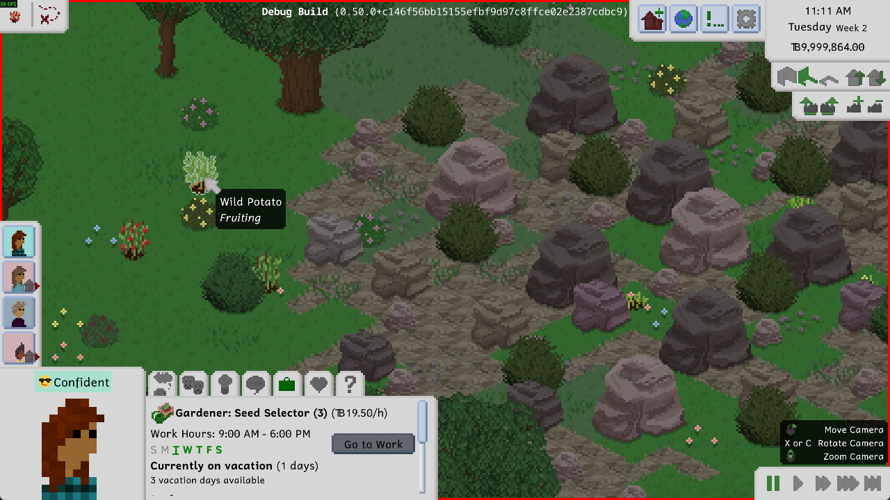

When harvesting wild plants to gather seeds, your Tinies will automatically equip a seed bag that the seeds will then go into. Seed bags, as well as the harvest baskets we'll talk about a bit later, are handheld objects that store your seeds and harvestables. They can be picked up and put down like any other small items, but they can also be put into and taken out of your household storage, which allows them to be tucked away neatly and shared easily with other household members and across different locations.

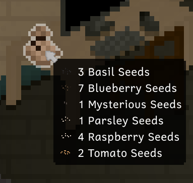

In the future, the wild plants system will be expanded into a full foraging system with an accompanying skill and different, unique items to forage for. For now, plants are the only thing you can find dotted around the world, though.

## Planting, Watering and Harvesting
The seeds your Tinies have collected can be planted in plant pots found in build mode. Two plant pots are available in this update: a 1x1 one and a 2x2 one, which can fit 1 and 4 plants, respectively. After planting, plants can optionally be moved around in build mode, including moving them out of their plant pots and onto natural ground.

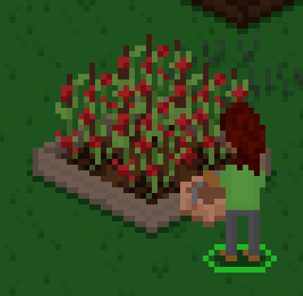

To thrive, plants need to be watered regularly, with the frequently depending on the plant. Plants can be hovered over to see their watering state as well as their growth stage. Once fully grown, plants can be harvested, causing their havest to be put into a harvest basket that works similarly to the seed bag. The quality of harvested plants depends on the total amount of time that they went unwatered while growing, as well as your Tiny's gardening skill level.

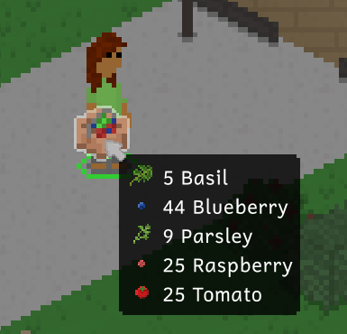

When harvesting plants, especially with low gardening skill, there is a chance that your Tiny harvests the plant incorrectly, causing for it to die. When a plant dies, the spot in the planter box becomes available for a new plant. If you don't like having to replant your dead plants, you can head into the gameplay options menu to enable the "Dead Plants Turn into Seeds" option, which will cause dying plants to turn into fresh seeds of the same type instead.

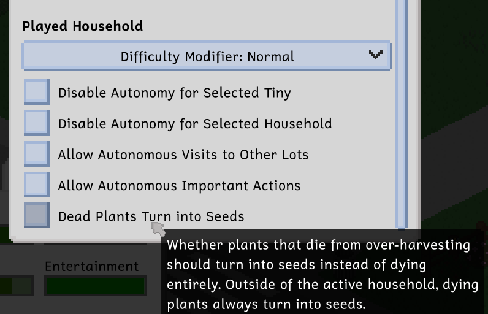

After harvesting, produce can then be sold through the mailbox for profit, and some items can be snacked on for some hunger need regeneration.

## Community Garden
This update also adds the community, or public, garden lot type, where Tinies will autonomously come and garden. The public garden lot also employs a community gardener who will occasionally tend plants and, upon request, plant some new ones for you.

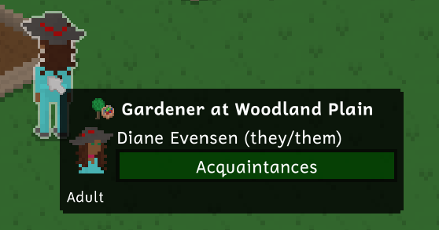

While this update doesn't include a prebuilt community garden lot, you can always build your own or find one on the Steam workshop!

## Other Gardening Activities
In addition to the ability to sell harvestables through the mailbox, a Tiny can also put their gardening skill to use through the Gardener job.

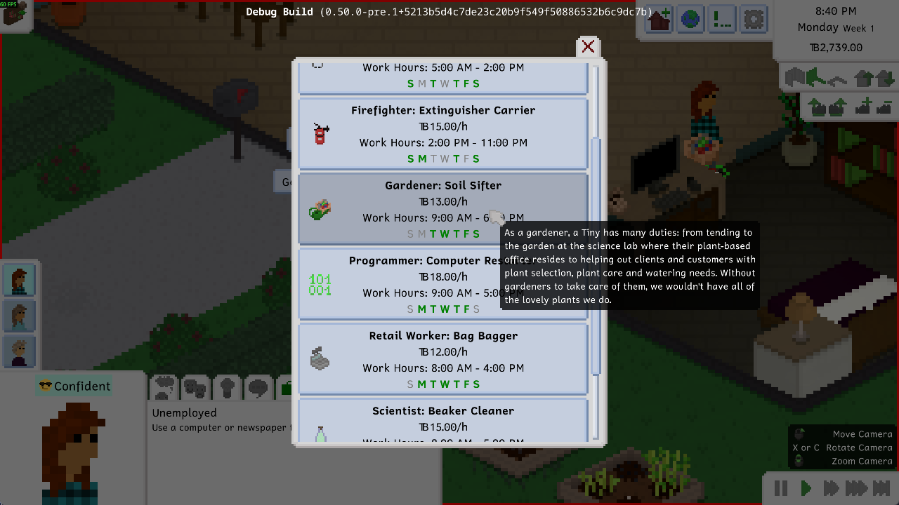

Alongside the new job type, we also added the Garden Guardian life goal. Completing this life goal gives your Tiny the ability to nourish their plants, which causes them to stop requiring water for a full week. During the week, they are also not susceptible to over-harvesting and will grow twice as fast!

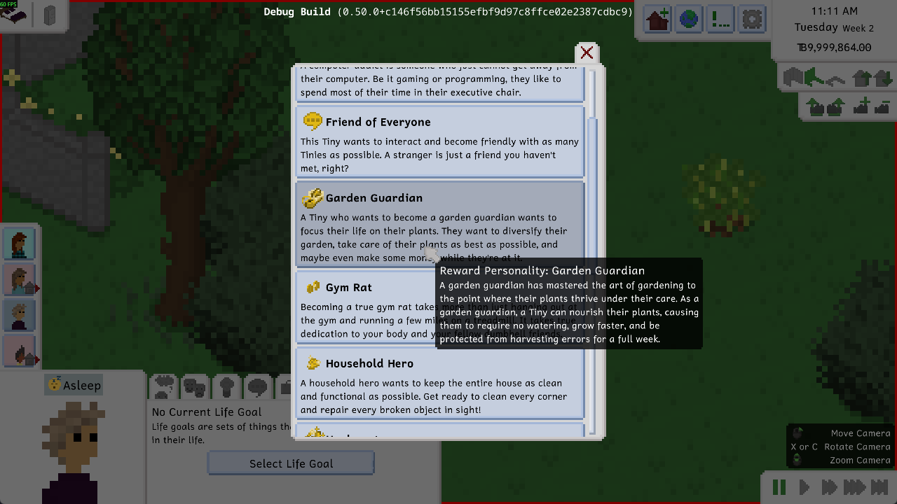

The gardening system is pretty in-depth already, and we're pretty proud of how it works right now, but we have a lot of additional plans for the future, so stay tuned for future game updates!

# Destination Doors
In addition to gardening and foraging, this update also features a new semi-major feature that map makers can use when creating [custom worlds](https://docs.tinylifegame.com/articles/custom_maps.html): destination doors, or out of town doors!

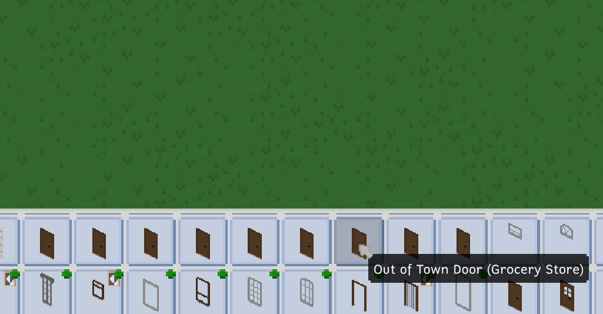

These doors can be bought with the ShowNonBuyable cheat enabled. As the name suggests, these doors act as "out of town destinations," which are places Tinies will go to do out-of-town activities like going to work. Previously, Tinies were only able to do these activities by exiting a world at a road or pathway connected to the border, but now, placing an out of town door of the relevant type will cause Tinies to head there for out of town activities instead.

This feature allows players to build custom buildings for set dressing, like a hospital, office or science lab, and have Tinies actually travel to them when heading to work or school.

In the future, new base game maps will also be making use of this feature.

# Small Stuff
Finally, this update also includes a bunch of small features, some of which we feel important enough to mention in this devlog!

The default wallpaper texture (which used to be a sort of drywall look) has gotten an overhaul: it now has the look of bare bricks instead! In addition to this, we've added a new and improved drywall texture to the game, which can be applied for the same price as the bare bricks texture if desired. The reason for this change is that Tiny Life was always meant to be set in Central Europe, but many of the design choices we adapted from games like The Sims contradicted that: The American-style free-standing mailboxes with flags, the thin walls that look like they're made of cardboard, the car-centric layout of suburban places like Maple Plains City, and so on. In recent history, we've been trying to rectify this by adapting some of these features to feel less overly American!

Check out the new bare bricks texture that walls will now have by default (right), as well as the new and improved drywall texture (left).

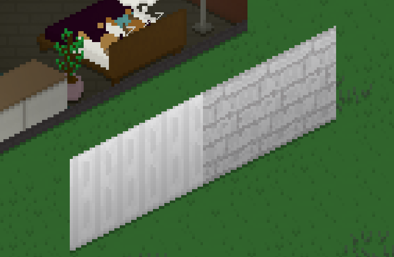

Now that we have two distinct "ugly wall" textures, we thought we'd increase the number of ugly things in the game further in case any of you want to build some old, grimy houses for any reason. This updates adds five new free decorative trash items that you can get in build mode. Be careful though: Tinies really don't like the look of these!

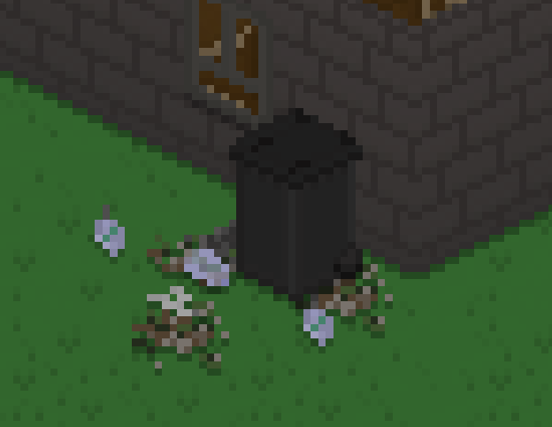

Finally, there are a bunch of additional small features in this update, including the ability to nap on sofas and benches, as well as the ability to disable autonomous outfit changes in the gmaeplay options. Feel free to explore the full changelog below if you're interested!

# About the Roadmap
As I said at the top, I know that this update has been a really long time coming. Over the last few years, we've gradually strayed away from the "one major update a month" schedule that I so rigidly try to stick to during and shortly after the pandemic. People who read these devlogs regularly know that I've already talked this topic to death, and so I don't want to go into details again about why updates have slowed down, but rest assured, I am still passionate about, and committed to, development on Tiny Life.

As you can probably tell, the gardening update is not one that was explicitly mentioned on [the public roadmap](https://tinylifegame.com/#roadmap) upfront, but it is one that players have been asking about for quite a long time. In a survey that we did a few months before we started work on the gardening feature, we asked what players would like, and gardening won by quite a large margin. That's why we started working on it!

After this update, however, we plan on continuing with the public roadmap in our attempt to get the game ready for leaving Early Access sooner rather than later. First up, we'd really love to get started on social events, which will pave the way for the addition of weddings and marriage in the future.

I hope you're excited for future updates and where they'll take Tiny Life, and I hope you enjoy playing with this update as well, of course!

❤️ Ell

# The Full Changelog
Finally, here's the full changelog as always:

Additions
- Added the gardening skill with 7* plants to take care of
- Added wild plant spawners to all worlds except Demoville (since gardening is unavailable in the demo)
- Added the community garden lot type, where visitors will autonomously garden
- Added a gardening life goal and the gardener job
- Added the ability to nap on benches and sofas
- Added sounds for changing game speed as well as a notification popping up
- Added keybinds for focusing the camera on the home lot and the active Tiny
- Added a decorative hydrangea plant
- Added the ability to disable autonomous outfit changes in the gameplay options
- Added various small, "decorative" trash items

Improvements
- Made actions like sleeping and sitting try multiple locations on the goal object, not just the closest one
- When closing an in-game hint, a notification now displays that allows re-opening it
- Stopped using "AI" wording in favor of "autonomy" in the game to avoid confusion with generative AI software (which Tiny Life does not use)
- Tinies now don't autonomously get a job in unplayed households if they already have enough money
- Custom content items that were manually installed or exported can now be deleted from the import menu
- When opening the Steam workshop from within the game, it will now go to the correct filter immediately
- The mods whose items are used for an exported lot or household are now listed in the Steam description when uploading
- Walls on lot borders are now handled more consistently, including the ability to place walls right on the border
- Made radio buttons have a visually distinct style from checkboxes
- Increased the chance of items randomly appearing in the trash
- Changed the default wallpaper style to a more European-style bare brick, and improved the texture of drywall

Fixes
- Fixed controls hints being visible for one frame if disabled
- Fixed the menu jumping around when typing into the search field for in-game hints
- Fixed children not using the running animation when running
- Fixed children being able to have dirty diapers if the Use Diaper action was enqueued before they grew up
- Fixed the relationship tab not updating correctly while open when relationship data changed
- Fixed job task changes not being reflected in the job tab while open
- Fixed completed life goals sticking around sometimes, causing crashes

API
- Added doors that act as certain destinations, which allow map makers to place faux-destination buildings that Tinies will actually visit when traveling out of town
- Household money is now stored as a double rather than a float to increase precision at high money amounts
