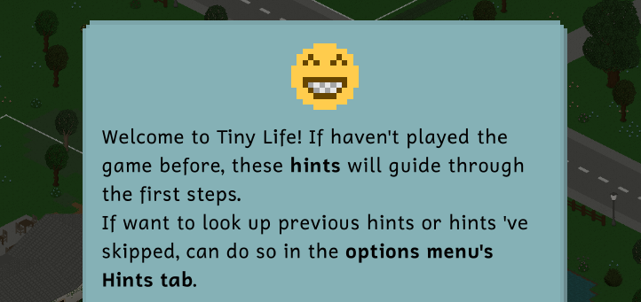
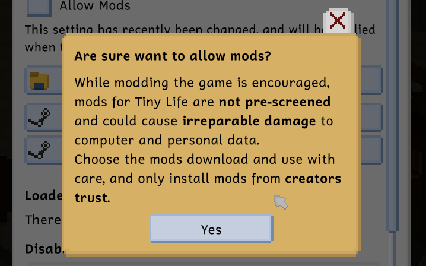
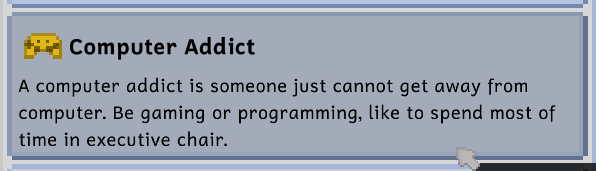

---
title: "[APRIL FOOLS] Finally Addressing Tiny Life's Gender Issue"
tags: [Devlogs]
image: "TinyLife_NsrTHY4IRZ.png"
itch: "https://ellpeck.itch.io/tiny-life/devlog/1476580/finally-addressing-tiny-lifes-gender-issue"
steam: "https://store.steampowered.com/news/app/1651490/view/510735652706321009"
---

The month of April has finally arrived, and with the month, the developers' realization: the developers have been going about inclusivity in Tiny Life all wrong. The developers' goal to create and foster a community intended for everyone, especially queer folk, has surely alienated many potential players.

Indeed, over the years, the developers have had many requests from gamers entirely unable to play the game because the amount of queer-positive features is just too overwhelming, resulting in potential players have had no choice but to refund the game.

Well, the developers have got these potential players now, friends.

# Pronouns in Tiny Life

For quite a while now, Tiny Life has featured the ability for players to select and later view the pronouns players would like to use for Tinies. The feature was intended to help players talk about Tinies, as Tinies were previously only addressed by the game using gender-neutral language. The feature was also intended to allow players to enhance storytelling by, for example, modifying a Tiny's pronouns during play to signify a change in the Tiny's gender identity.

However, recently, the developers have read Some Article on Some Website Somewhere and the article said the things mentioned in the previous paragraph are **wrong**, and gender is actually binary, pronouns somehow don't exist, and women should stay in the kitchen!

# The Update

For the first update, releasing a bit later the current week, the developers are addressing the pronoun situation first, as the situation is arguably the most egregious issue in Tiny Life at the moment. Getting the issue fixed, to the developers, has become far more important than fixing bugs or adding new gameplay features, so all of the bugs will remain in the game for now.

The pronoun issue in Tiny Life was remarkably easy to fix, as all the developers had to do was overhaul the game's language file and remove any pronouns from the file. Here are some screenshots showing the results!

As the reader may be able to see, players are greeted with the updated language right as players start a new game!

Of course, even the most important and serious of text boxes have been adjusted.

Aaah, a sight for sore eyes. The developers hope the reader is as excited about the update as the developers are! Please keep in mind: there may still be some phrases or sentences in the game erroneously including pronouns, as many more English words than the reader may think are actually pronouns.

# Future Updates

In the next update, the developers will be tackling the "women should stay in the kitchen" bit previously discussed. Further information the developers read on X also lead the developers to believe there may be a variety of other issues related to gender in the game, including the ability for Men to Wear Pink Little Skirts, as well as the ability for Women to Wear Anything At All.

The developers hope the reader looks forward to the update as well as all future ones!

❤️ Manly Man Ell Who Never Wears a Skirt Ever

---

*On a serious note, please remember: transphobia is antifeminist, and absolutely not welcome here. You can look forward to the "pronoun removal" joke feature in the next Tiny Life update in the form of a secret commandline switch. Happy April Fools, everyone!*
