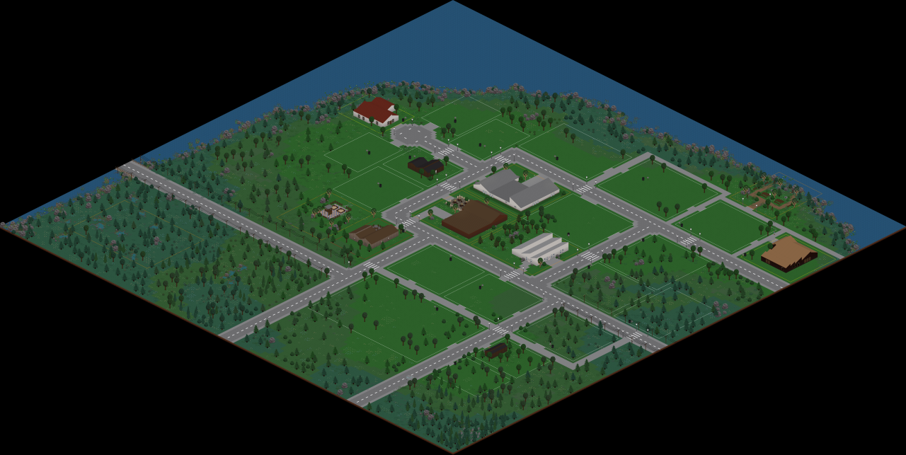
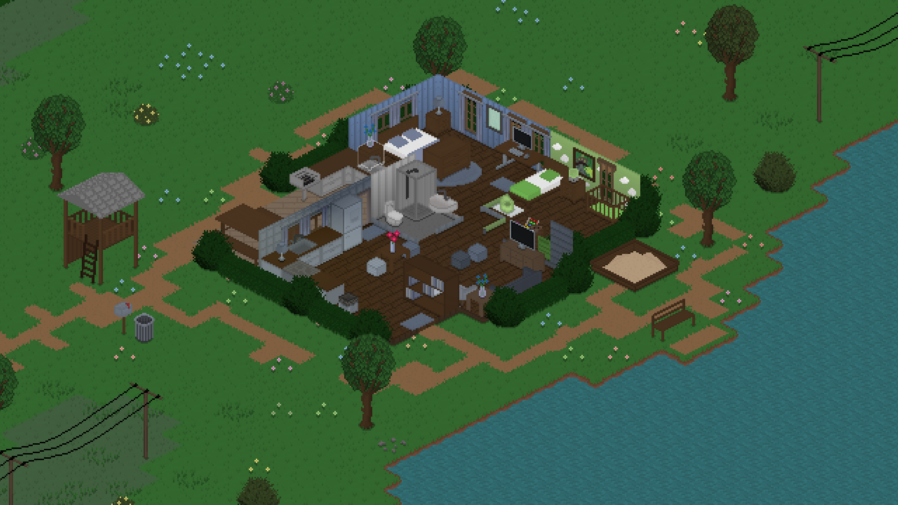
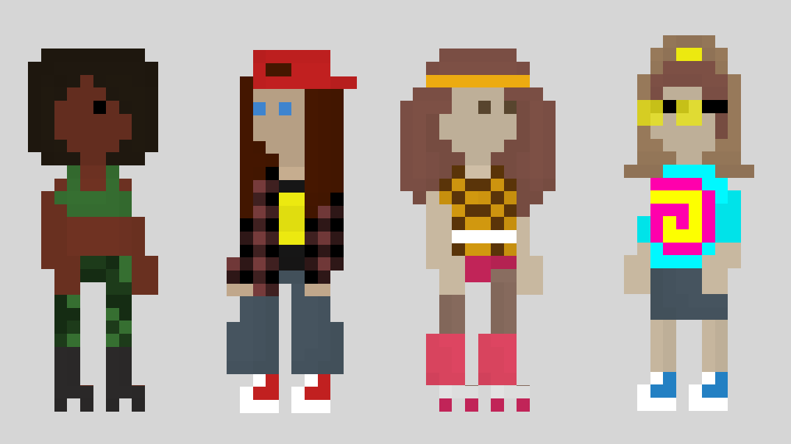
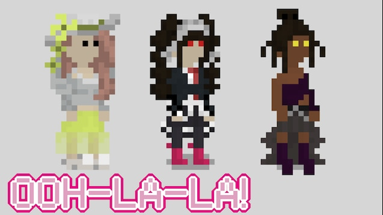
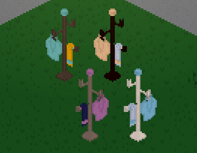
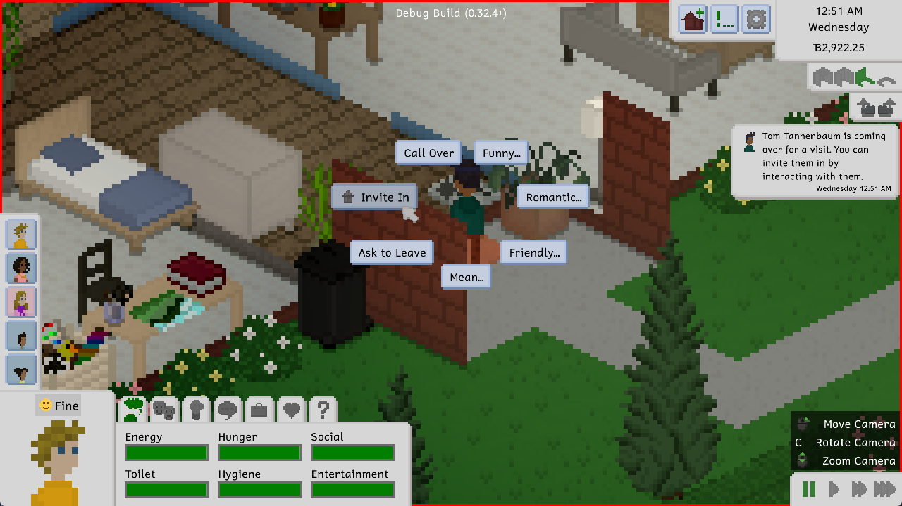

Hi everyone! The Tiny Life Early Access launch, which was a few weeks ago at this point, was an unprecedentedly big success. Not only did we see a huge amount of sales, we also saw rave reviews and a ton of excited people and amazing-looking custom content in the Steam workshop and the Discord server.

We'd like to take this post to thank everyone for their overwhelming support, and also show off some cool community creations that we've seen, and talk about the immediate plans for upcoming features.

# Some Beautiful Community Creations

Honestly, we've been absolutely overwhelmed with the stuff that yall have created. There are already mods with clothes and furniture, custom maps with beautiful scenery, and gorgeous-looking lots and households. We'll be showing off some of the ones here that we found most impressive, but of course, you can check out the [Steam workshop](https://link.tinylifegame.com/workshop) and the [Discord server](https://link.tinylifegame.com/discordweb) for yourself to see all of it.

This is an incredible custom map called [Foolshope](https://steamcommunity.com/sharedfiles/filedetails/?id=2976923398&searchtext=) by user v_dcc. Just *look at the detail*! It's so cute.

Workshop user AngelofAcid has been publishing a *ton* of beautiful builds, including residential lots and public ones. Here's a gorgeous residential home called [The Blue Lagoon](https://steamcommunity.com/sharedfiles/filedetails/?id=2972740783&searchtext=) as an example.

Our lovely community moderator Ari, whose Steam username is Superwholockwarrior, has been creating an adorable mod called [Tinies in the Nineties](https://steamcommunity.com/sharedfiles/filedetails/?id=2973959166&searchtext=) that contains a ton of fun nineties-themed clothing items for your Tinies. Here are some of them!

The user shroomy-p has also been creating a huge amount of custom clothing for their mod [A Bit Of Interest](https://steamcommunity.com/sharedfiles/filedetails/?id=2971443419&searchtext=), which features a ton of incredibly wacky, but equally gorgeous, clothing items. Just *look at these!!*

And lastly, check out this cute furniture mod called [Neb's Additional Furnitures](https://steamcommunity.com/sharedfiles/filedetails/?id=2974403719&searchtext=) by NebSpacefarer, which features a mix of additional furniture like chairs, TVs, and this adorable clothing rack!

Definitely keep all the custom content coming, we love seeing you share it on the Steam workshop and the Discord server. Yall are incredibly talented, and we're so excited that Tiny Life can be a way to express that creativity for you!! ❤️

# Our Immediate Plans

In case you haven't found it yet, the game has an official roadmap [on the website](https://tinylifegame.com/roadmap) that has a lot of information about planned features. As it says at the top, that list is not exhaustive by any means, and stuff may be added and moved around here and there, but it gives a pretty good overview of our long-term plans for Tiny Life's development.

What do we have planned for updates that are coming very soon, though? Well, let me tell you.

First up, we recently implemented a feature that a *lot* of you - and I mean a **lot** - have been requesting: the ability to invite visiting Tinies in, rather than them just breaking into your home!

For features that we'd like to add very soon, the major ones of note are
- the ability to take a break from work through vacation days,
- the ability to take family leave when having or adopting a child,
- additional baby skills, including thinking and self-care,
- additional life goals, including ones for writing and reasoning or reading,
- a retro-themed furniture set, with additional furniture and clothing sets already planned.

Of course, while doing all of that, we've steadily been releasing bug fix updates that also feature small improvements and features. Since the Early Access release, we've released four of them, and you can always find their full changelogs in the bottom-right corner of the main menu, or on the [documentation website](https://docs.tinylifegame.com/Changelog.html). So far, notable improvements that are already released include an easier way to see lots while zoomed out, the ability to highlight Tinies in the world, a better Steam workshop workflow, and more!

We hope you enjoyed this little update on Tiny Life's development, and we hope everyone is as excited as we are about the future of Tiny Life and its community. Please keep the feedback, bug reports, and amazing custom content creations coming!!

❤️ Ell
