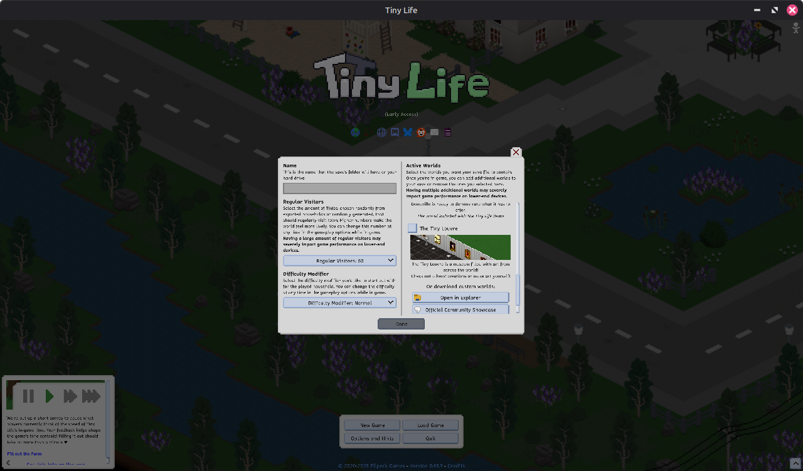
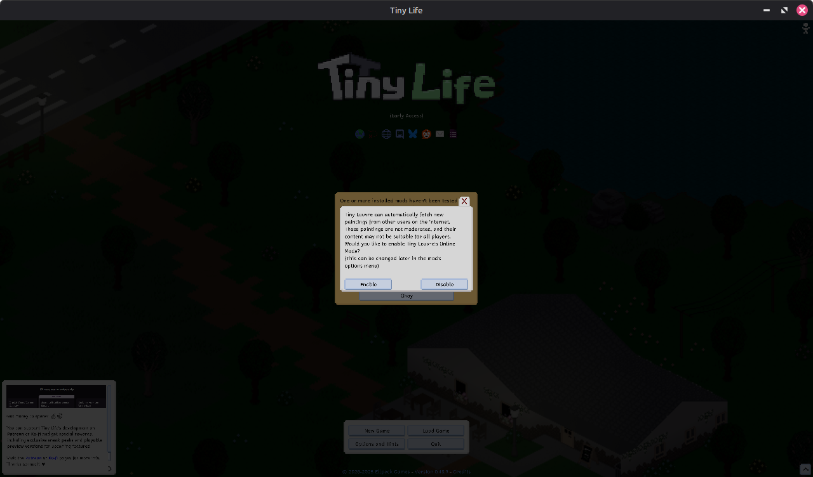
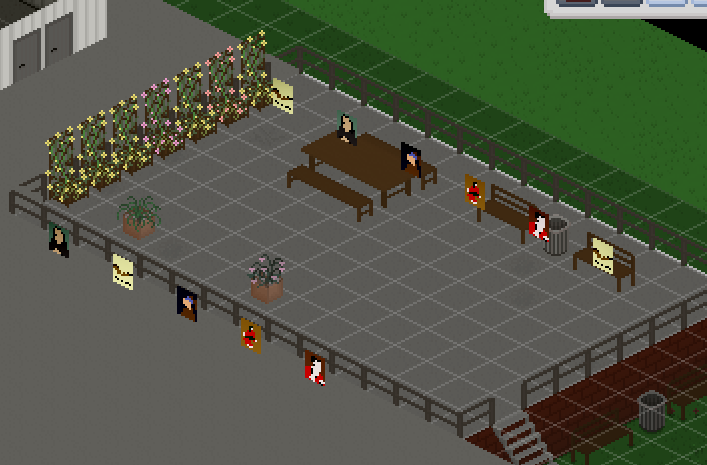
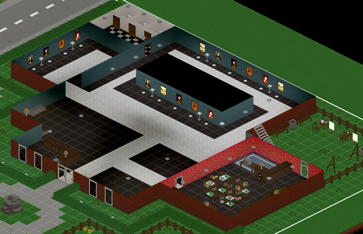
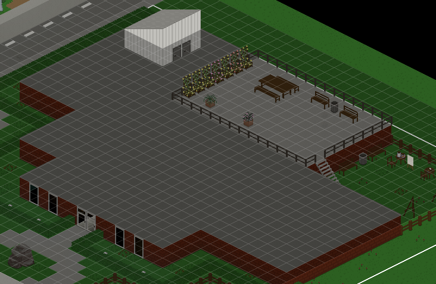
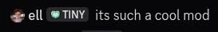

**ell:**

Hi everyone! It's been a hot minute since the last [Tiny Life Community Showcase](https://tinylifegame.com/#community-showcase) post, but I've been wanting to revive the category for *years* now. The opportunity presented itself to me when long-time friend of mine and modder of Tiny Life [blur](https://blur.gay) created the Tiny Louvre mod and an accompanying video and blog post on his website.

The following post is a version of [the original post](https://blur.gay/blog/tinylife/Making-Tiny-Louvre.html) modified by them to appear on the Tiny Life blog and accompanying platforms. It goes into detail about what Tiny Louvre is, how it was created, and gets technical about some implementation details here and there. In that way, it's also sort of a light version of a [Tiny Technicalities](https://tinylifegame.com/#tiny-technicalities) post.

I hope you enjoy reading blur's post, and please keep in mind to check out the mod afterwards!

---

**blur:**

So, recently I made a mod for Tiny Life called Tiny Louvre.
This mod adds paintings you can create in-game that both show up on furniture in-game and can be shared with and downloaded from other players.
To this end, the mod adds a variety of bits, like an easel with a painting
interface, a museum where people can view art collated from online,
and, well, the paintings themselves!

I made a video about the mod and how it works if you're interested:

[](https://www.youtube.com/watch?v=CipQ_CEHk0M)

Anyway, when I was making it, I bumped into some design challenges, and for the sake of my future self and anyone else looking to make a Tiny Life mod with these features, I figured I'd enumerate the challenges and the solutions I landed on.

# Adding Default Maps

So, Tiny Louvre adds a new default map, the Tiny Louvre.
This is a museum lot that lets players view a variety of both classical paintings I added to the game and paintings downloaded from online.

And this was simple enough, right?
I just used the [Creating Custom Maps](https://docs.tinylifegame.com/articles/custom_maps.html) tutorial in the Tiny Life docs to create the custom map, exported it, and copied the `.json` file into `Content/TinyLouvre/Maps`.

But wait, it wasn't appearing in the map list.
I guess that's to be expected, there's probably a method or event for telling the game what maps my mod adds.
And yep, there's
[Map.OnGetStaticMaps](https://docs.tinylifegame.com/api/TinyLife.World.Map.html#TinyLife_World_Map_OnGetStaticMaps),
which I can hook into without much fuss.



Hey, there it is!
 
I should make sure this works before I celebrate too much.
Check the map off, create the world, aaaaaand crash.

So, reading in modern day you might see something noteworthy in the `OnGetStaticMaps` docs:

> If this event is subscribed to and one or more custom maps are added to the list, the OnLoadStaticMap event should also be subscribed to to handle actually loading these maps.

That's because ell added that to the docs while we were talking about this issue.
At the time, I had no idea I had to do something else to load the map, but it turns out I *also* had to subscribe to
[OnLoadStaticMap](https://docs.tinylifegame.com/api/TinyLife.World.Map.html#TinyLife_World_Map_OnLoadStaticMap).
Okay, so add a new bit to `AddGameContent`,

```cs
Map.OnLoadStaticMap += (MapInfo mapInfo, Newtonsoft.Json.JsonSerializer serializer, ref Map map) =>
{
    if(mapInfo.Name == "TinyLouvre") 
        map ??= info.Content.LoadJson<Map>($"Maps/TinyLouvre", null, serializer);
};
```

and we're golden, everything loads and we can see the map in-game.

Well that was simple enough, let's move on to another issue I spent time on,

# Enabling Online Mode

So, adding the online mode features, while a technological challenge on their own, wasn't actually that involved since I knew before I started writing code how I was going to design the paintings and codec to optimize for sharing on social media.

What I did have some issues with, however, was getting a pop-up to appear the first time the mod was loaded asking the user if they wanted Online Mode enabled.
On principal, I didn't want to have online functionality in an offline-by-default game without disclosing that it was user-generated and confirming with the player.

For determining whether it was actually enabled, Tiny Life actually has a pretty good Options system, letting you put all your controls in the mod's options section using the `PopulateOptions` hook, and providing methods like `ModInfo.LoadOptions` to load your mod options into a convenient little object.
Handy!

My first approach, and a bit of a naïve one, was just to do exactly what I usually do to open a menu, but right when the mod loads up.
Which sounds fine on paper, but, uh. The Root UI element gets replaced once the main menu loads up, so the pop up doesn't actually stay on screen.

I ended up looking around, searching for a hook into the main menu spawning or something, until eventually just asking Ellpeck what he does for the mod version popup, which pretty much has exactly the behavior I was looking for.

And he pointed me to
[OnSwitchGameMode](https://docs.tinylifegame.com/api/TinyLife.GameImpl.html?q=OnSwitchGameMode#TinyLife_GameImpl_OnSwitchGameMode).
Well that's easy enough, just add
```cs
GameImpl.Instance.UiSystem.Add(
    "TinyLouvreOnlineConfirmWindows",
    new ConfirmWindow()
);
```
to that hook, and hey!



Then I just added a bit to the options that just checked whether it had been shown yet, and skip showing it if it had been.
Simple enough, what else is there to talk about?

# Furniture Textures

Sure, why not?

So, for Tiny Louvre, my original plan was to add a renderer to just draw the paintings askew and realign to the top pixels, either by drawing in blocks or using a shader.

But wait, Tiny Life is built with MLEM, which is based on MonoGame.
I can just construct textures in memory to save on render time!

```cs
_furnitureTextures[0] ??= new Texture2D(device, SIZE_X, (SIZE_Y + ho));
_furnitureTextures[1] ??= new Texture2D(device, SIZE_X, (SIZE_Y + ho));
```

Tiny Louvre keeps its furniture textures small, only constructing two for the downward-facing variants of Paintings.

When generating these, I just take the canvas (which I also convert to a Texture2D for rendering), then march from left to right placing pixels slightly askew, by either starting at the top and shifting down every other column or
vice versa.

Then, when it comes time to render in the world, it's as easy as drawing into the level, right?

Well, when I used the base `Draw` method, for some reason stuff just... wasn't working?
The layering was off, it was drawing paintings on every floor.



Wait, wait, wait.
I think I see what's going on here.

And ell agreed, noting that I was offsetting the depthOffset by too much to compensate for the fact that I wasn't using the right one for the floor the painting was on.
Oops.

Well, thankfully, there's a method on `MapObject`s that does all this for me, `DrawColumns`.
Just switch over to using that to draw my paintings et voilá!





Now you can't see paintings through the floor!

# Conclusion?

So, what's the takeaway here?

Well, first off, ell is very cool and helpful, thank you a ton.
Through his effort, during the dev process here and elsewhere, Tiny Life's modding and API documentation are quite good, which makes it very comfortable to learn how to mod this game and fun to continue to do so.

Also, don't be afraid to reach out for help in the
[#tiny-life-modding](https://discord.com/channels/181435613147430913/981562300592947220)
channel on the Ellpeck Games Discord.
Plenty of folks (myself included on occasion) are willing to help you get your mod working by pointing you to the right spots in documentation, helping you figure out tough problems, or rubber ducking for you as you walk through your process.

Honestly, I just like modding in Tiny Life.
I've mostly been working on games like Minecraft recently, which is fun, but having first-class modding support and a line to the game's primary developer is such a breath of fresh air.

I'd say if you are even a little interested in modding Tiny Life, give it a go!
It's cross-platform (I mod on Linux but it's trivially easy to do on Windows or Mac), it's fun, and there's a community waiting to help you get your mod made.

And remember:



Tiny Louvre is a cool mod

---

**ell:**

Lastly, you can download Tiny Louvre both on [Steam workshop](https://steamcommunity.com/sharedfiles/filedetails/?id=3590606034) and the mod's [GitHub repository](https://github.com/ssblur/tinylouvre). Be sure to have any paintings you create published through the mod's in-game editor so that they're available for other players to view!

Also, please keep in mind that, due to Tiny Louvre being a mod created by a community member and the game's modding API still being early, not all future versions of Tiny Life may be compatible with Tiny Louvre. If that's the case, you can always contact blur through the Steam workshop post or the GitHub issue tracker, as linked above!

❤️ ell and [blur](https://blur.gay)
