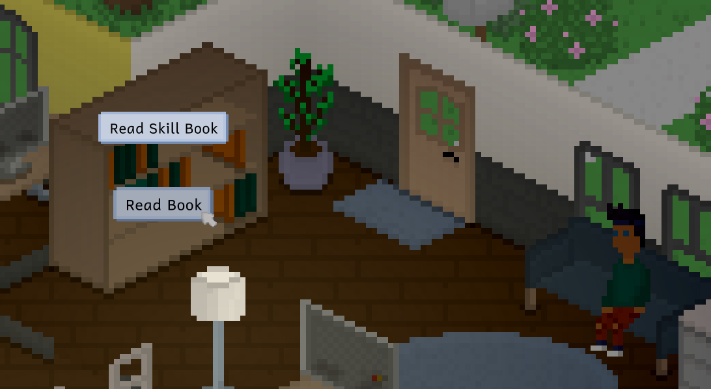

Hi everyone! I'm Ell, the creator and lead developer of Tiny Life, and this is a new sort of series of devlogs that we're starting. We're calling it **Tiny Technicalities**, because it's meant to give you a little look behind the scenes of Tiny Life development, including explanations about the graphics, music, the AI, build mode, play mode and so on.

If you think you'd be up for more Tiny Technicalities after reading this first edition, please let us know by liking this post, leaving a comment, or letting us know on [Twitter](https://twitter.com/TinyLifeGame) or [the Discord server](https://link.tinylifegame.com/discordweb).

# What's in an Action?
Have you ever wondered, while playing, what Tinies get up to under the hood of their lovely "Read book" or "Eat food" actions? Well, as it turns out, quite a lot goes on there, because the AI is pretty complex, and the ways that an action can play out are much more plentiful than you might think.

Now, we'll be the first to admit that the design approach we've chosen for Tiny Life's action may not be the be-all-end-all of software design, but they do the trick fairly well and they've managed to stick with us and evolve throughout the last three years of development.

Let's take a look at two main components of an action that determine what happens, how it happens, and what its outcome is: **conditions** and **execution**. I've created three example scenarios, all of which are a setup for the "Read" action.

## Reading a Book

This first scenario is probably the simplest, and the one that you're mostly expecting: Our Tiny (in this case, Tom Tannenbaum), is about to enqueue the "Read Book" action, which means they'll head to the bookshelf, pick up a book, and then attempt to read it in a comfortable chair or standing up.

Let's go through our two criteria here:
- **Conditions**:
  - Is there a free spot around the bookshelf that we can interact with?
  - Are our hands free so that we can pick up a book?
  - Is there an available seat in the area?
- **Execution**:
  - Head to the bookshelf
  - Pick up a book from the bookshelf
  - Try to find a seat
    - If a seat is found, head towards the seat, sit down on it, and then start reading the book
    - If no seat is found, simply stay where you are and read the book

Hm, that actually sounds pretty simple, right? Well. Let's run through some other possibilities! Because there's a lot more to consider when reading a book, like...

The book being on a table,

The book being on the ground,

and, of course, the book already being in our Tiny's hands.

Now, all of these actions have very similar steps we have to execute, including picking up the book (except for when we're holding it), and finding a seat, and so on. But nevertheless, we have to consider whether the book can be made to be in our Tiny's hands somehow, which is a different set of conditions for each of these scenarios.

Let's take a look at a more complicated example: Eating food.

## Eating Food
When eating food, we also have to consider that we'd like for there to be a table that we can put the food down on while eating. For a lot of actions like this, this could be a table with a chair attached, but it could also be a standing desk (though in the case of the food, we'd rather not eat at a standing desk, so that simplifies things a little).

Let's run through the full set of possibilities for this situation. The food we're trying to eat is...

on a surface, but the incorrect one (so we have to pick it up and move it elsewhere),

on the ground,

in our Tiny's hands,

on a table with a chair attached (so we just have to sit down and eat),

on a table without a chair attached (which is pretty similar to the first, "wrong surface" condition).

Of course, this is all while ignoring conditions we always have to check for, like:
- Is the food item still fresh and not spoiled?
- Can our Tiny reach the location that the food is in?
- Is there a chair and table that we can eat the food at?

# Conclusion
As you can see, actions are much more complicated and require much more thought than you might initially think. We wish it was just "eat the food, done", but that's not how programming works. Throughout Tiny Technicalities, we'll be thinking about this meme a lot while talking about other topics that seem simple on the surface, but are much more complex when you actually dig into them.

As we said at the top, please let us know whether you'd like to see more Tiny Technicalities! In the future, we'd also like to include actual code snippets and dig deeper into how certain systems are designed. If you have requests for what sort of stuff you're curious about, feel free to let us know on [Twitter](https://twitter.com/TinyLifeGame) or [the Discord server](https://link.tinylifegame.com/discordweb).

Thanks so much for reading, and have a lovely day!
