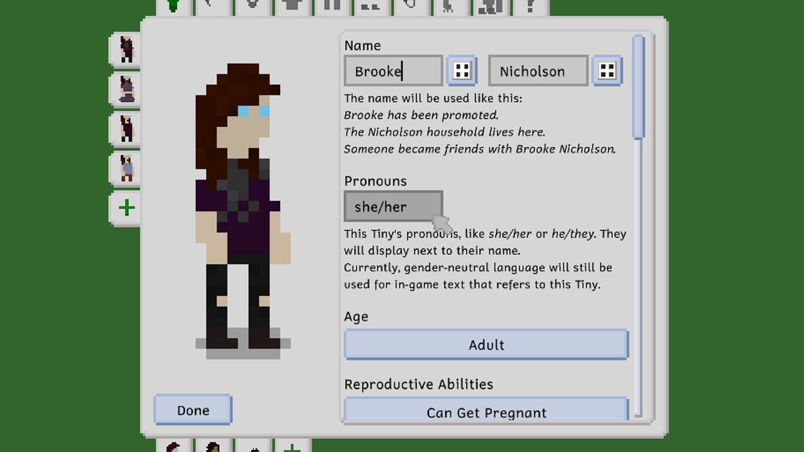
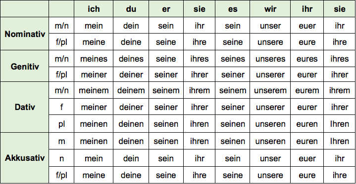

Yesterday, we released what we lovingly called *The Pronoun Update™*, which contains plenty of improvements and bug fixes and one important new feature: the ability to set custom pronouns for each Tiny you create.

A few days before that, we published a little [twitter Thread](https://twitter.com/TinyLifeGame/status/1643587758135418880) about our intentions with this update, as well as our future plans in relation to this feature. Now, I'd like to take some time to expand on this a bit, and explain why this feature is only releasing now, and why it's so... lackluster in its current implementation.

## Pronouns and Politics

The politics of gender and pronouns are very complicated, and I'll be trying not to get into them in this post. In my opinion, this debate should have a very simple conclusion: people should get to be who they want to be. That includes their gender identity, the appearance of their body, the pronouns they wish to be addressed with, the name they wish to have, and the way they wish to dress and otherwise express themselves. When developing Tiny Life, I take the steps that I hope accomplish this goal the best for everyone, regardless of whether they're cis or genderqueer.

Now, let's talk about this update and why it's both very cool and kind of a bummer, in my opinion. *Edit: I called this update "kind of a bummer" in reference to the "Is That Good Enough?" chapter of this post, in which I discuss feeling like this feature is not as good as it could be. Some people perceived this sentence as me implying that I'm unhappy with having added pronoun selection into the game. That is not the case!*

## The Pronoun Update™

Tiny Life now stores a Tiny's pronouns along with their first and last name, and displays them in situations where it might be helpful to a person talking about or referring to them. For example, in the relationship panel, Tinies will now be listed along with their pronouns.

This system makes it a lot easier for content creators, as well as players talking to their friends, to refer to Tinies without having to keep saying their names or use gender-neutral pronouns. It's also a great opportunity for queer people (or just players who want to create queer Tinies in general) to express their Tinies' identity in a more immediately obvious and easy-to-understand way. Of course, a cis Tiny just displays their pronouns the same way, just like we're starting to see more and more on websites like Twitter, LinkedIn and Instagram, as well as on places like the [Ellpeck Games Discord server](https://link.tinylifegame.com/discordweb).

## What It's Not

*However*, eagle-eyed readers may have already noticed the part of the screenshot where it says

> Currently, gender-neutral language will still be used for in-game text that refers to this Tiny.

Now, that may seem kind of weird to some people. Why would we include a cool new feature that celebrates the ability to set custom pronouns, and then not actually use them in text that refers to Tinies?

Well, the explanation to this is also the reason that it took us so long to get around to implementing this feature: *linguistic complexity* and *the fear of not being good enough*.

## Linguistic Complexity

If you speak any languages other than English, you may already know where this is going. But first, let's discuss English pronouns, and how other games get around the "specifying custom pronouns" issue.

Pronouns in English are a somewhat tricky thing. We're going to simplify a lot here, and this isn't a genuine linguistic discussion, but it's meant to be a bit of an insight into the complexity of designing a system like this.

For any given set of pronouns, English generally has five variations:

- **subjective**: "*He* visited Bluebird Café."
- **objective**: "Ell told *them* about the pronoun update."
- **posessive independent**: "That painting is *hers*."
- **posessive dependent**: "That is *her* painting."
- **reflexive**: "They bought it *themselves*." (or, alternatively, "They bought it *themself*.")

With just these five variations, it's reasonable enough to allow players to input a custom pronoun for each variation. That's exactly what The Sims 4 did in their semi-recent update that added exactly this feature.

## Is That Good Enough?

So far, they've only included this feature in the English version of The Sims 4, and that's where the trouble begins: that honestly just never felt... good enough for us. We want Tiny Life the best game it can be, a standard that, mind you, we know is unrealistic and ridiculous to achieve. I talked to a friend about this recently, shortly after announcing the pronouns feature, and I'm just going to quote what I said because I still deeply relate to it:

> i think the new system is a nice inbetween step until i get around to a nice system for custom pronouns  
> actually i think the new system is terrible and reduces the issue to something that feels like a parody, but everyone i asked about this idea thought it was great so  
> that's why i made it
>
> i just think it's important to do this kind of stuff right, and this implementation feels incredibly lazy to me

Now, I want to use this moment to clarify that I don't want this to be a pity party or a reason for a pat on the back at all. Instead, I'm quoting this stuff to highlight a part of Tiny Life development that has always been extraordinarily difficult for me: the fear of not representing things, especially queer & racially diverse things, well enough. Before releasing new features, and before releasing posts like this, I reach out to a lot of my friends to ask them if what I made or what I wrote is sensible, non-offensive and positive, and thankfully, the reponse is usually pretty positive. Nevertheless, there's still a voice somewhere that won't go away saying "you need to put in more effort, this is not good enough, you can't ship it like this".

That's why it took so long for Tiny Life to get this feature: we didn't want it to feel like a parody, and we didn't want it to be "not good enough" for us, for our players, or for anyone. But we realized that not having a feature like this at all, a feature for something that is close to our hearts and the hearts of our players, is maybe worse than having a version that, to some people, might feel a bit like a reduction or a parody. Because we know that our intentions are good, and we also know that most of you know that our intentions are good.

## Linguistic Overcomplexity

But... why not just include the "specify all variations of your pronouns" feature in every language that the game has? Well, let's take a language as an example that I know very well, despite the fact that I still struggle describing its grammar to non-Germans a lot when explaining this issue: German, and its grammatical case system.

A lot of languages have a grammatical case system, but English isn't (really) one of them. It does have something similar, of course, but it's not nearly as complex. And the trouble is: German isn't even the worst offender here! There are language with *more than four* cases, and there are languages that have a lot more complicated things, like gendered verbs, gendered adjectives and pronouns that literally become *part of* the nouns they describe.

Anyway, let's talk about German for a second. Let's imagine we wanted to add our pronouns in the same way that we do in The Sims 4. How many boxes would we need? Well, we have to factor in three key things: the grammatical case, the gender of the person or object that is the *object* of the sentence, and the gender of the person or object that is the *subject* of the sentence.

Anyway, here's a handy table (courtesy of [this website](https://www.sprachschule-aktiv-wien.at/die-possessivpronomen-im-deutschen/)) to show some of these variations. Each column is one set of pronouns, and the third column, for example, is *er* (*he*) and its variations. As you can see, it's... quite a lot.

From a quick glance, you may be able to spot that for some of these rows, the pronouns follow a very strict pattern that we might be able to exploit: for example, in the Akkusativ/maskulin row (third from the bottom), all the pronouns are just their basic form with an *-en* suffix added to them. There's also a fair bit of overlap (some columns have the same variation in multiple rows) but the overlap depends on the pronoun. But the overlap, and the consistent suffix, are also not *necessary* - that is, if you wanted to allow *truly* and *totally* customizable pronouns, you'd have to allow the ability to specify different pronouns for each situation that usually has overlap... right?

If you don't speak German, you might just say "oh but these variations are so slight, *surely* they're not actually necessary in everyday speech." But just like suddenly starting to always say "that is she painting" and "that painting is she", this would have a noticeable effect on a sentence's sound and parsability.

## A workaround?

Now, a lot of people that I talked to have suggested a sort of workaround, inbetween step: What if we *do* allow specifying all of these variations, but don't actually expose that to players. Instead, we expose it to localizers and mod creators, who can, for their own language, create a predefined set of pronouns and neopronouns that players can choose from.

We think this would be a lovely compromise, but we're also not super fond of the idea of having to select from a huge dropdown menu a pronoun set that you might not even end up finding in there because it doesn't exist. And then, as a player, you'd have to go through the trouble of creating a mod to add it yourself, or submitting it as feedback and then waiting for the pronoun to be implemented into your language officially.

And oh, on the topic of languages, what do we even do when a player switches their display language, or shares a household that has pronouns in a different language? If we had a predefined set, that would be reasonably easy, but only if the neopronouns existed in every language. And if we *didn't* have a predefined set, well, frankly, we wouldn't *know* what to do.

## Conclusion

So why even go through all of this trouble? Why not just have no pronoun selection at all? In fact, why not just have a simple "gender: male or female" selection and be done with it?

Well... the bottom line is this: gender is not a simple yes-or-no answer. In fact, sex is not a simple yes-or-no answer. Nothing is a simple yes-or-no answer when it comes to humans, their identity, and their body, and if you think that it is, you're one of the lucky few who hasn't had to agonize over who they really are, if it's okay to be who they really are, and how to truly become who they really are.

All of that being said, I hope you enjoyed this post as a little peek behind the curtain of what we've been thinking about for the last few weeks and months. We hope you enjoy *The Pronoun Update™*, and we hope you look forward to the game's release, its future features, and the future of the pronouns and their customizability.

## An Addendum: What About Traditional Pronouns?

Ever since I initially published this post, a lot of people have been asking a simple question that, frankly, I don't know why I didn't answer in the post originally:

> Why is gender-neutral language always used in-game?
>
> Why don't you just implement the grammatically correct use of a few traditional pronouns, as well as a gender-neutral option, for the time being?

Frankly, this comes down to the same thing that most of the other issues came down to: It's, surprisingly, much more complicated than you'd expect, and it doesn't end up seeming all great as a "quick solution", because it just wouldn't be one.

Let's use our trusty old friend German again as a little example of just how complex even a set of two traditional pronouns (masculine and feminine) can get in a deceptively simple sentence: "Their friend is visiting them."

In the English version of this sentence, the pronouns the friend uses aren't mentioned, because they simply don't have to be. This means that we just have to have two versions of the sentence for masculine and feminine pronouns: "His friend is visiting him" and "Her friend is visiting him". In a language like German, however, the gender of the friend has to be stated explicitly, and so we get four options for this sentence alone: "Sein Freund besucht ihn", "Seine Freundin besucht ihn", "Ihr Freund besucht sie", and "Ihre Freundin besucht sie". Notice that this isn't a simple one-word swap or ending change, either: A lot of the other parts of the sentence will change based on the genders of them and their friend.

And all of this has us still keeping in mind that there are languages with much more complicated, gendered features, like gendered verbs and adjectives, which would also have to be accounted for.

A lot of implementations of pronouns and gender in games will get around issues like this by just using phrasings that are as generalized as possible to avoid having to deal with all the intricacies. The trouble with that is that, in a lot of languages other than English, it will end up sounding a lot more, or equally, clunky than a blanket gender-neutral version.

All in all, we've decided to embrace the clunk as a sign of societal progress that hasn't fully made it into the space of linguistics quite yet. 

Ell ❤️
